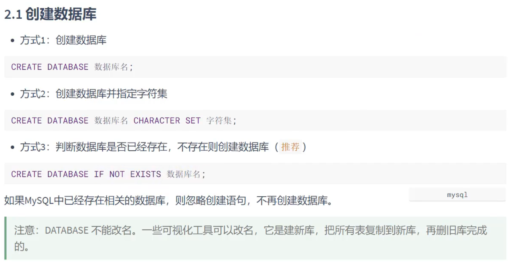
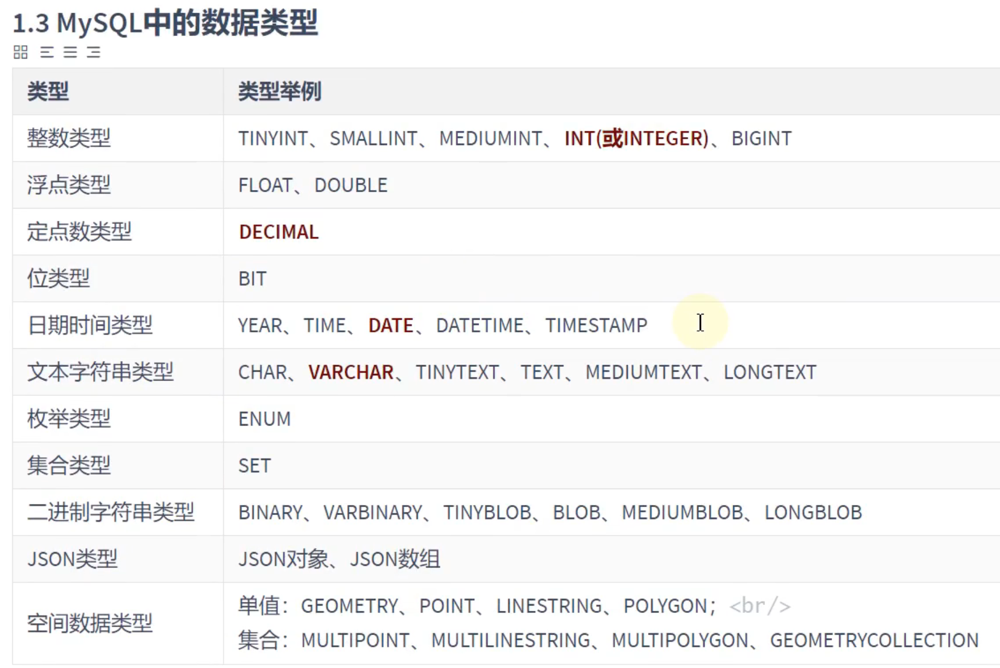

# 数据库（database）和表（table）

## 导入现有数据（source）

***.sql文件
`source [文件的全路径名];`

## SHOW

`show databases;`显示所有数据库

`show tables;`显示某个数据库中的所有表：

`show create database [数据库名];`显示某个数据库的创建信息：

`show create table [表名];`显示某个表的创建信息：

`show columns from [表名];`显示某个表的结构：

上面的语句可简写成`desc jobs;`

如果表名和MySQL保留的关键字冲突，要用着重号（``）括起来

### 查看数据库

## USE

选择数据库

### 切换数据库

## CREATE

创建数据库或创建表

### 创建数据库

### 创建数据表

## ALTER

修改数据库或表

### 修改数据库

### 修改数据表

## DROP

删除数据库或删除表

### 删除数据库

### 删除数据表

## TRUNCATE

### 清空数据表

## DROP、TRUNCATE、DELETE 的区别

DCL 事务简介

其中：
- DROP、TRUNCATE 是 **DDL** 语句
- DELETE 是 **DML** 语句

[MySQL删除表数据、清空表命令（truncate、drop、delete 区别）](https://cloud.tencent.com/developer/article/2389933)

---

之后详细讲
# DCL 中的 COMMIT 和 ROLLBACK

---

# MySQL数据类型

---
到P53

