# Nginx

## 基本概念

Nginx (engine x) 是一个高性能的HTTP和反向代理web服务器。
Nginx是一款轻量级的Web服务器/反向代理服务器及电子邮件（IMAP/POP3）代理服务器，在BSD-like协议下发行。其特点是占有内存少，并发能力强。

### 反向代理

正向代理：
正向代理总结就一句话：代理端**代理的是客户端**。
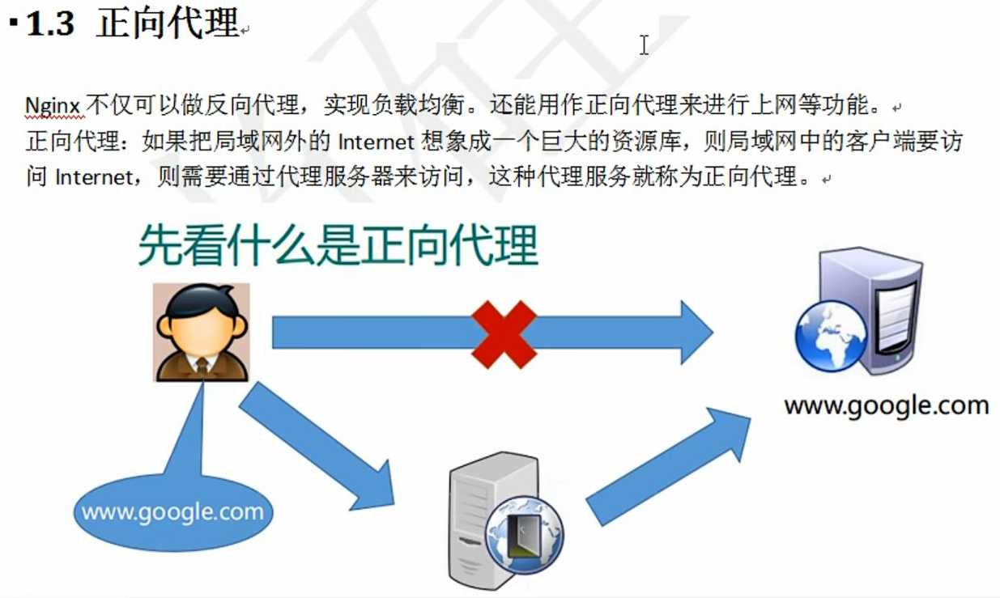

反向代理：
反向代理总结就一句话：代理端**代理的是服务端**。
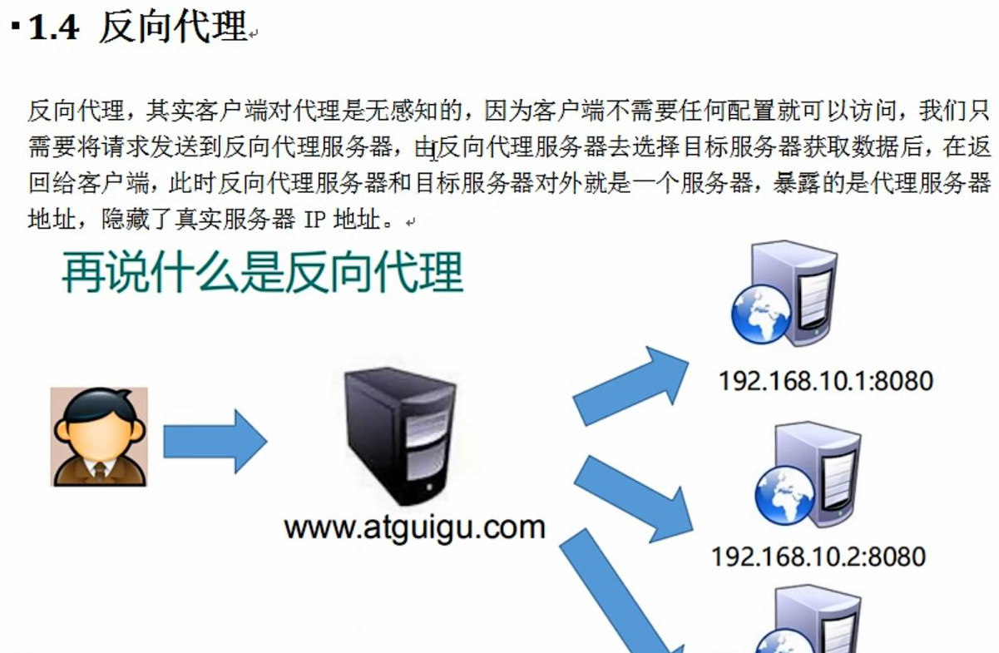

### 负载均衡


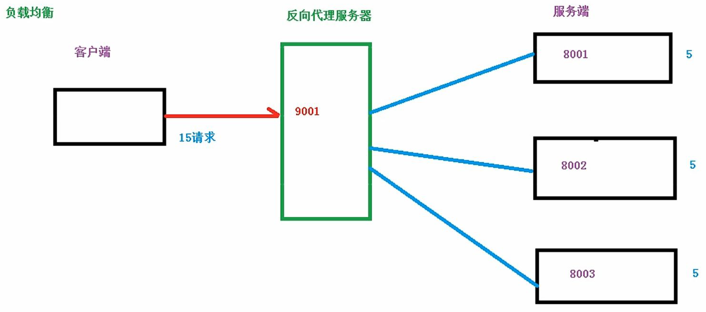

### 动静分离


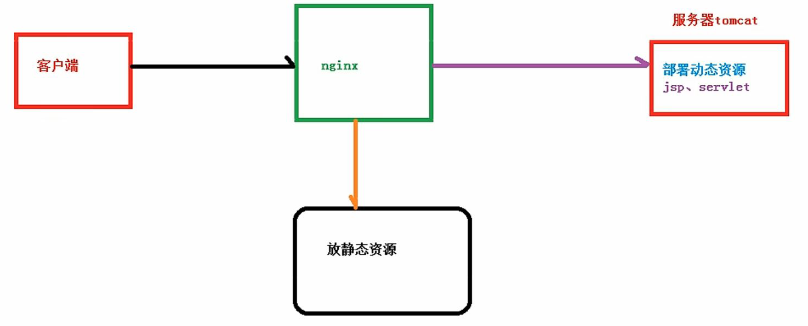

## 安装Nginx

安装依赖：
依赖包openssl安装```sudo apt-get install openssl libssl-dev```
依赖包pcre安装```sudo apt-get install libpcre3 libpcre3-dev```
依赖包zlib安装```sudo apt-get install zlib1g-dev```

安装Nginx：
```sudo apt update```
```sudo apt install nginx```

启动Nginx
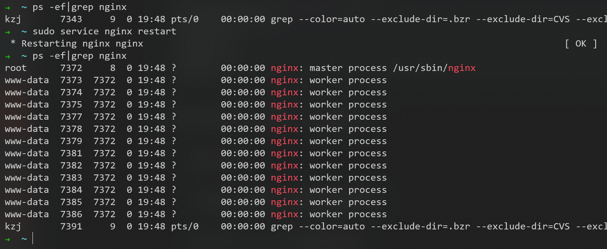

使用```whereis```命令，可以查找已安装软件的位置
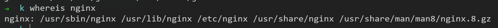

配置文件所在位置为
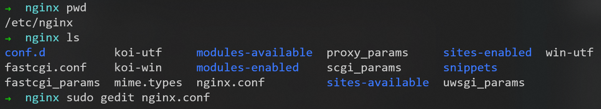
配置文件详解见```2_nginxconf.md```

通过WSL子系统的IP地址和80端口号


成功访问
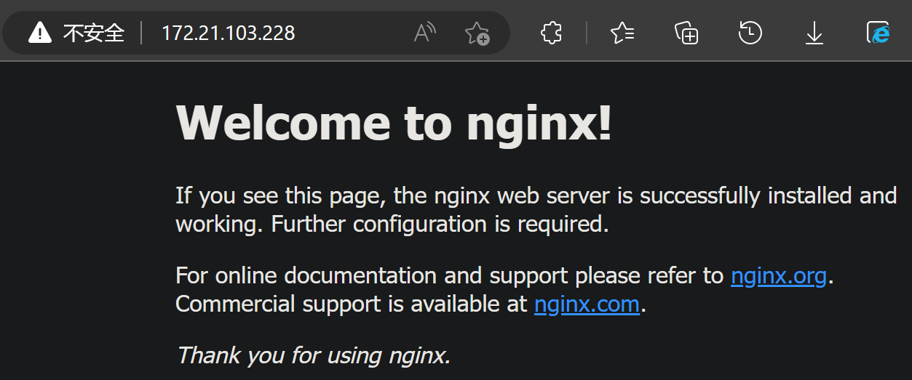

### 浏览器中访问nginx的端口，出现的却是apache的欢迎页

已经将apache的端口修改为：
1. 80->90
2. 443->444

访问nginx的80端口，却显示apache的欢迎页（在安装完apache后出现此现象）
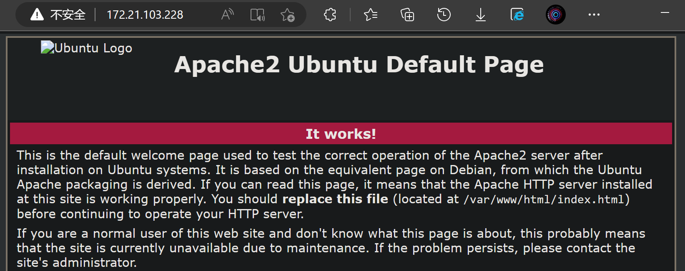

[网页链接](https://blog.csdn.net/jishuai6p/article/details/120335376)

注意：
apache与nginx是共用同一个站点目录的，apache和nginx中部署的网页文件都放在同一个目录```/var/www/html```

在nginx的配置文件```/etc/nginx/sites-available/default```中：
1. 第22-23行可修改nginx的端口号
2. 第41行用来设置nginx自己的站点目录
3. 第44行是根据所排列的顺序调用站点目录里的网页文件作为自己的欢迎页(解决一开始的问题只需把index.nginx-debian.html放在index.html前就行了)
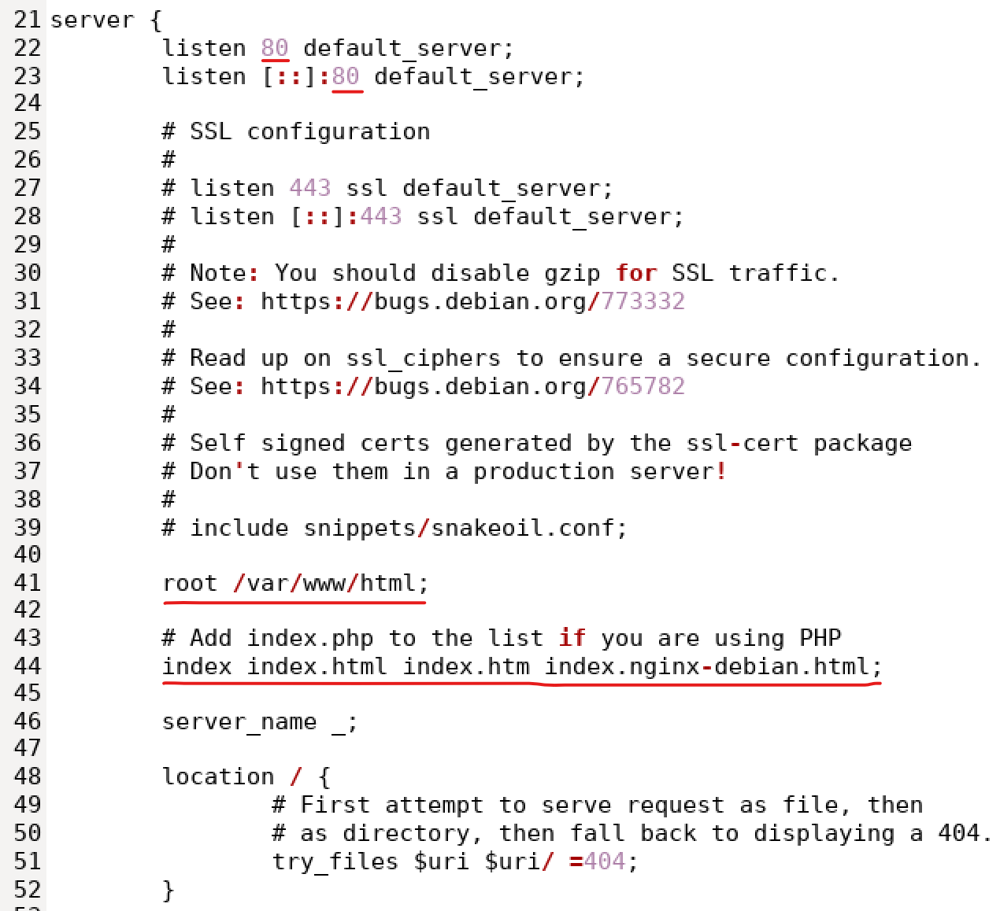

第44行改为```index index.nginx-debian.html index.html index.htm;```，并重启nginx服务，问题解决
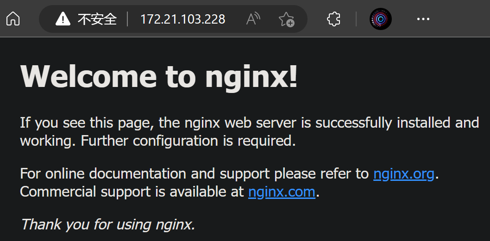

## 常用命令

### 查看nginx版本号

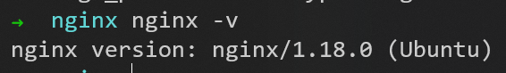

### 关闭nginx

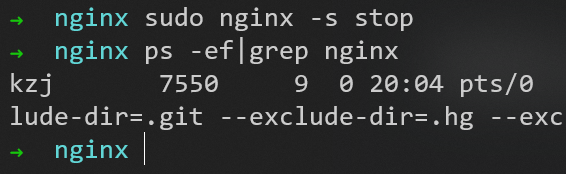

### 启动nginx

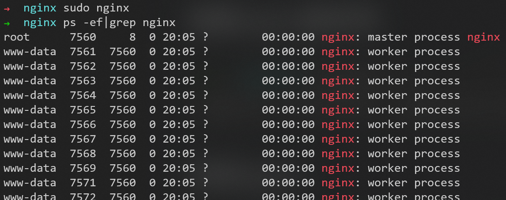

### 重加载nginx

让修改的配置文件生效


用Ubuntu的service命令也可以实现类似的效果
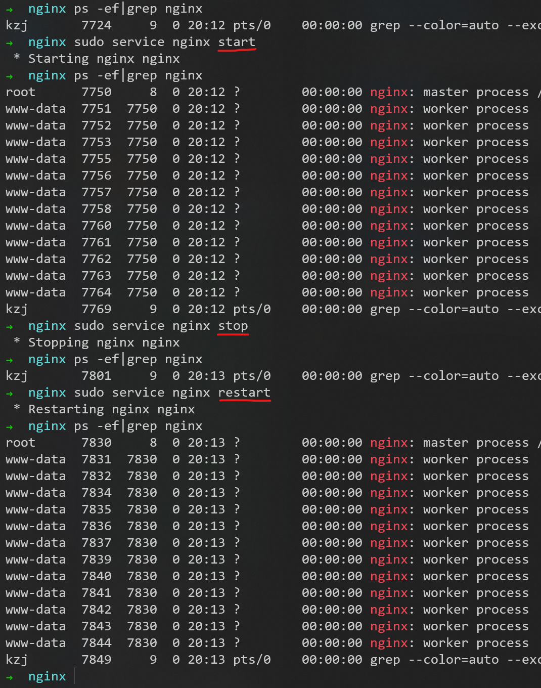


