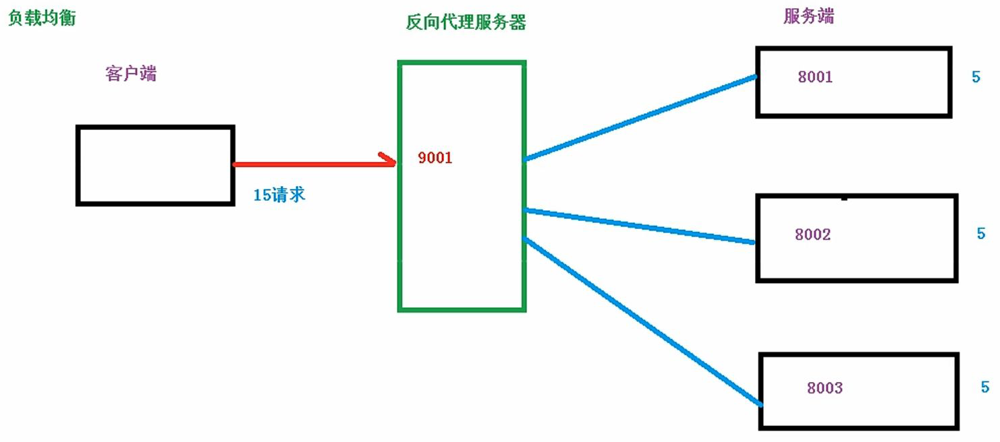
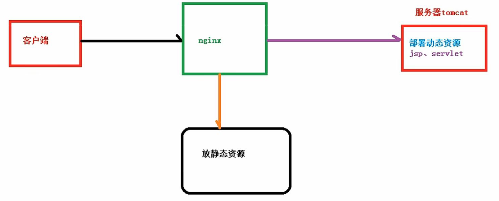
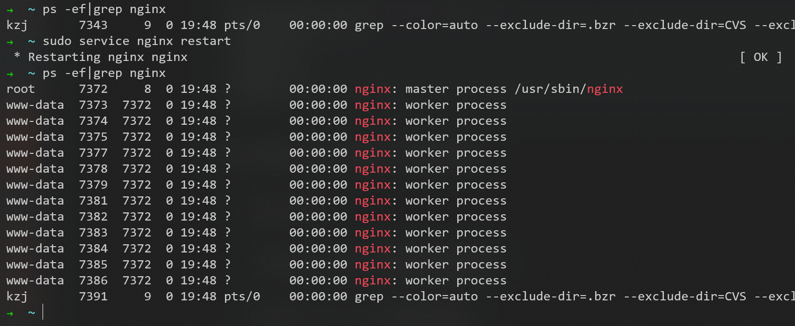
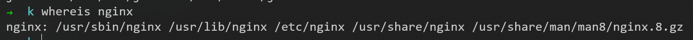
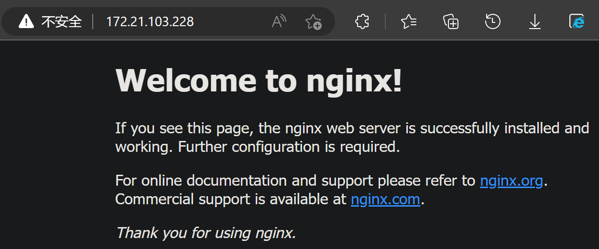
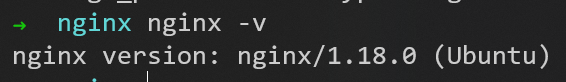
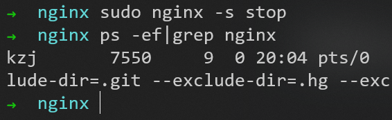
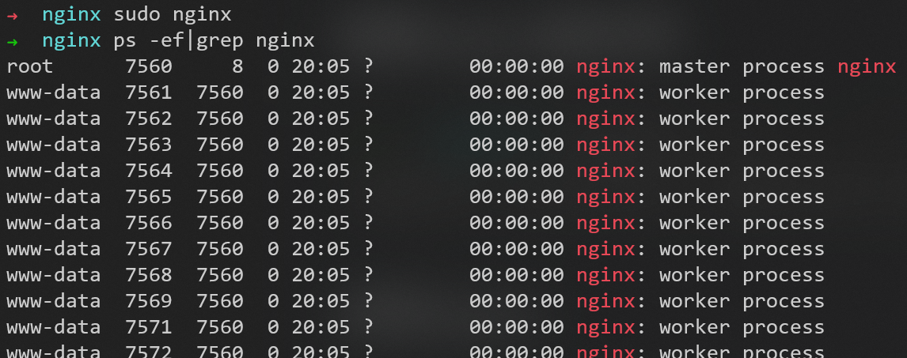
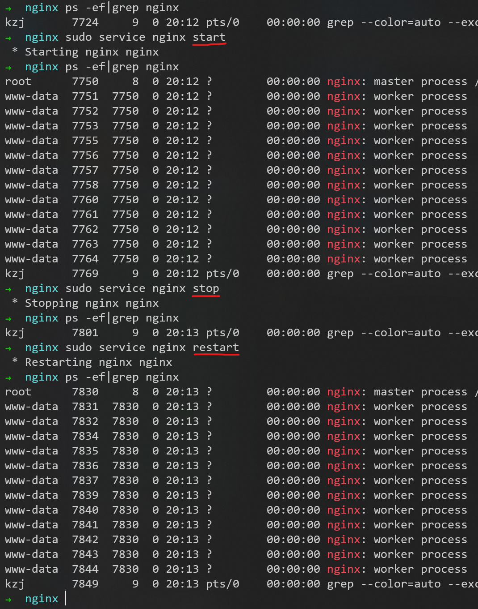

# Nginx

## 基本概念

Nginx (engine x) 是一个高性能的HTTP和反向代理web服务器。
Nginx是一款轻量级的Web服务器/反向代理服务器及电子邮件（IMAP/POP3）代理服务器，在BSD-like协议下发行。其特点是占有内存少，并发能力强。

### 反向代理

正向代理：


反向代理：


### 负载均衡




### 动静分离




## 安装Nginx

安装依赖：
依赖包openssl安装```sudo apt-get install openssl libssl-dev```
依赖包pcre安装```sudo apt-get install libpcre3 libpcre3-dev```
依赖包zlib安装```sudo apt-get install zlib1g-dev```

安装Nginx：
```sudo apt update```
```sudo apt install nginx```

启动Nginx


使用```whereis```命令，可以查找已安装软件的位置


配置文件所在位置为


通过WSL子系统的IP地址和80端口号


成功访问


## 常用命令

### 查看nginx版本号



### 关闭nginx



### 启动nginx



### 重加载nginx

让修改的配置文件生效


用Ubuntu的service命令也可以实现类似的效果



