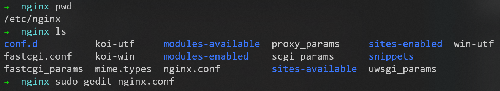
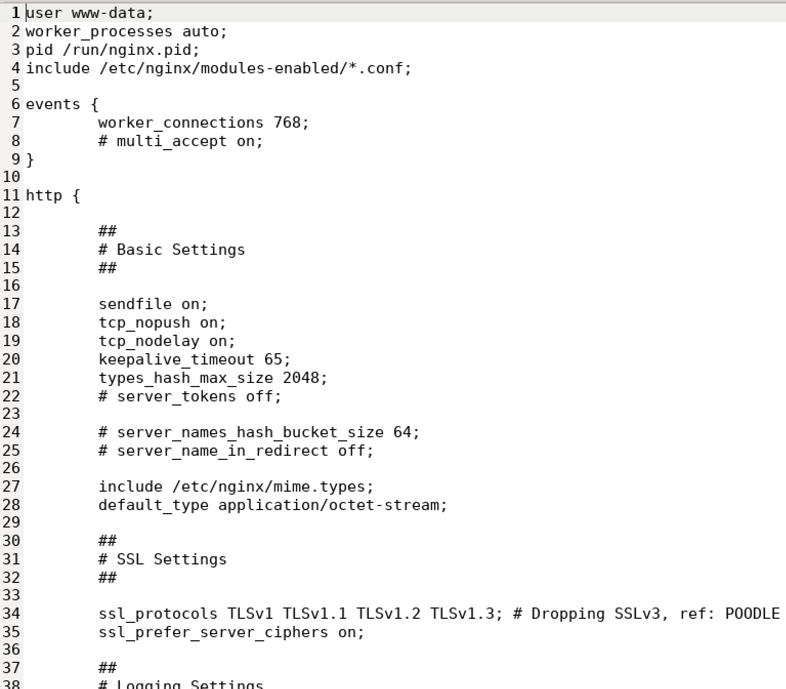
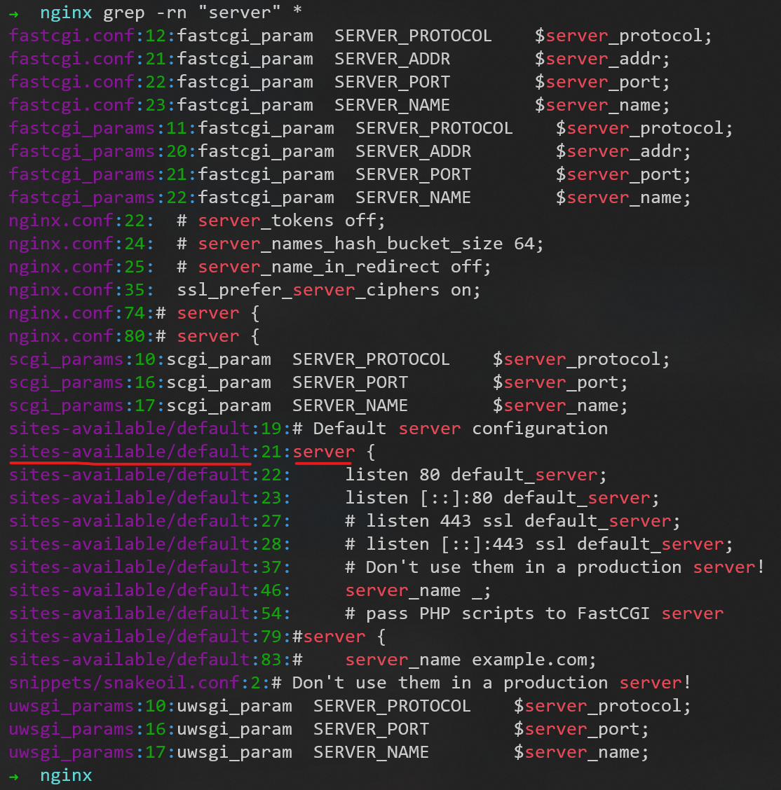
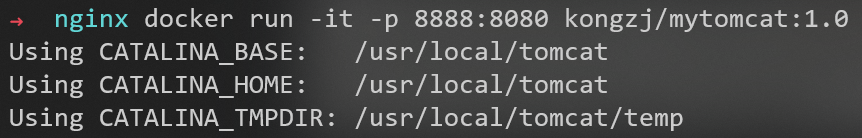

# nginx配置文件

## nginx配置文件位置



## nginx配置文件组成

由三部分组成


### 全局块


### events块


### http块


但是，在配置文件```nginx.conf```中，没有找到**server块**

使用命令```grep -rn "server" *```，在当前目录下的所有文件内容中搜索server字段


发现```sites-available/default```下有**server块**的配置信息，所以进入该目录就可进行更改


```default```文件的部分内容为


# nginx配置实例

## 配置实例1：反向代理


首先准备一个tomcat：
用docker启动一个tomcat服务器



访问```172.21.103.228:8888```（```localhost:8888```也可以）成功


到P9


