# nginx配置文件

## nginx配置文件位置

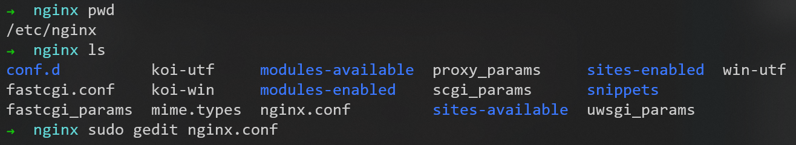

## nginx配置文件组成

[nginx配置详解](https://www.runoob.com/w3cnote/nginx-setup-intro.html)

由三部分组成
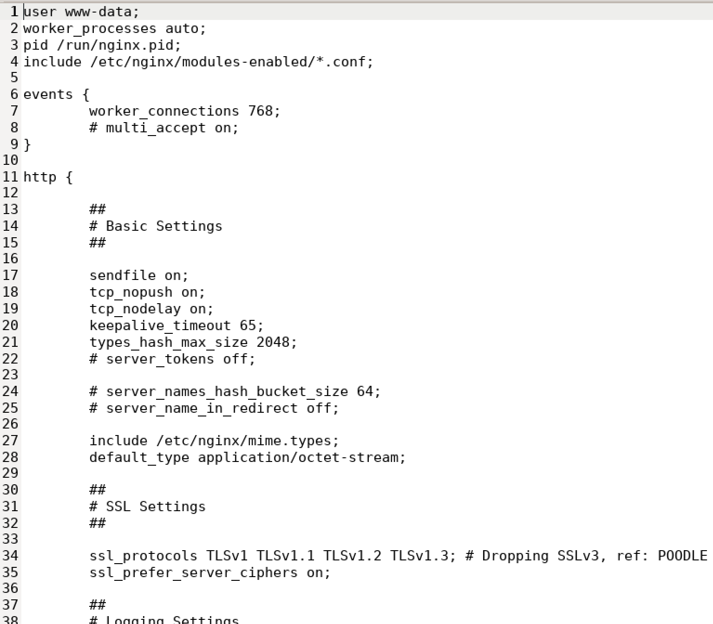

### 全局块


### events块


### http块


但是，在配置文件```nginx.conf```中，没有找到**server块**

使用命令```grep -rn "server" *```，在当前目录下的所有文件内容中搜索server字段
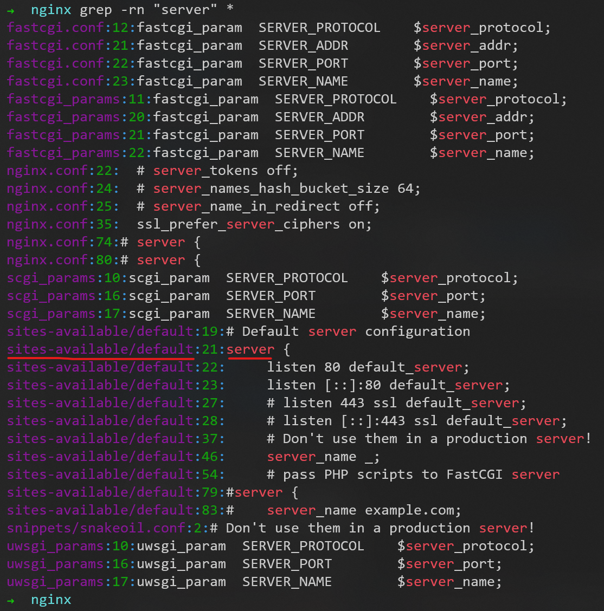

发现```sites-available/default```下有**server块**的配置信息，所以进入该目录就可进行更改
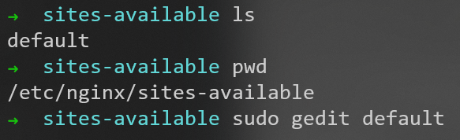

```default```文件的部分内容为
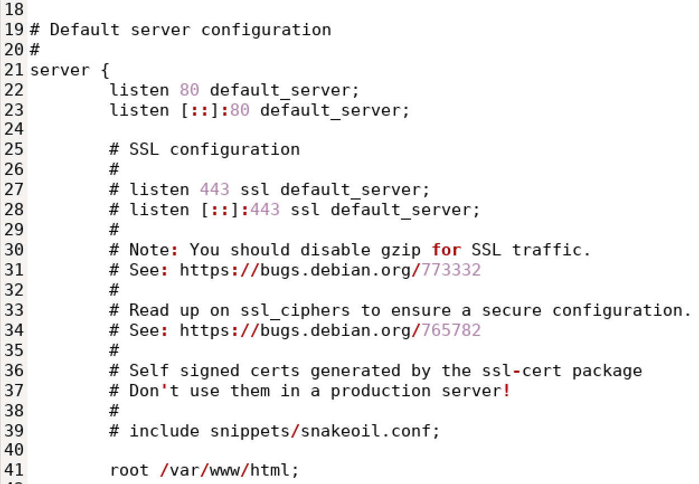
默认监听80端口

## Nginx的sites-available和sites-enabled

一个Nginx需要自动配置多个网站，并且配置基本相同，只需要修改端口号或root目录位置。

目标是用程序自动生成配置项，如果每次都修改```/etc/nginx/nginx.conf```，如何保留原有的server会比较复杂。

改成在```sites-abaiable```和```sites-enabled```目录中增加文件的方式，可以降低代码复杂度。

- sites-enabled 下的文件，会作为 nginx.conf 的一部分加载
- sites-enabled 下的用于存放 sites-available 中文件的**软连接**

sites-available 与 sites-enabled 使我们能够进行模块化配置，当我们希望增加新网站时，我们可以在 sites-available 中创建新配置文件，并在 sites-enabled 中**创建软连接**；当我们需要关闭某个站点时，我们可以在 sites-enabled 中**将软连接移除**，这在某种程度是提高了 nginx 的管理效率。

# nginx配置实例

## 配置实例1：反向代理


### 准备一个tomcat

用docker启动一个tomcat服务器
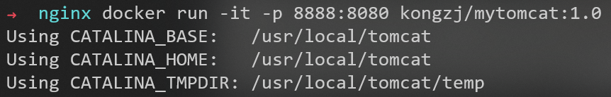

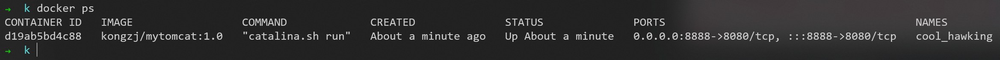

访问```172.21.103.228:8888```（```localhost:8888```也可以）成功


### 修改windows的hosts文件

目录```C:\Windows\System32\drivers\etc```下的hosts文件

没有修改权限，那就[给当前用户增加修改权限](https://www.cnblogs.com/jepson6669/p/9737645.html#:~:text=1%E3%80%81%E6%89%93%E5%BC%80%E7%94%B5%E8%84%91C%E7%9B%98%EF%BC%8C%E5%9C%A8%E7%9B%AE%E5%BD%95C%3A%5B%26Windows%26%5DSystem32driversetc%20%E4%B8%8B%E6%89%BE%E5%88%B0hosts%E6%96%87%E4%BB%B6%202.%E5%8F%B3%E9%94%AEhosts%E6%96%87%E4%BB%B6%EF%BC%8C%E9%80%89%E6%8B%A9%E5%B1%9E%E6%80%A7,3.%E7%82%B9%E5%87%BBhosts%E5%B1%9E%E6%80%A7%E5%AF%B9%E8%AF%9D%E6%A1%86%E9%87%8C%E7%9A%84%E2%80%9C%E9%AB%98%E7%BA%A7%E2%80%9D%EF%BC%8C%E5%A6%82%E4%B8%8B%E5%9B%BE%E6%89%80%E7%A4%BA%E3%80%82%204.%E5%9C%A8hosts%E7%9A%84%E9%AB%98%E7%BA%A7%E5%AE%89%E5%85%A8%E8%AE%BE%E7%BD%AE%E7%95%8C%E9%9D%A2%E7%82%B9%E5%87%BB%E6%9B%B4%E6%94%B9%E6%9D%83%E9%99%90%EF%BC%8C%E5%A6%82%E4%B8%8B%E5%9B%BE%E6%89%80%E7%A4%BA%E3%80%82%205.%E5%9C%A8%E6%96%B0%E5%BC%B9%E5%87%BA%E7%9A%84%E5%AF%B9%E8%AF%9D%E6%A1%86%E9%87%8C%E7%82%B9%E5%87%BB%E6%B7%BB%E5%8A%A0%E6%8C%89%E9%92%AE%EF%BC%8C%E5%A6%82%E4%B8%8B%E5%9B%BE%E6%89%80%E7%A4%BA%E3%80%82)

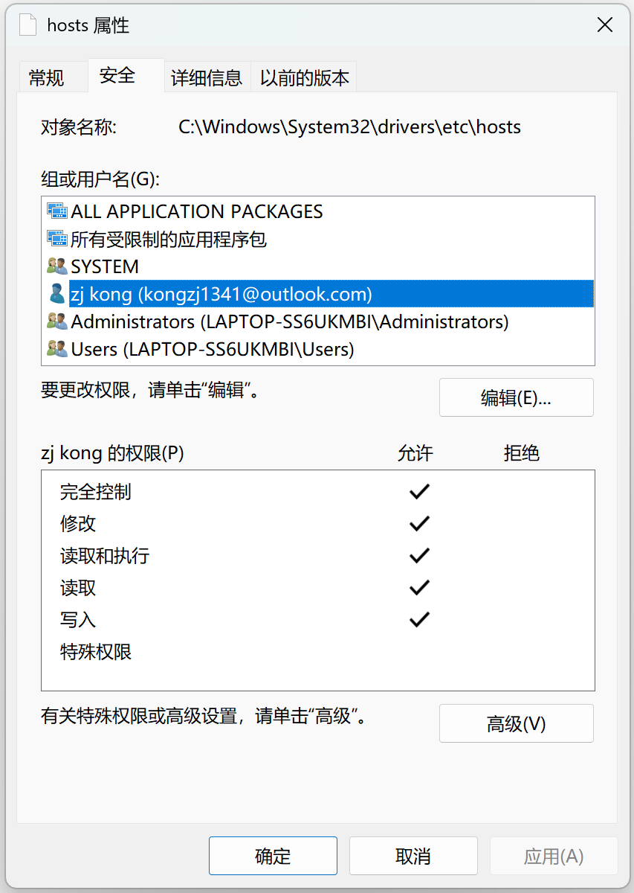

hosts文件最后增加一行


经测试，有效


### 新增nginx的配置文件```sites-available/myconf1```

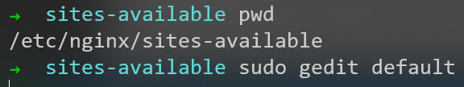

在配置文件```sites-available/default```中，有提示
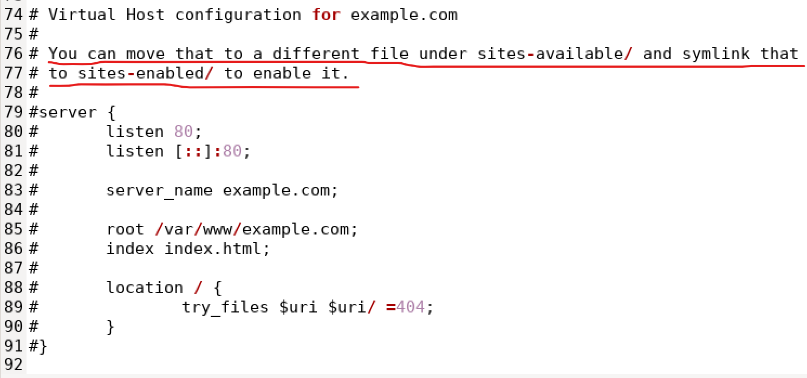

新增配置文件```sites-available/myconf1```
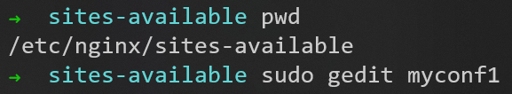

myconf1的内容为


让配置文件生效


--- 
到P9


