# nginx配置文件

## nginx配置文件位置

配置文件目录：```/etc/nginx```
虚拟主机配置文件目录：```/etc/nginx/sites-available/```
虚拟主机文件夹目录：```/var/www/```，详情可在 ```/etc/nginx/sites-available/``` 中配置
默认网页文件目录：```/usr/share/nginx/html```


## nginx配置文件组成

[nginx配置详解](https://www.runoob.com/w3cnote/nginx-setup-intro.html)

由三部分组成
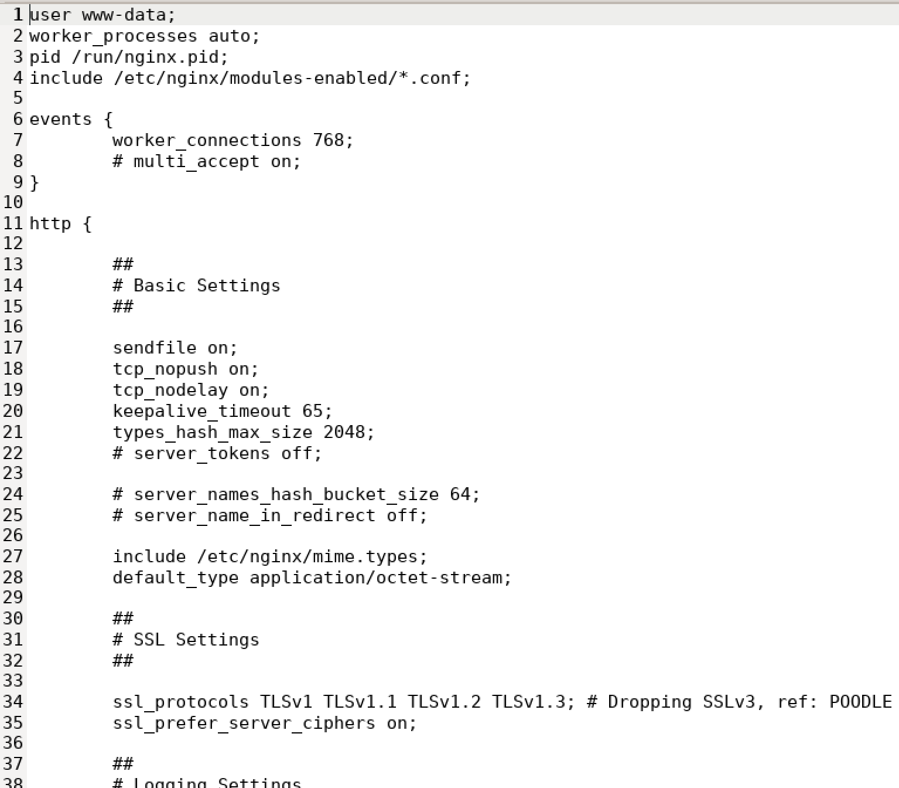

### 全局块


### events块

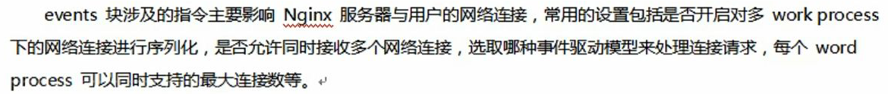

### http块


但是，在配置文件```nginx.conf```中，没有找到**server块**

使用命令```grep -rn "server" *```，在当前目录下的所有文件内容中搜索server字段
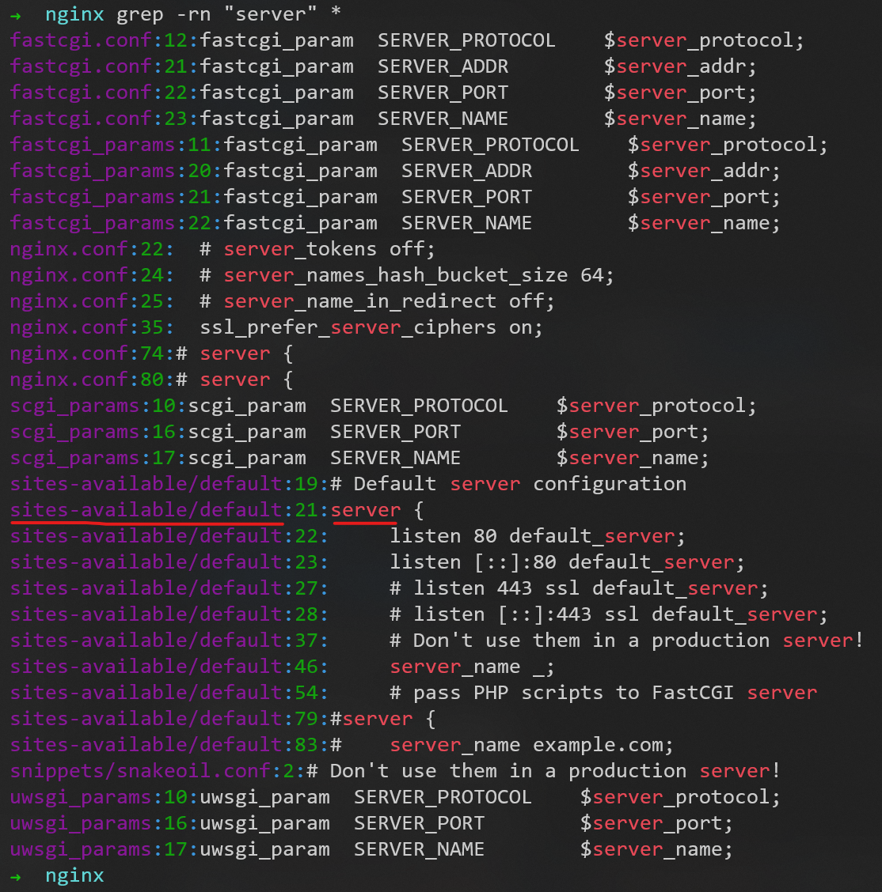

发现```sites-available/default```下有**server块**的配置信息，所以进入该目录就可进行更改
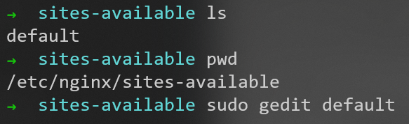

```default```文件的部分内容为
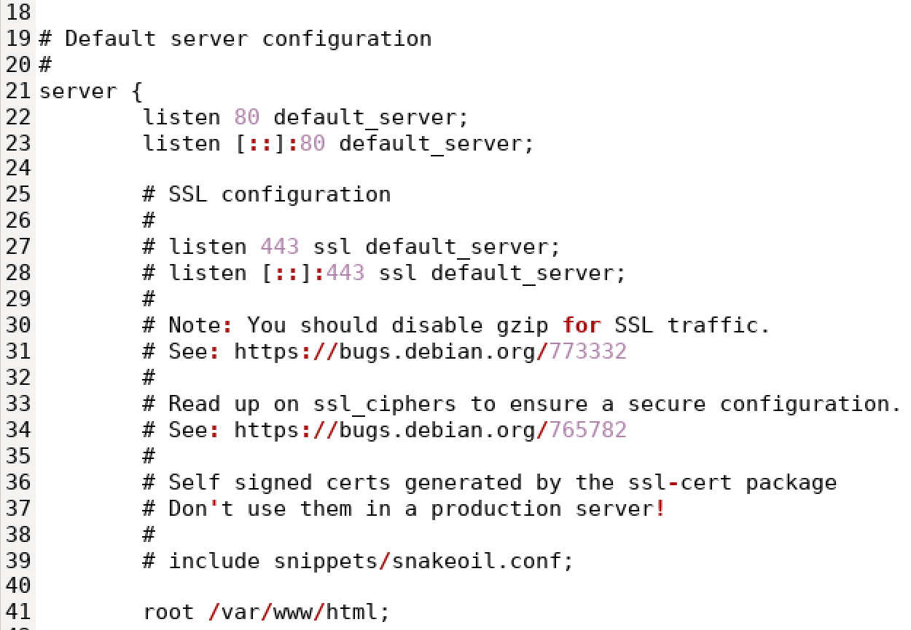
默认监听80端口

## Nginx的sites-available和sites-enabled

一个Nginx需要自动配置多个网站，并且配置基本相同，只需要修改端口号或root目录位置。

目标是用程序自动生成配置项，如果每次都修改```/etc/nginx/nginx.conf```，如何保留原有的server会比较复杂。

改成在```sites-abaiable```和```sites-enabled```目录中增加文件的方式，可以降低代码复杂度。

- sites-enabled 下的文件，会作为 nginx.conf 的一部分加载
- sites-enabled 下的用于存放 sites-available 中文件的**软连接**

sites-available 与 sites-enabled 使我们能够进行模块化配置，当我们希望增加新网站时，我们可以在 sites-available 中创建新配置文件，并在 sites-enabled 中**创建软连接**；当我们需要关闭某个站点时，我们可以在 sites-enabled 中**将软连接移除**，这在某种程度是提高了 nginx 的管理效率。

## nginx配置文件的关系

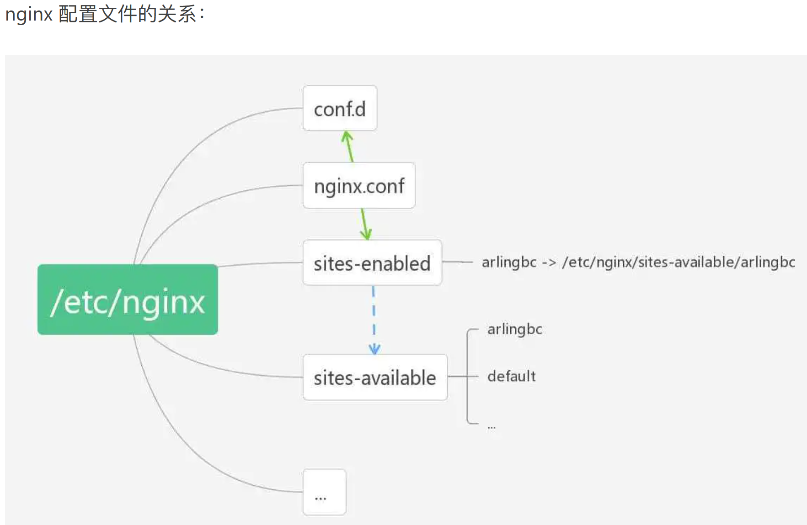

# nginx配置实例

## 配置实例1：反向代理


注意这里的tomcat主页被我修改过了

### 准备一个tomcat

用docker启动一个tomcat服务器
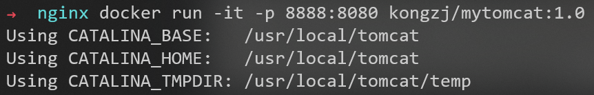

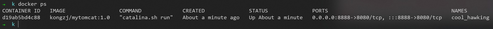

访问```172.21.103.228:8888```（```localhost:8888```也可以）成功
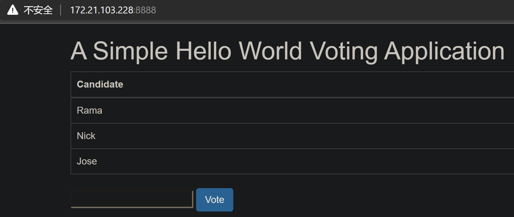

### 修改windows的hosts文件

目录```C:\Windows\System32\drivers\etc```下的hosts文件

没有修改权限，那就[给当前用户增加修改权限](https://www.cnblogs.com/jepson6669/p/9737645.html#:~:text=1%E3%80%81%E6%89%93%E5%BC%80%E7%94%B5%E8%84%91C%E7%9B%98%EF%BC%8C%E5%9C%A8%E7%9B%AE%E5%BD%95C%3A%5B%26Windows%26%5DSystem32driversetc%20%E4%B8%8B%E6%89%BE%E5%88%B0hosts%E6%96%87%E4%BB%B6%202.%E5%8F%B3%E9%94%AEhosts%E6%96%87%E4%BB%B6%EF%BC%8C%E9%80%89%E6%8B%A9%E5%B1%9E%E6%80%A7,3.%E7%82%B9%E5%87%BBhosts%E5%B1%9E%E6%80%A7%E5%AF%B9%E8%AF%9D%E6%A1%86%E9%87%8C%E7%9A%84%E2%80%9C%E9%AB%98%E7%BA%A7%E2%80%9D%EF%BC%8C%E5%A6%82%E4%B8%8B%E5%9B%BE%E6%89%80%E7%A4%BA%E3%80%82%204.%E5%9C%A8hosts%E7%9A%84%E9%AB%98%E7%BA%A7%E5%AE%89%E5%85%A8%E8%AE%BE%E7%BD%AE%E7%95%8C%E9%9D%A2%E7%82%B9%E5%87%BB%E6%9B%B4%E6%94%B9%E6%9D%83%E9%99%90%EF%BC%8C%E5%A6%82%E4%B8%8B%E5%9B%BE%E6%89%80%E7%A4%BA%E3%80%82%205.%E5%9C%A8%E6%96%B0%E5%BC%B9%E5%87%BA%E7%9A%84%E5%AF%B9%E8%AF%9D%E6%A1%86%E9%87%8C%E7%82%B9%E5%87%BB%E6%B7%BB%E5%8A%A0%E6%8C%89%E9%92%AE%EF%BC%8C%E5%A6%82%E4%B8%8B%E5%9B%BE%E6%89%80%E7%A4%BA%E3%80%82)

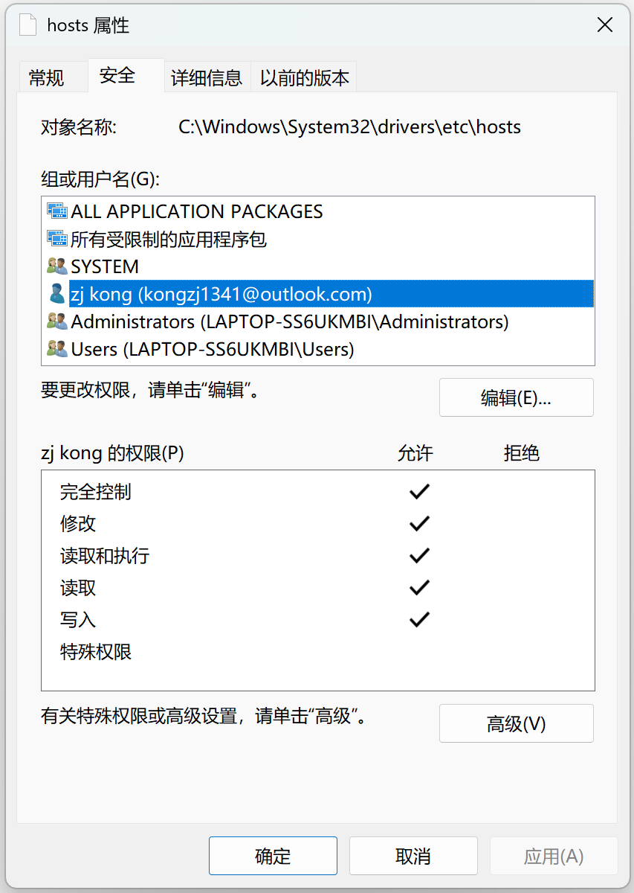

hosts文件最后增加一行


经测试，有效
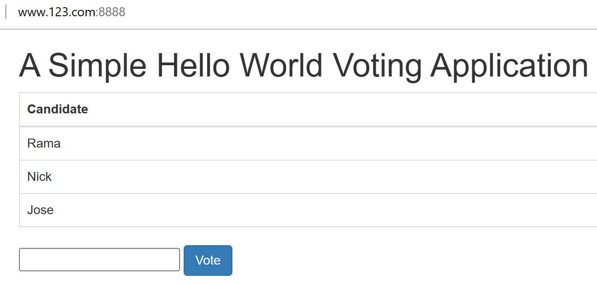

> 现在
> 1. ```172.21.103.228```（WSL子系统的IP地址）
> 2. ```localhost```（127.0.0.1）
> 3. ```www.123.com```（自己在hosts文件中设置的）
> 
> 都能访问nginx主页

### 新增nginx的配置文件```sites-available/myconf1```

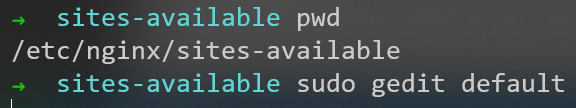

在配置文件```sites-available/default```中，有提示
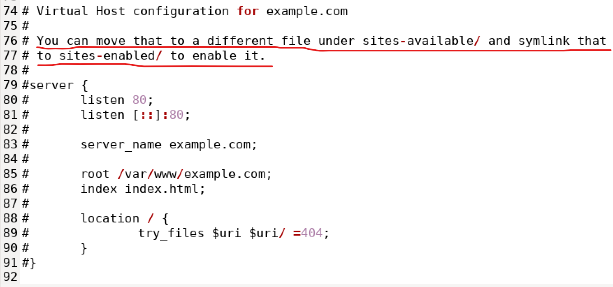

新增配置文件```sites-available/myconf1```
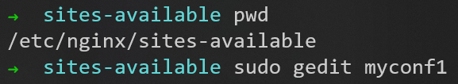

myconf1文件的内容为
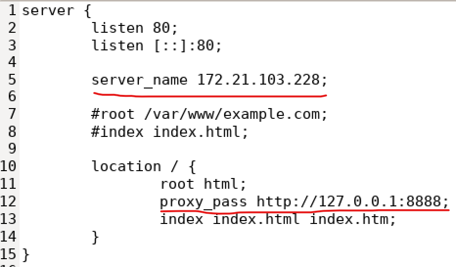

### 在```sites-enabled```中创建```sites-available/myconf1```的软连接，并删除默认的软连接

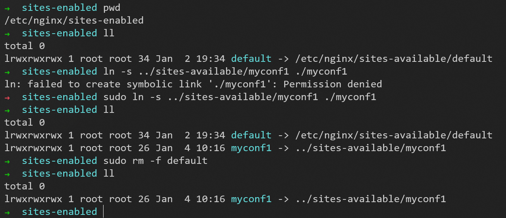

### 最终测试

让配置文件生效


访问```www.123.com```，成功
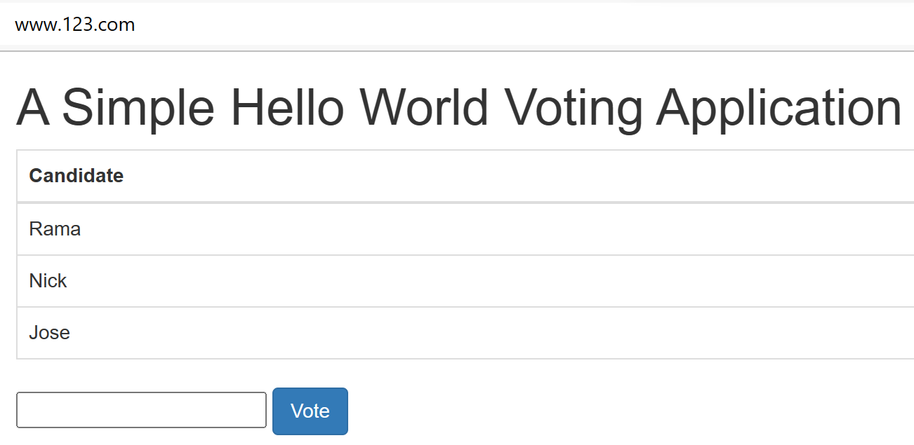

## 配置实例2：反向代理


### 准备两个tomcat

分别执行命令：
1. ```docker run -it -p 8080:8080 kongzj/mytomcat:1.0```
2. ```docker run -it -p 8081:8080 kongzj/mytomcat:1.0```

用快捷键```Ctrl + P + Q```实现容器不停止的退出

用命令```docker ps```列出所有正在运行的容器
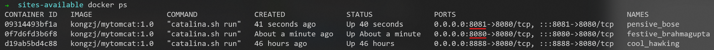

并修改两个tomcat中的```webapps/ROOT/index.html```文件，分别加上：
1. ```(port:8080)```
2. ```(port:8081)```

使之后访问不同的tomcat时，能区分开

### 新增nginx的配置文件```sites-available/myconf2```

myconf2文件的内容为
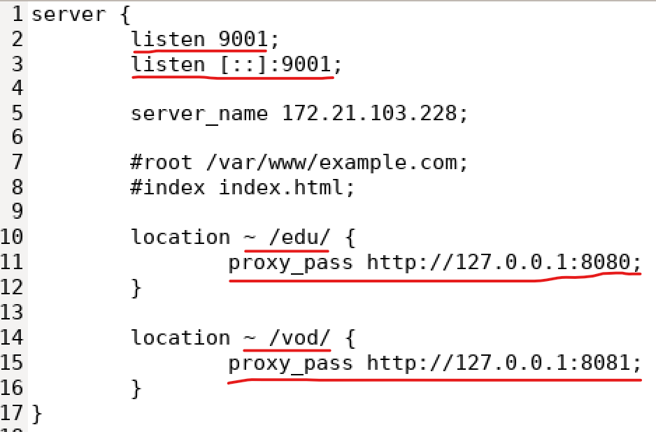

#### location中的正则表达式

该指令用于匹配 URI， 语法如下：
```
location [ = | ~ | ~* | ^~] uri {

}
 ```
- ```=``` ：用于不含正则表达式的 uri 前，要求请求字符串与 uri 严格匹配， 如果匹配成功，就停止继续向下搜索并立即处理该请求。
- ```~``` ：用于表示 uri 包含正则表达式，并且区分大小写。
- ```~*``` ：用于表示 uri 包含正则表达式，并且不区分大小写。
- ```^~``` ：用于不含正则表达式的 uri 前，要求 Nginx 服务器找到标识 uri 和请求
- 字符串匹配度最高的 location 后，立即使用此 location 处理请求，而不再使用 location块中的正则 uri 和请求字符串做匹配。
- 注意：如果 uri 包含正则表达式，则必须要有 ```~``` 或者 ```~*``` 标识

##### 注意URI、URL、URN的区别

- URI（Uniform Resource Identifier ）：统一资源标识符，就是在某一规则下能把一个资源独一无二地标识出来。
- URL（Uniform Resource Locator）：统一资源定位符。
- URN（Uniform Resource Name）：统一资源名称。

A Uniform Resource Identifier (URI) 是一个紧凑的字符串用来标示抽象或物理资源。

A URI 可以进一步被分为定位符、名字或两者都是. 术语"Uniform Resource Locator" (URL) 是URI的子集, 除了确定一个资源,还提供一种定位该资源的主要访问机制(如其网络"位置")。

URI可以分为URL,URN或同时具备locators 和names特性的一个东西。URN作用就好像一个人的名字，URL就像一个人的地址。换句话说：URN确定了东西的身份，URL提供了找到它的方式。


### 在```sites-enabled```中创建```sites-available/myconf2```的软连接

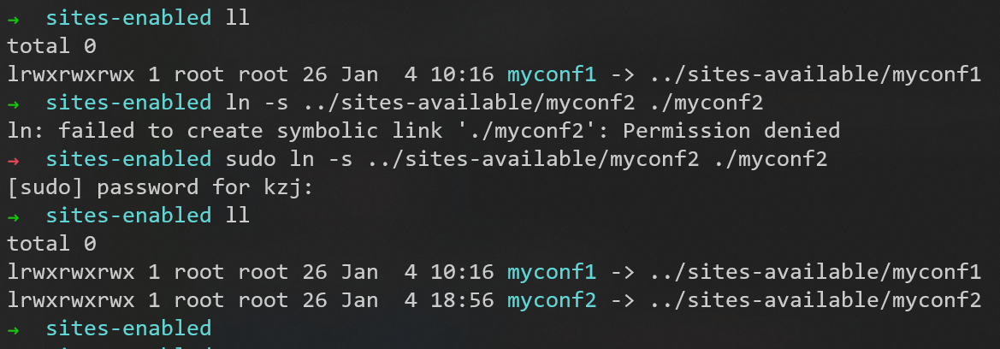

### 第一次测试（失败）

让配置文件生效


访问```127.0.0.1:9001/edu/```，返回404
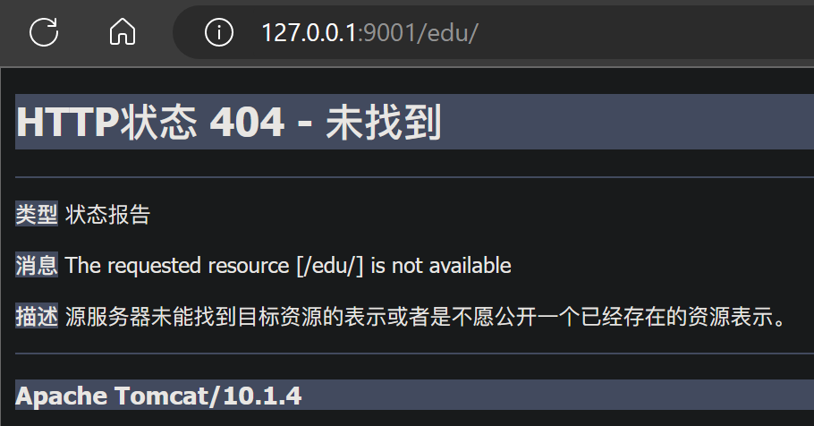
同理，访问```127.0.0.1:9001/vod/```也返回404

### 修改两个tomcat中index.html文件的位置

分别把：
1. 8080端口的tomcat中```webapps/ROOT/index.html```文件移动到```webapps/edu/index.html```
2. 同理，8081端口的tomcat中```webapps/ROOT/index.html```文件移动到```webapps/vod/index.html```

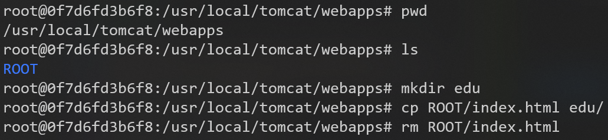

### 第二次测试（成功）

访问```127.0.0.1:9001/edu/```，返回8080的页面
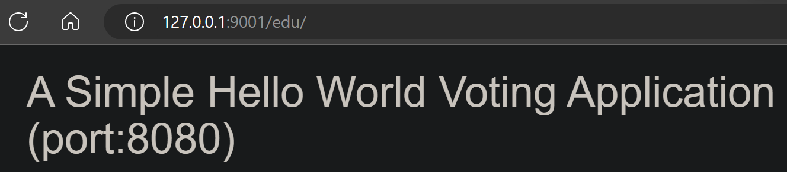

同理，访问```127.0.0.1:9001/vod/```，返回8081的页面
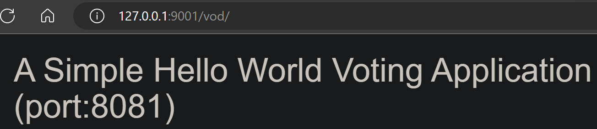

### 第一次测试和第二次测试的总结

- 根据上面的配置，当请求到达 Nginx 反向代理服务器时，会根据请求进行分发到不同的服务上。
- 所以不同tomcat的```webapps```目录下要建对应的文件夹```edu/```或```vod/```来响应不同的请求。

## 配置实例3：负载均衡


### 准备两个tomcat


现在访问```127.0.0.1:8080/edu/a.html```，返回8080的页面
同理，访问```127.0.0.1:8081/edu/a.html```，返回8081的页面

### 新增nginx的配置文件```sites-available/myconf3```进行负载均衡的配置

myconf3文件的内容为


--- 
到P11 6min


