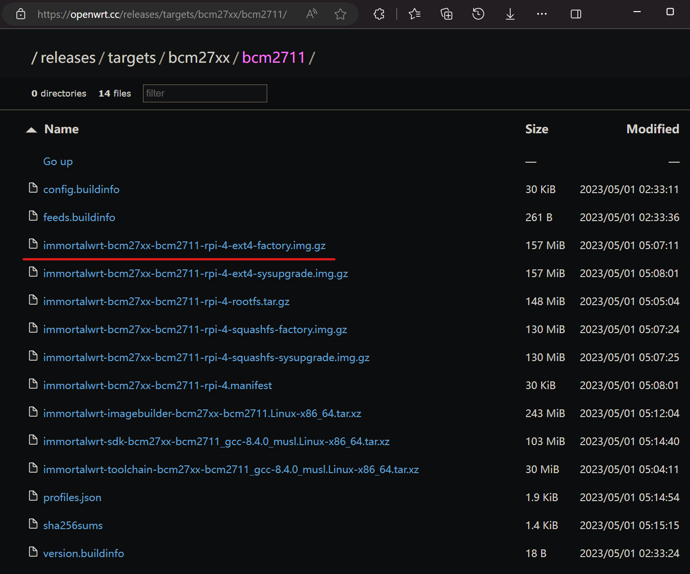
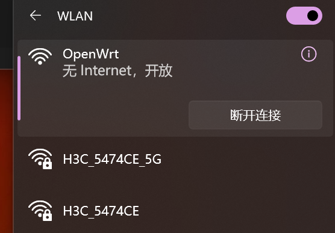
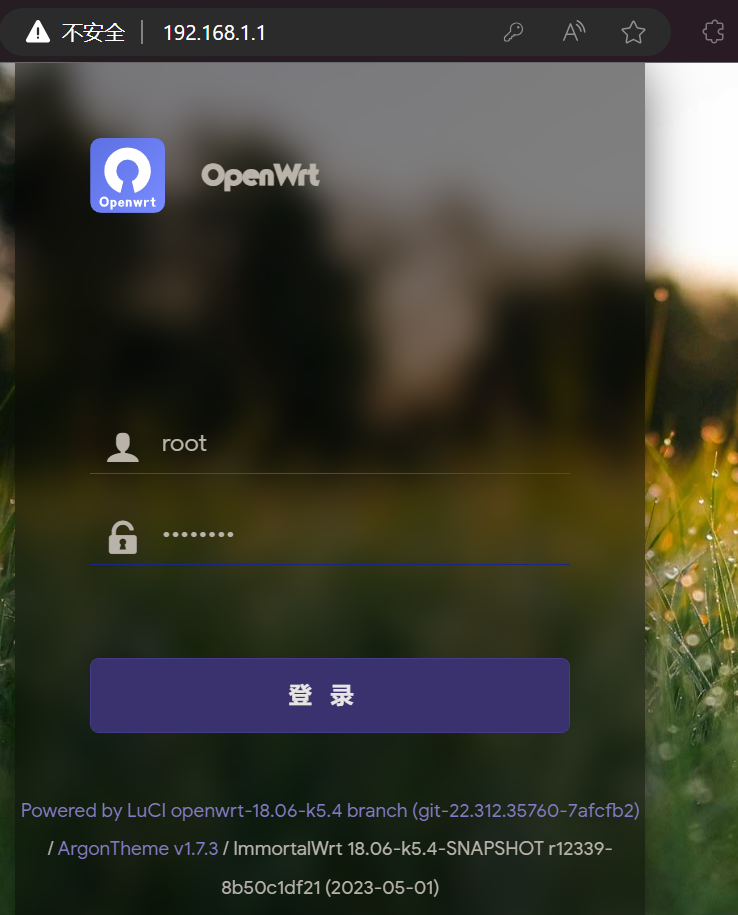
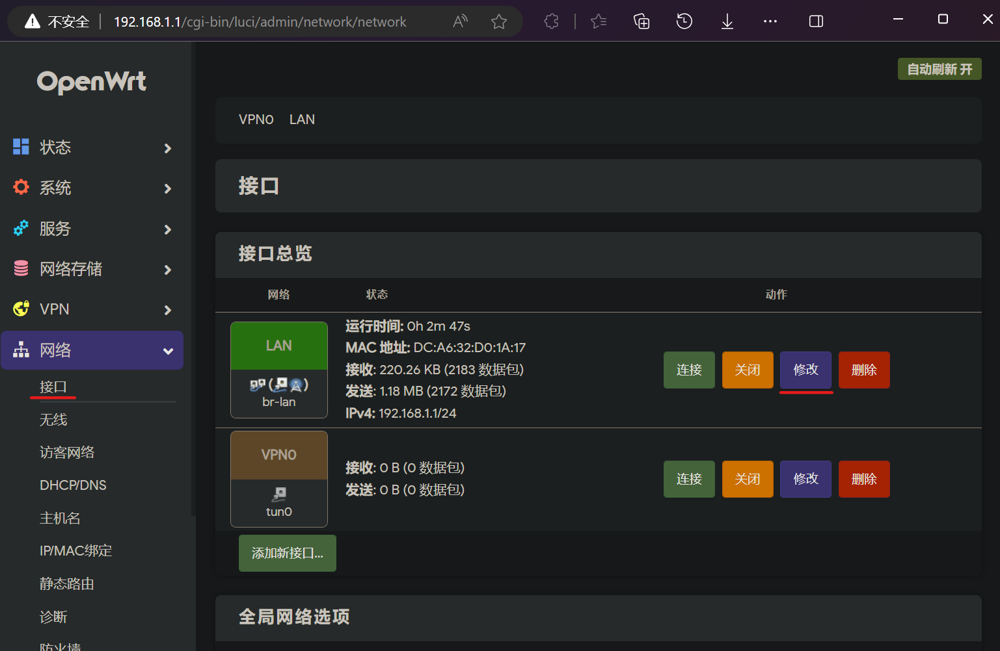
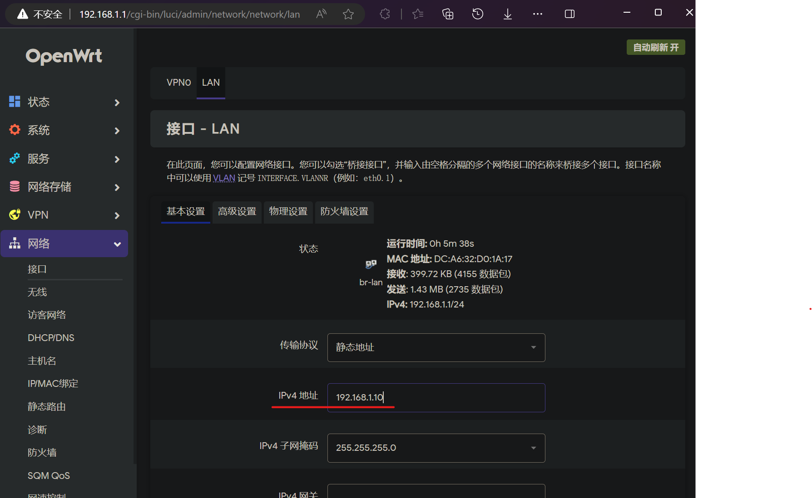

# OpenWrt

OpenWrt 是一个为嵌入式设备（通常是无线路由器）开发的高扩展度的 GNU/Linux 发行版。与许多其他路由器的发行版不同，OpenWrt 是一个完全为嵌入式设备构建的功能全面、易于修改、由现代 Linux 内核驱动的操作系统

## 安装 OpenWrt 到 树莓派4B

硬件设备为 树莓派4B

[OpenWrt的github](https://github.com/SuLingGG/OpenWrt-Rpi)

[OpenWrt固件下载](https://doc.openwrt.cc/2-OpenWrt-Rpi/1-Download/)

下载的镜像版本为

烧录镜像到SD卡

## 第一次启动，初始化设置

给树莓派通电开机，使用电脑查看周围的Wifi，将会看到一个名为 OpenWrt 的Wifi网络，电脑可以直接加入 OpenWrt 网络（无需密码）

也可以使用网线，连接树莓派和电脑

用电脑浏览器访问 192.168.1.1 ，即可进入路由器后台（Web管理界面）

默认用户名：root
默认密码：password

重新设置 root 密码为 kzj654321

为了避免 IP冲突，修改 LAN接口 的 IP地址为 192.168.1.10

以后，用电脑浏览器访问 192.168.1.10 ，即可进入路由器后台

