# 开始

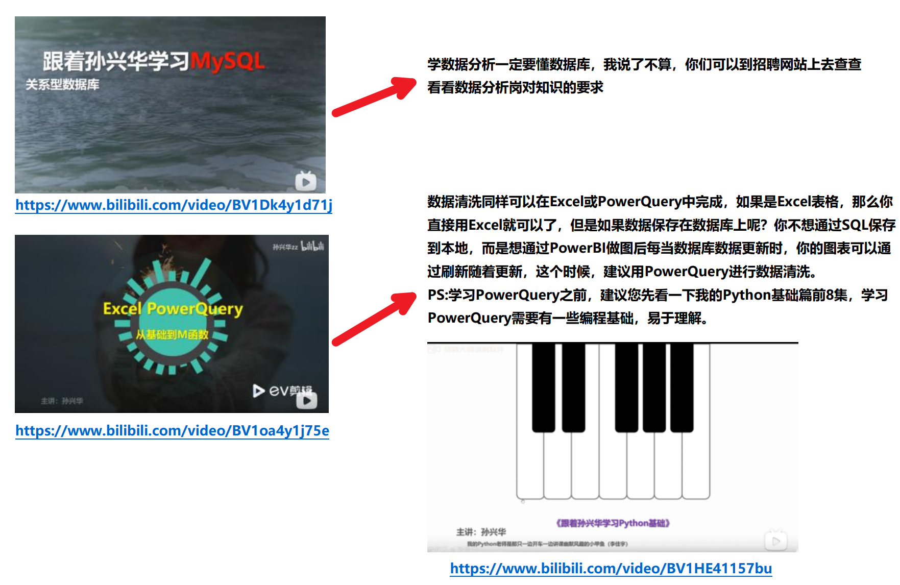

## 新建列

### ```'```，联想表名

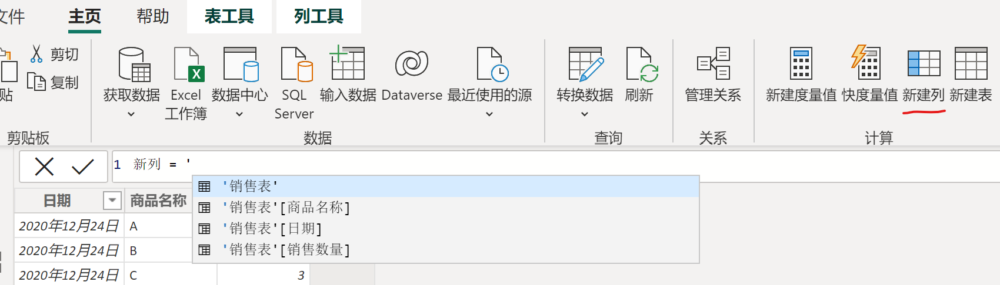

### ```[```，联想当前表的列名

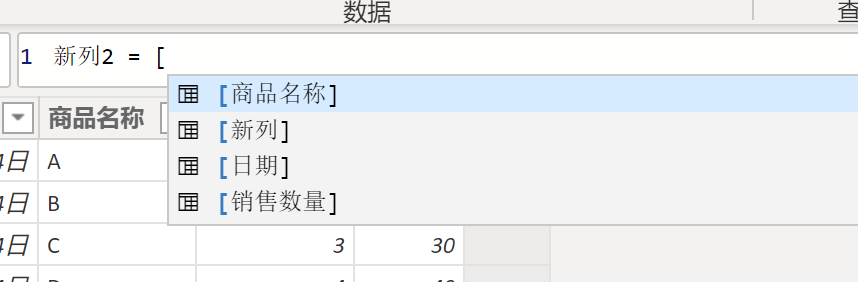

#### 上面两种用法功能相同

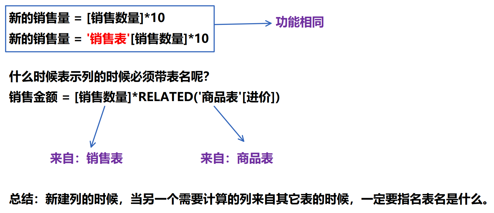

多个表时：

先让**品名**和**商品名称**构成1:n关系
（从一个表的一列托向另一个表的一列）


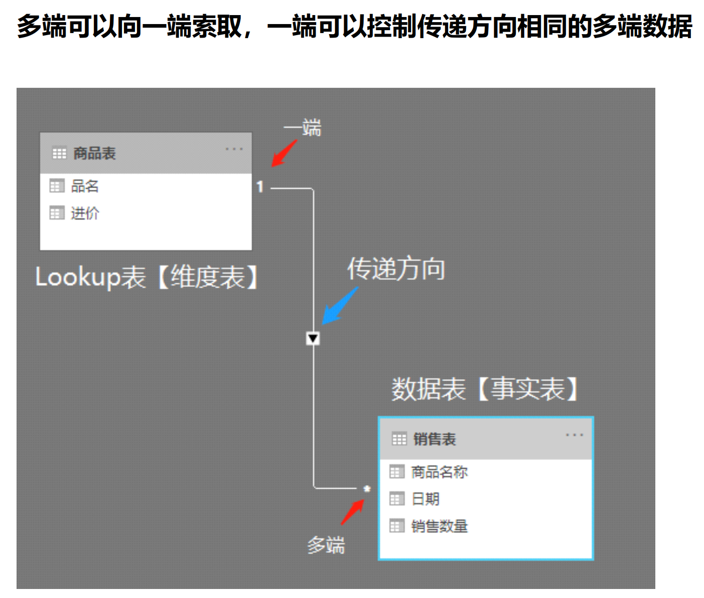

用另外一个表的数据


## Lookupvalue函数
把其他表中的对应值引入本表（对应值要唯一）

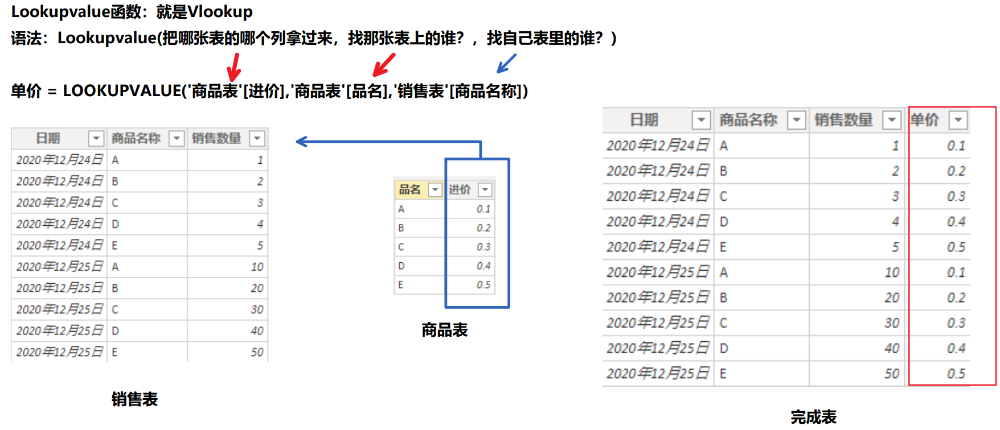

## Related函数
建立表之间的关系后，直接拿其他表中对应的数据
**多端找一端**

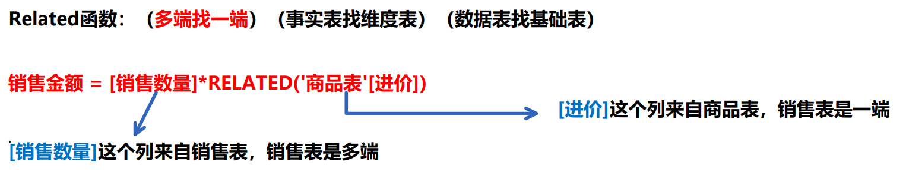

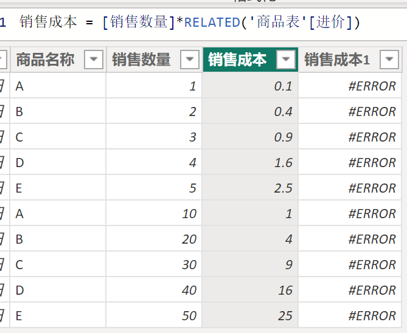

错误示范：

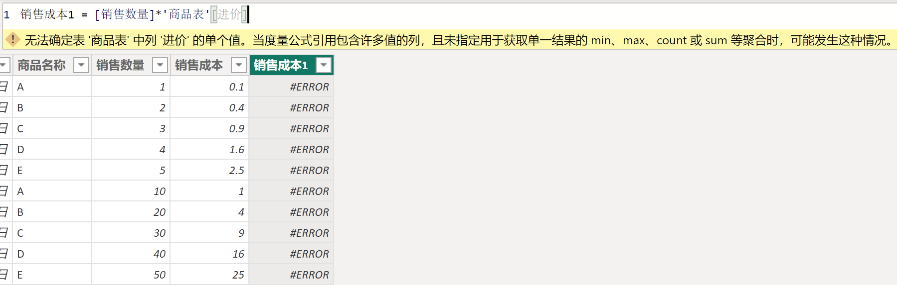

## Relatedtable函数
建立表之间的关系后，直接拿其他表中对应的数据
**一端找多端**

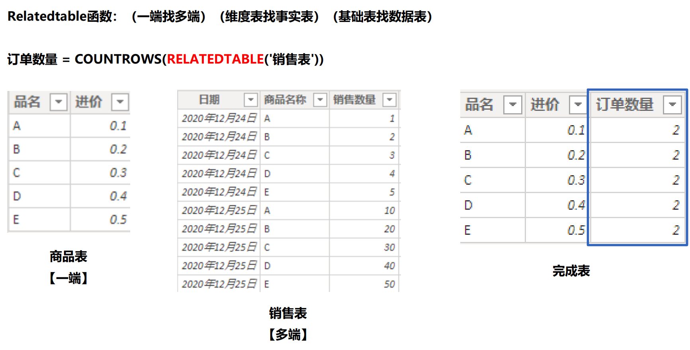

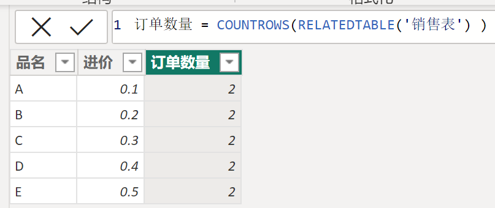

## Countrows函数
统计行数，见上图


