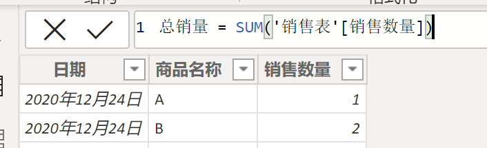
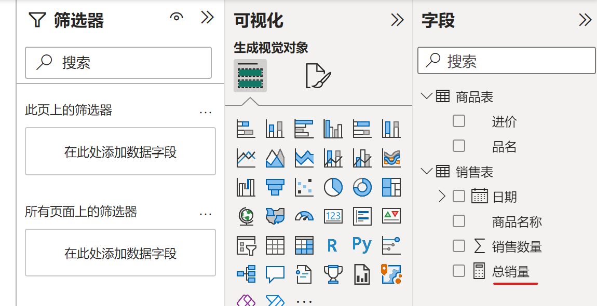
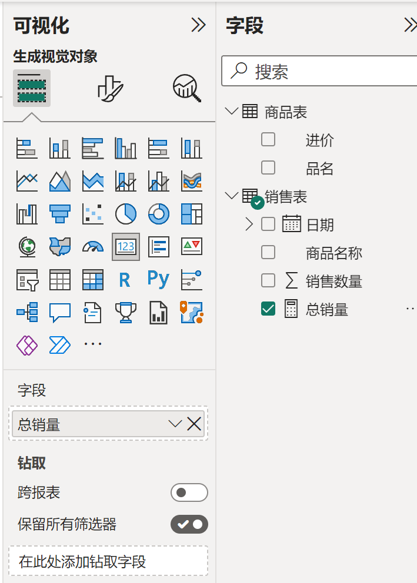
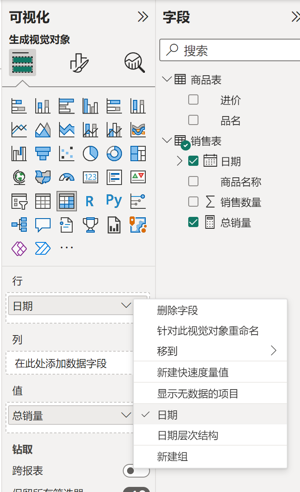
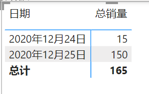
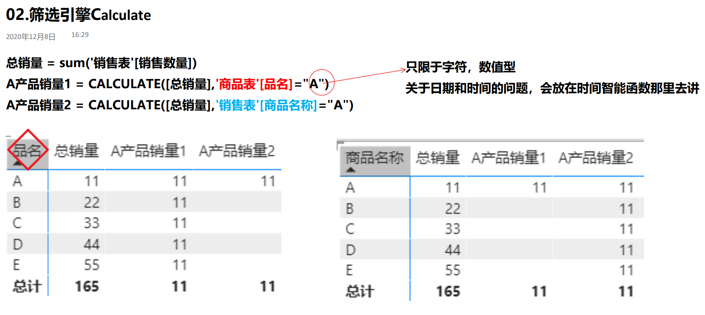
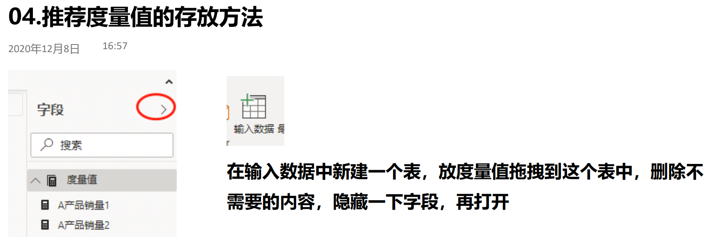
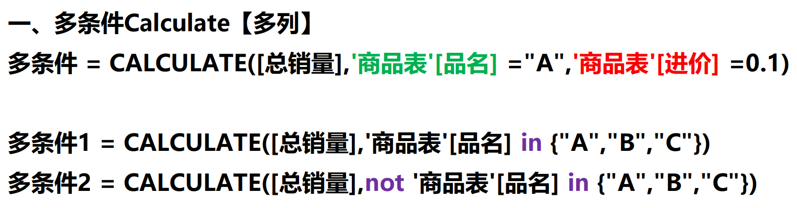
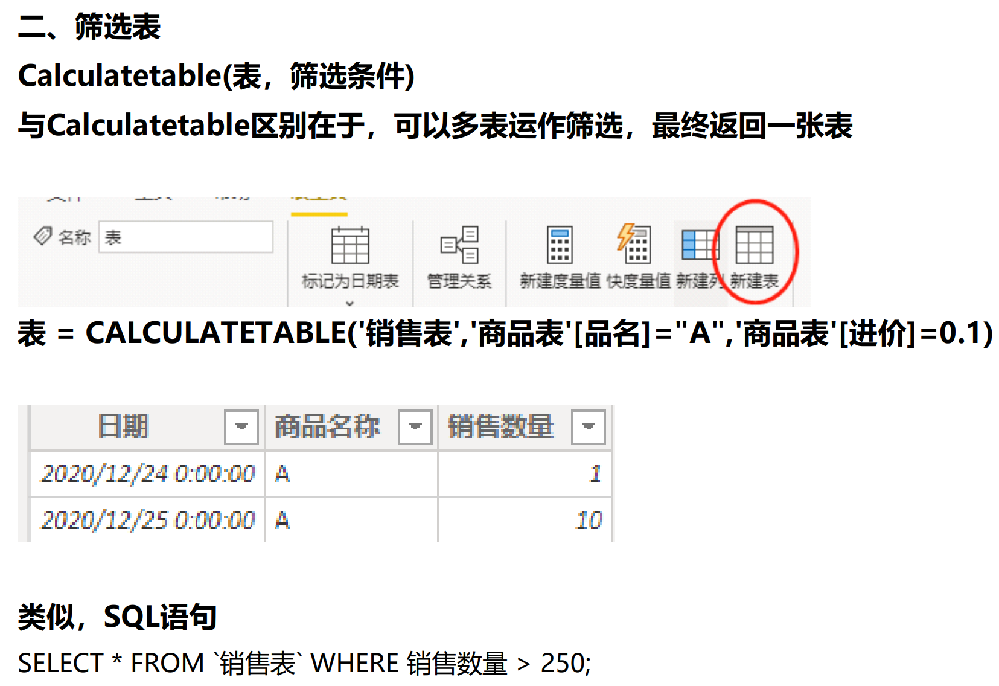

# 新建度量值
与新建列相比，**不费内存**，且**自带筛选功能**
总结：新建列是横向计算，新建度量值是纵向计算

## Sum函数
对某个列的所有数值求和

回车之后表中没有反应
到**报表**页面

**字段**窗口中可看到

可以应用这个字段

**日期**和**日期层次结构**两种选择

完成了**分组求和**功能

## 筛选引擎Calculate

### 单条件筛选

结论：筛选条件不要来自于创建度量值的同一张表

### 多条件筛选

## Calculatetable筛选表

新建表

到P8
