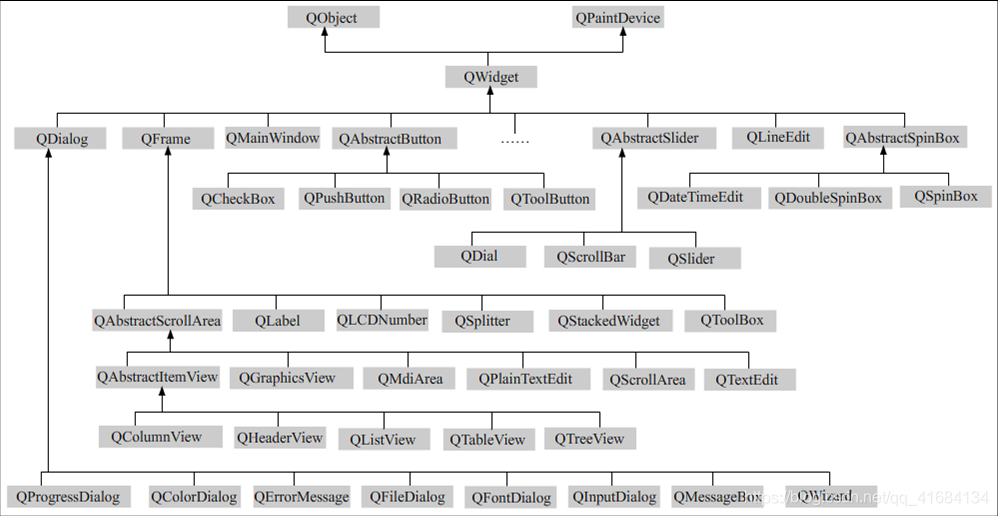

# PyQt5

## 介绍

PyQt是一个创建GUI应用程序的工具包。它是Python编程语言和Qt库的成功融合

PyQt5类分为很多模块，主要模块有：
- **QtCore** 包含了核心的非GUI的功能。主要和时间、文件与文件夹、各种数据、流、URLs、mime类文件、进程与线程一起使用
- **QtGui** 包含了窗口系统、事件处理、2D图像、基本绘画、字体和文字类
- **QtWidgets** 包含了一系列创建桌面应用的UI元素
- **QtMultimedia** 包含了处理多媒体的内容和调用摄像头API的类
- **QtBluetooth** 包含了查找和连接蓝牙的类
- **QtNetwork** 包含了网络编程的类，这些工具能让TCP/IP和UDP开发变得更加方便和可靠
- **QtPositioning** 包含了定位的类，可以使用卫星、WiFi甚至文本
- **Engine** 包含了通过客户端进入和管理Qt Cloud的类
- **QtWebSockets** 包含了WebSocket协议的类
- **QtWebKit** 包含了一个基WebKit2的web浏览器
- **QtWebKitWidgets** 包含了基于QtWidgets的WebKit1的类
- **QtXml** 包含了处理xml的类，提供了SAX和DOM API的工具
- **QtSvg** 提供了显示SVG内容的类，Scalable Vector Graphics (SVG)是一种是一种基于可扩展标记语言（XML），用于描述二维矢量图形的图形格式
- **QtSql** 提供了处理数据库的工具
- **QtTest** 提供了测试PyQt5应用的工具

## 链接

[官网](https://www.qt.io/)
[文档](https://doc.qt.io/)
[PyQt中文教程](https://maicss.gitbook.io/pyqt-chinese-tutoral/)

## 安装

```sh
pip install PyQt5 -i https://pypi.douban.com/simple
pip install PyQt5-tools -i https://pypi.douban.com/simple
```

## 简单示例

### 简单的窗口

运行这段代码，能展示出一个小窗口
```py
import sys
from PyQt5.QtWidgets import QApplication, QWidget

if __name__ == '__main__':
    # 面向过程编程
    # 每个PyQt5应用都必须创建一个应用对象。sys.argv是一组命令行参数的列表
    app = QApplication(sys.argv)

    # QWidget控件是一个用户界面的基本控件，它提供了基本的应用构造器。默认情况下，构造器是没有父级的，没有父级的构造器被称为窗口（window）
    w = QWidget()
    # resize()方法能改变控件的大小
    w.resize(250, 150)
    # move()方法能修改控件的位置
    w.move(300, 300)
    # 给这个窗口添加了一个标题，标题在标题栏展示
    w.setWindowTitle('Simple')
    # show()能让控件在桌面上显示出来。控件在内存里创建，之后才能在显示器上显示出来
    w.show()

    # 最后，我们进入了应用的主循环中，事件处理器这个时候开始工作。主循环从窗口上接收事件，并把事件派发到应用控件里。当调用exit()方法或直接销毁主控件时，主循环就会结束。sys.exit()方法能确保主循环安全退出。外部环境会收到主控件如何结束的信息
    sys.exit(app.exec_())
```

效果如下

### 带窗口图标

窗口图标通常是显示在窗口的左上角，标题栏的最左边
```py
import sys
from PyQt5.QtWidgets import QApplication, QWidget
from PyQt5.QtGui import QIcon

# 面向对象编程
# 这个类继承自QWidget。这就意味着，我们调用了两个构造器，一个是这个类本身的，一个是这个类继承的
class Example(QWidget):

    def __init__(self):
        # super()构造器方法返回父级的对象。__init__()方法是构造器的一个方法
        super().__init__()

        # 使用initUI()方法创建一个GUI
        self.initUI()

    def initUI(self):
        # setGeometry()有两个作用：把窗口放到屏幕上并且设置窗口大小。参数分别代表屏幕坐标的x、y和窗口大小的宽、高。也就是说这个方法是resize()和move()的合体
        self.setGeometry(300, 300, 300, 220)
        self.setWindowTitle('Icon')
        # 自己准备一个web.png文件，放在当前目录下
        # 先创建一个QIcon对象，然后接受一个路径作为参数显示图标
        self.setWindowIcon(QIcon('web.png'))        

        self.show()

if __name__ == '__main__':
    # 应用和示例的对象创立，主循环开始
    app = QApplication(sys.argv)
    ex = Example()
    sys.exit(app.exec_())
```

效果如下


### 提示框

为应用和按钮分别添加一个提示框
```py
import sys
from PyQt5.QtWidgets import (QWidget, QToolTip, QPushButton, QApplication)
from PyQt5.QtGui import QFont    

class Example(QWidget):

    def __init__(self):
        super().__init__()
        self.initUI()

    def initUI(self):
        # setFont()这个静态方法设置了提示框的字体，我们使用了10px的SansSerif字体
        QToolTip.setFont(QFont('SansSerif', 10))

        # 调用setToolTip()创建提示框，可以使用富文本格式的内容
        self.setToolTip('This is a <b>QWidget</b> widget')

        # 创建一个按钮，并且为按钮添加了一个提示框
        btn = QPushButton('Button', self)
        btn.setToolTip('This is a <b>QPushButton</b> widget')
        # sizeHint()方法提供了一个默认的按钮大小
        btn.resize(btn.sizeHint())
        btn.move(50, 50)       

        self.setGeometry(300, 300, 300, 200)
        self.setWindowTitle('Tooltips')    
        self.show()

if __name__ == '__main__':
    app = QApplication(sys.argv)
    ex = Example()
    sys.exit(app.exec_())
```

效果如下


### 关闭窗口

创建了一个点击之后就退出窗口的按钮。这里我们将接触到一点signal（信号）和slots（槽）的知识
```py
import sys
from PyQt5.QtWidgets import QWidget, QPushButton, QApplication
from PyQt5.QtCore import QCoreApplication

class Example(QWidget):

    def __init__(self):
        super().__init__()
        self.initUI()

    def initUI(self):               
        # 创建一个继承自QPushButton的按钮。第一个参数是按钮的文本，第二个参数是按钮的父级组件，此处，父级组件就是我们创建的继承自QWidget的Example类
        qbtn = QPushButton('Quit', self)
        # 事件传递系统在PyQt5内建的signals和slots机制里面。点击按钮之后，信号会被捕捉并给出既定的反应。QCoreApplication包含了事件的主循环，它能添加和删除所有的事件，instance()创建了一个它的实例。QCoreApplication是在QApplication里创建的。 点击事件和能终止进程并退出应用的quit函数绑定在了一起。在发送者和接受者之间建立了通讯，发送者就是按钮，接受者就是应用对象
        qbtn.clicked.connect(QCoreApplication.instance().quit)
        qbtn.resize(qbtn.sizeHint())
        qbtn.move(50, 50)       

        self.setGeometry(300, 300, 250, 150)
        self.setWindowTitle('Quit button')    
        self.show()

if __name__ == '__main__':
    app = QApplication(sys.argv)
    ex = Example()
    sys.exit(app.exec_())
```

效果如下


### 消息盒子

默认情况下，我们点击标题栏的×按钮，QWidget就会关闭。但是有时候，我们会修改默认行为。比如，如果我们打开的是一个文本编辑器，并且做了一些修改，我们就会想在关闭按钮的时候让用户进一步确认操作
```py
import sys
from PyQt5.QtWidgets import QWidget, QMessageBox, QApplication

class Example(QWidget):

    def __init__(self):
        super().__init__()
        self.initUI()

    def initUI(self):               
        self.setGeometry(300, 300, 250, 150)        
        self.setWindowTitle('Message box')    
        self.show()

    # 如果关闭QWidget，就会产生一个QCloseEvent，并且把它传入到closeEvent函数的event参数中。改变控件的默认行为，就是替换掉默认的事件处理
    def closeEvent(self, event):
        # 创建了一个消息框，上面有俩按钮：Yes和No。第一个字符串显示在消息框的标题栏，第二个字符串显示在对话框，第三个参数是消息框的俩按钮，最后一个参数是默认按钮，这个按钮是默认选中的。返回值在变量reply里
        reply = QMessageBox.question(self, 'Message',
            "Are you sure to quit?", QMessageBox.Yes | 
            QMessageBox.No, QMessageBox.No)

        # 判断返回值，如果点击的是Yes按钮，我们就关闭组件和应用，否者就忽略关闭事件
        if reply == QMessageBox.Yes:
            event.accept()
        else:
            event.ignore()        

if __name__ == '__main__':
    app = QApplication(sys.argv)
    ex = Example()
    sys.exit(app.exec_())
```

效果如下


### 窗口居中

实现窗口的居中显示
```py
import sys
from PyQt5.QtWidgets import QWidget, QDesktopWidget, QApplication

class Example(QWidget):

    def __init__(self):
        super().__init__()
        self.initUI()

    def initUI(self):               
        self.resize(250, 150)
        # 调用我们下面写的，实现对话框居中的方法
        self.center()
        self.setWindowTitle('Center')    
        self.show()

    def center(self):
        # 获得主窗口所在的框架
        qr = self.frameGeometry()
        # 获取显示器的分辨率，然后得到屏幕中间点的位置
        cp = QDesktopWidget().availableGeometry().center()
        # 然后把主窗口框架的中心点放置到屏幕的中心位置
        qr.moveCenter(cp)
        # 通过move函数把主窗口的左上角移动到其框架的左上角，这样就把窗口居中了
        self.move(qr.topLeft())

if __name__ == '__main__':
    app = QApplication(sys.argv)
    ex = Example()
    sys.exit(app.exec_())
```

效果如下

## QWidget、QMainWindow、QDialog

QMainWindow、QWidget、QDialog是Qt中常用的窗口，我们在新建Qt Widgets项目进行类信息选择时会碰到它们，那么他们之间到底有什么区别和联系呢？

QWidget继承于QObject和QPaintDevice，QDialog和QMainWindow则继承于QWidget，QDialog、QMainWindow两者之间没有直接关系



## QWidget（基础构建块）

QWidget 是 Qt 中所有用户界面元素的基类。从按钮到文本框，甚至包括窗口和对话框，所有这些都是 QWidget 的子类。QWidget 可以是可视化元素，也可以作为其他可视化元素的容器

## QMainWindow（构建复杂应用程序的框架）


## QDialog


---

https://www.bilibili.com/video/BV1LT4y1e72X/?spm_id_from=333.337.search-card.all.click

http://www.pyqt5.cn/video/


[pyqt6](https://maicss.gitbook.io/pyqt-chinese-tutoral/pyqt6)

