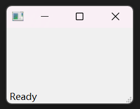
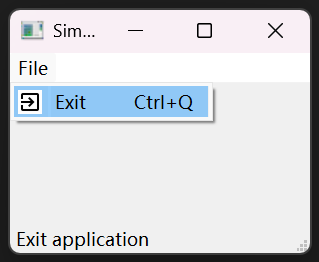
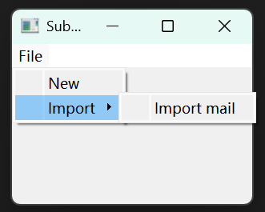
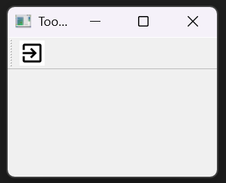

# 主窗口 QMainWindow

QMainWindow是一个为用户提供主窗口程序的类，包含一个菜单栏（menu bar）、多个工具栏(tool bars)、多个锚接部件(dock widgets)、一个状态栏(status bar)及一个中心部件(central widget)，是许多应用程序的基础，如文本编辑器，图片编辑器等

QMainWindow 提供了主窗口的功能，使用它能创建一些简单的**状态栏、菜单栏、工具栏**

现在我们把上面的三种栏在一个应用里展示出来
```py
import sys
from PyQt5.QtWidgets import QMainWindow, QTextEdit, QAction, QApplication
from PyQt5.QtGui import QIcon

class Example(QMainWindow):

    def __init__(self):
        super().__init__()
        self.initUI()

    def initUI(self):               
        textEdit = QTextEdit()
        self.setCentralWidget(textEdit)

        # 自己准备一个exit.png文件，放在当前目录下
        exitAct = QAction(QIcon('exit.png'), 'Exit', self)
        exitAct.setShortcut('Ctrl+Q')
        exitAct.setStatusTip('Exit application')
        exitAct.triggered.connect(self.close)

        self.statusBar()

        menubar = self.menuBar()
        fileMenu = menubar.addMenu('&File')
        fileMenu.addAction(exitAct)

        toolbar = self.addToolBar('Exit')
        toolbar.addAction(exitAct)

        self.setGeometry(300, 300, 350, 250)
        self.setWindowTitle('Main window')    
        self.show()

if __name__ == '__main__':
    app = QApplication(sys.argv)
    ex = Example()
    sys.exit(app.exec_())
```

效果如下


# QAction 动作

# 状态栏

状态栏是用来显示应用的状态信息的组件，通常在应用的底部

```py
import sys
from PyQt5.QtWidgets import QMainWindow, QApplication

class Example(QMainWindow):

    def __init__(self):
        super().__init__()
        self.initUI()

    def initUI(self):
        # 调用QtGui.QMainWindow类的statusBar()方法，创建状态栏。第一次调用会创建一个状态栏，而再次调用会返回一个状态栏对象。showMessage()方法在状态栏上显示一条信息               
        self.statusBar().showMessage('Ready')
        self.setGeometry(300, 300, 250, 150)
        self.setWindowTitle('Statusbar')    
        self.show()

if __name__ == '__main__':
    app = QApplication(sys.argv)
    ex = Example()
    sys.exit(app.exec_())
```

效果如下


# 菜单栏

菜单栏是一组命令的集合

```py
import sys
from PyQt5.QtWidgets import QMainWindow, QAction, qApp, QApplication
from PyQt5.QtGui import QIcon

class Example(QMainWindow):

    def __init__(self):
        super().__init__()
        self.initUI()

    def initUI(self):
        # QAction是菜单栏、工具栏或者快捷键的动作的组合
        # 自己准备一个exit.png文件，放在当前目录下
        # 创建了一个图标、一个exit的标签              
        exitAct = QAction(QIcon('exit.png'), '&Exit', self)
        # 创建一个快捷键组合   
        exitAct.setShortcut('Ctrl+Q')
        # 创建了一个状态栏，当鼠标悬停在菜单栏的时候，能显示当前状态
        exitAct.setStatusTip('Exit application')
        # 当执行这个指定的动作时，就触发了一个事件。这个事件跟QApplication的quit()行为相关联，所以这个动作就能终止这个应用
        exitAct.triggered.connect(qApp.quit)

        self.statusBar()

        # menuBar()创建菜单栏
        menubar = self.menuBar()
        # 用addMenu()在上面添加了一个File菜单
        fileMenu = menubar.addMenu('&File')
        # 用addAction()关联点击退出应用的事件
        fileMenu.addAction(exitAct)

        self.setGeometry(300, 300, 300, 200)
        self.setWindowTitle('Simple menu')    
        self.show()

if __name__ == '__main__':
    app = QApplication(sys.argv)
    ex = Example()
    sys.exit(app.exec_())
```

效果如下


## 子菜单

子菜单是**嵌套**在菜单里面的二级或者三级等更高级的菜单
本例中，有两个子菜单，一个在File菜单下面，一个在File的Import下面

```py
import sys
from PyQt5.QtWidgets import QMainWindow, QAction, QMenu, QApplication

class Example(QMainWindow):

    def __init__(self):
        super().__init__()
        self.initUI()

    def initUI(self):         
        menubar = self.menuBar()
        fileMenu = menubar.addMenu('File')

        # 使用QMenu创建一个新菜单
        impMenu = QMenu('Import', self)
        impAct = QAction('Import mail', self)
        # 使用addAction()添加一个动作
        impMenu.addAction(impAct)

        newAct = QAction('New', self)        

        fileMenu.addAction(newAct)
        # 使用addMenu()添加一个子菜单
        fileMenu.addMenu(impMenu)

        self.setGeometry(300, 300, 300, 200)
        self.setWindowTitle('Submenu')    
        self.show()

if __name__ == '__main__':
    app = QApplication(sys.argv)
    ex = Example()
    sys.exit(app.exec_())
```

效果如下


## 勾选菜单

勾选菜单有选中和未选中两种状态
本例中，创建了一个勾选菜单。这个行为／动作能切换状态栏显示或者隐藏

```py
import sys
from PyQt5.QtWidgets import QMainWindow, QAction, QApplication

class Example(QMainWindow):

    def __init__(self):
        super().__init__()
        self.initUI()

    def initUI(self):         
        self.statusbar = self.statusBar()
        self.statusbar.showMessage('Ready')

        menubar = self.menuBar()
        viewMenu = menubar.addMenu('View')

        viewStatAct = QAction('View statusbar', self, checkable=True)
        viewStatAct.setStatusTip('View statusbar')
        viewStatAct.setChecked(True)
        viewStatAct.triggered.connect(self.toggleMenu)

        viewMenu.addAction(viewStatAct)

        self.setGeometry(300, 300, 300, 200)
        self.setWindowTitle('Check menu')    
        self.show()

    def toggleMenu(self, state):
        if state:
            self.statusbar.show()
        else:
            self.statusbar.hide()

if __name__ == '__main__':
    app = QApplication(sys.argv)
    ex = Example()
    sys.exit(app.exec_())
```

效果如下


# 工具栏

菜单栏包含了所有的命令，工具栏就是常用的命令的集合
本例中，创建了一个工具栏，这个工具栏只有一个退出应用的动作

```py
import sys
from PyQt5.QtWidgets import QMainWindow, QAction, qApp, QApplication
from PyQt5.QtGui import QIcon

class Example(QMainWindow):

    def __init__(self):
        super().__init__()
        self.initUI()

    def initUI(self):
        # 自己准备一个exit.png文件，放在当前目录下
        # 这里使用了一个行为对象，这个对象绑定了一个标签，一个图标和一个快捷键               
        exitAct = QAction(QIcon('exit.png'), 'Exit', self)
        exitAct.setShortcut('Ctrl+Q')
        # 行为被触发的时候，会调用QtGui.QMainWindow的quit方法退出应用
        exitAct.triggered.connect(qApp.quit)

        # 用addToolBar()创建工具栏
        self.toolbar = self.addToolBar('Exit')
        # 用addAction()将动作对象添加到工具栏
        self.toolbar.addAction(exitAct)

        self.setGeometry(300, 300, 300, 200)
        self.setWindowTitle('Toolbar')    
        self.show()

if __name__ == '__main__':
    app = QApplication(sys.argv)
    ex = Example()
    sys.exit(app.exec_())
```

效果如下


