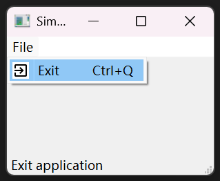

# 主窗口 QMainWindow

QMainWindow是一个为用户提供主窗口程序的类，包含**一个**状态栏(status bar)、**一个**菜单栏（menu bar）、**多个**工具栏(tool bars)、多个锚接部件(dock widgets)、一个中心部件(central widget)，是许多应用程序的基础，如文本编辑器，图片编辑器等

QMainWindow 提供了主窗口的功能，使用它能创建一些简单的**状态栏、菜单栏、工具栏**

现在我们把上面的三种栏在一个应用里展示出来
```py
import sys
from PyQt5.QtWidgets import QMainWindow, QTextEdit, QAction, QApplication
from PyQt5.QtGui import QIcon

class Example(QMainWindow):

    def __init__(self):
        super().__init__()
        self.initUI()

    def initUI(self):               
        textEdit = QTextEdit()
        self.setCentralWidget(textEdit)

        # QAction 动作
        # 自己准备一个exit.png文件，放在当前目录下
        exitAct = QAction(QIcon('exit.png'), 'Exit', self)
        exitAct.setShortcut('Ctrl+Q')
        exitAct.setStatusTip('Exit application')
        exitAct.triggered.connect(self.close)

        # QStatusBar 状态栏
        self.statusBar()

        # QMenuBar 菜单栏
        menubar = self.menuBar()

        # QMenu 菜单
        fileMenu = menubar.addMenu('&File')
        fileMenu.addAction(exitAct)

        # QToolBar 工具栏
        toolbar = self.addToolBar('Exit')
        toolbar.addAction(exitAct)

        self.setGeometry(300, 300, 350, 250)
        self.setWindowTitle('Main window')    
        self.show()

if __name__ == '__main__':
    app = QApplication(sys.argv)
    ex = Example()
    sys.exit(app.exec_())
```

效果如下


# QStatusBar 状态栏

状态栏是用来显示应用的状态信息的组件，通常在QMainWindow主窗口对象的底部

一般会有一个QStatusBar状态栏对象，通过QMainWindow.statusBar()可以获取该QStatusBar对象

## 常用方法

- showMessage()： 在状态栏显示一条指定时长的临时信息
- clearMessage()： 清除正在显示的临时信息
- addWidget()： 在状态栏中添加给定的窗口控件对象
- addPermanentWidget()： 在状态栏中永久添加给定的窗口控件对象
- removeWidget()： 从状态栏中移除指定的控件

## 示例

```py
import sys
from PyQt5.QtWidgets import QMainWindow, QStatusBar, QApplication

class Example(QMainWindow):

    def __init__(self):
        super().__init__()
        self.initUI()

    def initUI(self):
        # 方法1：手动
        # 实例化状态栏
        self.statusBar = QStatusBar()
        # 设置状态栏
        self.setStatusBar(self.statusBar)
        # 设置状态栏显示的信息
        self.statusBar.showMessage('Ready')

        # 方法2：自动
        # 调用QtGui.QMainWindow类的statusBar()方法，创建状态栏。第一次调用会创建一个状态栏，而再次调用会返回一个状态栏对象
        # self.statusBar().showMessage('Ready')

        self.setGeometry(300, 300, 250, 150)
        self.setWindowTitle('Statusbar')    
        self.show()

if __name__ == '__main__':
    app = QApplication(sys.argv)
    ex = Example()
    sys.exit(app.exec_())
```

效果如下


# QAction 动作

PyQt提供QAction类来封装用户需要执行的动作，这样不管是菜单栏，抑或是工具条栏，还是快捷键，都可以独立地和和这个动作相关联，这样就很好地做到了界面操作方式和具体行为动作的分离，代码之间的耦合性减少，可维护性良好。一句话，QAction是一个用于菜单栏、工具栏或自定义快捷键的抽象动作行为

## 常用方法

- setIcon()： 设置图标
- setText()： 设置要显示的文字
- setToolTip()： 设置提示文字
- setShortcut()： 设置快捷键
- setCheckable()： 设置成check选择模式
- setChecked()： 设置成选中/未选中(菜单前打勾或不打勾)
- setStatusTip()：设置状态栏的内容

## 常用信号

- triggered： 点击时发射信号
- hovered： 鼠标悬浮上空时发射该信号
- toggled： 如果状态为选中，则checked为True，该参数会被发送
- changed： 只要QAction状态发生改变就会发送，如多了个图标，换了文字等

## 示例

```py
import sys
from PyQt5.QtWidgets import QMainWindow, QMenuBar, QAction, qApp, QApplication
from PyQt5.QtGui import QIcon

class Example(QMainWindow):

    def __init__(self):
        super().__init__()
        self.initUI()

    def initUI(self):
        # 自己准备一个exit.png文件，放在当前目录下
        # 这里使用了一个动作对象，这个对象绑定了一个标签，一个图标和一个快捷键           
        exitAct = QAction(QIcon('exit.png'), '&Exit', self)  
        exitAct.setShortcut('Ctrl+Q')
        # 创建了一个状态栏，当鼠标悬停在菜单栏的时候，能显示当前状态
        exitAct.setStatusTip('Exit application')
        # 当执行这个指定的动作时，就触发了一个事件。这个事件跟QApplication的quit()动作相关联，所以这个动作就能终止这个应用
        exitAct.triggered.connect(qApp.quit)

        self.statusBar()

        # 调用QtGui.QMainWindow类的menuBar()方法，创建菜单栏
        menubar = self.menuBar()

        # 用addMenu()在菜单栏中添加了一个File菜单（一级菜单）
        fileMenu = menubar.addMenu('&File')
        # 用addAction()在File菜单中添加了一个点击退出应用的动作
        fileMenu.addAction(exitAct)

        self.setGeometry(300, 300, 300, 200)
        self.setWindowTitle('Simple menu')    
        self.show()

if __name__ == '__main__':
    app = QApplication(sys.argv)
    ex = Example()
    sys.exit(app.exec_())
```

效果如下


## 可勾选的动作 示例

可勾选的动作有选中和未选中两种状态

本例中，创建了一个可勾选的动作。这个动作能切换状态栏显示或者隐藏
```py
import sys
from PyQt5.QtWidgets import QMainWindow, QAction, QApplication

class Example(QMainWindow):

    def __init__(self):
        super().__init__()
        self.initUI()

    def initUI(self):         
        self.statusbar = self.statusBar()
        self.statusbar.showMessage('Ready')

        menubar = self.menuBar()
        viewMenu = menubar.addMenu('View')

        viewStatAct = QAction('View statusbar', self, checkable=True)
        viewStatAct.setStatusTip('View statusbar')
        viewStatAct.setChecked(True)
        viewStatAct.triggered.connect(self.toggleMenu)

        viewMenu.addAction(viewStatAct)

        self.setGeometry(300, 300, 300, 200)
        self.setWindowTitle('Check menu')    
        self.show()

    def toggleMenu(self, state):
        if state:
            self.statusbar.show()
        else:
            self.statusbar.hide()

if __name__ == '__main__':
    app = QApplication(sys.argv)
    ex = Example()
    sys.exit(app.exec_())
```

效果如下


# QMenuBar 菜单栏

菜单栏是一组命令的集合，通常在QMainWindow主窗口对象的标题栏下方

一般会有一个QMenuBar菜单栏对象，通过QMainWindow.menuBar()可以获取该QMenuBar对象

## 常用方法

- addMenu()： 在菜单栏中添加一个新的QMenu对象，通过QMenu对象添加下拉菜单
- addAction()： 在菜单栏添加一个无子菜单的菜单项
- clear()： 删除菜单栏中的所有菜单项

## 示例

```py
import sys
from PyQt5.QtWidgets import QMainWindow, QMenuBar, QMenu, QAction, qApp, QApplication
from PyQt5.QtGui import QIcon

class Example(QMainWindow):

    def __init__(self):
        super().__init__()
        self.initUI()

    def initUI(self):
        # 自己准备一个exit.png文件，放在当前目录下
        # 这里使用了一个动作对象，这个对象绑定了一个标签，一个图标和一个快捷键           
        exitAct = QAction(QIcon('exit.png'), '&Exit', self)  
        exitAct.setShortcut('Ctrl+Q')
        # 创建了一个状态栏，当鼠标悬停在菜单栏的时候，能显示当前状态
        exitAct.setStatusTip('Exit application')
        # 当执行这个指定的动作时，就触发了一个事件。这个事件跟QApplication的quit()动作相关联，所以这个动作就能终止这个应用
        exitAct.triggered.connect(qApp.quit)

        self.statusBar()
        
        # 方法1：手动
        # 实例化菜单栏
        self.menuBar = QMenuBar()
        # 设置菜单栏
        self.setMenuBar(self.menuBar)
        menubar = self.menuBar

        # 方法2：自动
        # 调用QtGui.QMainWindow类的menuBar()方法，创建菜单栏
        # menubar = self.menuBar()

        # 用addMenu()在菜单栏中添加了一个File菜单（一级菜单）
        fileMenu = menubar.addMenu('&File')
        # 等同于
        # fileMenu = QMenu('&File', self)
        # menubar.addMenu(fileMenu)
    
        # 用addAction()在File菜单中添加了一个点击退出应用的动作
        fileMenu.addAction(exitAct)

        self.setGeometry(300, 300, 300, 200)
        self.setWindowTitle('Simple menu')    
        self.show()

if __name__ == '__main__':
    app = QApplication(sys.argv)
    ex = Example()
    sys.exit(app.exec_())
```

效果如下


# QMenu 菜单

菜单中可以**嵌套**菜单

可以有多个QMenu菜单对象，通过QMainWindow.addMenu()可以获取一个QMenu对象

在一个应用中菜单常以以下三种方式出现：
- 在PyQt中的QMainWindow中包含一个菜单栏，该**菜单栏**可以包含多个菜单
- 点击一个**按钮**，弹出一个菜单，在PyQt中QToolButton常用这种方式弹出一个菜单
- 在一个控件上击鼠标**右键**，弹出一个菜单

## 常用方法

- addMenu()： 在菜单中添加一个新的菜单对象，该菜单对象可以继续添加子菜单
- addAction()： 在菜单栏添加一个无子菜单的菜单项
- addSeparator()： 添加一个分隔线
- insertMenu()： 在指定菜单项前插入一个菜单对象
- insertSeparator()： 插入一个分隔线
- clear()： 删除菜单中的所有项

## 示例

本例中，有二个菜单，分别是File菜单（一级菜单）和Import子菜单（在File菜单中）
```py
import sys
from PyQt5.QtWidgets import QMainWindow, QAction, QMenu, QApplication

class Example(QMainWindow):

    def __init__(self):
        super().__init__()
        self.initUI()

    def initUI(self):
        # 创建菜单栏     
        menubar = self.menuBar()
        # 用addMenu()在菜单栏中添加了一个File菜单（一级菜单）
        fileMenu = menubar.addMenu('File')

        newAct = QAction('New', self)
        fileMenu.addAction(newAct)

        # 方法1：手动
        # 使用QMenu创建一个子菜单（二级菜单）
        impMenu = QMenu('Import', self)
        impAct = QAction('Import mail', self)
        # 使用addAction()添加一个动作
        impMenu.addAction(impAct)
        # 使用addMenu()添加一个子菜单（二级菜单）
        fileMenu.addMenu(impMenu)

        # 方法2：自动
        # 链式
        # fileMenu.addMenu('Import').addAction('Import mail')

        self.setGeometry(300, 300, 300, 200)
        self.setWindowTitle('Submenu')    
        self.show()

if __name__ == '__main__':
    app = QApplication(sys.argv)
    ex = Example()
    sys.exit(app.exec_())
```

效果如下


## 右键菜单 示例

```py
import sys
from PyQt5.QtWidgets import QMainWindow, qApp, QMenu, QApplication

class Example(QMainWindow):

    def __init__(self):
        super().__init__()
        self.initUI()

    def initUI(self):
        self.setGeometry(300, 300, 300, 200)
        self.setWindowTitle('Context menu')
        self.show()

    # contextMenuEvent 是右键菜单事件
    def contextMenuEvent(self, event):
        cmenu = QMenu(self)

        newAct = cmenu.addAction("New")
        opnAct = cmenu.addAction("Open")
        quitAct = cmenu.addAction("Quit")
        # 使用exec_()方法显示菜单。从鼠标右键事件对象中获得当前坐标。mapToGlobal()方法把当前组件的相对坐标转换为窗口（window）的绝对坐标
        action = cmenu.exec_(self.mapToGlobal(event.pos()))

        # 如果右键菜单里触发了Quit动作，也就触发了退出事件，终止应用
        if action == quitAct:
            qApp.quit()

if __name__ == '__main__':
    app = QApplication(sys.argv)
    ex = Example()
    sys.exit(app.exec_())
```

效果如下


# QToolBar 工具栏

菜单栏包含了所有的命令，工具栏就是常用的命令的集合

QToolBar工具栏是一个可移动面板，在其中常包含文本按钮，图标或者其他控件。通常情况下它位于菜单条下方，但可以移动它，在窗口上下左右不同的位置停靠。QToolBar通常和QMenuBar结合使用，用不同的交互动作完成相同的工作（因为它们可指向相同的QAction）

可以有多个QToolBar工具栏对象，通过QMainWindow.addToolBar()可以获取一个QMenuBar对象

## 常用方法

- addAction()： 添加具有文本或者图标的工具按钮
- addSeperator()： 分组显示工具条上的按钮
- addWidget()： 添加工具条中按钮以外的控件
- setMovable()： 让工具条可移动
- setFloatable()： 工具条可浮动(True:可浮动， False,不可浮动)
- setOrientation()： 设置工具条的方向(Qt.Horizontal:水平，Qt.Vertical:垂直)
- setAllowedAreas()：设置工具条允许停靠的区域

## 常用信号

- actionTriggered()： 工具条中的按钮点击时，发射该信号
- movableChanged()： 工具条的可移动状态改变时，发射该信号
- allowedAreasChanged()： 工具条可允许的区域发生改变时，发射该信号
- orientationChanged()： 工具条的方向发生改变时，发射该信号

## 示例

本例中，创建了一个工具栏，这个工具栏只有一个退出应用的动作

```py
import sys
from PyQt5.QtWidgets import QMainWindow, QToolBar, QAction, qApp, QApplication
from PyQt5.QtGui import QIcon

class Example(QMainWindow):

    def __init__(self):
        super().__init__()
        self.initUI()

    def initUI(self):
        # 自己准备一个exit.png文件，放在当前目录下
        # 这里使用了一个动作对象，这个对象绑定了一个标签，一个图标和一个快捷键               
        exitAct = QAction(QIcon('exit.png'), 'Exit', self)
        exitAct.setShortcut('Ctrl+Q')
        # 动作被触发的时候，会调用QtGui.QMainWindow的quit方法退出应用
        exitAct.triggered.connect(qApp.quit)

        # 方法1：手动
        # 实例化工具栏
        self.toolbar = QToolBar('Exit')
        # 设置工具栏
        self.addToolBar(self.toolbar)

        # 方法2：自动
        # 调用QtGui.QMainWindow类的addToolBar()方法，创建工具栏
        # self.toolbar = self.addToolBar('Exit')

        # 用addAction()将动作对象添加到工具栏
        self.toolbar.addAction(exitAct)

        self.setGeometry(300, 300, 300, 200)
        self.setWindowTitle('Toolbar')    
        self.show()

if __name__ == '__main__':
    app = QApplication(sys.argv)
    ex = Example()
    sys.exit(app.exec_())
```

效果如下


# 多个锚接部件(dock widgets)


# 一个中心部件(central widget)