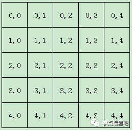

# 布局管理

在一个GUI程序里，布局是一个很重要的方面。布局就是如何管理应用中的元素和窗口。有两种方式可以搞定：绝对定位和PyQt5的layout类

## 绝对定位

每个程序都是以像素为单位区分元素的位置，衡量元素的大小。所以我们完全可以使用绝对定位搞定每个元素和窗口的位置。但是这也有局限性：
- 如果我们调整窗口大小，元素的大小和位置不会改变
- 不能适用于不同的平台和不同分辨率的显示器
- 更改应用字体大小会破坏布局
- 如果我们决定改变我们的布局，我们必须彻底重做布局，这很浪费时间

本例中，我们将小部件置于绝对坐标中
```py
import sys
from PyQt5.QtWidgets import QWidget, QLabel, QApplication

class Example(QWidget):

    def __init__(self):
        super().__init__()
        self.initUI()

    def initUI(self):
        lbl1 = QLabel('Zetcode', self)
        # 使用move()方法定位了每一个元素，使用x、y坐标。x、y坐标的原点是程序的左上角
        lbl1.move(15, 10)

        lbl2 = QLabel('tutorials', self)
        lbl2.move(35, 40)

        lbl3 = QLabel('for programmers', self)
        lbl3.move(55, 70)        

        self.setGeometry(300, 300, 250, 150)
        self.setWindowTitle('Absolute')    
        self.show()

if __name__ == '__main__':
    app = QApplication(sys.argv)
    ex = Example()
    sys.exit(app.exec_())
```

效果如下


## 盒布局（箱布局）

使用盒布局能让程序具有更强的适应性。这个才是布局一个应用的更合适的方式。QHBoxLayout 和 QVBoxLayout 是基本的布局类，分别是水平布局和垂直布局

本例中，我们需要把两个按钮放在程序的右下角，创建这样的布局，我们只需要一个水平布局加一个垂直布局的盒子就可以了。再用弹性布局增加一点间隙。当改变窗口大小的时候，它们能依然保持在相对的位置。我们同时使用了 QHBoxLayout 和 QVBoxLayout
```py
import sys
from PyQt5.QtWidgets import (QWidget, QPushButton, QHBoxLayout, QVBoxLayout, QApplication)

class Example(QWidget):

    def __init__(self):
        super().__init__()
        self.initUI()

    def initUI(self):
        # 创建两个按钮
        okButton = QPushButton("OK")
        cancelButton = QPushButton("Cancel")

        # 创建一个水平布局盒
        hbox = QHBoxLayout()
        # addStretch()函数，用于增加弹性元素，它会将按钮挤到窗口的右边
        hbox.addStretch(1)
        # 增加两个按钮
        hbox.addWidget(okButton)
        hbox.addWidget(cancelButton)

        # 创建一个垂直布局盒
        vbox = QVBoxLayout()
        # 弹性元素会把水平布局盒挤到窗口的下边
        vbox.addStretch(1)
        # 把这个水平布局盒放到了一个垂直布局盒里面
        vbox.addLayout(hbox)

        self.setLayout(vbox)    

        self.setGeometry(300, 300, 300, 150)
        self.setWindowTitle('Buttons')    
        self.show()

if __name__ == '__main__':
    app = QApplication(sys.argv)
    ex = Example()
    sys.exit(app.exec_())
```

效果如下


### addStretch()函数

[PyQt5的addStretch()函数介绍](https://zhuanlan.zhihu.com/p/36193945)

待完成

https://zhuanlan.zhihu.com/p/28559136

## 栅格布局（网格布局）

栅格布局将位于其中的窗口部件放入一个网状的栅格之中。QGridLayout需要将提供给它的空间划分成的行和列，并把每个窗口部件插入并管理到正确的单元格。


栅格布局是这样工作的：它计算了位于其中的空间，然后将它们合理的划分成若干个行（row）和列（column），并把每个由它管理的窗口部件放置在合适的单元之中，这里所指的单元（cell）即是指由行和列交叉所划分出来的空间。

坐标分布是这样的：



这种布局是把窗口分为行和列。创建和使用栅格布局，需要使用QGridLayout模块

本例中，我们创建了栅格化的按钮
```py
import sys
from PyQt5.QtWidgets import (QWidget, QGridLayout, QPushButton, QApplication)

class Example(QWidget):

    def __init__(self):
        super().__init__()
        self.initUI()

    def initUI(self):
        # 创建一个QGridLayout实例
        grid = QGridLayout()
        # 并把它放到程序窗口里
        self.setLayout(grid)

        # 这是我们将要使用的按钮的名称
        names = ['Cls', 'Bck', '', 'Close',
                 '7', '8', '9', '/',
                '4', '5', '6', '*',
                 '1', '2', '3', '-',
                '0', '.', '=', '+']

        # 创建按钮位置列表
        positions = [(i,j) for i in range(5) for j in range(4)]

        # zip()函数用于将可迭代的对象作为参数，将对象中对应的元素打包成一个个元组，然后返回由这些元组组成的列表
        for position, name in zip(positions, names):

            if name == '':
                continue
            # 创建按钮
            button = QPushButton(name)
            # 并使用addWidget()方法把按钮放到布局里面
            grid.addWidget(button, *position)

        self.move(300, 150)
        self.setWindowTitle('Calculator')
        self.show()

if __name__ == '__main__':
    app = QApplication(sys.argv)
    ex = Example()
    sys.exit(app.exec_())
```

效果如下


## 表单布局

QFormLayout管理输入型控件和关联的标签组成的那些Form表单。


QFormLayout是一个方便的布局类，其中的控件以两列的形式被布局在表单中。左列包括标签，右列包含输入控件，例如：QLineEdit、QSpinBox、QTextEdit等。


下面这个例子就是说明表单布局是怎么用的


组件能跨列和跨行展示


我们创建了一个有三个标签的窗口。两个行编辑和一个文版编辑，这是用QGridLayout模块搞定的


```py
import sys
from PyQt5.QtWidgets import (QWidget, QLabel, QLineEdit, QTextEdit, QGridLayout, QApplication)

class Example(QWidget):

    def __init__(self):
        super().__init__()
        self.initUI()

    def initUI(self):
        title = QLabel('Title')
        author = QLabel('Author')
        review = QLabel('Review')

        titleEdit = QLineEdit()
        authorEdit = QLineEdit()
        reviewEdit = QTextEdit()

        grid = QGridLayout()
        # 创建标签之间的空间
        grid.setSpacing(10)

        grid.addWidget(title, 1, 0)
        grid.addWidget(titleEdit, 1, 1)

        grid.addWidget(author, 2, 0)
        grid.addWidget(authorEdit, 2, 1)

        grid.addWidget(review, 3, 0)
        # 我们可以指定组件的跨行和跨列的大小。这里我们指定这个元素跨5行显示
        grid.addWidget(reviewEdit, 3, 1, 5, 1)

        self.setLayout(grid) 

        self.setGeometry(300, 300, 350, 300)
        self.setWindowTitle('Review')    
        self.show()

if __name__ == '__main__':
    app = QApplication(sys.argv)
    ex = Example()
    sys.exit(app.exec_())
```

效果如下


这个例子用到了 QFormLayout
```py
import sys
from PyQt5.QtWidgets import (QWidget, QPushButton, QApplication, QFormLayout, QLabel, QLineEdit, QTextEdit)

class Example(QWidget):
    def __init__(self):
        super().__init__()
        self.Init_UI()
    def Init_UI(self):
        self.setGeometry(300,300,300,200)
        self.setWindowTitle('学点编程吧')

        formlayout = QFormLayout()
        nameLabel = QLabel("姓名")
        nameLineEdit = QLineEdit("")
        introductionLabel = QLabel("简介")
        introductionLineEdit = QTextEdit("")

        formlayout.addRow(nameLabel,nameLineEdit)
        formlayout.addRow(introductionLabel,introductionLineEdit)
        self.setLayout(formlayout)

        self.show()
if __name__ == '__main__':
    app = QApplication(sys.argv)
    ex = Example()
    app.exit(app.exec_())
```


Qt提供了4种用于页面布局的类：QBoxLayout，QGridLayout，QFormLayout，QStackedLayout
https://zhuanlan.zhihu.com/p/345745900


QGridLayout 和QFormLayout的区别
https://blog.csdn.net/weixin_45424185/article/details/109732945


---

https://www.bilibili.com/video/BV1LT4y1e72X/?spm_id_from=333.337.search-card.all.click

http://www.pyqt5.cn/video/


[pyqt6](https://maicss.gitbook.io/pyqt-chinese-tutoral/pyqt6)