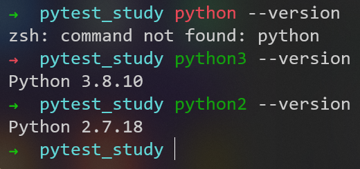
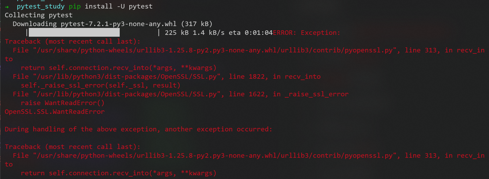
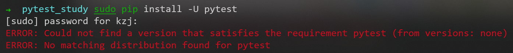
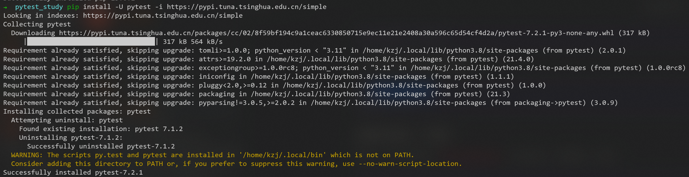
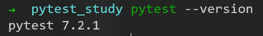
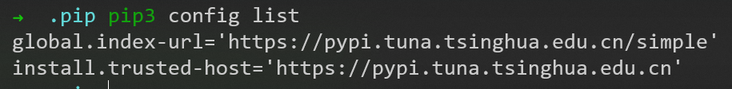
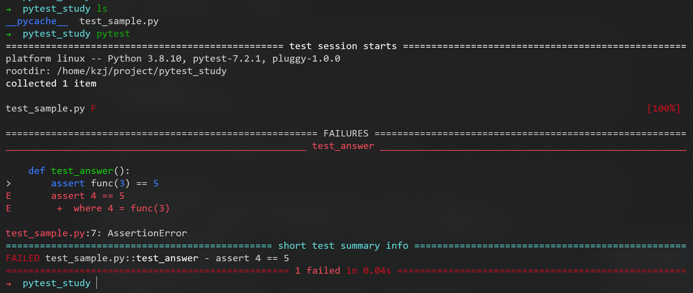
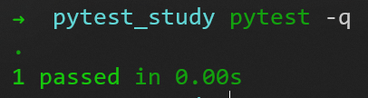
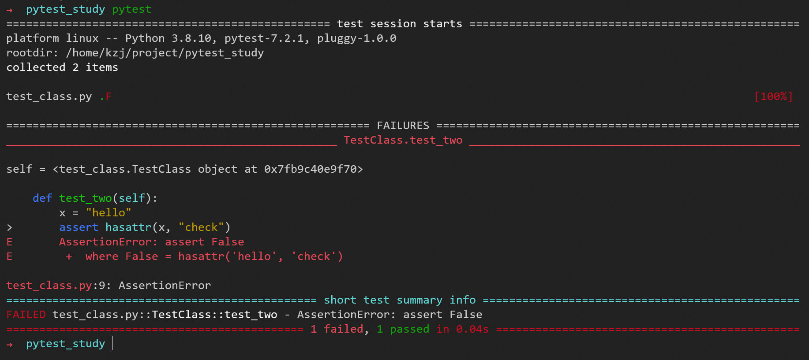
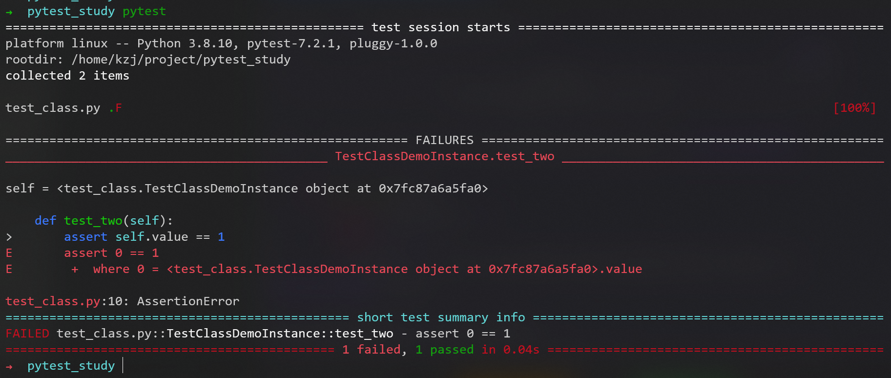

# pytest

[pytest教程](https://www.w3cschool.cn/pytest/pytest-e24w3m8u.html)

## 安装



```pip install -U pytest```

报错



使用国内源

```python3 -m pip install --upgrade pip -i https://pypi.tuna.tsinghua.edu.cn/simple```

```pip install -U pytest -i https://pypi.tuna.tsinghua.edu.cn/simple```

上图黄色字，提示没有将目录加入PATH中

### 添加环境变量PATH

[教程](https://blog.csdn.net/xiaobumi123/article/details/110985547)

将```/home/kzj/.local/bin```目录加入PATH
同```Quantitative_trading_learn```中```1_start.md```中找不到命令的解决方法

每次重启，要手动加入$PATH，在~目录下使用命令
```bash
source .profile
 ```



### 配置国内源

发现是没有配置国内镜像，下载速度过慢导致的报错

[教程](https://www.runoob.com/w3cnote/pip-cn-mirror.html)

全局修改，则需要修改配置文件

配置文件位置在```~/.pip/pip.conf```（如果不存在，创建该目录和文件）
修改如下：
```bash
[global]
index-url = https://pypi.tuna.tsinghua.edu.cn/simple
[install]
trusted-host = https://pypi.tuna.tsinghua.edu.cn
 ```

可以用命令```pip3 config list```查看镜像地址


可见配置成功

## HelloWorld

### 使用```assert```语句进行断言

创建一个新文件​```test_sample.py```
```py
def func(x):
    return x + 1

def test_answer():
    assert func(3) == 5
 ```

在该文件的目录下使用```pytest```命令


### 运行多个测试

```pytest```命令将在当前目录及其子目录中运行```​test_*.py​```或```​*_test.py​```形式的所有文件

### 使用```​raises```​断言某些代码引发了异常

使用```raises```断言一些代码块或者函数时会引发意料之中的异常或者其他失败的异常
程序无法运行时，使用```raises```捕获匹配到的异常，可以继续让代码正常运行

```py
import pytest

def f():
    raise SystemExit(1)

def test_mytest():
    with pytest.raises(SystemExit):
        f()
 ```

使用```with pytest.raises(异常类型):f()```，去断言异常的类型，如果```异常类型```和函数```f()```中的一致，则运行通过，否则断言失败

运行通过


### 默认的用例识别的规则

1. 用例文件：```​test_*.py​```或```​*_test.py​```形式的所有文件
2. 用例类：测试文件中每个```Test开头```的类
3. 测试用例：测试类中每个```test开头```的方法或函数

### 将多个测试分组到一个类中

```py
class TestClass:
    def test_one(self):
        x = "this"
        assert "h" in x

    def test_two(self):
        x = "hello"
        assert hasattr(x, "check")
```



#### 每个测试共享相同的类实例对测试隔离非常不利（不良的测试实践）

```py
class TestClassDemoInstance:
    value = 0

    def test_one(self):
        self.value = 1
        assert self.value == 1

    def test_two(self):
        assert self.value == 1
```



### 从 Python 代码调用 pytest

```retcode = pytest.main()```

