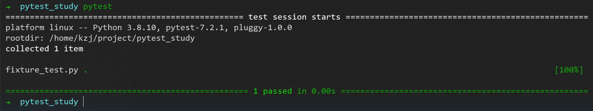
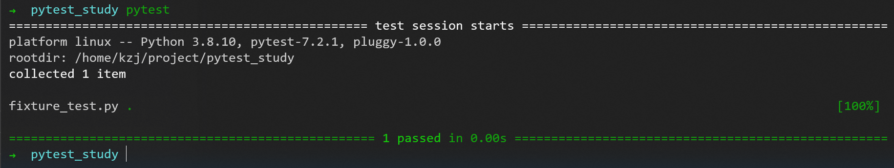
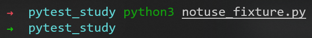
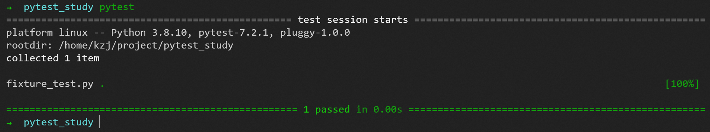

# fixture

[fixture教程](https://zhuanlan.zhihu.com/p/87775743)

显示可用的内置方法参数：
```pytest --fixtures```

## 引入

### 测试的构成

其实说白了，测试就是在特定的环境、特定的场景下、执行特定的行为，然后确认结果与期望的是否一致。

就拿最常见的登录来说，完成一次正常的登录场景，需要可用的测试环境，可以正常登录的账号和密码。

然后，用这个账号密码进行登录操作，结果登录成功，符合这次正常登录场景的预期结果，测试完成。

这样看来，通常就可以把测试分为4个步骤：

- Arrange
- Act
- Assert
- Cleanup

**Arrange**，可以理解为 除了执行测试之外的任何事情。比如上面例子中，我得有个可用的测试环境跟可用的账号密码，这些都要事先准备好。

此外，还有可能是：启动/终止服务、将记录输入数据库、定义要查询的URL、为还不存在的用户生成一些凭据等等。

总之，就是为了能够进行测试要准备好的事情。

**Act**，相比准备前置环境，Act做的事情就相对单一些，其实就是开始测试动作。比如，接口测试里，调用被测试的api接口。

**Assert**，Assert是我们查看结果的地方，看看是否像我们预期的那样。比如接口请求成功后，数据的接口会返回“success”，assert status == "success"。

**Cleanup**，在测试结束后，做清理工作，为了其他的测试不会意外的受到本次测试的影响。比如，测试之前我插入了一条测试数据，测试完后，我把它删掉。

总得来说，测试就是Act+Assert，而其他要安排的事情，放在Arrange里。

### 回到fixtures本身

而在pytest中，fixtures就是来做Arrange的事情。当然了，fixture也不局限于此，如果测试足够复杂的话，不妨也可以在里面进行act的事情。

把一个普通的函数变成fixtures非常简单，只要加上@pytest.fixture这个装饰
```py
import pytest

class Fruit:
    def __init__(self, name):
        self.name = name

    def __eq__(self, other):
        return self.name == other.name

@pytest.fixture
def my_fruit():
    # 这里是一个fixture，返回了一个Fruit对象，名字叫苹果
    return Fruit("苹果")

@pytest.fixture
def fruit_basket(my_fruit):
    # 这里是另一个fixture，同样声明一个Fruit对象，名字叫香蕉。
    # 然后在这个fixture中又传入了上一个fixture：my_fruit
    # 最后把最终的返回装到一个列表[]里，返回
    return [Fruit("香蕉"), my_fruit]

def test_my_fruit_in_basket(my_fruit, fruit_basket):
    # 这是一个测试函数，可以使用多个fixture
    assert my_fruit in fruit_basket
 ```
上面的代码体现了fixtures的2个重要特性：

- 测试函数可以使用多个fixture
- fixture本身还可以使用其他的fixture



## fixtures的调用方式

### 第一步：测试函数声明传参请求fixture

```py
def test_my_fruit_in_basket(my_fruit, fruit_basket):
    # 这是一个测试函数
    assert my_fruit in fruit_basket
 ```
- 测试函数test_my_fruit_in_basket通过传入my_fruit, fruit_basket来调用这2个fixture
- 当pytest运行测试函数时，它会查看该测试函数中的参数，然后搜索与这些参数具有相同名称的fixture
- 一旦pytest找到这些对象，它就会运行这些fixture

### 第二步：fixture中的返回值传递给测试函数

```py
@pytest.fixture
def my_fruit():
    # 这里是一个fixture，返回了一个Fruit对象，名字叫苹果
    return Fruit("苹果")
 ```
- 如果fixture中还有返回的内容，pytest可以拿到，并将这些对象作为参数传递给测试函数

## fixtures调用别的fixtures

```py
import pytest

# Arrange
@pytest.fixture
def first_entry():
    # 这是一个fixture函数，返回值:"a"
    return "a"

# Arrange
@pytest.fixture
def order(first_entry):
    # 这是另一个fixture函数，请求了上一个fixture函数first_entry()，
    # 并且把first_entry()的返回值，放进了列表[]里，最后返回
    return [first_entry]

def test_string(order):
    # Act
    # 测试函数中请求了第二个fixture函数order，可以拿到返回的[]
    order.append("b")
    # Assert
    assert order == ["a", "b"]
 ```
- 可以看到，pytest中的某个fixture请求别的fixture，就像测试函数请求fixture一样，所有的请求规则都适用



同样，如果这些事情换我们自己来做的话，应该是下面这样：
```py
def first_entry():
    return "a"

def order(first_entry):
    return [first_entry]

def test_string(order):
    # Act
    order.append("b")
    # Assert
    assert order == ["a", "b"]

entry = first_entry()
the_list = order(first_entry=entry)
test_string(order=the_list)
 ```



## 一个fixtures被多个测试函数请求（fixtures的复用性）

- pytest中的fixtures还可以让我们像使用普通函数一样，能够定义反复重用的通用setup步骤
- 两个不同的测试函数可以请求相同的fixture，每个测试函数都会获得该fixture的各自结
- 这样的优点就是，确保不同的测试函数之间不会相互影响
- 我们可以使用这种机制来确保每个测试函数都获得各自新的、干净的、一致的数据

```py
import pytest

# Arrange
@pytest.fixture
def first_entry():
    return "a"

# Arrange
@pytest.fixture
def order(first_entry):
    return [first_entry]

def test_string(order):
    # Act
    order.append("b")
    # Assert
    assert order == ["a", "b"]

def test_int(order):
    # Act
    order.append(2)
    # Assert
    assert order == ["a", 2]
 ```

- 从代码可以看出，fixture函数```order()```虽然先后被两个测试函数调用，但是每次被调用给出的结果都是一样的

- 并不会因为在测试函数```test_string()```中，进行了```order.append("b")```后，就影响了```order.append(2)```在测试函数```test_int()```中的返回值

同样，这些事情换成我们自己来做，那就是这样的：
```py
def first_entry():
    return "a"

def order(first_entry):
    return [first_entry]

def test_string(order):
    # Act
    order.append("b")
    # Assert
    assert order == ["a", "b"]

def test_int(order):
    # Act
    order.append(2)
    # Assert
    assert order == ["a", 2]

entry = first_entry()
the_list = order(first_entry=entry)
test_string(order=the_list)

entry = first_entry()
the_list = order(first_entry=entry)
test_int(order=the_list)
 ```


## 一次请求多个fixtures

- 在测试函数和fixture函数中，每一次并不局限于请求一个fixture，他们想要多少就可以要多少

```py
import pytest

# Arrange
@pytest.fixture
def first_entry():
    return "a"

# Arrange
@pytest.fixture
def second_entry():
    return 2

# Arrange
@pytest.fixture
def order(first_entry, second_entry):
    # 这是一个fixture函数，请求了2个其他的fixture函数
    return [first_entry, second_entry]

# Arrange
@pytest.fixture
def expected_list():
    return ["a", 2, 3.0]

def test_string(order, expected_list):
    # 这是一个测试函数，请求了2个不同的fixture函数
    # Act
    order.append(3.0)
    # Assert
    assert order == expected_list
 ```

- 在fixture函数order中，请求了2个其他的fixture函数，分别是：first_entry、second_entry
- 在测试函数test_string中，请求了2个不同的fixture函数，分别是：order、expected_list

## 一个fixtures被一个测试函数多次请求

- 在同一个测试函数中，fixture也可以被请求多次。但是在这个测试函数中，pytest在第一次执行fixture函数之后，**不会再次执行它们**
- 如果第一次执行fixture函数有返回值，那么**返回值会被缓存起来**

```py
import pytest

 # Arrange
@pytest.fixture
def first_entry():
    return "a"

 # Arrange
@pytest.fixture
def order():
    return []

 # Act
@pytest.fixture
def append_first(order, first_entry):
    # 在这里order第一次被请求，返回一个列表[]
    # 接着，order空列表增加了first_entry的返回值，此时的order变成了["a"]，被缓存起来
    return order.append(first_entry)

def test_string_only(append_first, order, first_entry):
    # 在测试函数里，order第二次被请求，但是并不会拿到空列表[]，而且拿到了被缓存起来的["a"]
    # 所以断言order == [first_entry]，其实就是 ["a"] == ["a"]，测试通过
    # Assert
    assert order == [first_entry]
 ```
- 在fixture函数```append_first()```中，order第一次被请求，返回一个列表[]，被缓存起来
- 接着，```order.append(first_entry)```在[]中增加了```first_entry()```的返回值，所以，此时的order变成了["a"]
- 最后，在测试函数```test_string_only()```中，order第二次被请求，但是并不会拿到空列表[]，而且拿到了**被缓存起来的["a"]**
- 这样的话，最后的断言```assert order == [first_entry]```就会成功
- 反过来，如果同一个fixture在一个测试函数中每次都去请求一次，那上面的测试函数必然失败
- 因为，这样一来，虽然在`append_first`中的返回值仍然是["a"]，但是在test_string_only中，又去重新请求了一次order，拿到的其实是空列表[]，所以最后断言会失败
- **相同作用域下，相对于依赖了其他fixture的fixture，被依赖的fixture优先执行**
- **如果多个测试函数分别去调用append_first，测试函数之间并不影响；如果是一个测试函数里 重复调用append_first，是不会重复执行的，第一次执行后的结果就缓存了**



注意：
一个fixtures**被一个测试函数多次请求**
与 
一个fixtures**被多个测试函数请求** 
的区别

## fixtures的autouse

- 那么有的时候，我们可能会写一个fixture，而这个fixture所有的测试函数都会用到它。那这个时候，就可以用autouse自动让所有的测试函数都请求它，不需要在每个测试函数里显式地请求一遍
- 具体用法就是，将```autouse=True```传递给fixture的装饰器即可

```py
import pytest

@pytest.fixture
def first_entry():
    return "a"

@pytest.fixture
def order(first_entry):
    return []

# 将autouse=True传递给fixture的装饰器
@pytest.fixture(autouse=True)
def append_first(order, first_entry):
    return order.append(first_entry)

def test_string_only(order, first_entry):
    assert order == [first_entry]

def test_string_and_int(order, first_entry):
    order.append(2)
    assert order == [first_entry, 2]
 ```
先来看第一个测试函数```test_string_only(order, first_entry)```的执行情况：
- 虽然在测试函数里请求了2个fixture函数，但是order拿到的并不是[]，first_entry拿到的也并不是"a"
- 因为存在了一个**autouse=True的fixture函数**，所以```append_first()```先会被调用执行
- 在执行```append_first()```过程中，又分别请求了```order()```和```first_entry()```这两个fixture函数
- 接着，```append_first()```对分别拿到的[]和"a"进行append处理，最终返回了["a"]
- 所以，断言```assert order == [first_entry]```是成功的

同理，第二个测试函数```test_string_and_int(order, first_entry)```的执行过程亦是如此

## fixture errors（当fixtures抛错后）


---
到[教程](https://zhuanlan.zhihu.com/p/87775743)的解读6了