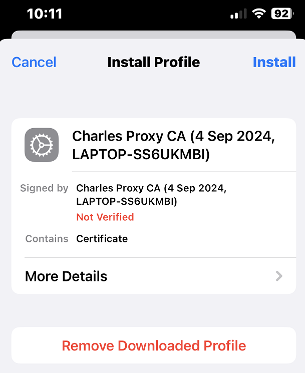
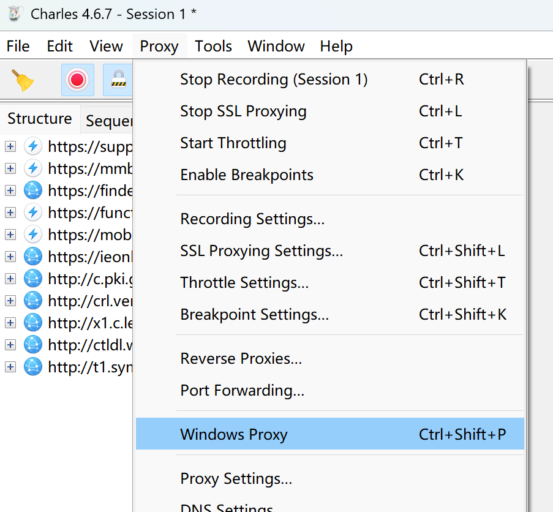

# Charles

Charles是一款基于 HTTP 和 HTTPS 协议的代理服务器，用于截取请求和请求结果以进行分析抓包。它主要用于捕获、分析和调试在客户端（如浏览器或移动设备）与服务器之间的 HTTP 和 HTTPS 通信。

[Charles官方网站](https://www.charlesproxy.com/)

## Charles对iOS手机的https进行抓包

### 证书配置

#### 在电脑上安装证书

打开Charles，点击顶部菜单栏的 Help -> SSL Proxying -> Install Charles Root Certificate，将证书安装到电脑上
安装位置如图（运行 `Certmgr.msc` 可以查看）

#### 在手机上安装证书

##### 方法1

保证电脑和手机在同一个局域网下，可以点击顶部菜单栏的 Help -> Local IP Address，查看电脑的IP地址，如下图

点击顶部菜单栏的 Help -> SSL Proxying -> Install Charles Root Certificate on a Mobile Device or Remote Browser，提示如下图

可见，Charles默认使用列表中的第一个网络，而不是有手机的那个网络，但是可以通过禁用其他网络，只保留有手机网络

> 在**控制面板**中，找不到 `Hyper-V Virtual`开头的这个网络
> 
> 那就去**设备管理器**中找，要选择显示隐藏的设备，找到了，右键**禁用设备**，然后需要重启系统才能生效
> 

Charles默认使用列表中的第一个网络，即有手机的那个网络

依据上图提供的信息，设置手机HTTP代理

之后，在手机上用浏览器访问 `chls.pro/ssl`，电脑上会提示是否允许连接

点击允许，在手机浏览器刷新 `chls.pro/ssl`，会提示下载证书

然后安装证书

然后信任证书

##### 方法2

如果不想像方法1那么麻烦，点击顶部菜单栏的 Help -> SSL Proxying -> Save Charles Root Certificate，将证书保存在本地，再发送到手机上，安装证书，并信任证书
同时别忘了设置手机HTTP代理

### Charles配置

#### 取消Windows代理

由于此次目标是抓取移动端微信小程序中的数据，取消此选项是尽量减少无关的数据量

#### Proxy Settings 和 SSL Proxying Settings

### Charles数据抓取

手机与Charles均配置成功后，打开微信小程序，此时Charles会自动获取http与https访问

在 Overview 中，可以看到访问的url地址

在 Contents 中，可以看到解析出来的微信小程序数据内容

