# Python 使用

## 终端运行

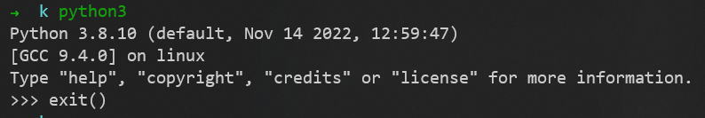

## 文件运行

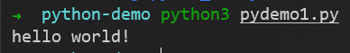

## 使用jupyter-notebook

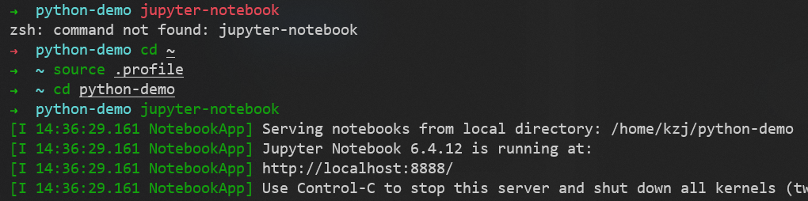

## pip

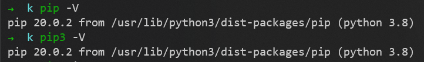

# Python 基础

## Python 数据类型

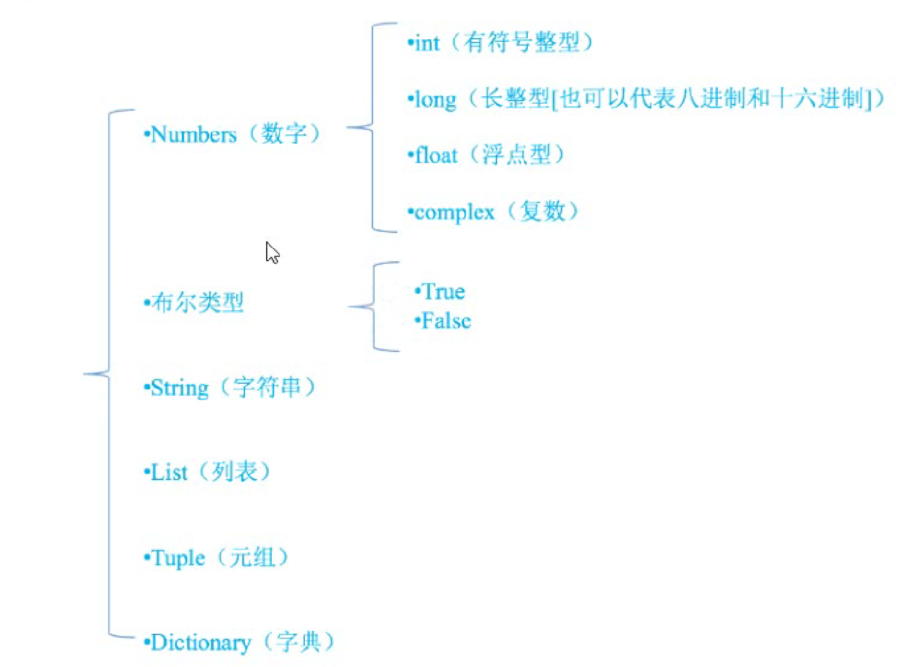

### string 字符串

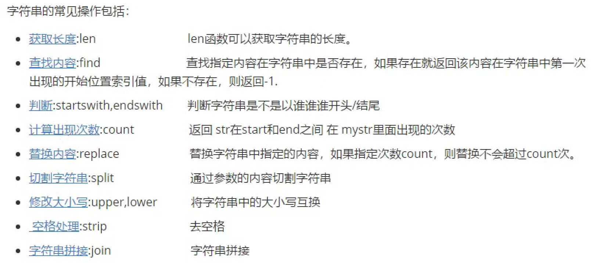

### list 列表

中括号
```py
[value, ...]
```

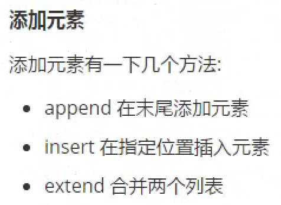

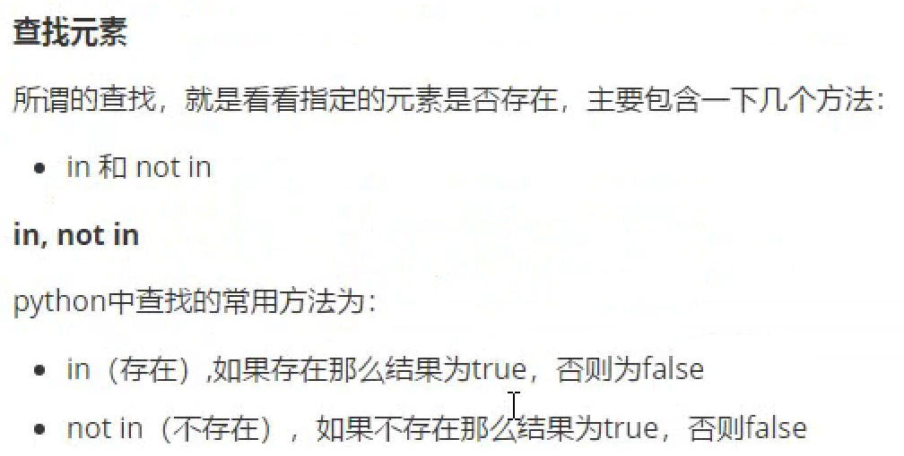
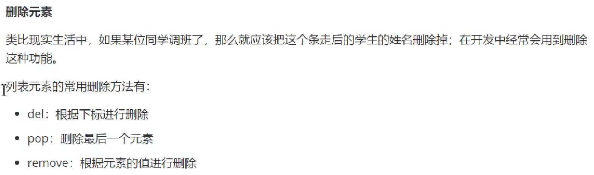

### tuple 元组

小括号
```py
(value, ...)
```


#### 切片


### dict 字典

花括号
```py
{key:value, ...}
```

#### 查询

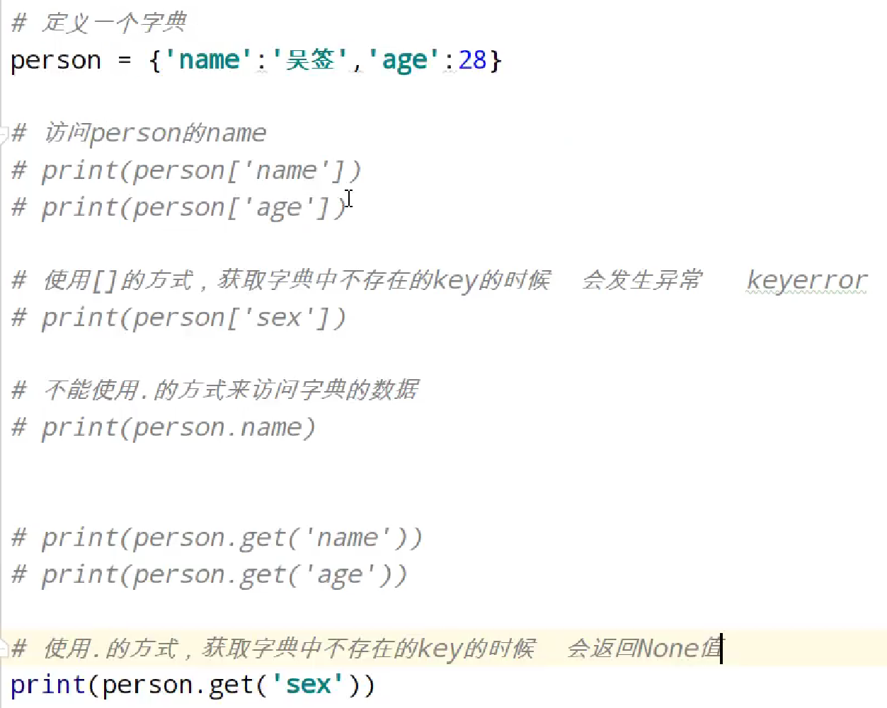

#### 修改

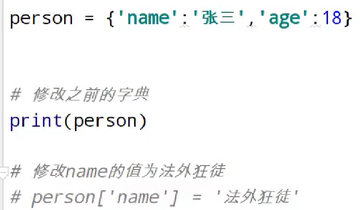

#### 添加

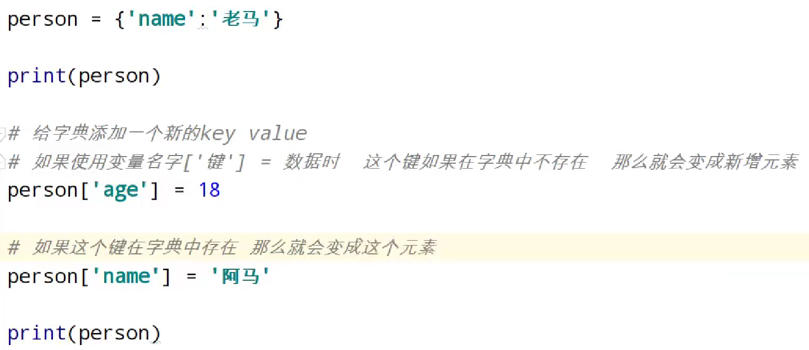

#### 删除

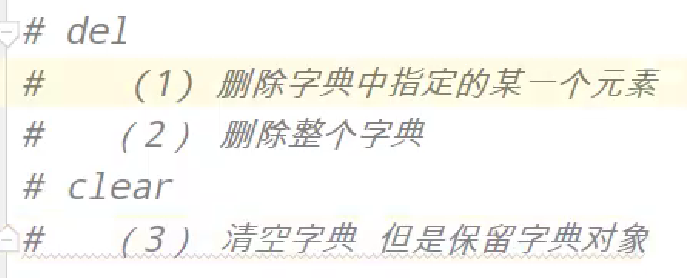

#### 遍历

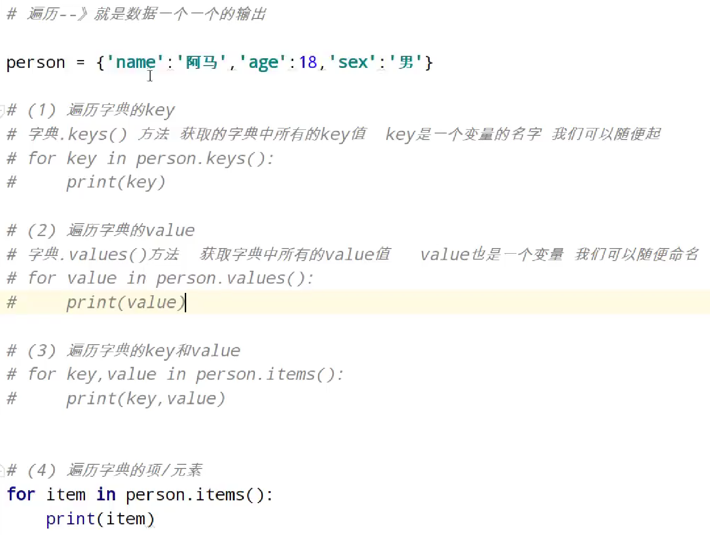

### 数据类型

变量没有类型，数据才有类型

```py
type(变量名)
```

### 类型转换

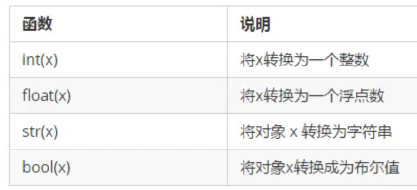

## 运算符

### 算数运算符

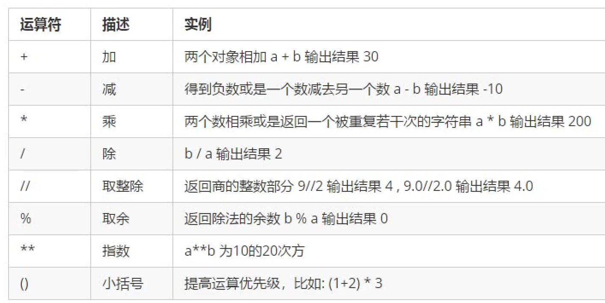

### 赋值运算符

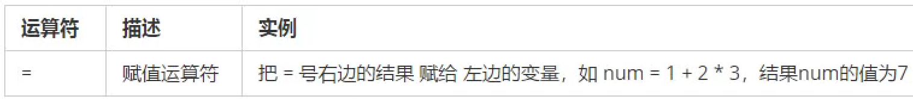

#### 复合赋值运算符

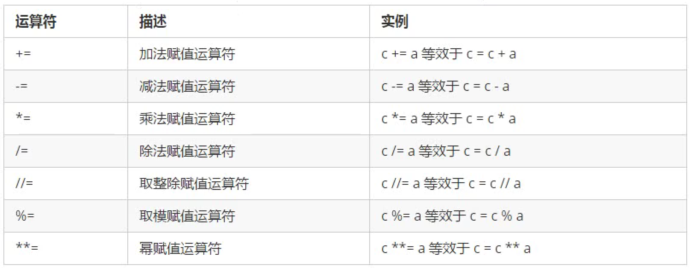

### 比较运算符

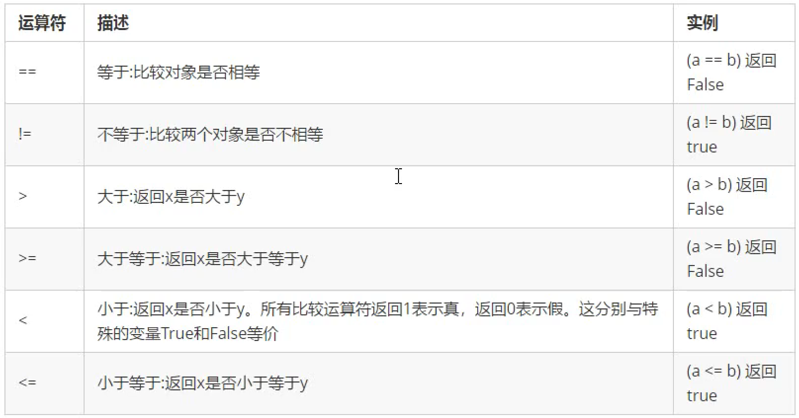

### 逻辑运算符

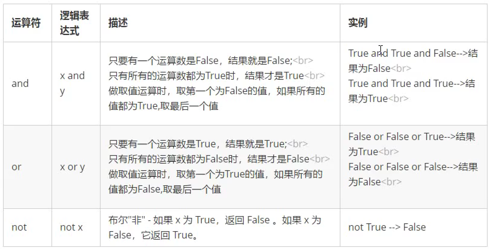

#### 性能优化

and：如果and前面的结果为False，则后面的不再执行
or：如果or前面的的结果为True，则后面的不再执行

## 函数

定义和调用、参数、返回值、局部变量和全局变量

## 文件

### 文件的打开和关闭

```py
fp = open('test.txt', 'w')
fp.close()
```

### 文件的读写

```py
fp = open('test.txt', 'a')
fp.write('hello world\n' *5)
fp.close()
```

```py
fp = open('test.txt', 'r')
content = fp.read()
print(content)
fp.close()
```

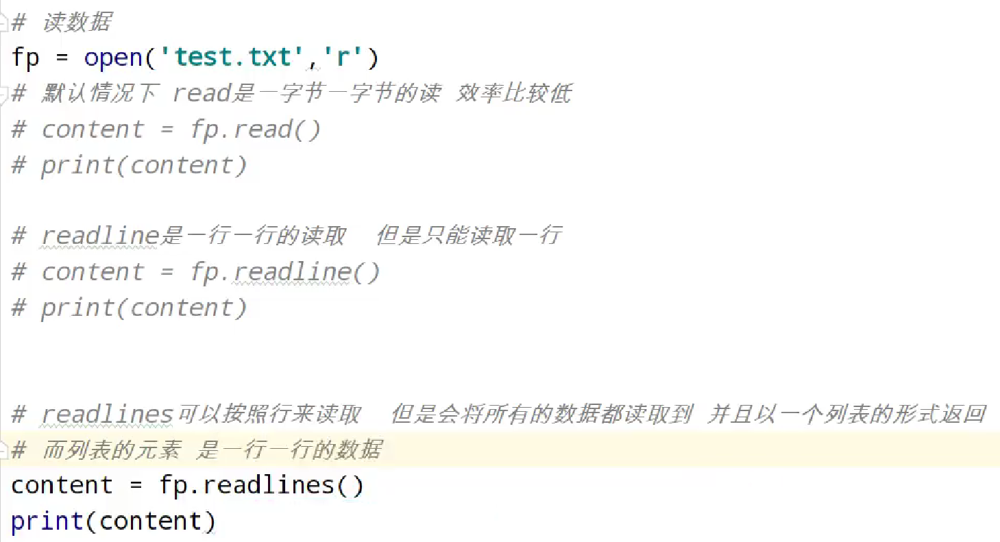

### 序列化和反序列化

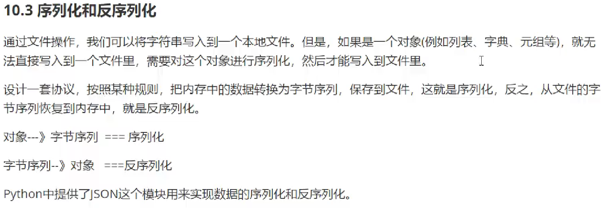

#### 用JSON模块进行序列化

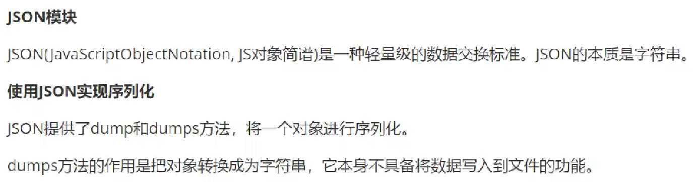

##### dumps:

```py
import json
fp = open('test.txt', 'w')
name_list = ['kzj','ll']
name_json = json.dumps(name_list)
fp.write(name_json)
fp.close()
```

##### dump:

相当于操作合并
```py
import json
fp = open('test.txt', 'w')
name_list = ['kzj','ll']
json.dump(name_list, fp)
fp.close()
```

#### 用JSON模块进行反序列化

##### loads:
 
```py
import json
fp = open('test.txt', 'r')
name_json = fp.read()
print(type(name_json))
name_list = json.loads(name_json)
print(type(name_list))
fp.close()
```

##### load:

相当于操作合并
```py
import json
fp = open('test.txt', 'r')
name_list = json.load(fp)
print(type(name_list))
fp.close()
```

## 异常

```py
try:
    fh = open("testfile", "w")
    fh.write("这是一个测试文件，用于测试异常!!")
except IOError:
    print "Error: 没有找到文件或读取文件失败"
else:
    print "内容写入文件成功"
    fh.close()
```

# 反爬手段

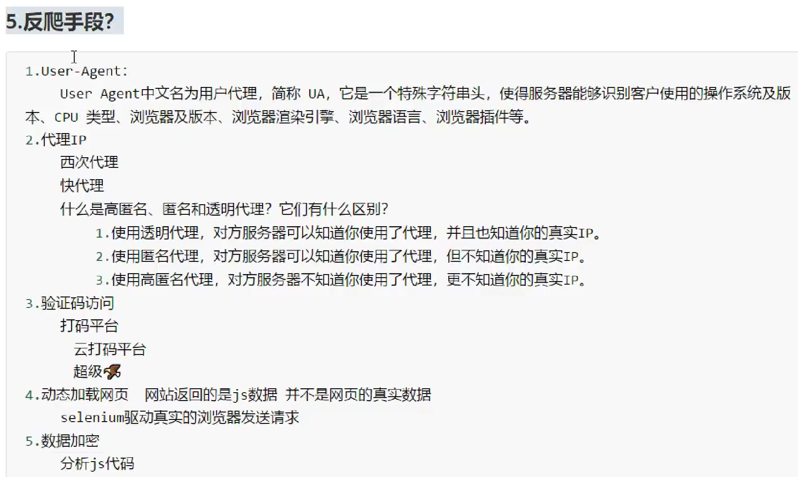


