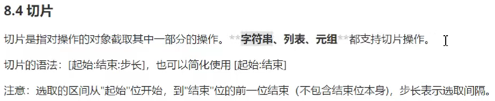

# Python 使用

## 终端运行


## 文件运行


## 使用jupyter-notebook


## pip


# Python 基础

## Python 数据类型


### string 字符串


### list 列表

中括号
```py
[value, ...]
```


### tuple 元组

小括号
```py
(value, ...)
```


#### 切片



### dict 字典

花括号
```py
{key:value, ...}
```

#### 查询


#### 修改


#### 添加


#### 删除


#### 遍历


### 数据类型

变量没有类型，数据才有类型

```py
type(变量名)
```

### 类型转换


## 运算符

### 算数运算符


### 赋值运算符


#### 复合赋值运算符


### 比较运算符


### 逻辑运算符


#### 性能优化

and：如果and前面的结果为False，则后面的不再执行
or：如果or前面的的结果为True，则后面的不再执行

## 函数

定义和调用、参数、返回值、局部变量和全局变量

## 文件

### 文件的打开和关闭

### 文件的读写
