# urllib 库

## 基本使用

```py
import urllib
url = 'http://www.baidu.com'
# 模拟浏览器发送请求
response = urllib.request.urlopen(url)
# 获取相应的页面的源码
content = response.read().decode('utf-8')
# read方法返回的是二进制数据，还要将二进制数据转换为字符串（解码）（用decode）
print(content)
```

### 一个类型和六个方法

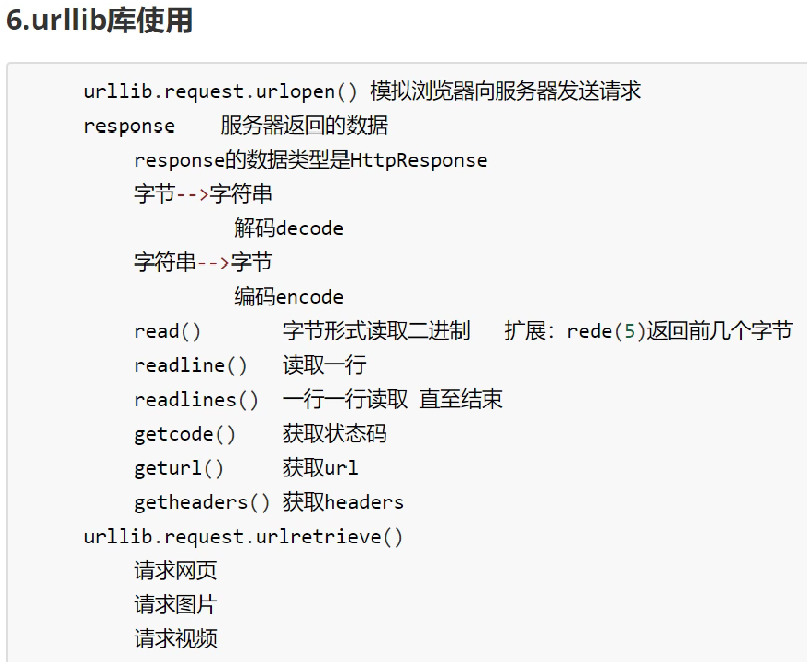

#### HTTPResponse

```py
import urllib
url = 'http://www.baidu.com'
# 模拟浏览器发送请求
response = urllib.request.urlopen(url)
print(type(response))
# 打印输出为<class 'http.client.HTTPResponse'>
```

#### 六个方法

```py
import urllib
url = 'http://www.baidu.com'
response = urllib.request.urlopen(url)
content = response.read(10)
content = response.readline()
content = response.readlines()
code = response.getcode()
url2 = response.geturl()
headers = response.getheaders()
```

## 下载

### 下载网页

```py
import urllib.request
url_page = 'http://www.baidu.com'
# 保存到baidu.html文件中
urllib.request.urlretrieve(url_page, 'baidu.html')
```

### 下载图片

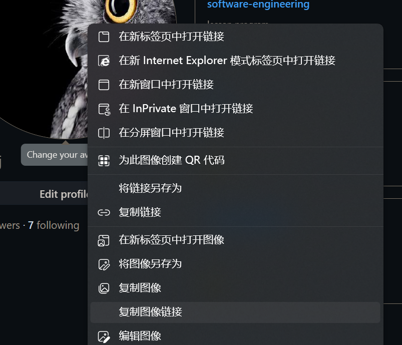

```py
import urllib.request
url_img = 'https://avatars.githubusercontent.com/u/47291826?v=4'
urllib.request.urlretrieve(url_img, 'sky.jpg')
```

### 下载视频

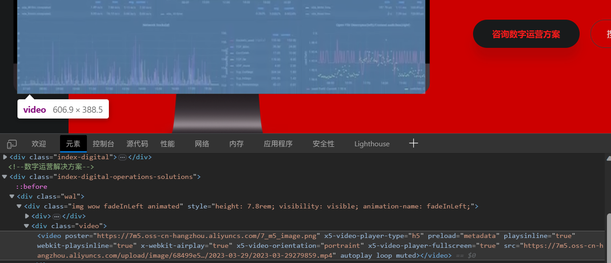

```py
import urllib.request
url_video = 'https://7m5.oss-cn-hangzhou.aliyuncs.com/upload/image/68499e58090d4aafa0fb6d0545d4f2c1/2023-03-29/2023-03-29279859.mp4'
urllib.request.urlretrieve(url_video, 'kgu.mp4')
```

## 请求对象的定制

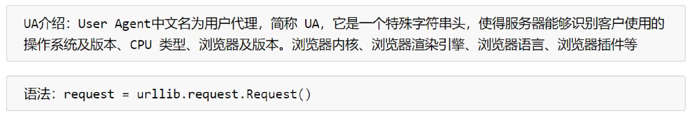

### url的组成

[url的组成链接](https://developer.mozilla.org/zh-CN/docs/Learn/Common_questions/Web_mechanics/What_is_a_URL)


### User-Agent

[UA大全链接](http://useragent.kuzhazha.com/)

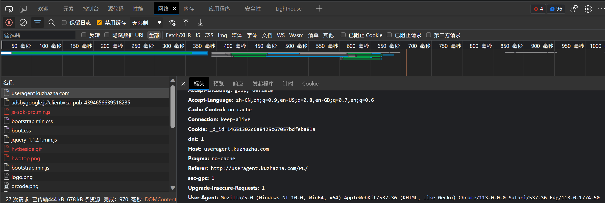

```py
import urllib.request
url = 'http://www.baidu.com'
headers = {
    'User-Agent': 'Mozilla/5.0 (Windows NT 10.0; Win64; x64) AppleWebKit/537.36 (KHTML, like Gecko) Chrome/113.0.0.0 Safari/537.36 Edg/113.0.1774.50'
}
# 请求对象的定制
# 需要关键字传参
request = urllib.request.Request(url = url, headers = headers)
# 这样会报错，因为传递的参数的顺序问题
# request = urllib.request.Request(url, headers)
response = urllib.request.urlopen(request)
content = response.read().decode('utf8')
print(content)
```

第三个参数才是headers，如果在传参时不加指定，会把实参headers传递给形参data
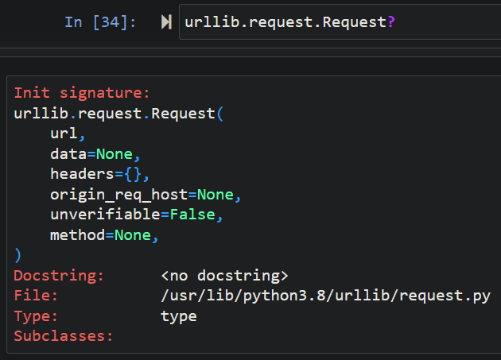

## get请求中的编码解码

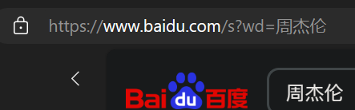
```url
https://www.baidu.com/s?wd=%E5%91%A8%E6%9D%B0%E4%BC%A6
```

### get请求的```quote```方法

```py
import urllib.request
import urllib.parse
# url = 'https://www.baidu.com/s?wd=%E5%91%A8%E6%9D%B0%E4%BC%A6'
# url = "https://www.baidu.com/s?wd=周杰伦"
url = "https://www.baidu.com/s?wd="
headers = {
    'User-Agent': 'Mozilla/5.0 (Windows NT 10.0; Win64; x64) AppleWebKit/537.36 (KHTML, like Gecko) Chrome/113.0.0.0 Safari/537.36 Edg/113.0.1774.50'
}
# 将周杰伦三个字变成unicode编码格式
# 需要依赖于urllib.parse
name = urllib.parse.quote('周杰伦')
url += name
print(url)
request = urllib.request.Request(url = url, headers = headers)
response = urllib.request.urlopen(request)
content = response.read().decode('utf8')
print(content)
```

### get请求的```urlencode```方法

相比于```quote```方法，```urlencode```方法更加方便地解决多个参数的编码转换

```py
import urllib.request
import urllib.parse
# url = "https://www.baidu.com/s?wd=周杰伦&sex=男&location=中国"
base_url = "https://www.baidu.com/s?"
headers = {
    'User-Agent': 'Mozilla/5.0 (Windows NT 10.0; Win64; x64) AppleWebKit/537.36 (KHTML, like Gecko) Chrome/113.0.0.0 Safari/537.36 Edg/113.0.1774.50'
}
# 将周杰伦和男变成unicode编码格式
# 需要依赖于urllib.parse
data = {
    'wd': '周杰伦',
    'sex': '男',
    'location': '中国'
}
args = urllib.parse.urlencode(data)
url = base_url + args
print(url)
request = urllib.request.Request(url = url, headers = headers)
response = urllib.request.urlopen(request)
content = response.read().decode('utf8')
print(content)
```

## post请求

### 百度翻译

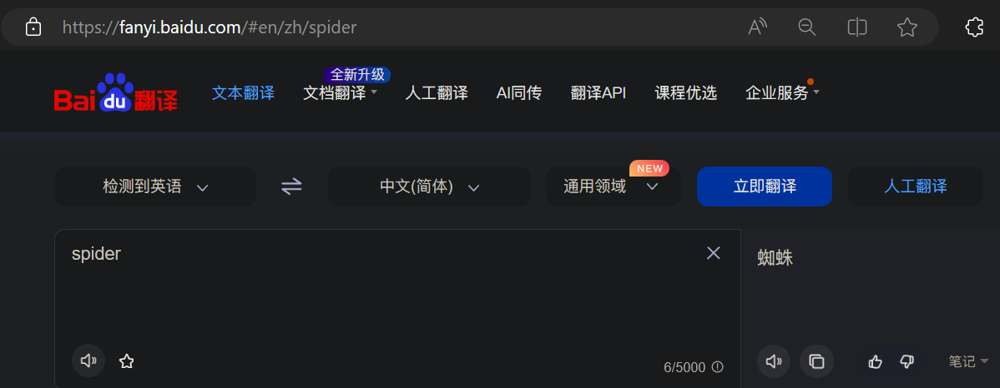
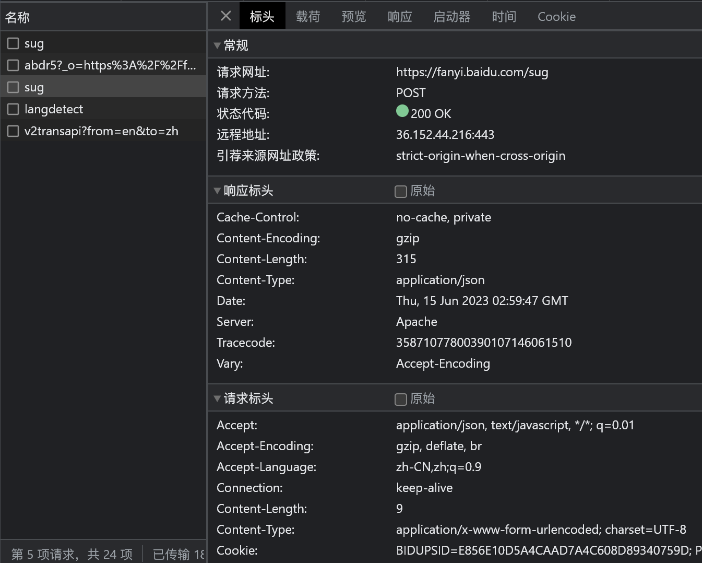
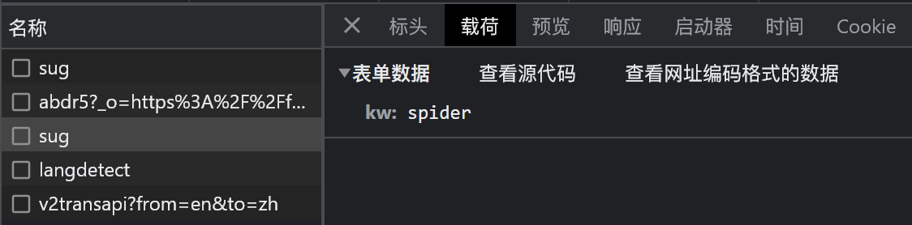
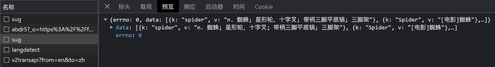

```py
import urllib.request
import urllib.parse
url = 'https://fanyi.baidu.com/sug'
headers = {
    'User-Agent': 'Mozilla/5.0 (Windows NT 10.0; Win64; x64) AppleWebKit/537.36 (KHTML, like Gecko) Chrome/114.0.0.0 Safari/537.36 Edg/114.0.1823.43'
}
data = {
    'kw': 'spider',
}
# 还要编码成字节型
# data = urllib.parse.urlencode(data)
data = urllib.parse.urlencode(data).encode('utf-8')
# post请求的请求参数不会拼接在url里，而是放在请求对象定制的参数中
request = urllib.request.Request(url=url, data=data, headers=headers)
response = urllib.request.urlopen(request)
content = response.read().decode('utf8')
print(type(content))
print(content)
# 字符串 -> json对象
import json
obj = json.loads(content)
print(type(obj))
print(obj)
```

这里的post请求的代码与前面的get请求的代码相比（对参数的处理不同）：
1. get请求的data参数只要使用```urlencode()```方法，转化为**unicode编码**格式；post请求的data参数不仅要使用```urlencode()```方法，转化为**unicode编码**格式，还要使用```encode('utf-8')```方法，转化为**字节型**
2. get请求的**unicode编码**格式的参数，**拼接到请求url中**；post请求的**字节型**格式的参数，要传入```urllib.request.Request()```方法的**data参数**中

### 百度翻译中的详细翻译

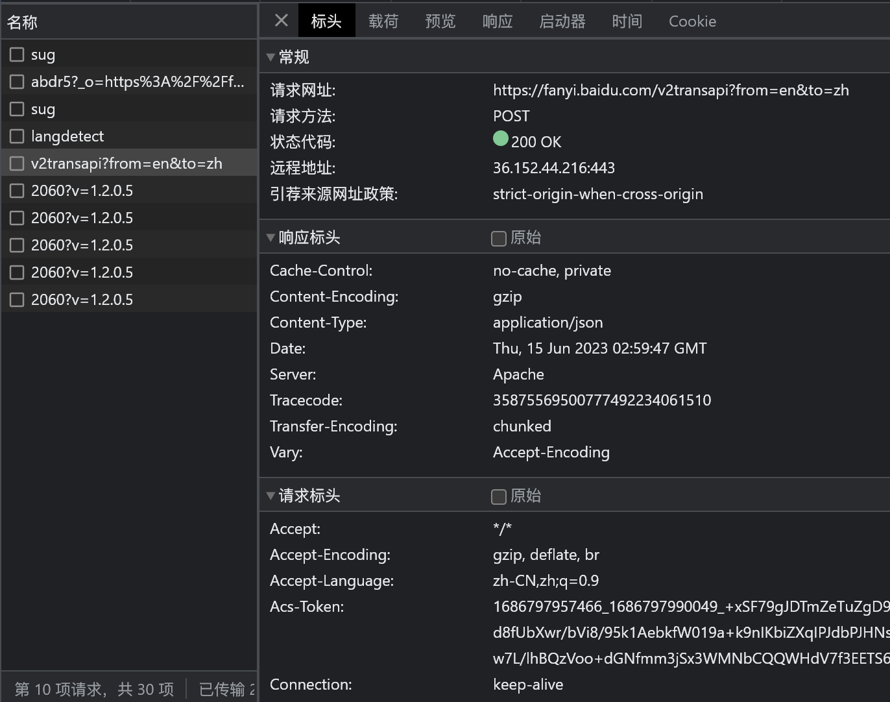
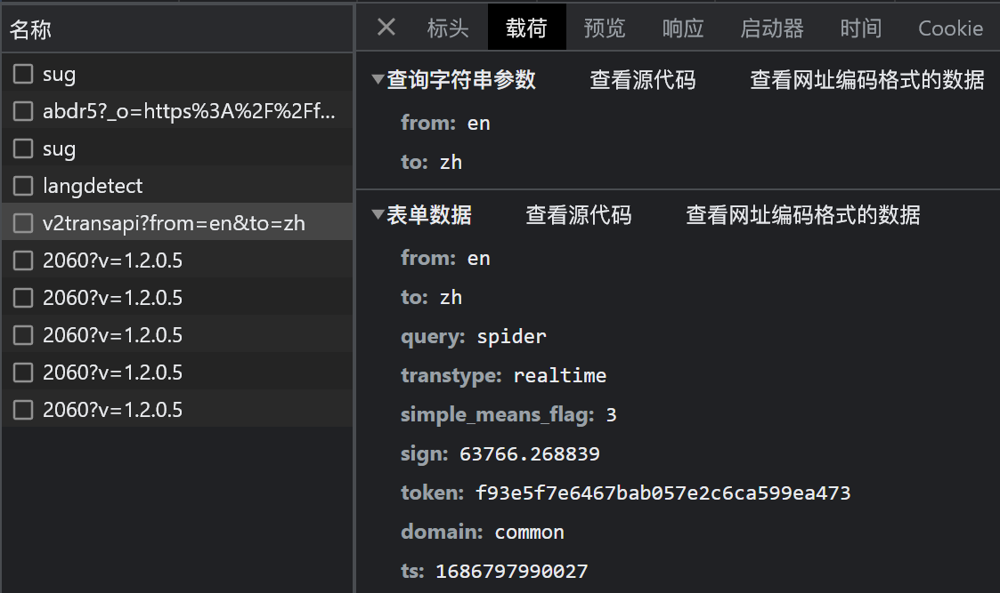
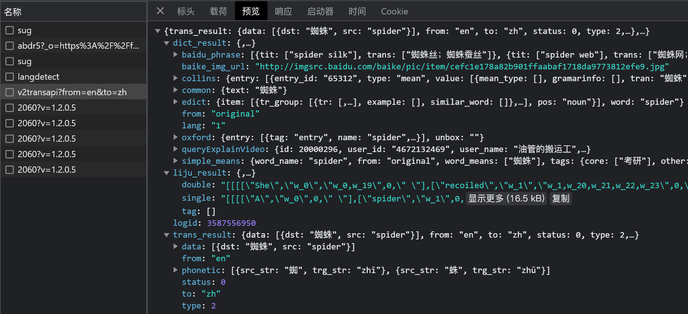

```py
import urllib.request
import urllib.parse
url = 'https://fanyi.baidu.com/v2transapi?from=en&to=zh'
headers = {
    'User-Agent': 'Mozilla/5.0 (Windows NT 10.0; Win64; x64) AppleWebKit/537.36 (KHTML, like Gecko) Chrome/114.0.0.0 Safari/537.36 Edg/114.0.1823.43',
    'Cookie': 'BIDUPSID=E856E10D5A4CAAD7A4C608D89340759D; PSTM=1681349511; BAIDUID=E856E10D5A4CAAD74158E5153F019EF7:FG=1; BAIDUID_BFESS=E856E10D5A4CAAD74158E5153F019EF7:FG=1; Hm_lvt_64ecd82404c51e03dc91cb9e8c025574=1686797959; Hm_lpvt_64ecd82404c51e03dc91cb9e8c025574=1686797959; REALTIME_TRANS_SWITCH=1; FANYI_WORD_SWITCH=1; HISTORY_SWITCH=1; SOUND_SPD_SWITCH=1; SOUND_PREFER_SWITCH=1; ab_sr=1.0.1_YjU2NzNiZjQwNTFlMjNmYTBlMjk5MDA5MjhjMzkwMzg4ZDFlM2E5NTE3YTlmNjUxZDIzZmM0NGIyYzljZTExZDI4OWE0ZmUzYmY0NGYwYWYwNWYyZmFlY2ZhYWVlMTc4NDJiOGMxYjU5YmZmMTQ4YzM3MjMwMGRiYmFjMzkyYzk1YTg0MTFhMDZmN2JhN2IwOTgwYmM3ODdkYWM1YjljNQ=='
}
data = {
    'from': 'en',
    'to': 'zh',
    'query': 'spider',
    'transtype': 'realtime',
    'simple_means_flag': '3',
    'sign': '63766.268839',
    'token': 'f93e5f7e6467bab057e2c6ca599ea473',
    'domain': 'common',
    'ts': '1686797990027'
}
# data = urllib.parse.urlencode(data)
# 还要编码成字节型
data = urllib.parse.urlencode(data).encode('utf-8')
# post请求的请求参数不会拼接在url里，而是放在请求对象定制的参数中
request = urllib.request.Request(url=url, data=data, headers=headers)
response = urllib.request.urlopen(request)
content = response.read().decode('utf8')
print(type(content))
# 字符串 -> json对象
import json
obj = json.loads(content)
print(type(obj))
print(obj)
```

## ajax

### ajax的get请求

#### 获取豆瓣电影排行榜第一页的数据，并保存到文件

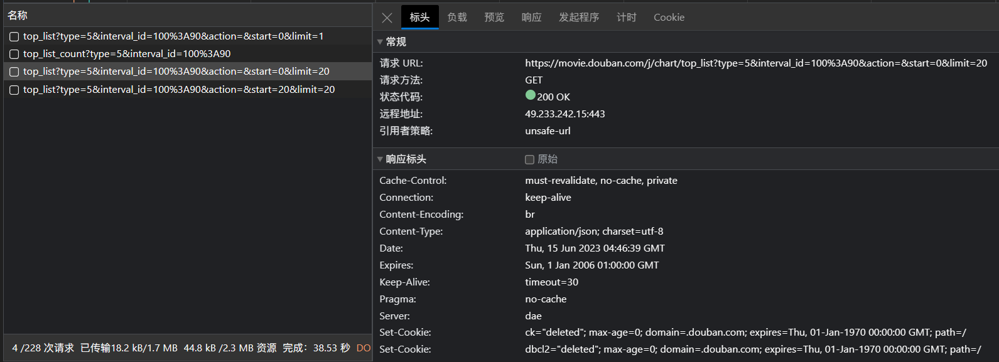

```py
import urllib.request
import urllib.parse
url = 'https://movie.douban.com/j/chart/top_list?type=5&interval_id=100%3A90&action=&start=0&limit=20'
headers = {
    'User-Agent': 'Mozilla/5.0 (Windows NT 10.0; Win64; x64) AppleWebKit/537.36 (KHTML, like Gecko) Chrome/114.0.0.0 Safari/537.36 Edg/114.0.1823.43'
}
request = urllib.request.Request(url=url, headers=headers)
response = urllib.request.urlopen(request)
content = response.read().decode('utf8')
print(content)
# 数据下载到本地
# fp = open('douban.json', 'w', encoding='utf-8')
# fp.write(content)
# fp.close()
# 下面的写法，作用和上面的相同
with open('douban.json', 'w', encoding='utf-8') as fp:
    fp.write(content)
```

#### 获取豆瓣电影排行榜前10页的数据

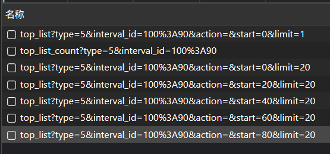

找规律，每一页请求的参数start不同
```start = ( page - 1 ) * 20```

```py
import urllib.request
import urllib.parse

def create_request(page):
    url = 'https://movie.douban.com/j/chart/top_list?type=5&interval_id=100%3A90&action=&'
    data = {
        'start': (page-1) * 20,
        'limit': 20,  
    }
    data = urllib.parse.urlencode(data)
    url += data
    headers = {
        'User-Agent': 'Mozilla/5.0 (Windows NT 10.0; Win64; x64) AppleWebKit/537.36 (KHTML, like Gecko) Chrome/114.0.0.0 Safari/537.36 Edg/114.0.1823.43'
    }
    request = urllib.request.Request(url=url, headers=headers)
    return request
    
def get_content(request):
    response = urllib.request.urlopen(request)
    content = response.read().decode('utf-8')
    return content
    
def download_page(content, page):
    with open('douban_page_' + str(page) + '.json', 'w') as fp:
        fp.write(content)
    
if __name__ == '__main__':
    start_page = int(input('请输入起始的页码：'))
    end_page = int(input('请输入结束的页码：'))
    
    for page in range(start_page, end_page+1):
        # 每一页都有自己的请求对象定制
        request = create_request(page)
        # 获得相应数据                     
        content = get_content(request)
        # 下载
        download_page(content, page)
 ```

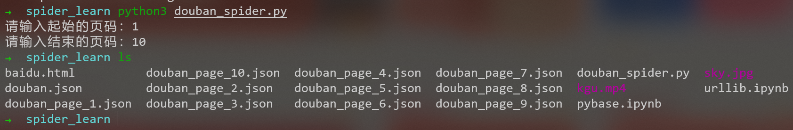

### ajax的post请求

#### 获取肯德基官网中的门店列表的前10页数据

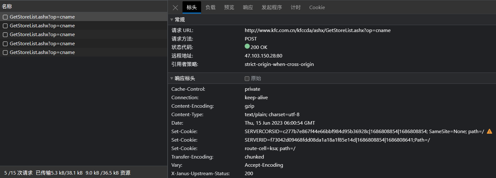
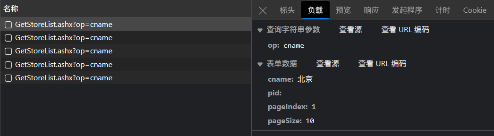

```py
import urllib.request
import urllib.parse

def create_request(page):
    url = 'http://www.kfc.com.cn/kfccda/ashx/GetStoreList.ashx?op=cname'
    data = {
        'cname': '北京',
        'pid': '',
        'pageIndex': page,
        'pageSize': '10'
    }
    headers = {
        'User-Agent': 'Mozilla/5.0 (Windows NT 10.0; Win64; x64) AppleWebKit/537.36 (KHTML, like Gecko) Chrome/114.0.0.0 Safari/537.36 Edg/114.0.1823.43'
    }
    data = urllib.parse.urlencode(data).encode('utf-8')
    request = urllib.request.Request(url=url, data=data, headers=headers)
    return request

def get_content(request):
    response = urllib.request.urlopen(request)
    content = response.read().decode('utf-8')
    return content

def download_page(content, page):
    with open('kfc_page_' + str(page) + '.json', 'w') as fp:
        fp.write(content)

if __name__ == '__main__':
    start_page = int(input('请输入起始的页码：'))
    end_page = int(input('请输入结束的页码：'))
    
    for page in range(start_page, end_page+1):
        # 每一页都有自己的请求对象定制
        request = create_request(page)
        # 获得相应数据                     
        content = get_content(request)
        # 下载
        download_page(content, page)
```

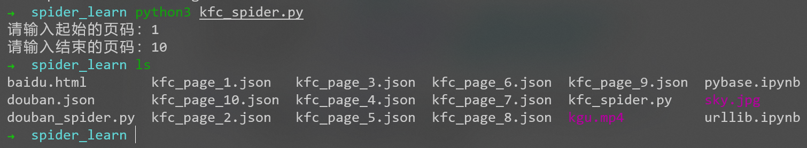

## 异常

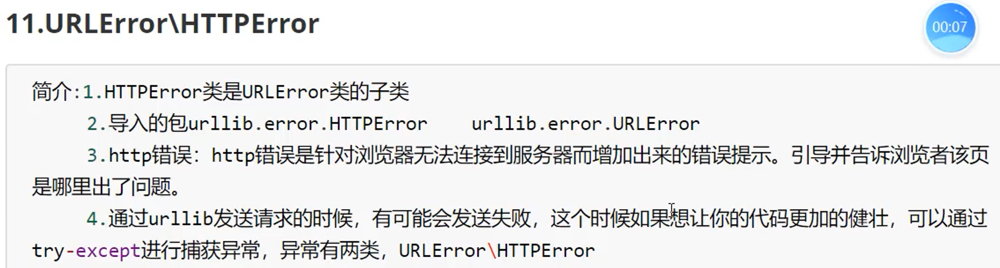

```py
import urllib.request
import urllib.error

url = 'http://www.baidu1.com'
headers = {
    'User-Agent': 'Mozilla/5.0 (Windows NT 10.0; Win64; x64) AppleWebKit/537.36 (KHTML, like Gecko) Chrome/114.0.0.0 Safari/537.36 Edg/114.0.1823.43'
}
try:
    request = urllib.request.Request(url=url, headers=headers)
    response = urllib.request.urlopen(request)
    content = response.read().decode('utf-8')
    print(content)
except urllib.error.HTTPError:
    print('网络异常')
except urllib.error.URLError:
    print('网址异常')
```

## cookie登录

### 微博

用户自己的详细资料，需要登录才能查看
1. **cookie**中携带着你的登录信息，如果有登录之后的cookie，那么我们就可以携带着cookie访问页面
2. **referer**用来判断当前路径是不是由上一个路径进来的，一般情况下，是做图片或视频的防盗链

```py
import urllib.request
url = 'https://weibo.cn/7746108856/info'
headers = {
    'User-Agent': 'Mozilla/5.0 (Windows NT 10.0; Win64; x64) AppleWebKit/537.36 (KHTML, like Gecko) Chrome/114.0.0.0 Safari/537.36 Edg/114.0.1823.43',
    'Cookie': '_T_WM=b7cc669d5fbb36c5eab9906ffc04f281; SUB=_2A25JjsQ2DeRhGeFJ71QQ8CbEzjqIHXVrcOx-rDV6PUJbktCOLUfgkW1Nf93udy1aAwYlWVjDBYi3cmkhK3qAEMHK; SUBP=0033WrSXqPxfM725Ws9jqgMF55529P9D9W5PdqCi3i_Wxh6GIkT4FFUr5NHD95QNS0BceK5R1h-cWs4DqcjMi--NiK.Xi-2Ri--ciKnRi-zNS0MXSo271hnfSntt; SSOLoginState=1686811750',
    'Referer': 'https://weibo.cn/'
}
request = urllib.request.Request(url=url, headers=headers)
response = urllib.request.urlopen(request)
content = response.read().decode('utf-8')
print(content)
```

## Handler处理器

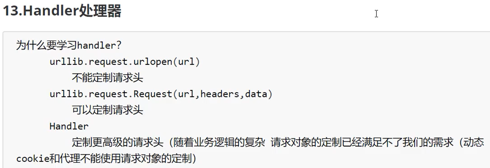

### 基本使用

```py
import urllib.request
url = 'http://www.baidu.com'
headers = {
    'User-Agent': 'Mozilla/5.0 (Windows NT 10.0; Win64; x64) AppleWebKit/537.36 (KHTML, like Gecko) Chrome/114.0.0.0 Safari/537.36 Edg/114.0.1823.43',
}
request = urllib.request.Request(url=url, headers=headers)
# handler build_opener open
# 获取handler对象
handler = urllib.request.HTTPHandler()
# 获取opener对象
opener = urllib.request.build_opener(handler)
# 调用open方法
response = opener.open(request)
content = response.read().decode('utf-8')
print(content)
```

## 代理服务器

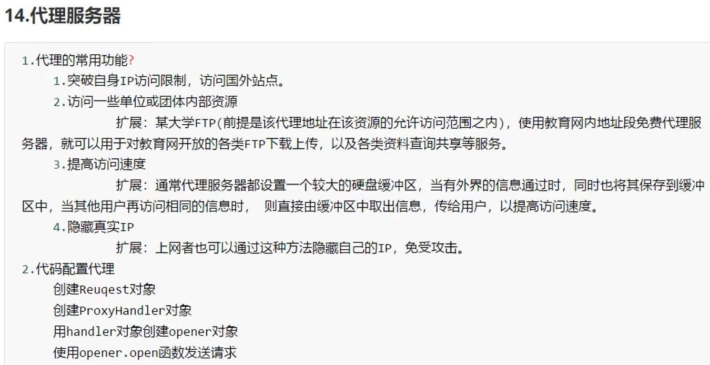

[免费代理链接](https://www.kuaidaili.com/free/)

```py
import urllib.request
url = 'http://ip.900cha.com/'
headers = {
    'User-Agent': 'Mozilla/5.0 (Windows NT 10.0; Win64; x64) AppleWebKit/537.36 (KHTML, like Gecko) Chrome/114.0.0.0 Safari/537.36 Edg/114.0.1823.43',
}
request = urllib.request.Request(url=url, headers=headers)
# 模拟浏览器访问服务器
# response = urllib.request.urlopen(request)
proxies = {
    'http': '223.96.90.216:8085'
}
# handler build_opener open
handler = urllib.request.ProxyHandler(proxies=proxies)
opener = urllib.request.build_opener(handler)
response = opener.open(request)
content = response.read().decode('utf-8')
print(content)
```

### 代理池

```py
import urllib.request
url = 'http://ip.900cha.com/'
headers = {
    'User-Agent': 'Mozilla/5.0 (Windows NT 10.0; Win64; x64) AppleWebKit/537.36 (KHTML, like Gecko) Chrome/114.0.0.0 Safari/537.36 Edg/114.0.1823.43',
}
request = urllib.request.Request(url=url, headers=headers)
proxies_pool = [
    {'http': '223.96.90.216:8085'},
    {'http': '120.220.220.95:8085'},
    {'http': '58.20.184.187:9091'}
]
import random
proxies = random.choice(proxies_pool)
print(proxies)
handler = urllib.request.ProxyHandler(proxies=proxies)
opener = urllib.request.build_opener(handler)
response = opener.open(request)
content = response.read().decode('utf-8')
print(content)
```


