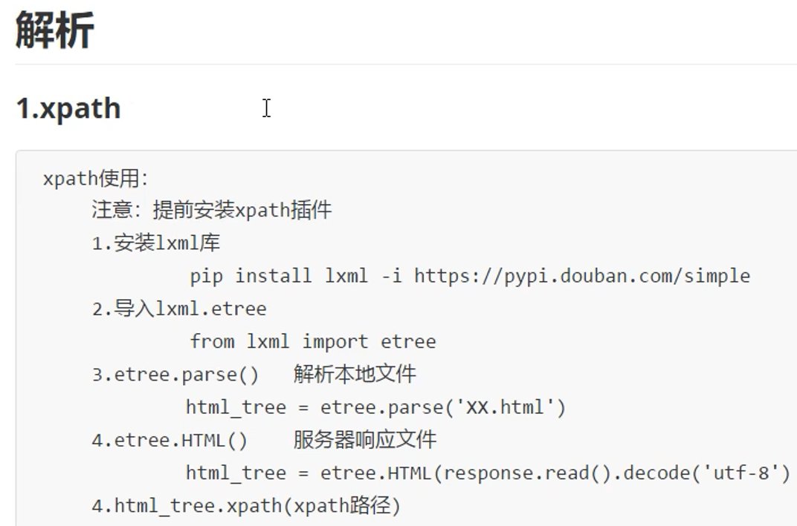
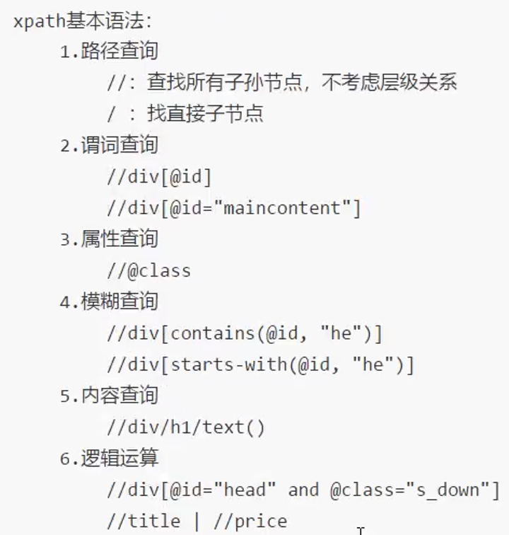
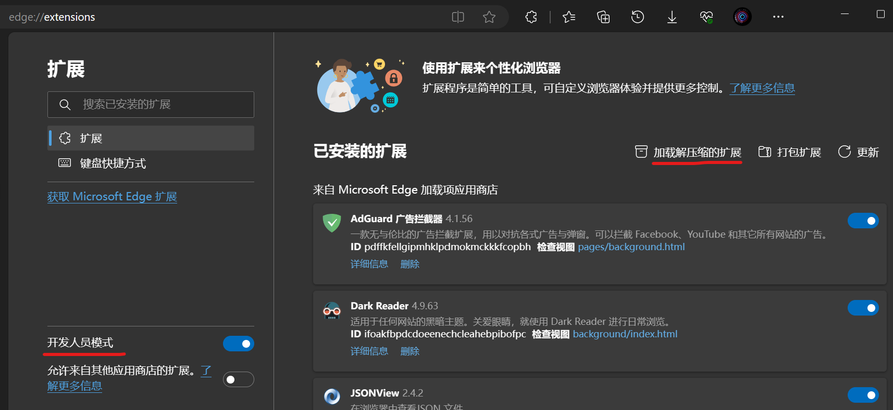
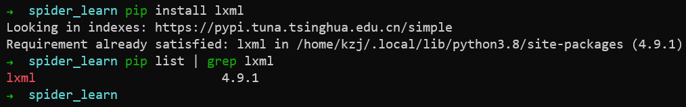
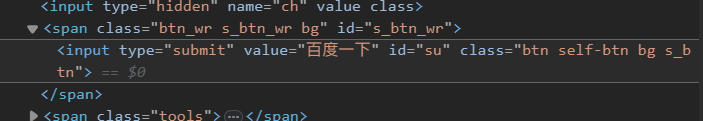
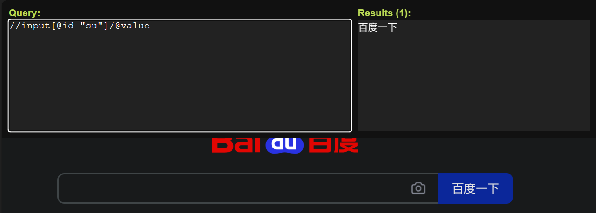
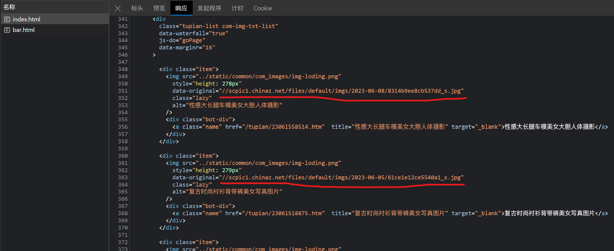
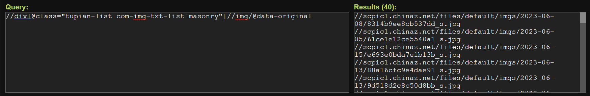
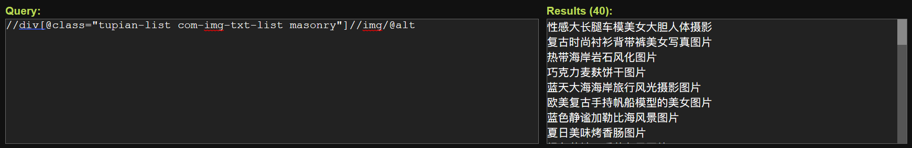
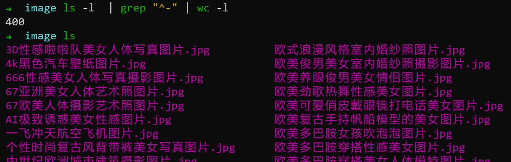

# xpath 库

## 基本使用




### 安装浏览器插件xpath_helper

[安装教程](https://www.cnblogs.com/watalo/p/13768986.html)

[下载地址](https://github.com/eliasdorneles/xpath_helper)

[解决快捷键冲突的问题](https://blog.csdn.net/m0_38039437/article/details/127546641)

我解压到的位置为```D:\Software\xpath浏览器插件\xpath_helper-master```，在Edge浏览器的扩展管理中，打开开发者模式，引入本地的扩展



修改了快捷键为<kbd>Shift</kbd>+<kbd>Alt</kbd>+<kbd>X</kbd>

### 安装lxml库



### 解析本地文件

现在有文件```html_demo.html```，内容如下
```html
<!DOCTYPE html>
<html lang="en">
    <head>
        <meta charset="UTF-8"/>
        <title>Title</title>
    </head>
    <body>
        <ul>
            <li id="l1" class="c1">北京</li>
            <li id="l2">上海</li>
            <li id="c3">深圳</li>
            <li id="c4">武汉</li>
        </ul>
        <!-- <ul>
            <li>大连</li>
            <li>锦州</li>
            <li>沈阳</li>
        </ul> -->
    </body>
</html>
```


xpath基础语法的代码示例：
```py
from lxml import etree
tree = etree.parse('html_demo.html')
# 查找<ul>标签中的<li>
# 路径查询
li_list = tree.xpath('//body/ul/li')
print(li_list)
print(len(li_list))
# 查找<ul>标签中的<li>
# 内容查询
li_text_list = tree.xpath('//body/ul/li/text()')
print(li_text_list)
print(len(li_text_list))
# 查找所有有id属性的<li>标签
# 谓词查询
li_list = tree.xpath('//body/ul/li[@id]')
print(li_list)
print(len(li_list))
# 查找所有有id属性的<li>标签
# 谓词查询
li_list = tree.xpath('//body/ul/li[@id="l1"]')
print(li_list)
print(len(li_list))
# 查找id为l1的<li>标签的class属性值
# 属性查询
li_class = tree.xpath('//body/ul/li[@id="l1"]/@class')
print(li_class)
print(len(li_class))
# 查找id中包含l的<li>标签
# 模糊查询
li_list = tree.xpath('//body/ul/li[contains(@id, "l")]')
print(li_list)
print(len(li_list))
# 查找id的值以l开头的<li>标签
# 模糊查询
li_list = tree.xpath('//body/ul/li[starts-with(@id, "l")]')
print(li_list)
print(len(li_list))
# 查找id为l1和class为c1的<li>标签
# 逻辑与运算
li_list = tree.xpath('//body/ul/li[@id="l1" and @class="c1"]')
print(li_list)
print(len(li_list))
# 查找id为l1和class为c1的<li>标签
# 逻辑或运算
li_list = tree.xpath('//body/ul/li[@id="l1"] | //body/ul/li[@id="l2"]')
print(li_list)
print(len(li_list))
# 注意：属性的或关系用 or 表示
# 注意：节点的或关系用 | 表示
```

### 解析服务器相应的数据

解析出[百度官网](https://www.baidu.com/)的搜索按钮上的文字（百度一下）



用快捷键打开浏览器的xpath_helper插件，用来验证xpath语句是否正确



经验证，可以用```//input[@id="su"]/@value```解析出百度一下

```py
import urllib.request
url = 'https://www.baidu.com/'
headers = {
    'User-Agent': 'Mozilla/5.0 (Windows NT 10.0; Win64; x64) AppleWebKit/537.36 (KHTML, like Gecko) Chrome/113.0.0.0 Safari/537.36 Edg/113.0.1774.50'
}
request = urllib.request.Request(url=url, headers=headers)
response = urllib.request.urlopen(request)
content = response.read().decode('utf-8')
# 解析网页源码，获取想要的数据
from lxml import etree
# 解析服务器相应的文件
tree = etree.HTML(content)
# 获取想要的数据
result = tree.xpath('//input[@id="su"]/@value')
print(result)
```

## 解析图片

### 爬取站长素材中图片列表的前10页图片

[要爬取的网址](https://sc.chinaz.com/tupian/index.html)



用浏览器的xpath_helper插件，用```//div[@class="tupian-list com-img-txt-list masonry"]//img/@data-original```解析出图片的地址


用```//div[@class="tupian-list com-img-txt-list masonry"]//img/@alt```解析出图片的名称



第1页的url：```https://sc.chinaz.com/tupian/index.html```
第2页的url：```https://sc.chinaz.com/tupian/index_2.html```
第page页的url：```https://sc.chinaz.com/tupian/index_page.html```

```py
import urllib.request
from lxml import etree

def create_request(page):
    if(page==1):
        url = 'https://sc.chinaz.com/tupian/index.html'
    else:
        url = 'https://sc.chinaz.com/tupian/index_' + str(page) + '.html'
    headers = {
        'User-Agent': 'Mozilla/5.0 (Windows NT 10.0; Win64; x64) AppleWebKit/537.36 (KHTML, like Gecko) Chrome/113.0.0.0 Safari/537.36 Edg/113.0.1774.50'
    }
    request = urllib.request.Request(url=url, headers=headers)
    return request

def get_content(request):
    response = urllib.request.urlopen(request)
    content = response.read().decode('utf-8')
    return content

def download_image(content):
    tree = etree.HTML(content)
    name_list = tree.xpath('//div[@class="tupian-list com-img-txt-list"]//img/@alt')
    src_list = tree.xpath('//div[@class="tupian-list com-img-txt-list"]//img/@data-original')
    print(len(name_list), len(src_list))
    for i in range(len(src_list)):
        name = name_list[i]
        src = src_list[i]
        url = 'https:' + src
        urllib.request.urlretrieve(url=url, filename='./image/'+name+'.jpg')
        
if __name__ == '__main__':
    start_page = int(input('请输入起始页码：'))
    end_page = int(input('请输入结束页码：'))
    
    for page in range(start_page, end_page+1):
        request = create_request(page);
        content = get_content(request);
        download_image(content);
```

爬取成功


# jsonpath 库


---
到p73