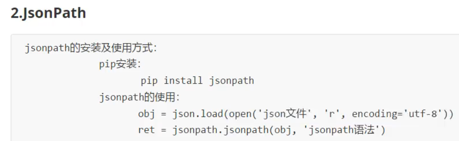

# xpath 库

## 基本使用


### 安装浏览器插件xpath_helper

[安装教程](https://www.cnblogs.com/watalo/p/13768986.html)

[下载地址](https://github.com/eliasdorneles/xpath_helper)

[解决快捷键冲突的问题](https://blog.csdn.net/m0_38039437/article/details/127546641)

我解压到的位置为```D:\Software\xpath浏览器插件\xpath_helper-master```，在Edge浏览器的扩展管理中，打开开发者模式，引入本地的扩展


修改了快捷键为<kbd>Shift</kbd>+<kbd>Alt</kbd>+<kbd>X</kbd>

### 安装lxml库


### 解析本地文件

现在有文件```html_demo.html```，内容如下
```html
<!DOCTYPE html>
<html lang="en">
    <head>
        <meta charset="UTF-8"/>
        <title>Title</title>
    </head>
    <body>
        <ul>
            <li id="l1" class="c1">北京</li>
            <li id="l2">上海</li>
            <li id="c3">深圳</li>
            <li id="c4">武汉</li>
        </ul>
        <!-- <ul>
            <li>大连</li>
            <li>锦州</li>
            <li>沈阳</li>
        </ul> -->
    </body>
</html>
```


xpath基础语法的代码示例：
```py
from lxml import etree
tree = etree.parse('html_demo.html')
# 查找<ul>标签中的<li>
# 路径查询
li_list = tree.xpath('//body/ul/li')
print(li_list)
print(len(li_list))
# 查找<ul>标签中的<li>
# 内容查询
li_text_list = tree.xpath('//body/ul/li/text()')
print(li_text_list)
print(len(li_text_list))
# 查找所有有id属性的<li>标签
# 谓词查询
li_list = tree.xpath('//body/ul/li[@id]')
print(li_list)
print(len(li_list))
# 查找所有有id属性的<li>标签
# 谓词查询
li_list = tree.xpath('//body/ul/li[@id="l1"]')
print(li_list)
print(len(li_list))
# 查找id为l1的<li>标签的class属性值
# 属性查询
li_class = tree.xpath('//body/ul/li[@id="l1"]/@class')
print(li_class)
print(len(li_class))
# 查找id中包含l的<li>标签
# 模糊查询
li_list = tree.xpath('//body/ul/li[contains(@id, "l")]')
print(li_list)
print(len(li_list))
# 查找id的值以l开头的<li>标签
# 模糊查询
li_list = tree.xpath('//body/ul/li[starts-with(@id, "l")]')
print(li_list)
print(len(li_list))
# 查找id为l1和class为c1的<li>标签
# 逻辑与运算
li_list = tree.xpath('//body/ul/li[@id="l1" and @class="c1"]')
print(li_list)
print(len(li_list))
# 查找id为l1和class为c1的<li>标签
# 逻辑或运算
li_list = tree.xpath('//body/ul/li[@id="l1"] | //body/ul/li[@id="l2"]')
print(li_list)
print(len(li_list))
# 注意：属性的或关系用 or 表示
# 注意：节点的或关系用 | 表示
```

### 解析服务器相应的数据

解析出[百度官网](https://www.baidu.com/)的搜索按钮上的文字（百度一下）


用快捷键打开浏览器的xpath_helper插件，用来验证xpath语句是否正确


经验证，可以用```//input[@id="su"]/@value```解析出百度一下

```py
import urllib.request
url = 'https://www.baidu.com/'
headers = {
    'User-Agent': 'Mozilla/5.0 (Windows NT 10.0; Win64; x64) AppleWebKit/537.36 (KHTML, like Gecko) Chrome/113.0.0.0 Safari/537.36 Edg/113.0.1774.50'
}
request = urllib.request.Request(url=url, headers=headers)
response = urllib.request.urlopen(request)
content = response.read().decode('utf-8')
# 解析网页源码，获取想要的数据
from lxml import etree
# 解析服务器相应的文件
tree = etree.HTML(content)
# 获取想要的数据
result = tree.xpath('//input[@id="su"]/@value')
print(result)
```

## 解析网站中的图片信息

### 爬取站长素材中图片列表的前10页图片

[要爬取的网址](https://sc.chinaz.com/tupian/index.html)


用浏览器的xpath_helper插件，用```//div[@class="tupian-list com-img-txt-list masonry"]//img/@data-original```解析出图片的地址


用```//div[@class="tupian-list com-img-txt-list masonry"]//img/@alt```解析出图片的名称


第1页的url：```https://sc.chinaz.com/tupian/index.html```
第2页的url：```https://sc.chinaz.com/tupian/index_2.html```
第page页的url：```https://sc.chinaz.com/tupian/index_page.html```

```py
import urllib.request
from lxml import etree

def create_request(page):
    if(page==1):
        url = 'https://sc.chinaz.com/tupian/index.html'
    else:
        url = 'https://sc.chinaz.com/tupian/index_' + str(page) + '.html'
    headers = {
        'User-Agent': 'Mozilla/5.0 (Windows NT 10.0; Win64; x64) AppleWebKit/537.36 (KHTML, like Gecko) Chrome/113.0.0.0 Safari/537.36 Edg/113.0.1774.50'
    }
    request = urllib.request.Request(url=url, headers=headers)
    return request

def get_content(request):
    response = urllib.request.urlopen(request)
    content = response.read().decode('utf-8')
    return content

def download_image(content):
    tree = etree.HTML(content)
    name_list = tree.xpath('//div[@class="tupian-list com-img-txt-list"]//img/@alt')
    src_list = tree.xpath('//div[@class="tupian-list com-img-txt-list"]//img/@data-original')
    print(len(name_list), len(src_list))
    for i in range(len(src_list)):
        name = name_list[i]
        src = src_list[i]
        url = 'https:' + src
        urllib.request.urlretrieve(url=url, filename='./image/'+name+'.jpg')
        
if __name__ == '__main__':
    start_page = int(input('请输入起始页码：'))
    end_page = int(input('请输入结束页码：'))
    
    for page in range(start_page, end_page+1):
        request = create_request(page);
        content = get_content(request);
        download_image(content);
```

爬取成功


# jsonpath 库

## 基本使用



只能解析本地文件

[教程链接](https://blog.csdn.net/luxideyao/article/details/77802389)


### 安装jsonpath库


### 解析本地文件

本地的jsonpath.json文件的内容为：
```json
 { "store": {
    "book": [
      { "category": "reference",
        "author": "Nigel Rees",
        "title": "Sayings of the Century",
        "price": 8.95
      },
      { "category": "fiction",
        "author": "Evelyn Waugh",
        "title": "Sword of Honour",
        "price": 12.99
      },
      { "category": "fiction",
        "author": "Herman Melville",
        "title": "Moby Dick",
        "isbn": "0-553-21311-3",
        "price": 8.99
      },
      { "category": "fiction",
        "author": "J. R. R. Tolkien",
        "title": "The Lord of the Rings",
        "isbn": "0-395-19395-8",
        "price": 22.99
      }
    ],
    "bicycle": {
      "author": "KZJ",
      "color": "red",
      "price": 19.95
    }
  }
}
```


```py
import json
import jsonpath
obj = json.load(open('jsonpath.json', 'r', encoding='utf-8'))
# 书店所有书的作者
author_list = jsonpath.jsonpath(obj, '$.store.book[*].author')
print(author_list)
# 所有的作者
author_list = jsonpath.jsonpath(obj, '$..author')
print(author_list)
# store下面的所有元素
tag_list = jsonpath.jsonpath(obj, '$.store.*')
print(tag_list)
# store下面所有东西的price
price_list = jsonpath.jsonpath(obj, '$.store..price')
print(price_list)
# 第三个书
book = jsonpath.jsonpath(obj, '$..book[2]')
print(book)
# 最后一本书
book = jsonpath.jsonpath(obj, '$..book[(@.length-1)]')
print(book)
# 前两本书
# book_list = jsonpath.jsonpath(obj, '$..book[0,1]')
# book_list = jsonpath.jsonpath(obj, '$..book[0:2]')
book_list = jsonpath.jsonpath(obj, '$..book[:2]')
print(book_list)
# 条件过滤需要在()前面添加一个?
# 过滤出所有包含isbn的书
book_list = jsonpath.jsonpath(obj, '$..book[?(@.isbn)]')
print(book_list)
# 超过了10元钱的书
book_list = jsonpath.jsonpath(obj, '$..book[?(@.price>10)]')
print(book_list)
```

## 解析网站中的json数据

### 解析淘票票网站中城市接口中的数据

[要爬取的网站](https://dianying.taobao.com/)

[要爬取的接口url](https://dianying.taobao.com/cityAction.json?activityId&_ksTS=1687077532149_108&jsoncallback=jsonp109&action=cityAction&n_s=new&event_submit_doGetAllRegion=true)


直接用浏览器访问这个接口url，不能拿到数据，是因为headers不对


那就在爬虫代码里，把正常访问接口时的headers都加上（手动在代码里去掉不需要的），模拟浏览器


直接从浏览器的F12工具中，复制headers，格式不对，少了单引号
这里新建一个文件，把内容粘贴进去，用pycharm的替换工具，快捷键为<kbd>command</kbd>+<kbd>R</kbd>，使用正则表达式规则替换，如下图

再粘贴到代码中

```py
import urllib.request
url = 'https://dianying.taobao.com/cityAction.json?activityId&_ksTS=1687077532149_108&jsoncallback=jsonp109&action=cityAction&n_s=new&event_submit_doGetAllRegion=true'
headers = {
# ':Authority':' dianying.taobao.com',
# ':Method':' GET',
# ':Path':'/cityAction.json?activityId&_ksTS=1687077532149_108&jsoncallback=jsonp109&action=cityAction&n_s=new&event_submit_doGetAllRegion=true',
# ':Scheme':' https',
'Accept':' text/javascript, application/javascript, application/ecmascript, application/x-ecmascript, */*; q=0.01',
# 'Accept-Encoding':' gzip, deflate, br',
'Accept-Language':' zh-CN,zh;q=0.9,en;q=0.8',
'Bx-V':'2.5.0',
'Cookie':' miid=1222458658192706076; lLtC1_=1; cookie2=183fc3f4003c2b0fe9c004ddb27c3ef1; t=5dacf4eb615aae70d28cf5757011f795; _tb_token_=ef44ee9e74e33; _samesite_flag_=true; tk_trace=oTRxOWSBNwn9dPyorMJE%2FoPdY8zMG1aAN%2F0TkjYGZjkj6rrK3kv4LgxGhtlxvv5DK7siwhr9c%2BstdFdCVk5KH7TNtr9MmPTTivFz95dL1UlOsk99CBjqGQtqaYz9ErqncArVife5c%2Bfop9ZYxDAxh%2BmdaHavG9oT41w%2BdOY7tRAIvKsDBXMRxlpOCy59E6YWIj%2FtYjP%2Fl3nQHncC1E84RrBI%2F%2BsjjMxWHDEZ3pjMX7SlEkucR%2FTiMc8UZpICKgKk1sSxn%2BRvhmuMqPdu0VJqq5rqdIwQj0SXMRNVbKK1w0WCsrSazxT%2Fthikh8xDic2%2BWSm3kimuWJ5oybEbt%2FDzWmZFHbeaL%2BWAzysQn8wlWuA1Zm%2BKU7ohouuosp6H8HxlVX1OE57AwJ8iFwA0iYsYb8ycMEA3wZFffXbdHD3dPGiQ7hp4JbYr4z9QaD7gX%2B8g2Tk7i33PR99UDlgmKVcgGRMh%2FZE%3D; v=0; cna=1MEUHShDTSACAXABrDKUge10; xlly_s=1; tfstk=cFUhBba_XA9b_s78CJgCRF22tEjAZ1Trnzz_7_xV78fmXAUNim-w0F8FsvXfL31..; l=fBrSdYrVNooXS0IvBO5aPurza77OnIRb4sPzaNbMiIEGa6ZdtFaqRNC1TWHXSdtjgTCAQetPl_pr6dLHRnZM5c0c07kqm0St3xvtaQtJe; isg=BFhY9GZWiLUMCaQx_BN0x9R6KYDqQbzL0pBVqJJJKxNGLfgXOlDGWyyDZWUdPXSj',
'Referer':' https://dianying.taobao.com/',
'Sec-Ch-Ua':' "Not.A/Brand";v="8", "Chromium";v="114", "Google Chrome";v="114"',
'Sec-Ch-Ua-Mobile':'?0',
'Sec-Ch-Ua-Platform':' "macOS"',
'Sec-Fetch-Dest':' empty',
'Sec-Fetch-Mode':'cors',
'Sec-Fetch-Site':' same-origin',
'User-Agent':' Mozilla/5.0 (Macintosh; Intel Mac OS X 10_15_7) AppleWebKit/537.36 (KHTML, like Gecko) Chrome/114.0.0.0 Safari/537.36',
'X-Requested-With':' XMLHttpRequest',
}
request = urllib.request.Request(url=url, headers=headers)
response = urllib.request.urlopen(request)
content = response.read().decode('utf-8')
print(content)
```


此时获取的数据前后还有圆括号，还不是真正的json数据，可以用下面的工具进行验证

[json工具网站](https://www.json.cn/)

要把前后用不到的去掉
继续上面的代码：
```py
# split 切割
content = content.split('(')[1].split(')')[0]
print(content)
```

因为jsonpath只能处理本地的文件，所以先把content保存到本地
继续上面的代码：
```py
# 保存到本地
with open('taopp_city.json', 'w', encoding='utf-8') as fp:
    fp.write(content)
```

在pycharm中使用快捷键<kbd>option</kbd>+<kbd>command</kbd>+<kbd>L</kbd>，格式化代码


使用jsonpath提取城市列表
继续上面的代码：
```py
import json
import jsonpath
obj = json.load(open('taopp_city.json', 'r', encoding='utf-8'))
city_list = jsonpath.jsonpath(obj, '$..regionName')
print(city_list)
```

# bs4(BeautifulSoup)


---
到p75