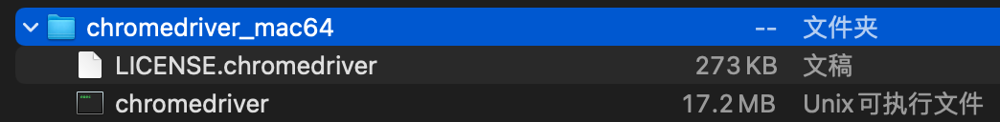
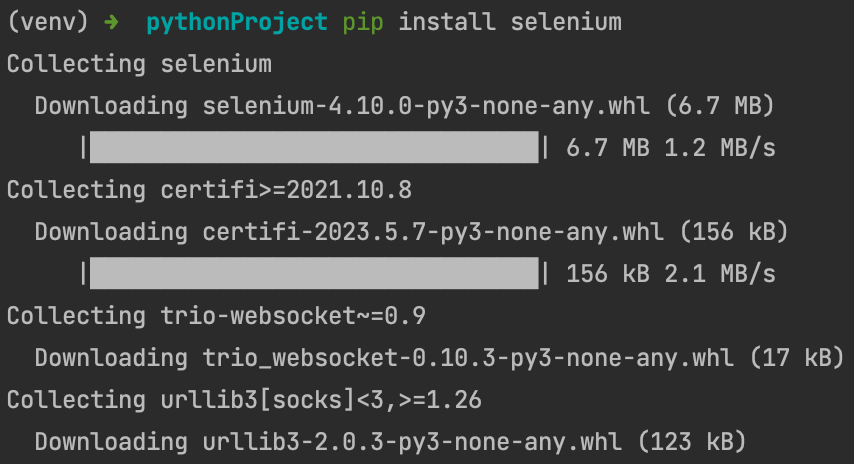
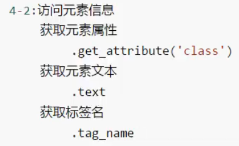
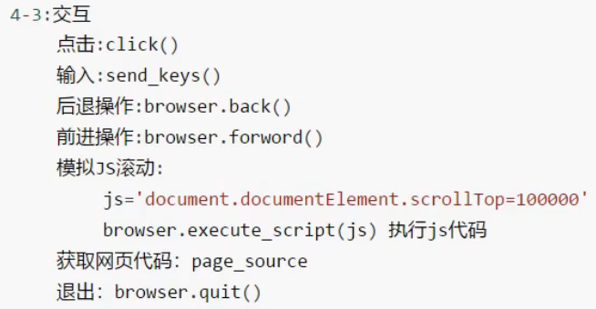

# selenium 库

## 基本使用


### 下载谷歌浏览器驱动

这里用的是mac

[驱动下载地址](https://chromedriver.storage.googleapis.com/index.html)



解压后的chromedriver文件，移动到main.py的同级目录下


#### WSL2环境下的配置

如果不用mac，使用win11和内置的WSL2子系统

[ChromeDriver in WSL2教程](https://www.gregbrisebois.com/posts/chromedriver-in-wsl2/)

[中文教程](https://blog.csdn.net/weixin_42555153/article/details/119118054)

##### 安装chrome浏览器

需要先在WSL2子系统中安装chrome浏览器（和win11系统中的chrome浏览器无关）
```shell
# 最新的稳定版本
# wget https://dl.google.com/linux/direct/google-chrome-stable_current_amd64.deb
# 手动指定版本
wget https://dl.google.com/linux/chrome/deb/pool/main/g/google-chrome-stable/google-chrome-stable_114.0.5735.90-1_amd64.deb
sudo apt install ./google-chrome-stable_current_amd64.deb
# 检测是否安装好
google-chrome --version
```

如果中文显示不出来，那就安装中文字体
```shell
# 安装中文字体
sudo apt install fonts-wqy-microhei
# 查看已安装的中文字体
fc-list :lang=zh-cn
```

##### 安装驱动程序

[下载地址](https://chromedriver.storage.googleapis.com/)

[另一个下载地址](https://googlechromelabs.github.io/chrome-for-testing/#stable)

安装chromedriver
```shell
# 按照自己的chrome浏览器的版本号下载
wget https://chromedriver.storage.googleapis.com/114.0.5735.90/chromedriver_linux64.zip
unzip chromedriver_linux64.zip
sudo mv chromedriver /usr/bin/chromedriver
sudo chown root:root /usr/bin/chromedriver
sudo chmod +x /usr/bin/chromedriver
# 检测是否安装好
chromedriver --version
```

##### 运行python代码，不显示chrome的解决方法

可能是之前运行的chromedriver没有关闭，手动关闭即可


### 安装selenium库



### 驱动真实的浏览器来访问京东网站的秒杀信息

```py
from selenium import webdriver
# 创建浏览器操作对象
# 这是selenium使用旧版本时的写法
# path = 'chromedriver'
# browser = webdriver.Chrome(path)
# 这是selenium4版本的写法
browser = webdriver.Chrome()
# 访问网站
url = 'https://www.jd.com/'
browser.get(url)
# page_source用来获取网页源码
content = browser.page_source
print(content)
# 用来暂停，不然浏览器窗口会一闪而过
input()
```


京东的秒杀信息，用前面的urllib库获取不到，这里用selenium可以获取，因为京东检测到是真实的浏览器，就给了数据

## 元素定位


### 定位百度的搜索框


```py
from selenium import webdriver
# 创建浏览器操作对象
browser = webdriver.Chrome()
# 访问网站
url = 'https://www.baidu.com'
browser.get(url)

# 元素定位

# 1.根据id找到对象
# selenium使用旧版本时的写法
# button = browser.find_element_by_id('kw')
# selenium4版本的写法
button = browser.find_element('id', 'kw')
print(button)

# 2.根据标签属性的属性值来找对象
# selenium使用旧版本时的写法
# button = browser.find_element_by_name('wd')
# selenium4版本的写法
button = browser.find_element('name', 'wd')
print(button)

# 3.根据xpath语句来获取对象
# selenium使用旧版本时的写法
# button = browser.find_element_by_xpath('//input[@id="kw"]')
# selenium4版本的写法
button = browser.find_element('xpath', '//input[@id="kw"]')
print(button)

# 4.根据标签名获取对象
# selenium使用旧版本时的写法
# button = browser.find_elements_by_tag_name('input')
# selenium4版本的写法
button = browser.find_elements('tag name', 'input')
print(button)

# 5.根据bs4语法来获取对象
# selenium使用旧版本时的写法
# button = browser.find_elements_by_css_selector('#kw')
# selenium4版本的写法
button = browser.find_elements('css selector', '#kw')
print(button)

# 6.根据链接文本（即<a>标签的文本）来获取对象
# selenium使用旧版本时的写法
# button = browser.find_elements_by_link_text('贴吧')
# selenium4版本的写法
button = browser.find_elements('link text', '贴吧')
print(button)

# 用来暂停，不然浏览器窗口会一闪而过
input()
```

## 元素信息



### 获取百度的搜索框元素的信息


```py
from selenium import webdriver
browser = webdriver.Chrome()
url = 'http://baidu.com'
browser.get(url)
button = browser.find_element('id', 'kw')
# 1.获取元素的属性值
print(button.get_attribute('class'))
# 2.获取标签的名字
print(button.tag_name)
# 3.获取元素文本
a = browser.find_element('link text', '贴吧')
print(a.text)

# 用来暂停，不然浏览器窗口会一闪而过
input()
```

## 交互



### 百度搜索周杰伦并翻页

```py
from selenium import webdriver
browser = webdriver.Chrome()
url = 'http://baidu.com'
browser.get(url)

# 睡1秒
import time
time.sleep(1)

# 获取文本框对象
baidu_input = browser.find_element('id', 'kw')
# 在文本框中输入信息
baidu_input.send_keys('周杰伦')
time.sleep(1)

# 获取百度一下的按钮
baidu_button = browser.find_element('id', 'su')
# 点击按钮
baidu_button.click()
time.sleep(1)

# 滑到底部
js_bottom = 'document.documentElement.scrollTop=100000'
browser.execute_script(js_bottom)
time.sleep(1)

# 获取下一页的按钮
next_button = browser.find_element('xpath', '//a[@class="n"]')
# 点击下一页
next_button.click()
time.sleep(1)

# 后退操作
browser.back()
time.sleep(1)

# 前进操作
browser.forward()
time.sleep(1)

# 退出
browser.quit()

# 用来暂停，不然浏览器窗口会一闪而过
input()
```

### 模拟登录启信宝并获取cookie


---

https://blog.csdn.net/XianZhe_/article/details/119860391


# 无界面浏览器（提高代码效率）

之前的执行都要打开浏览器，打开网页页面做一通操作，有点慢

## Phantomjs


### 安装

WSL2子系统

```shell
apt install phantomjs
# 检测是否安装好
phantomjs -v
```

### 使用

如果出现找不到Phantomjs，尝试用pip降低selenium的版本


和前面使用selenium的代码相比，除了引入的文件不一样，其他的完全一致
但是与handless相比，更推荐使用Chrome handless

## Chrome headless


为了与前面的代码统一，把selenium又用回4.10.0版本

### 简单使用

```py
from selenium import webdriver
from selenium.webdriver.chrome.options import Options

chrome_options = Options()
chrome_options.add_argument('--headless')
chrome_options.add_argument('--disable_gpu')

browser = webdriver.Chrome(chrome_options=chrome_options)
url = 'https://www.baidu.com'
browser.get(url)
# 保存网页快照
browser.save_screenshot('baidu.png')
```

### 封装使用

```py
from selenium import webdriver
from selenium.webdriver.chrome.options import Options

# 封装
def share_browser():
    chrome_options = Options()
    chrome_options.add_argument('--headless')
    chrome_options.add_argument('--disable_gpu')
    browser = webdriver.Chrome(chrome_options=chrome_options)
    return browser

# 调用
browser = share_browser()
url = 'https://www.baidu.com'
browser.get(url)
```

