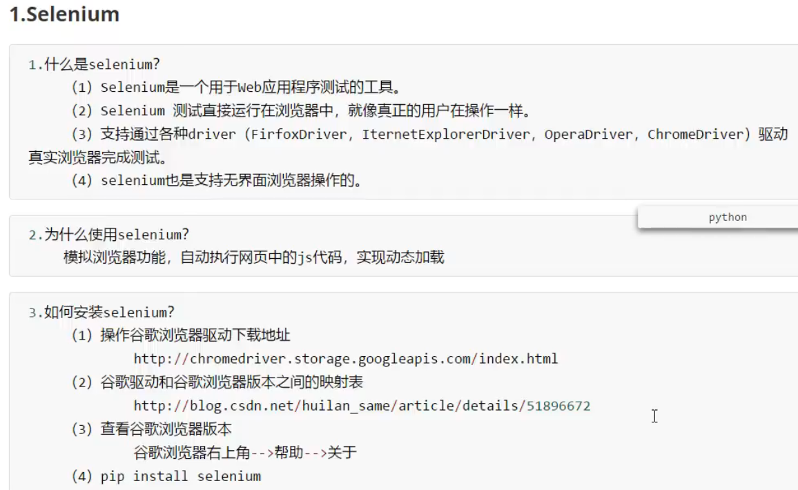
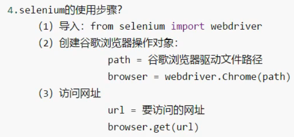
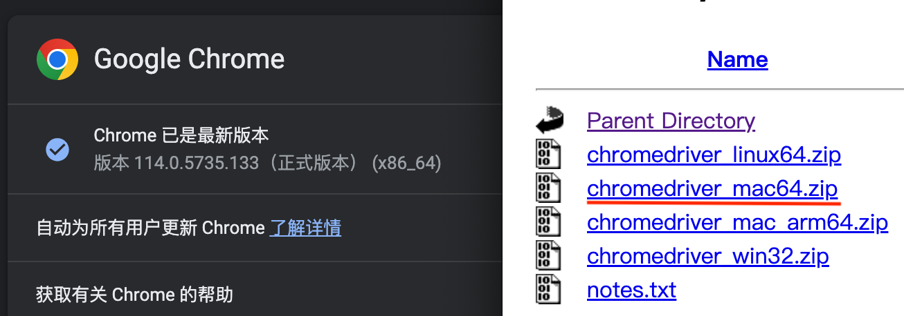
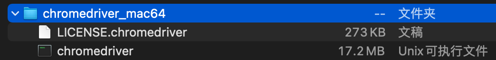
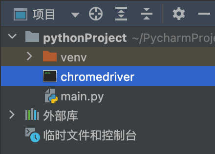
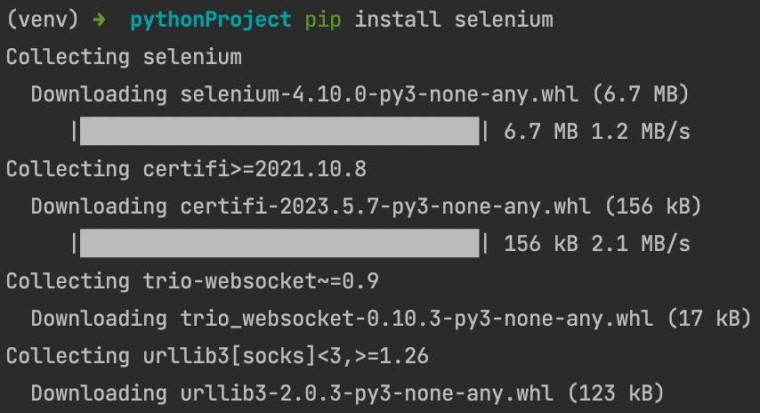
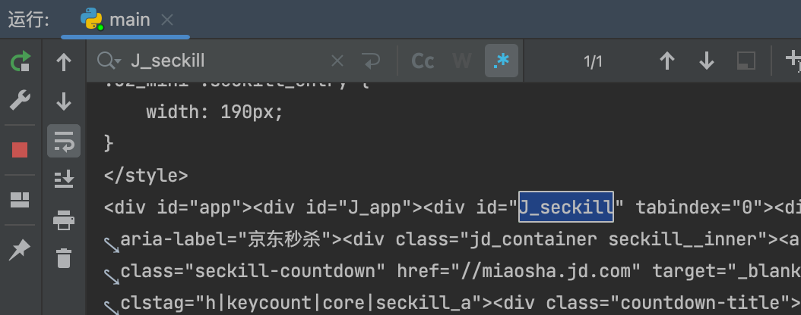
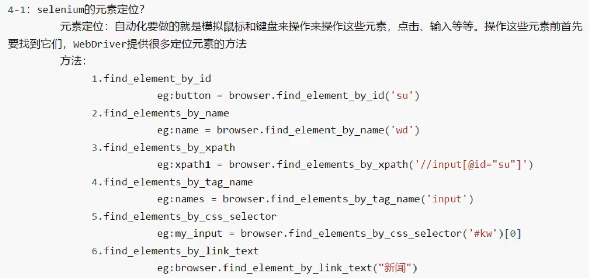

# selenium 库

## 基本使用




### 下载谷歌浏览器驱动

[驱动下载地址](https://chromedriver.storage.googleapis.com/index.html)




解压后的chromedriver文件，移动到main.py的同级目录下



### 安装selenium库



### 驱动真实的浏览器来访问京东网站的秒杀信息

```py
from selenium import webdriver
# 创建浏览器操作对象
# 这是selenium使用旧版本时的写法
# path = 'chromedriver'
# browser = webdriver.Chrome(path)
# 这是selenium4版本的写法
browser = webdriver.Chrome()
# 访问网站
url = 'https://www.jd.com/'
browser.get(url)
# page_source用来获取网页源码
content = browser.page_source
print(content)
# 用来暂停，不然浏览器窗口会一闪而过
input()
```



京东的秒杀信息，用前面的urllib库获取不到，这里用selenium可以获取，因为京东检测到是真实的浏览器，就给了数据

## 元素定位




到P79

