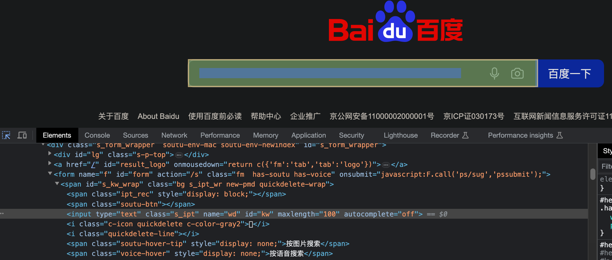

# selenium 库

## 基本使用


### 下载谷歌浏览器驱动

[驱动下载地址](https://chromedriver.storage.googleapis.com/index.html)


解压后的chromedriver文件，移动到main.py的同级目录下


### 安装selenium库


### 驱动真实的浏览器来访问京东网站的秒杀信息

```py
from selenium import webdriver
# 创建浏览器操作对象
# 这是selenium使用旧版本时的写法
# path = 'chromedriver'
# browser = webdriver.Chrome(path)
# 这是selenium4版本的写法
browser = webdriver.Chrome()
# 访问网站
url = 'https://www.jd.com/'
browser.get(url)
# page_source用来获取网页源码
content = browser.page_source
print(content)
# 用来暂停，不然浏览器窗口会一闪而过
input()
```


京东的秒杀信息，用前面的urllib库获取不到，这里用selenium可以获取，因为京东检测到是真实的浏览器，就给了数据

## 元素定位


### 定位百度的搜索框



```py
from selenium import webdriver
# 创建浏览器操作对象
browser = webdriver.Chrome()
# 访问网站
url = 'https://www.baidu.com'
browser.get(url)

# 元素定位

# 1.根据id找到对象
# selenium使用旧版本时的写法
# button = browser.find_element_by_id('kw')
# selenium4版本的写法
button = browser.find_element('id', 'kw')
print(button)

# 2.根据标签属性的属性值来找对象
# selenium使用旧版本时的写法
# button = browser.find_element_by_name('wd')
# selenium4版本的写法
button = browser.find_element('name', 'wd')
print(button)

# 3.根据xpath语句来获取对象
# selenium使用旧版本时的写法
# button = browser.find_element_by_xpath('//input[@id="kw"]')
# selenium4版本的写法
button = browser.find_element('xpath', '//input[@id="kw"]')
print(button)

# 4.根据标签名获取对象
# selenium使用旧版本时的写法
# button = browser.find_elements_by_tag_name('input')
# selenium4版本的写法
button = browser.find_elements('tag name', 'input')
print(button)

# 5.根据bs4语法来获取对象
# selenium使用旧版本时的写法
# button = browser.find_elements_by_css_selector('#kw')
# selenium4版本的写法
button = browser.find_elements('css selector', '#kw')
print(button)

# 6.根据链接文本（即<a>标签的文本）来获取对象
# selenium使用旧版本时的写法
# button = browser.find_elements_by_link_text('贴吧')
# selenium4版本的写法
button = browser.find_elements('link text', '贴吧')
print(button)

# 用来暂停，不然浏览器窗口会一闪而过
input()
```

## 元素信息


### 获取百度的搜索框元素的信息


```py
from selenium import webdriver
browser = webdriver.Chrome()
url = 'http://baidu.com'
browser.get(url)
button = browser.find_element('id', 'kw')
# 1.获取元素的属性值
print(button.get_attribute('class'))
# 2.获取标签的名字
print(button.tag_name)
# 3.获取元素文本
a = browser.find_element('link text', '贴吧')
print(a.text)

# 用来暂停，不然浏览器窗口会一闪而过
input()
```

## 交互


### 百度搜索周杰伦并翻页

```py
from selenium import webdriver
browser = webdriver.Chrome()
url = 'http://baidu.com'
browser.get(url)

# 睡1秒
import time
time.sleep(1)

# 获取文本框对象
baidu_input = browser.find_element('id', 'kw')
# 在文本框中输入信息
baidu_input.send_keys('周杰伦')
time.sleep(1)

# 获取百度一下的按钮
baidu_button = browser.find_element('id', 'su')
# 点击按钮
baidu_button.click()
time.sleep(1)

# 滑到底部
js_bottom = 'document.documentElement.scrollTop=100000'
browser.execute_script(js_bottom)
time.sleep(1)

# 用来暂停，不然浏览器窗口会一闪而过
input()
```


---
到P79

