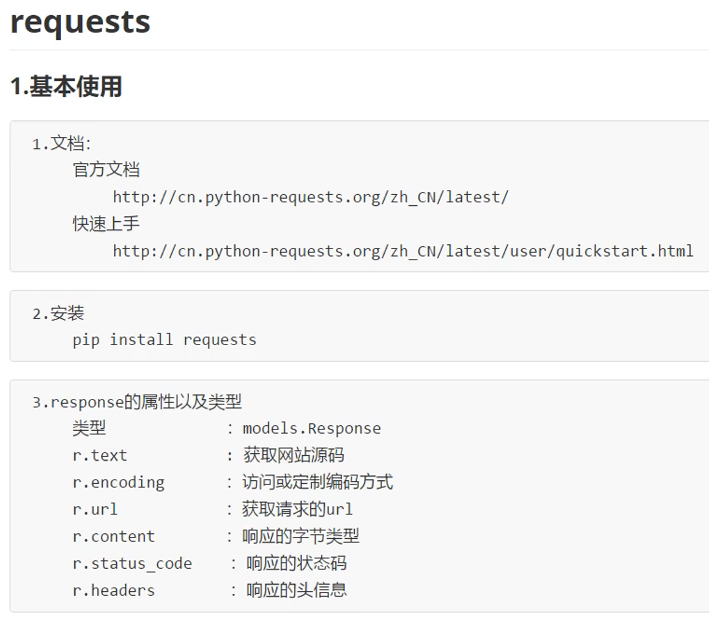
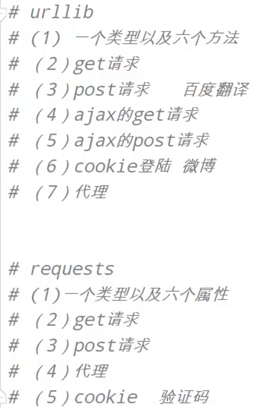
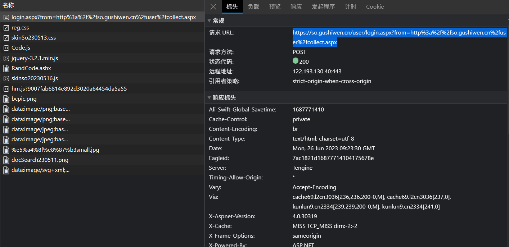
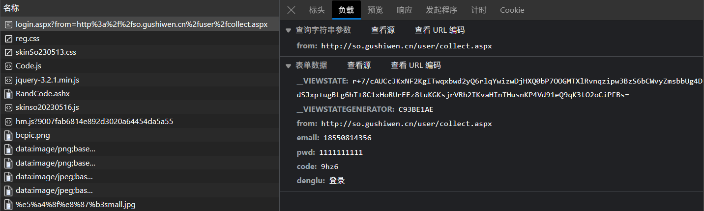
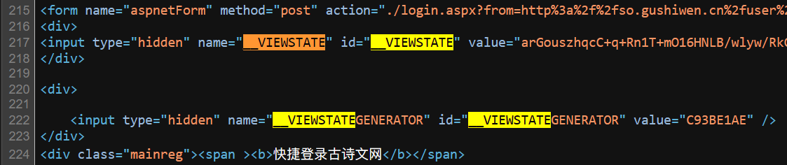
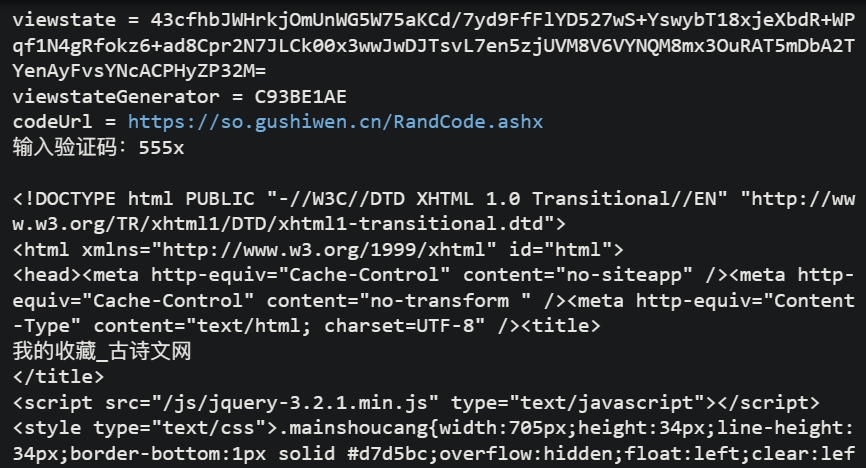
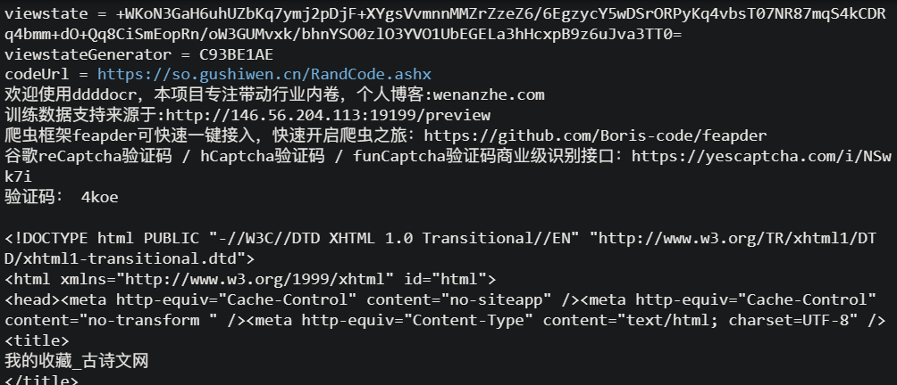

# requests 库

和 urllib 库作用类似

## 基本使用



### 安装

```shell
pip install requests
```

### 一个类型和六个属性


#### Response 类型

```py
import requests
url = 'http://www.baidu.com'
response = requests.get(url=url)
print(type(response))
# 打印输出为<class 'requests.models.Response'>
```

#### 六个属性

```py
import requests
url = 'http://www.baidu.com'
response = requests.get(url=url)
# 设置响应的编码格式
response.encoding = 'utf-8'
# 六个属性
print(response.text)
print(response.encoding)
print(response.url)
print(response.content)
print(response.status_code)
print(response.headers)
```

### urllib 库和 requests 库学习路线对比



## get请求

用百度搜索北京，url显示为
```url
https://www.baidu.com/s?wd=北京
```
实际编码为
```url
https://www.baidu.com/s?wd=%E5%8C%97%E4%BA%AC
```

发起get请求的代码为
```py
import requests
# url = 'https://www.baidu.com/s?'
url = 'https://www.baidu.com/s'
headers = {
    'User-Agent': 'Mozilla/5.0 (Windows NT 10.0; Win64; x64) AppleWebKit/537.36 (KHTML, like Gecko) Chrome/114.0.0.0 Safari/537.36 Edg/114.0.1823.51'
}
data = {
    'wd': '北京'
}

# requests.get()的传入参数
# url 请求资源路径
# params 参数
# kwargs 字典
response = requests.get(url=url, params=data, headers=headers)
content = response.text
print(content)

# get请求总结：
# 1.参数使用params传递
# 2.参数无需像urllib中使用urlencode编码
# 3.不需要请求对象的定制
# 4.请求资源路径中的？可加可不加
``` 

## post请求

为了方便和urllib库的使用做对比，还是用之前的百度翻译案例

```py
import requests
url = 'https://fanyi.baidu.com/sug'
headers = {
    'User-Agent': 'Mozilla/5.0 (Windows NT 10.0; Win64; x64) AppleWebKit/537.36 (KHTML, like Gecko) Chrome/114.0.0.0 Safari/537.36 Edg/114.0.1823.43'
}
data = {
    'kw': 'spider',
}

# requests.post()的传入参数
# url 请求地址
# data 请求参数
# kwargs 字典
response = requests.post(url=url, data=data, headers=headers)
content = response.text
print(content)
# 字符串 -> json对象
import json
obj = json.loads(content)
print(type(obj))
print(obj)

# post请求总结：
# 1.不需要编码解码
# 2.参数使用data传递
# 3.不需要请求对象的定制
```

## 代理

```py
import requests
url = 'http://ip.900cha.com/'
headers = {
    'User-Agent': 'Mozilla/5.0 (Windows NT 10.0; Win64; x64) AppleWebKit/537.36 (KHTML, like Gecko) Chrome/114.0.0.0 Safari/537.36 Edg/114.0.1823.43',
}
proxies = {
    'http': '223.96.90.216:8085'
}
response = requests.get(url=url, headers=headers, proxies=proxies)
content = response.text
print(content)
```

## cookie登录

之前使用 requests 模块的时候，是直接 requests.get() 或者 requests.post() 发送GET请求或POST请求，当然也是可以带上 cookies 和 headers 的，但这都是一次性请求，你这次带着cookies信息，后面的请求还得带。这时候 requests.session() 就派上用场了，它可以自动处理cookies，做**状态保持**。

- requests.session的作用：自动处理cookie，即 下一次请求会带上前一次的cookie
- requests.session的应用场景：自动处理连续的多次请求过程中产生的cookie

### 古诗文网

[古诗文网登录页面](https://so.gushiwen.cn/user/login.aspx)

[找到的登录接口](https://so.gushiwen.cn/user/login.aspx?from=http%3a%2f%2fso.gushiwen.cn%2fuser%2fcollect.aspx)





通过找到的登录接口发现，登录时需要的参数很多，如下：
```xml
__VIEWSTATE: r+7/cAUCcJKxNF2KgITwqxbwd2yQ6rlqYwizwDjHXQ0bP7OOGMTXlRvnqzipw3BzS6bCWvyZmsbbUg4DdSJxp+ugBLg6hT+8C1xHoRUrEEz8tuKGKsjrVRh2IKvaHInTHusnKP4Vd91eQ9qK3tO2oCiPFBs=
__VIEWSTATEGENERATOR: C93BE1AE
from: http://so.gushiwen.cn/user/collect.aspx
email: 18550814356
pwd: 1111111111
code: 9hz6
denglu: 登录
```

难点：
1. 不知道 __VIEWSTATE 和 __VIEWSTATEGENERATOR 的值是哪来的
2. 验证码怎么识别出 code 

解决：
1. 一般来说，看不到的数据，都是在页面的源码中（隐藏域）

我们需要获取页面的源码，然后进行解析就可以获取了

2. 下载验证码图片，如果是用 urllib.request.urlretrieve() 请求来获取，是获取的新的一张图片，和登录页面上的验证码图片无关


```py
import requests
from bs4 import BeautifulSoup
import urllib.request
# 登录页面的url地址
url = 'https://so.gushiwen.cn/user/login.aspx?from=http://so.gushiwen.cn/user/collect.aspx'
headers = {
    'User-Agent': 'Mozilla/5.0 (Windows NT 10.0; Win64; x64) AppleWebKit/537.36 (KHTML, like Gecko) Chrome/114.0.0.0 Safari/537.36 Edg/114.0.1823.43',
}
# 获取页面的源码
response = requests.get(url=url, headers=headers)
content = response.text
# 解析出 __VIEWSTATE 和 __VIEWSTATEGENERATOR
soup = BeautifulSoup(content, 'lxml')
# 获取 __VIEWSTATE
viewstate = soup.select('#__VIEWSTATE')[0].attrs.get('value')
# 获取 __VIEWSTATEGENERATOR
viewstateGenerator = soup.select('#__VIEWSTATEGENERATOR')[0].attrs.get('value')
print('viewstate =', viewstate)
print('viewstateGenerator =', viewstateGenerator)
# 获取验证码图片
codeImg = soup.select('#imgCode')[0].attrs.get('src')
codeUrl = 'https://so.gushiwen.cn' + codeImg
print('codeUrl =', codeUrl)
# 有坑，再次请求的验证码图片，是新的一张，不是登录页面上的那一张
# 错误的做法
# urllib.request.urlretrieve(url=codeUrl, filename='codeImg.png')
# 正确的做法
# requests的方法session()，通过session()的返回值，可以使请求变成一个对象
session = requests.session()
# 验证码url返回的内容
response_code = session.get(codeUrl)
# 注意此时要使用二进制数据，因为要下载图片的二进制格式内容
content_code = response_code.content
# wb模式就是将二进制数据写入到文件
with open('codeImg.png', 'wb') as fp:
    fp.write(content_code)
# 观察验证码图片后，在控制台输入验证码
code = input('输入验证码：')
# 点击登录
url_post = 'https://so.gushiwen.cn/user/login.aspx?from=http%3a%2f%2fso.gushiwen.cn%2fuser%2fcollect.aspx'
data_post = {
    '__VIEWSTATE': viewstate,
    '__VIEWSTATEGENERATOR': viewstateGenerator,
    'from': 'http://so.gushiwen.cn/user/collect.aspx',
    'email': '18550814356',
    'pwd': 'kzj1998,.',
    'code': code,
    'denglu': '登录'
}
# 这里不能用 requests，要用 session，才能保证验证码的请求和登录的请求是同一个
# response_post = requests.post(url=url, headers=headers, data=data_post)
response_post = session.post(url=url, headers=headers, data=data_post)
content = response_post.text
print(content)
```

登录成功


这里的验证码手动输入，效率较低

#### 自动识别验证码

##### 使用打码平台

[超级鹰官网](http://www.chaojiying.com/)

##### ddddocr 库

[ddddocr官方网站](https://pypi.org/project/ddddocr/)

使用方法：
```py
import ddddocr
# 实例化
ocr = ddddocr.DdddOcr()
# 以二进制格式打开图片用于只读
with open('codeImg.png', 'rb') as fp:
	img_bytes = fp.read()
# 识别图片中的内容
res = ocr.classification(img_bytes)
# 输出内容
print('识别出的验证码为：' + res)
```

应用到上面例子的代码为：
```py
import requests
from bs4 import BeautifulSoup
import urllib.request
import ddddocr
# 登录页面的url地址
url = 'https://so.gushiwen.cn/user/login.aspx?from=http://so.gushiwen.cn/user/collect.aspx'
headers = {
    'User-Agent': 'Mozilla/5.0 (Windows NT 10.0; Win64; x64) AppleWebKit/537.36 (KHTML, like Gecko) Chrome/114.0.0.0 Safari/537.36 Edg/114.0.1823.43',
}
# 获取页面的源码
response = requests.get(url=url, headers=headers)
content = response.text
# 解析出 __VIEWSTATE 和 __VIEWSTATEGENERATOR
soup = BeautifulSoup(content, 'lxml')
# 获取 __VIEWSTATE
viewstate = soup.select('#__VIEWSTATE')[0].attrs.get('value')
# 获取 __VIEWSTATEGENERATOR
viewstateGenerator = soup.select('#__VIEWSTATEGENERATOR')[0].attrs.get('value')
print('viewstate =', viewstate)
print('viewstateGenerator =', viewstateGenerator)
# 获取验证码图片
codeImg = soup.select('#imgCode')[0].attrs.get('src')
codeUrl = 'https://so.gushiwen.cn' + codeImg
print('codeUrl =', codeUrl)
# 有坑，再次请求的验证码图片，是新的一张，不是登录页面上的那一张
# 错误的做法
# urllib.request.urlretrieve(url=codeUrl, filename='codeImg.png')
# 正确的做法
# requests的方法session()，通过session()的返回值，可以使请求变成一个对象
session = requests.session()
# 验证码url返回的内容
response_code = session.get(codeUrl)
# 注意此时要使用二进制数据，因为要图片的二进制格式内容
content_code = response_code.content
# 使用ddddocr库识别验证码
ocr = ddddocr.DdddOcr()
code = ocr.classification(content_code)
print('验证码：', code)
# 点击登录
url_post = 'https://so.gushiwen.cn/user/login.aspx?from=http%3a%2f%2fso.gushiwen.cn%2fuser%2fcollect.aspx'
data_post = {
    '__VIEWSTATE': viewstate,
    '__VIEWSTATEGENERATOR': viewstateGenerator,
    'from': 'http://so.gushiwen.cn/user/collect.aspx',
    'email': '18550814356',
    'pwd': 'kzj1998,.',
    'code': code,
    'denglu': '登录'
}
# 这里不能用 requests，要用 session，才能保证验证码的请求和登录的请求是同一个
# response_post = requests.post(url=url, headers=headers, data=data_post)
response_post = session.post(url=url, headers=headers, data=data_post)
content = response_post.text
print(content)
```

登录成功，效果如下

