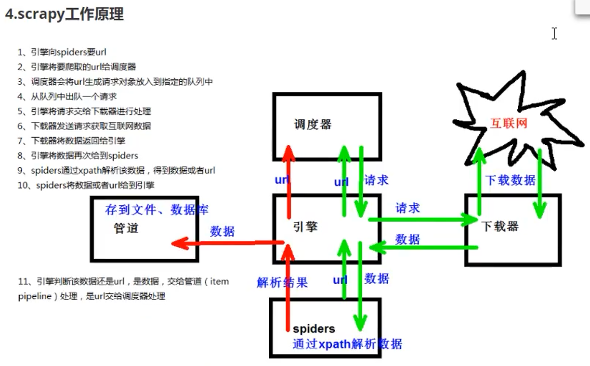
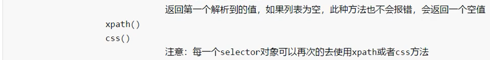

# scrapy 库


## 安装

```shell
pip install scrapy 
```

还需要配置环境变量


每次重启之后，需要再次执行
```shell
 source .profile
```

## 简单使用

### 初始化项目


```shell
scrapy startproject 项目名称
```


### 创建爬虫文件


在/home/kzj/python-demo/spider_learn/scrapy_demo/demo1/demo1/目录中执行
```shell
scrapy genspider 爬虫的名称 要爬的网址
```

/home/kzj/python-demo/spider_learn/scrapy_demo/demo1/demo1/spiders/baidu.py文件的内容为
```py
import scrapy

class BaiduSpider(scrapy.Spider):
    # 爬虫的名字，通过这个名字调用爬虫
    name = "baidu"
    # 允许访问的域名
    allowed_domains = ["www.baidu.com"]
    # 起始url地址，指的是第一次要访问的域名
    # start_urls 在 allowed_domains 的基础上生成
    start_urls = ["https://www.baidu.com"]

    # 相当于 response = urllib.request.urlopen()
    # 相当于 response = requests.get()
    def parse(self, response):
        print('baidu爬虫成功启动')
```


### 运行爬虫代码

在baidu.py所在的目录中执行
```shell
scrapy crawl 爬虫的名称
```


可以看出没有爬取成功，因为scrapy默认遵守robots协议

[百度的robots协议](https://www.baidu.com/robots.txt)

在/home/kzj/python-demo/spider_learn/scrapy_demo/demo1/demo1/settings.py文件中注释掉这行即可
```py
# ROBOTSTXT_OBEY = True
```

这样修改之后就不遵守了

可见运行成功

## 入门案例

### 58同城

[58同城官网](https://cn.58.com/)
在58同城的搜索栏中搜索 前端开发，请求的url为
```url
https://cn.58.com/sou/?key=%E5%89%8D%E7%AB%AF%E5%BC%80%E5%8F%91&classpolicy=classify_E%2Cuuid_tRa4i6KKN632Q5Ch6HteYrW3k5hbFQzJ&search_uuid=tRa4i6KKN632Q5Ch6HteYrW3k5hbFQzJ&search_type=input
```

使用如下命令创建爬虫
```shell
scrapy startproject scrapy_58tc
cd scrapy_58tc/scrapy_58tc
scrapy genspider 58tc https://cn.58.com/sou/\?key\=%E5%89%8D%E7%AB%AF%E5%BC%80%E5%8F%91\&classpolicy\=classify_E%2Cuuid_tRa4i6KKN632Q5Ch6HteYrW3k5hbFQzJ\&search_uuid\=tRa4i6KKN632Q5Ch6HteYrW3k5hbFQzJ\&search_type\=input
```

选择不遵守robots协议
```py
# ROBOTSTXT_OBEY = True
```

使用如下命令运行爬虫
```shell
scrapy crawl 58tc
```

#### scrapy 项目的结构


#### response 的属性和方法


/home/kzj/python-demo/spider_learn/scrapy_demo/scrapy_58tc/scrapy_58tc/spiders/a58tc.py文件的内容为
```py
import scrapy

class A58tcSpider(scrapy.Spider):
    name = "58tc"
    allowed_domains = ["cn.58.com"]
    start_urls = ["https://cn.58.com/sou/?key=%E5%89%8D%E7%AB%AF%E5%BC%80%E5%8F%91&classpolicy=classify_E%2Cuuid_tRa4i6KKN632Q5Ch6HteYrW3k5hbFQzJ&search_uuid=tRa4i6KKN632Q5Ch6HteYrW3k5hbFQzJ&search_type=input"]

    def parse(self, response):
        print('58同城爬虫启动成功')
        # 字符串
        content = response.text
        # 二进制数据
        b_content = response.body
        # 直接使用xpath方法，解析response中的内容
        span_list = response.xpath('//div[@id="filter"]//div[@class="tabs"]/a/span')
        print(span_list[0].extract())
```

### 汽车之家

[汽车之家官网](https://www.autohome.com.cn/)
在搜索栏中搜索 宝马热门车，进入宝马热门车页面，url为
```url
https://car.autohome.com.cn/price/brand-15.html
```

使用如下命令创建爬虫
```shell
scrapy startproject scrapy_carhome
cd scrapy_carhome
scrapy genspider carhome https://car.autohome.com.cn/price/brand-15.html
```

选择不遵守robots协议
```py
# ROBOTSTXT_OBEY = True
```

使用如下命令运行爬虫
```shell
scrapy crawl carhome
```

/home/kzj/python-demo/spider_learn/scrapy_demo/scrapy_carhome/scrapy_carhome/spiders/carhome.py文件的内容为
```py
import scrapy

class CarhomeSpider(scrapy.Spider):
    name = "carhome"
    allowed_domains = ["car.autohome.com.cn"]
    start_urls = ["https://car.autohome.com.cn/price/brand-15.html"]

    def parse(self, response):
        print('汽车之家爬虫启动成功')
        name_list = response.xpath('//div[@class="main-title"]/a/text()')
        price_list = response.xpath('//span[@class="lever-price red"]/span[@class="font-arial"]/text()')
        for i in range(len(name_list)):
            name = name_list[i].extract()
            price = price_list[i].extract()
            print(name, price)
```

运行结果为


#### scrapy 架构组成


#### scrapy 工作原理




## scrapy shell 交互终端




在wsl2的终端中输入
```shell
scrapy shell url网址
```
即可进入scrapy shell


## yield


### 当当网

[当当网青春爱情文学书籍列表](http://category.dangdang.com/cp01.01.02.00.00.00.html)

/home/kzj/python-demo/spider_learn/scrapy_demo/scrapy_dangdang/scrapy_dangdang/items.py文件的内容为
```py
import scrapy

class ScrapyDangdangItem(scrapy.Item):
    # define the fields for your item here like:
    # name = scrapy.Field()
    # 通俗的说就是要下载的数据都有什么
    # 图片链接
    # 除了第一张图片，其他图片用了懒加载，加载前的src属性值放在data-original属性里
    # 第一张图片的src的获取方法
    # //ul[@id="component_59"]/li//img/@src
    # 其余图片的src的获取方法
    # //ul[@id="component_59"]/li//img/@data-original
    src = scrapy.Field()
    # 书名
    # //ul[@id="component_59"]/li//img/@alt
    name = scrapy.Field()
    # 价格
    # //ul[@id="component_59"]/li//p[@class="price"]/span[1]/text()
    price = scrapy.Field()   
```

/home/kzj/python-demo/spider_learn/scrapy_demo/scrapy_dangdang/scrapy_dangdang/spiders/dangdang.py文件的内容为
```py
import scrapy

class DangdangSpider(scrapy.Spider):
    name = "dangdang"
    allowed_domains = ["category.dangdang.com"]
    start_urls = ["http://category.dangdang.com/cp01.01.02.00.00.00.html"]

    def parse(self, response):
        print('当当网爬虫启动成功')
        # 第一张图片使用 src = //ul[@id="component_59"]/li//img/@src
        # 其他图片使用 src = //ul[@id="component_59"]/li//img/@data-original
        # name = //ul[@id="component_59"]/li//img/@alt
        # price = //ul[@id="component_59"]/li//p[@class="price"]/span[1]/text()
        li_list = response.xpath('//ul[@id="component_59"]/li')
        for li in li_list:
            # li是Selector对象
            # 所有Selector对象，都可以再次调用xpath方法
            # .表示当前节点元素
            # 想要多次调用xpath()，//要改为.//，不然每次使用//都会从全局匹配
            src = li.xpath('.//img/@data-original').extract_first()
            # 不管图片是否懒加载，都能拿到正确的信息
            if (None == src):
                src = li.xpath('.//img/@src').extract_first()
            name = li.xpath('.//img/@alt').extract_first()
            price = li.xpath('.//p[@class="price"]/span[1]/text()').extract_first()
            print(src, name, price)
```

连续调用xpath()要注意：
1. .表示当前节点元素
2. 想要多次调用xpath()，//要改为.//，不然每次使用//都会从全局匹配

#### 管道封装

上面的代码已经能获得对应的信息，并且打印到终端中，现在想把爬到的信息保存起来

之前在items.py文件中定义了数据结构，定义完了就该使用它了，即在dangdang.py文件中导入和使用，dangdang.py文件的内容为
```py
import scrapy
# 导入items
from scrapy_dangdang.items import ScrapyDangdangItem

class DangdangSpider(scrapy.Spider):
    name = "dangdang"
    allowed_domains = ["category.dangdang.com"]
    start_urls = ["http://category.dangdang.com/cp01.01.02.00.00.00.html"]

    def parse(self, response):
        print('当当网爬虫启动成功')
        li_list = response.xpath('//ul[@id="component_59"]/li')
        for li in li_list:
            src = li.xpath('.//img/@data-original').extract_first()
            if (None == src):
                src = li.xpath('.//img/@src').extract_first()
            name = li.xpath('.//img/@alt').extract_first()
            price = li.xpath('.//p[@class="price"]/span[1]/text()').extract_first()
            # 把零散的信息组装成对象
            book = ScrapyDangdangItem(src=src, name=name, price=price)
            # 获取一个book对象，就用yield交给管道pipelines
            yield book    
```

如果想要使用管道的话，先要在settings.py文件中开启管道，即在settings.py文件中取消注释
```py
ITEM_PIPELINES = {
   "scrapy_dangdang.pipelines.ScrapyDangdangPipeline": 300,
}
```
管道可以有很多个，管道是有优先级的，优先级的范围是1到1000，值越小，优先级越高

在pipelines.py文件中编写保存信息的代码

/home/kzj/python-demo/spider_learn/scrapy_demo/scrapy_dangdang/scrapy_dangdang/pipelines.py文件的内容为
```py
from itemadapter import ItemAdapter

class ScrapyDangdangPipeline:
    def process_item(self, item, spider):
        # 这里的item就是yield后面的book对象
        # 如果用w模式，传入每一个对象时，都会打开一次文件，写入的内容会覆盖之前的内容
        # 所以使用a模式
        with open('book.json', 'a', encoding='utf-8') as fp:
            # write()方法，必须传入一个字符串，而不能是对象
            fp.write(str(item))
```
但是上面这样写**不推荐**，因为每传递过来一个对象，就打开一次文件，对文件的操作过于频繁
引出两个**生命周期方法**

##### open_spider() 方法和 close_spider() 方法

解决文件的打开和关闭过于频繁的问题

pipelines.py文件的内容修改为
```py
from itemadapter import ItemAdapter

class ScrapyDangdangPipeline:
    # 在爬虫文件执行前执行的方法
    def open_spider(self, spider):
        self.fp = open('book.json', 'w', encoding='utf-8')
        
    def process_item(self, item, spider):
        self.fp.write(str(item))
        return item
            
    # 在爬虫文件执行后执行的方法
    def close_spider(self, spider):
        self.fp.close()
```

#### 开启多条管道下载

##### 步骤1：定义管道类

在pipelines.py文件中新增加一个类ScrapyDangdangPipeline2，pipelines.py文件的内容修改为
```py
from itemadapter import ItemAdapter
import urllib.request

class ScrapyDangdangPipeline:
    # 在爬虫文件执行前执行的方法
    def open_spider(self, spider):
        self.fp = open('book.json', 'w', encoding='utf-8')
        
    def process_item(self, item, spider):
        self.fp.write(str(item))
        return item
            
    # 在爬虫文件执行后执行的方法
    def close_spider(self, spider):
        self.fp.close()

# 开启多条管道
class ScrapyDangdangPipeline2:
    def process_item(self, item, spider):
        url = item.get('src')
        # 注意这里的当前目录.指的是执行 scrapy crawl dangdang 命令的目录
        filename = './bookImg/' + item.get('name') + '.png'
        # 下载图片
        urllib.request.urlretrieve(url=url, filename=filename)
        return item
```

##### 步骤2：在settings中开启管道

settings.py文件中对应位置修改如下
```py
ITEM_PIPELINES = {
   "scrapy_dangdang.pipelines.ScrapyDangdangPipeline": 300,
   "scrapy_dangdang.pipelines.ScrapyDangdangPipeline2": 301
}
```

经测试，book.json文件的写入和图片的下载都可正常执行


#### 多页数据下载

上面的代码只能下载第一页的数据，现在想下载前一百页的数据

每一页的url为
```url
http://category.dangdang.com/pg1-cp01.01.02.00.00.00.html(或http://category.dangdang.com/cp01.01.02.00.00.00.html)
http://category.dangdang.com/pg2-cp01.01.02.00.00.00.html
...
http://category.dangdang.com/pg100-cp01.01.02.00.00.00.html
```

每一页的爬取逻辑相同，在parse()函数中递归调用自身，实现多页爬取，dangdang.py文件的内容修改为
```py
import scrapy
# 导入items
from scrapy_dangdang.items import ScrapyDangdangItem

class DangdangSpider(scrapy.Spider):
    name = "dangdang"
    # 如果爬取多页的话，一般情况下allowed_domains只写域名
    allowed_domains = ["category.dangdang.com"]
    start_urls = ["http://category.dangdang.com/cp01.01.02.00.00.00.html"]
    # 用于拼接url
    prefix_url = 'http://category.dangdang.com/pg'
    page = 1
    suffix_url = '-cp01.01.02.00.00.00.html'

    def parse(self, response):
        print('当当网爬虫启动成功')
        li_list = response.xpath('//ul[@id="component_59"]/li')
        for li in li_list:
            src = li.xpath('.//img/@data-original').extract_first()
            if (None == src):
                src = li.xpath('.//img/@src').extract_first()
            name = li.xpath('.//img/@alt').extract_first()
            price = li.xpath('.//p[@class="price"]/span[1]/text()').extract_first()
            # 把零散的信息组装成对象
            book = ScrapyDangdangItem(src=src, name=name, price=price)
            # 获取一个book对象，就用yield交给管道pipelines
            yield book
        # 每一页的业务逻辑都一样，所以只需要再次调用对下一页的parse()方法
        if (self.page < 100):
            self.page += 1
            url = self.prefix_url + str(self.page) + self.suffix_url
            # 调用parse()方法
            # scrapy.Request就是scrapy的get请求
            # 传入的url是请求地址，callback是要执行的那个函数，注意self.parse不需要加()
            yield scrapy.Request(url=url, callback=self.parse)
```

### 电影天堂

[电影天堂国内电影列表](https://www.ygdy8.net/html/gndy/china/index.html)

父级页面，电影列表


子级页面，一部电影的详细信息


items.py文件的内容为
```py
import scrapy

class ScrapyMovieItem(scrapy.Item):
    # 电影名
    name = scrapy.Field()
    # 电影海报链接
    img_src = scrapy.Field()
```

#### 爬取多级页面

在movie.py文件的MovieSpider类中新增加一个方法parse_child()，movie.py文件的内容为
```py
import scrapy
from scrapy_movie.items import ScrapyMovieItem

class MovieSpider(scrapy.Spider):
    name = "movie"
    allowed_domains = ["www.ygdy8.net"]
    start_urls = ["https://www.ygdy8.net/html/gndy/china/index.html"]
    # 电影详细页的前缀
    prefix_url = 'https://www.ygdy8.net/'

    def parse(self, response):
        print('电影天堂爬虫启动成功')
        a_list = response.xpath('//table[@class="tbspan"]//a[@class="ulink"][2]')
        for a in a_list:
            # 获取当前页的电影列表中的电影名和电影详细页链接
            name = a.xpath('./text()').extract_first()
            href = a.xpath('./@href').extract_first()
            url = self.prefix_url + href
            # 对详细页发起访问
            # 使用 meta 参数传递数据
            yield scrapy.Request(url=url, callback=self.parse_child, meta={'name':name})
    
    def parse_child(self, response):
        img_src = response.xpath('//div[@id="Zoom"]//img/@src').extract_first()
        # 接收到请求的 meta 参数的值
        name = response.meta['name']
        # 组装成对象，用于下载
        movie = ScrapyMovieItem(name=name, img_src=img_src)
        # 把 movie 返回给管道pipelines
        yield movie
```

注意：
1. parse()方法用于爬取父级页面
2. parse_child()方法用于爬取子级页面
3. 使用meta参数，从parse()方法向parse_child()方法传递数据

接下来完成下载功能的代码

在settings中开启管道，settings.py文件中对应位置修改如下
```py
ITEM_PIPELINES = {
   "scrapy_movie.pipelines.ScrapyMoviePipeline": 300,
   "scrapy_movie.pipelines.ScrapyMoviePipelineImg": 301
}
```

pipelines.py文件的内容为
```py
from itemadapter import ItemAdapter
import urllib.request

class ScrapyMoviePipeline:
    def open_spider(self, spider):
        self.fp = open('movie.json', 'w', encoding='utf-8')
    
    def process_item(self, item, spider):
        self.fp.write(str(item))
        return item

    def close_spider(self, spider):
        self.fp.close()

class ScrapyMoviePipelineImg:    
    def process_item(self, item, spider):
        img_src = item.get('img_src')
        img_name = './movieImg/' + item.get('name') + '.png'
        urllib.request.urlretrieve(url=img_src, filename=img_name)
        return item
```

经测试，爬取成功

## CrawlSpider

链接提取器


### 读书网

[读书网的当代小说列表](https://www.dushu.com/book/1188.html)

之前爬当当网的时候，能看到列表总共只有100页
而读书网的列表，看不出有多少页


#### 简单使用 CrawlSpider

定义一个规则，拿到网页中的符合规则链接，进行解析

这里使用 scrapy shell 进行演示
```shell
scrapy shell https://www.dushu.com/book/1188.html
In [1]: from scrapy.linkextractors import LinkExtractor
In [2]: link = LinkExtractor(allow=r'/book/1188_\d+\.html')
In [3]: link.extract_links(response)
Out[3]:
[Link(url='https://www.dushu.com/book/1188_2.html', text='2', fragment='', nofollow=False),
 Link(url='https://www.dushu.com/book/1188_3.html', text='3', fragment='', nofollow=False),
 Link(url='https://www.dushu.com/book/1188_4.html', text='4', fragment='', nofollow=False),
 Link(url='https://www.dushu.com/book/1188_5.html', text='5', fragment='', nofollow=False),
 Link(url='https://www.dushu.com/book/1188_6.html', text='6', fragment='', nofollow=False),
 Link(url='https://www.dushu.com/book/1188_7.html', text='7', fragment='', nofollow=False),
 Link(url='https://www.dushu.com/book/1188_8.html', text='8', fragment='', nofollow=False),
 Link(url='https://www.dushu.com/book/1188_9.html', text='9', fragment='', nofollow=False),
 Link(url='https://www.dushu.com/book/1188_10.html', text='10', fragment='', nofollow=False),
 Link(url='https://www.dushu.com/book/1188_11.html', text='11', fragment='', nofollow=False),
 Link(url='https://www.dushu.com/book/1188_12.html', text='12', fragment='', nofollow=False),
 Link(url='https://www.dushu.com/book/1188_13.html', text='13', fragment='', nofollow=False)]
In [4]: link = LinkExtractor(restrict_xpaths=r'//div[@class="pages"]/a')
In [5]: link.extract_links(response)
Out[5]:
[Link(url='https://www.dushu.com/book/1188_2.html', text='2', fragment='', nofollow=False),
 Link(url='https://www.dushu.com/book/1188_3.html', text='3', fragment='', nofollow=False),
 Link(url='https://www.dushu.com/book/1188_4.html', text='4', fragment='', nofollow=False),
 Link(url='https://www.dushu.com/book/1188_5.html', text='5', fragment='', nofollow=False),
 Link(url='https://www.dushu.com/book/1188_6.html', text='6', fragment='', nofollow=False),
 Link(url='https://www.dushu.com/book/1188_7.html', text='7', fragment='', nofollow=False),
 Link(url='https://www.dushu.com/book/1188_8.html', text='8', fragment='', nofollow=False),
 Link(url='https://www.dushu.com/book/1188_9.html', text='9', fragment='', nofollow=False),
 Link(url='https://www.dushu.com/book/1188_10.html', text='10', fragment='', nofollow=False),
 Link(url='https://www.dushu.com/book/1188_11.html', text='11', fragment='', nofollow=False),
 Link(url='https://www.dushu.com/book/1188_12.html', text='12', fragment='', nofollow=False),
 Link(url='https://www.dushu.com/book/1188_13.html', text='13', fragment='', nofollow=False),
 Link(url='https://www.dushu.com/book/1188_2.html', text='下一页»', fragment='', nofollow=False)]
```

注意：
r'...'中r的意思是，后面语句中出现的斜杠和反斜杠不进行转义，表示自己本身

#### 在项目中使用 CrawlSpider


使用命令创建爬虫项目
```shell
scrapy startproject scrapy_readbook
cd scrapy_readbook
scrapy genspider -t crawl readbook https://www.dushu.com/book/1188.html
```

注意：
这里执行 scrapy genspider 命令时，多了 -t crawl 参数
生成的readbook.py文件中相比之前多了
```py
rules = (Rule(LinkExtractor(allow=r"Items/"), callback="parse_item", follow=True),)
```

readbook.py文件的内容为
```py
import scrapy
from scrapy.linkextractors import LinkExtractor
from scrapy.spiders import CrawlSpider, Rule
from scrapy_readbook.items import ScrapyReadbookItem

class ReadbookSpider(CrawlSpider):
    name = "readbook"
    allowed_domains = ["www.dushu.com"]
    start_urls = ["https://www.dushu.com/book/1188.html"]

    # rules = (Rule(LinkExtractor(allow=r"Items/"), callback="parse_item", follow=True),)
    rules = (Rule(LinkExtractor(allow=r'/book/1188_\d+\.html'), callback="parse_item", follow=False),)

    def parse_item(self, response):
        print('读书网爬虫启动成功')
        img_list = response.xpath('//div[@class="bookslist"]//a/img')
        for img in img_list:
            name = img.xpath('./@alt').extract_first()
            src = img.xpath('./@data-original').extract_first()
            book = ScrapyReadbookItem(name=name, src=src)
            yield book
```

items.py文件的内容为
```py
import scrapy

class ScrapyReadbookItem(scrapy.Item):
    name = scrapy.Field()
    src = scrapy.Field()
```

别忘了在settings.py文件中开启管道
```py
ITEM_PIPELINES = {
   "scrapy_readbook.pipelines.ScrapyReadbookPipeline": 300,
}
```

pipelines.py文件的内容为
```py
from itemadapter import ItemAdapter

class ScrapyReadbookPipeline:
    def open_spider(self, spider):
        self.fp = open('book.json', 'w', encoding='utf-8')
        
    def process_item(self, item, spider):
        self.fp.write(str(item))
        return item

    def close_spider(self, spider):
        self.fp.close()
```

使用命令运行爬虫
```shell
scrapy crawl readbook
```

得到的book.json文件中有480本书的信息


---
到P101

