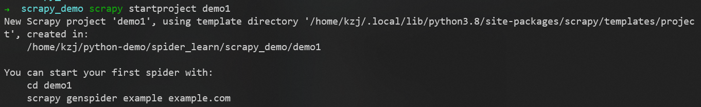
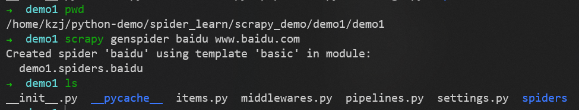
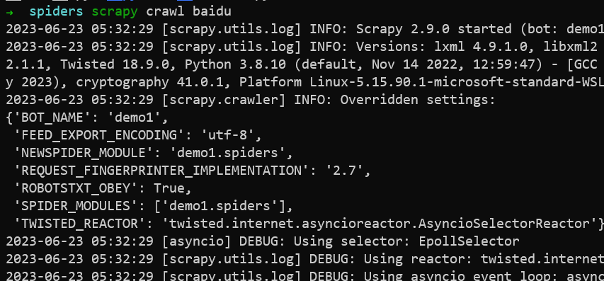
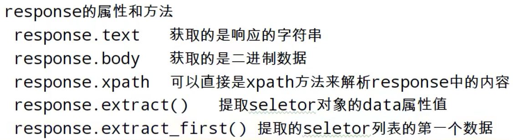
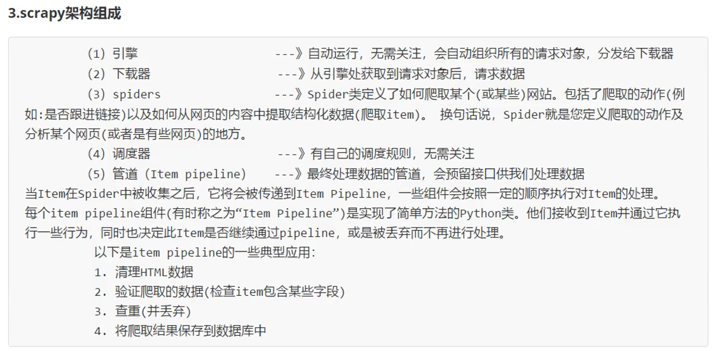
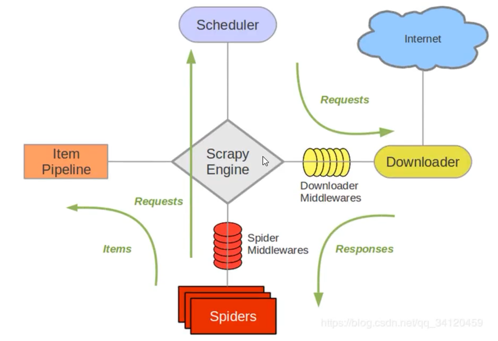
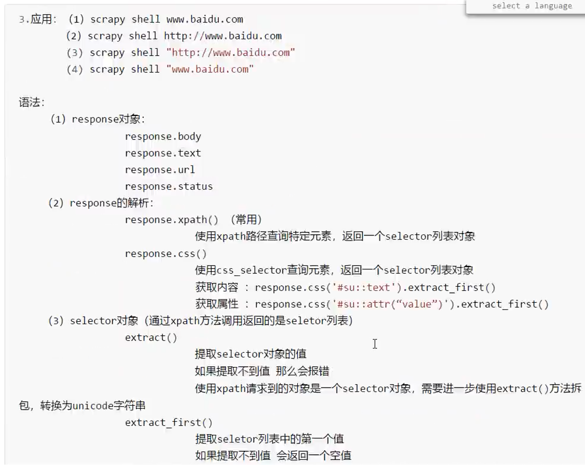
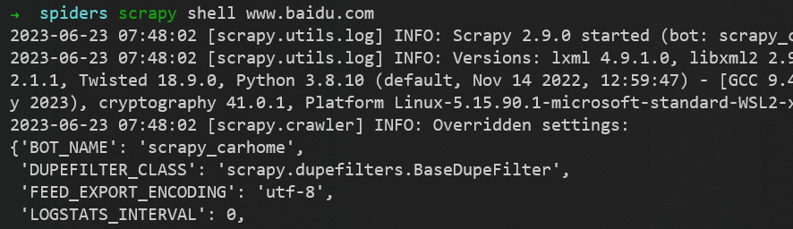

# scrapy 库


## 安装

```shell
pip install scrapy 
```

还需要配置环境变量


每次重启之后，需要再次执行
```shell
 source .profile
```

## 简单使用

### 初始化项目


```shell
scrapy startproject 项目名称
```


### 创建爬虫文件


在/home/kzj/python-demo/spider_learn/scrapy_demo/demo1/demo1/目录中执行
```shell
scrapy genspider 爬虫的名称 要爬的网址
```

/home/kzj/python-demo/spider_learn/scrapy_demo/demo1/demo1/spiders/baidu.py文件的内容为
```py
import scrapy

class BaiduSpider(scrapy.Spider):
    # 爬虫的名字，通过这个名字调用爬虫
    name = "baidu"
    # 允许访问的域名
    allowed_domains = ["www.baidu.com"]
    # 起始url地址，指的是第一次要访问的域名
    # start_urls 在 allowed_domains 的基础上生成
    start_urls = ["https://www.baidu.com"]

    # 相当于 response = urllib.request.urlopen()
    # 相当于 response = requests.get()
    def parse(self, response):
        print('baidu爬虫成功启动')
```



### 运行爬虫代码

在baidu.py所在的目录中执行
```shell
scrapy crawl 爬虫的名称
```


可以看出没有爬取成功，因为scrapy默认遵守robots协议

[百度的robots协议](https://www.baidu.com/robots.txt)

在/home/kzj/python-demo/spider_learn/scrapy_demo/demo1/demo1/settings.py文件中注释掉这行即可
```py
# ROBOTSTXT_OBEY = True
```

这样修改之后就不遵守了

可见运行成功

## 入门案例

### 58同城

[58同城官网](https://cn.58.com/)
在58同城的搜索栏中搜索 前端开发，请求的url为
```url
https://cn.58.com/sou/?key=%E5%89%8D%E7%AB%AF%E5%BC%80%E5%8F%91&classpolicy=classify_E%2Cuuid_tRa4i6KKN632Q5Ch6HteYrW3k5hbFQzJ&search_uuid=tRa4i6KKN632Q5Ch6HteYrW3k5hbFQzJ&search_type=input
```

使用如下命令创建爬虫
```shell
scrapy startproject scrapy_58tc
cd scrapy_58tc/scrapy_58tc
scrapy genspider 58tc https://cn.58.com/sou/\?key\=%E5%89%8D%E7%AB%AF%E5%BC%80%E5%8F%91\&classpolicy\=classify_E%2Cuuid_tRa4i6KKN632Q5Ch6HteYrW3k5hbFQzJ\&search_uuid\=tRa4i6KKN632Q5Ch6HteYrW3k5hbFQzJ\&search_type\=input
```

选择不遵守robots协议
```py
# ROBOTSTXT_OBEY = True
```

使用如下命令运行爬虫
```shell
scrapy crawl 58tc
```

#### scrapy 项目的结构


#### response 的属性和方法



/home/kzj/python-demo/spider_learn/scrapy_demo/scrapy_58tc/scrapy_58tc/spiders/a58tc.py文件的内容为
```py
import scrapy

class A58tcSpider(scrapy.Spider):
    name = "58tc"
    allowed_domains = ["cn.58.com"]
    start_urls = ["https://cn.58.com/sou/?key=%E5%89%8D%E7%AB%AF%E5%BC%80%E5%8F%91&classpolicy=classify_E%2Cuuid_tRa4i6KKN632Q5Ch6HteYrW3k5hbFQzJ&search_uuid=tRa4i6KKN632Q5Ch6HteYrW3k5hbFQzJ&search_type=input"]

    def parse(self, response):
        print('58同城爬虫启动成功')
        # 字符串
        content = response.text
        # 二进制数据
        b_content = response.body
        # 直接使用xpath方法，解析response中的内容
        span_list = response.xpath('//div[@id="filter"]//div[@class="tabs"]/a/span')
        print(span_list[0].extract())
```

### 汽车之家

[汽车之家官网](https://www.autohome.com.cn/)
在搜索栏中搜索 宝马热门车，进入宝马热门车页面，url为
```url
https://car.autohome.com.cn/price/brand-15.html
```

使用如下命令创建爬虫
```shell
scrapy startproject scrapy_carhome
cd scrapy_carhome
scrapy genspider carhome https://car.autohome.com.cn/price/brand-15.html
```

选择不遵守robots协议
```py
# ROBOTSTXT_OBEY = True
```

使用如下命令运行爬虫
```shell
scrapy crawl carhome
```

/home/kzj/python-demo/spider_learn/scrapy_demo/scrapy_carhome/scrapy_carhome/spiders/carhome.py文件的内容为
```py
import scrapy

class CarhomeSpider(scrapy.Spider):
    name = "carhome"
    allowed_domains = ["car.autohome.com.cn"]
    start_urls = ["https://car.autohome.com.cn/price/brand-15.html"]

    def parse(self, response):
        print('汽车之家爬虫启动成功')
        name_list = response.xpath('//div[@class="main-title"]/a/text()')
        price_list = response.xpath('//span[@class="lever-price red"]/span[@class="font-arial"]/text()')
        for i in range(len(name_list)):
            name = name_list[i].extract()
            price = price_list[i].extract()
            print(name, price)
```

运行结果为


#### scrapy 架构组成



#### scrapy 工作原理




## scrapy shell 交互终端




在wsl2的终端中输入
```shell
scrapy shell url网址
```
即可进入scrapy shell




## 综合案例

### 当当网


### 电影天堂


---
到P95

