# 知乎禁止复制的文章

[要爬取的知乎文章](https://www.zhihu.com/question/52855766/answer/3101359797)

## 准备与初始化项目

无法复制超过一定数量的文字
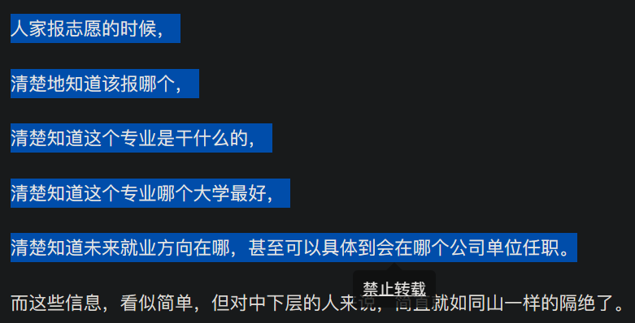

查看网页源代码，文字是一小段一小段放到不同的标签中的
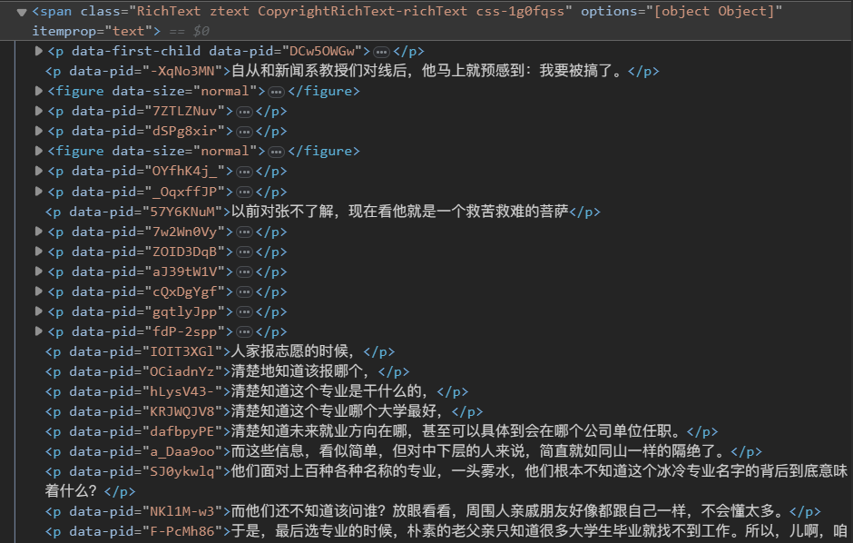

用xpath_helper插件
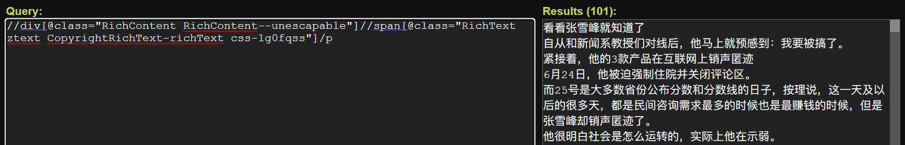

用scrapy爬虫框架创建爬虫

在settings.py文件中加入UA（如果没有，会报403状态码）
```py
# Crawl responsibly by identifying yourself (and your website) on the user-agent
USER_AGENT = "Mozilla/5.0 (Windows NT 10.0; Win64; x64) AppleWebKit/537.36 (KHTML, like Gecko) Chrome/114.0.0.0 Safari/537.36"
```

scrapy_zhihu/scrapy_zhihu/spiders/zhihu.py文件的内容为
```py
import scrapy

class ZhihuSpider(scrapy.Spider):
    name = "zhihu"
    allowed_domains = ["www.zhihu.com"]
    start_urls = ["https://www.zhihu.com/question/52855766/answer/3101359797"]

    def parse(self, response):
        print('知乎爬虫启动成功')
        p_list = response.xpath('//div[@class="RichContent RichContent--unescapable"]//span[@class="RichText ztext CopyrightRichText-richText css-1g0fqss"]/p')
        for p_each in p_list:
            print(p_each.extract())
```

爬下来的包含文章内容的标签为
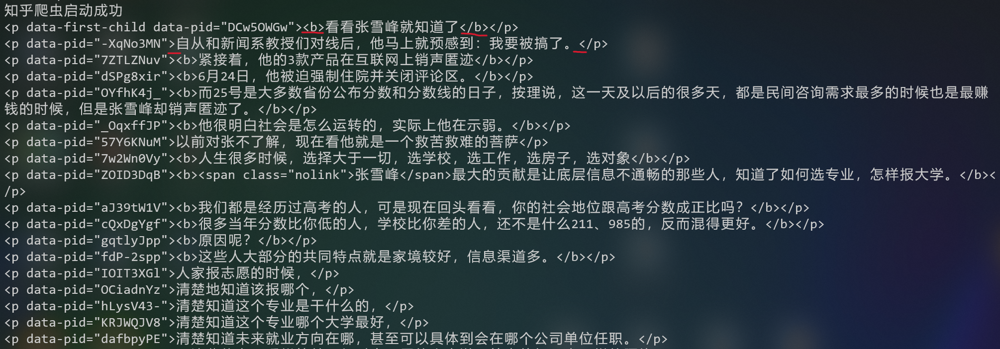

## 精细提取

### xpath节点的或关系用 | 表示

可以看到，上面的代码爬取的内容，有的p标签里面直接就是内容文字，有的p标签里面还嵌套了b标签，再里面才是内容文字

对上面提取到的p标签，再次用xpath()函数提取其中的文字内容，传入参数为
```
./text() | ./b/text()
```

zhihu.py文件的内容修改为
```py
import scrapy

class ZhihuSpider(scrapy.Spider):
    name = "zhihu"
    allowed_domains = ["www.zhihu.com"]
    start_urls = ["https://www.zhihu.com/question/52855766/answer/3101359797"]

    def parse(self, response):
        print('知乎爬虫启动成功')
        p_list = response.xpath('//div[@class="RichContent RichContent--unescapable"]//span[@class="RichText ztext CopyrightRichText-richText css-1g0fqss"]/p')
        for p_each in p_list:
            # 拿到p标签中的文字，或者p标签中的b标签中的文字
            p_content = p_each.xpath('./text() | ./b/text()')
            if(p_content):
                # 有一些空行，忽略掉
                print(p_content.extract_first())
```

提取出的文字内容为
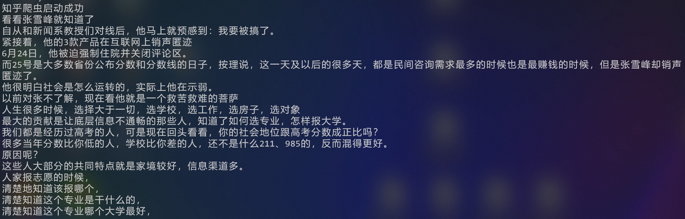

### 注意F12中的审查和右键中的源代码的区别

到目前位置，提取到的文字还不全

有一点问题，就是有一些p标签中的a标签的内容获取成功，有一些p标签中的a标签的内容获取失败

#### 获取成功的：

网页显示：
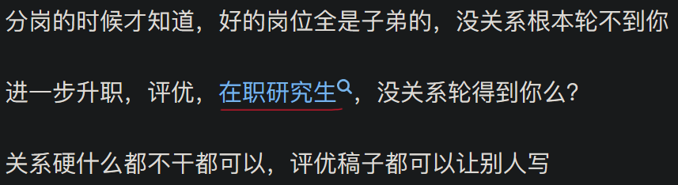
审查元素：
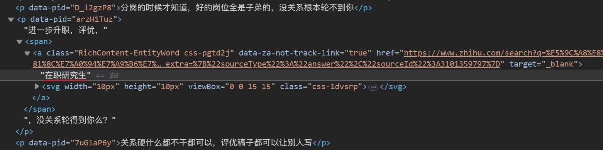
爬取结果：
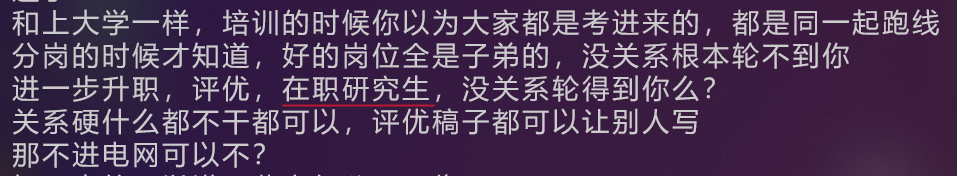

#### 获取失败的：

网页显示：
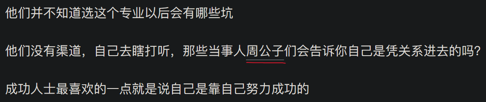
审查元素：
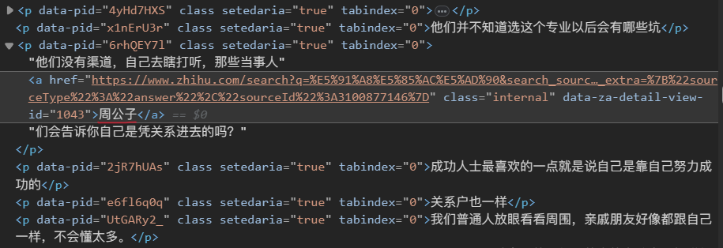
爬取结果：
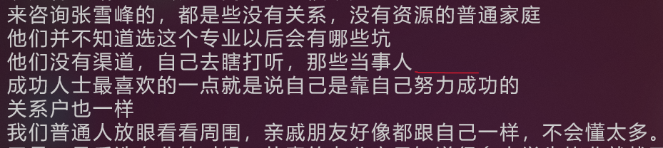

#### 爬虫的分析基于网页源代码，不是审查元素的信息

“查看网页源代码”的代码内容是服务器发送到浏览器的原封不动的源代码，不包括页面动态渲染的内容；“审查元素”包括源代码+js动态渲染的内容，即最终展示的html内容。

[网页中审查元素与查看网页源代码的区别](https://blog.csdn.net/u010865136/article/details/109857046)

上面a标签中的文字 在职研究生 为什么会获取成功，因为网页源代码中的文字 在职研究生 根本不在a标签中

将zhihu.py文件的内容
```py
print(p_content.extract_first())
```
修改为
```py
print(p_content.extract())
```
再次执行爬虫

发现上面获取**成功**的结果为
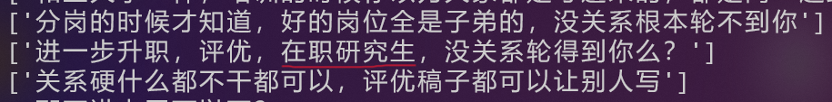
此处的网页源代码（不同于审查元素）为
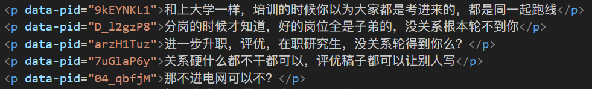
对应位置**没有a标签**

发现上面获取**失败**的结果为
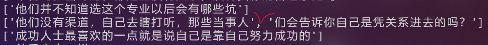
此处的网页源代码（和审查元素相同）为
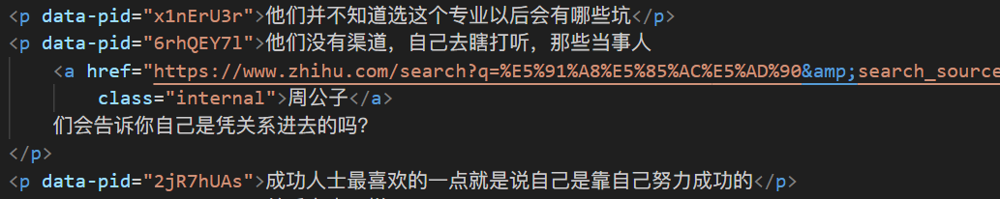
对应位置**有a标签**

### 获取嵌套的子标签内容

上面可以获取p标签里的文字，但是不能获取p标签里的a标签里的文字

[XPath中text方法和string方法的用法总结](https://blog.csdn.net/qq_27283619/article/details/89154163)

#### text() 方法

##### .xpath('./text()')

表示只取当前节点中的文本内容，对于子孙节点的内容不会取
对 周公子 的提取效果为（提取不到）


##### .xpath('.//text()')

表示取当前节点及其子孙节点中的文本内容
对 周公子 的提取效果为（能提取到，但是是分隔开的，还需要手动拼接）
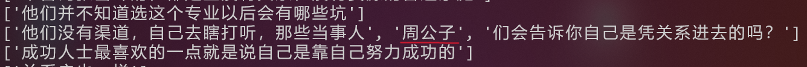

#### string() 方法

把当前节点和所有的子孙节点中的文本全部提取出来，组合成一个字符串
对 周公子 的提取效果为（好用，不用手动拼接）
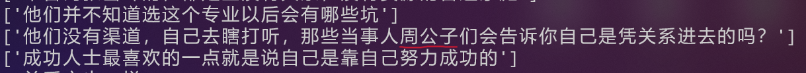

注意：
string()方法使用时，要单独写成.xpath('string(.)')的形式，不能和路径拼在一起

发现string()方法满足当前的要求，至此，zhihu.py文件的内容修改为
```py
import scrapy
from scrapy_zhihu.items import ScrapyZhihuItem

class ZhihuSpider(scrapy.Spider):
    name = "zhihu"
    allowed_domains = ["www.zhihu.com"]
    start_urls = ["https://www.zhihu.com/question/52855766/answer/3101359797"]

    def parse(self, response):
        print('知乎爬虫启动成功')
        p_list = response.xpath('//div[@class="RichContent RichContent--unescapable"]//span[@class="RichText ztext CopyrightRichText-richText css-1g0fqss"]/p')
        for p_each in p_list:
            # 拿到p标签中的文字，或者p标签中的b标签中的文字
            p_content = p_each.xpath('string(.)').extract_first()
            if(p_content):
                # 有一些空行，忽略掉
                print(p_content)
```

## 保存到文件

已经能爬到完整的信息，并打印在终端中，现在要把爬到的信息保存到文件中

items.py文件的内容为
```py
import scrapy

class ScrapyZhihuItem(scrapy.Item):
    p_content = scrapy.Field()
```

zhihu.py文件的内容修改为
```py
import scrapy
from scrapy_zhihu.items import ScrapyZhihuItem

class ZhihuSpider(scrapy.Spider):
    name = "zhihu"
    allowed_domains = ["www.zhihu.com"]
    start_urls = ["https://www.zhihu.com/question/52855766/answer/3101359797"]

    def parse(self, response):
        print('知乎爬虫启动成功')
        p_list = response.xpath('//div[@class="RichContent RichContent--unescapable"]//span[@class="RichText ztext CopyrightRichText-richText css-1g0fqss"]/p')
        for p_each in p_list:
            # 拿到p标签中的文字，或者p标签中的b标签中的文字
            p_content = p_each.xpath('string(.)').extract_first()
            if(p_content):
                # 有一些空行，忽略掉
                print(p_content)
                # 将每行内容保存到文件
                oneline_item = ScrapyZhihuItem(p_content=p_content)
                yield oneline_item
```

在settings.py文件中取消注释
```py
ITEM_PIPELINES = {
   "scrapy_zhihu.pipelines.ScrapyZhihuPipeline": 300,
}
```

piplines.py文件的内容为
```py
from itemadapter import ItemAdapter

class ScrapyZhihuPipeline:
    def open_spider(self, spider):
        self.fp = open('zhihu.txt', 'w', encoding='utf-8')
    
    def process_item(self, item, spider):
        # 取出这个对象中的p_content数据，就是一行文字的内容
        oneline = item.get('p_content')
        # 只保存文字内容，不保存json格式数据
        self.fp.writelines(oneline + '\n')
        return item

    def close_spider(self, spider):
        self.fp.close()
```

使用命令
```shell
scrapy crawl zhihu
```
运行爬虫

## 爬取结果

看看张雪峰就知道了
自从和新闻系教授们对线后，他马上就预感到：我要被搞了。
紧接着，他的3款产品在互联网上销声匿迹
6月24日，他被迫强制住院并关闭评论区。
而25号是大多数省份公布分数和分数线的日子，按理说，这一天及以后的很多天，都是民间咨询需求最多的时候也是最赚钱的时候，但是张雪峰却销声匿迹了。
他很明白社会是怎么运转的，实际上他在示弱。
以前对张不了解，现在看他就是一个救苦救难的菩萨
人生很多时候，选择大于一切，选学校，选工作，选房子，选对象
张雪峰最大的贡献是让底层信息不通畅的那些人，知道了如何选专业，怎样报大学。
我们都是经历过高考的人，可是现在回头看看，你的社会地位跟高考分数成正比吗？
很多当年分数比你低的人，学校比你差的人，还不是什么211、985的，反而混得更好。
原因呢？
这些人大部分的共同特点就是家境较好，信息渠道多。
人家报志愿的时候，
清楚地知道该报哪个，
清楚知道这个专业是干什么的，
清楚知道这个专业哪个大学最好，
清楚知道未来就业方向在哪，甚至可以具体到会在哪个公司单位任职。
而这些信息，看似简单，但对中下层的人来说，简直就如同山一样的隔绝了。
他们面对上百种各种名称的专业，一头雾水，他们根本不知道这个冰冷专业名字的背后到底意味着什么？
而他们还不知道该问谁？放眼看看，周围人亲戚朋友好像都跟自己一样，不会懂太多。
于是，最后选专业的时候，朴素的老父亲只知道很多大学生毕业就找不到工作。所以，儿啊，咱还是实际点，选个能学到东西，毕业好找工作的，于是土木工程，建筑工程。。。
我很清晰的记得张雪峰有一期视频劝没有关系的不要学电气
那咱就聊聊这个专业
读过电气的朋友应该都知道有个很魔幻的事情
大一大二感觉大家都很普普通通，没什么差别
大三大四开始准备电网考试的时候，各方牛鬼蛇神都来了
这个家里是哪哪国网的
那个家里是南网哪个局哪个局的
整个专业至少有三分之一是电网子弟
其他的三分之二毕业了怎么就业？
当然也是可以考国网的，只是地区偏远些，近一点的地级市，远一点的新疆西藏
但是进去国网以后就完了？
进了国网还是一样的套路，首先培训，然后分岗
和上大学一样，培训的时候你以为大家都是考进来的，都是同一起跑线
分岗的时候才知道，好的岗位全是子弟的，没关系根本轮不到你
进一步升职，评优，在职研究生，没关系轮得到你么？
关系硬什么都不干都可以，评优稿子都可以让别人写
那不进电网可以不？
好一点的可以进一些电气公司，像施耐德，本科生基本是电气类销售岗
或者做一些自动化专业的工作
再者进设计院，了解设计院的都知道，996在设计院都算不上啥
007的命工资六七千，再能吃苦都坚持不下去
还有就是考研的，以为考了研走社招能进个市局
结果社招来是来了，宣讲会完，招聘名额0
然后同专业四个同学进了这个招聘名额0的市局（导员就业名单上看到）
电气这个专业本科阶段学的很杂，强电弱电plc自动化智能电网单片机c语言都学
什么都学，什么都不精，毕业了更是绝大部分都用不上
当你还为各种课程瞎努力的时候
电网子弟从一进校门就知道，他们这四年只用准备两件事，4级和电网考试，其他的混过就行，享受大学生活。
所以你看，那些电网子弟，会去咨询张雪峰么？
该走什么路怎么去走上高中的时候就知道了
来咨询张雪峰的，都是些没有关系，没有资源的普通家庭
他们并不知道选这个专业以后会有哪些坑
他们没有渠道，自己去瞎打听，那些当事人周公子们会告诉你自己是凭关系进去的吗？
成功人士最喜欢的一点就是说自己是靠自己努力成功的
关系户也一样
我们普通人放眼看看周围，亲戚朋友好像都跟自己一样，不会懂太多。
于是，最后选专业的时候，朴素的老父亲只知道很多大学生毕业就找不到工作。所以，儿啊，咱还是实际点，选个能学到东西，毕业好找工作的，于是土木工程，建筑工程。。。
但因为有了张雪峰，他时不时的会告诉你，某某专业是什么样，某某学校哪个好，毕业会进到哪个单位。
比如没有张雪峰，我们根本不知道某大学的数学专业会有这么好的前景，我更难以想象阶层之间隔阂这么大，你认为的好东西在人家眼里不值一提。
电力系统放到以前是子弟直接进的，关系网早就固化了
现在假把意思搞个统考，让垫脚石们觉得公平一些，心里没那么不平衡罢了
张雪峰做直播，虽然不能把这些内幕详细告诉你，但是他会简单粗暴地给你指明方向
电气这个专业，关系就是坑，你家里没关系，别去踩这个坑
我觉得敢公开做这个事情的人是非常牛逼的
家里但凡有点关系的，肯定去找靠山了，怎么会傻乎乎的去问张雪峰呢？能傻乎乎问到他头上，基本就是个小白
周公子不是说了吗：我怕你会读书？？？
至于张雪峰为什么会被搞？
因为他讲真话影响了太多人的利益，毕竟饭要都让普通孩子吃了，少爷们吃什么呀！？这点就很可怕。
中国社会有两套规则，一种是明的，一种是暗的
明的就是摆在桌面上给傻逼看的，安慰傻逼的；
暗的就是给规则的制定者，还有各种各样的强者量身打造的秘密武器。他们使用时没有刀光剑影，亦能所向披靡。
张雪峰所做的，就是把这不好放在台面上讲的，有些暗黑的东西，直接放到台面上讲了。
电力部门都是家族传承吾辈责的，你一个普通牛马别想着进去。
新闻行业没就业前景，别去掺和他们。
还想学外语外交家，你爷爷是谁？
相当于在张雪峰告诉你：“牛马就是牛马，你得想办法让自己过得舒服点。”
我看过他的一个视频，他告诉你，不要去看CBD，不要去看SOHO，不要去看故宫三环里，因为那不是真正的北京，那是有钱人的北京，那不是你的北京，不是北漂人的北京。
他告诉你，早上6点，去八王坟，去赶第一班公交，去试试1500人抢着上一辆车是什么概念，那是属于北漂的北京，那是属于大部分人的北京；
他告诉你，去天通苑，早上6点半去赶第一班地铁，那是属于普通人的北京；
他告诉你，上学难么？上学不难，难的是你进到职场，有人拿着一大杯白酒，告诉你喝进去我就跟你签约，你明知道喝进去就会吐的不省人事但是你必须得喝，他告诉你这个才是真的难；
他告诉你，所有的世界500强都跟你强调学历不重要，但是他们不会去齐齐哈尔大学招聘；
他告诉你不要信那些所谓的鸡汤，乔布斯，盖茨确实大学都没上完，但是他们上的是常青藤大学，能进去就比大部分的人都强；
他告诉你也不要信马云所谓的学历不重要，马云虽然只是一个大专生但是那是30年前，能上大学的都是猛人。
张雪峰是我见过头一个靠讲真话活着的人。
在这个社会上，大部分人靠说谎话，靠信息差活着。
而张雪峰不需要讲任何谎言，只需要就事论事陈述事实就可以帮助别人顺便把钱赚了。
实话实说，这种生活方式让我很羡慕。
我也看了很多回答，所有贬低他的人大都只能在他的态度上指责他的不是，他的履历上指责他的逊色。
却几乎没有一个人敢指责他说的重要观点不对，并抛出自己的纠正来对比检验。
在知乎这个公共平台上对张雪峰的评价是如此这般，那么很显然了，他就是照进黑暗里的光。
他阻挡不了那些真正有条件可以按自己喜好来选专业的学子的脚步，他只是给那些迷茫的将来需要为生计奔波的孩子提供一些有效的建议
如果有一天，张雪峰在互联网上消失了，那才是万千平民子弟的悲哀。
他有没有错，我们这些普通人不清楚吗？
我们没有守住罗翔，希望这一次，我们能守住张雪峰。
这篇文章的内容，我删了40%，不然太敏感了过不了审，想看完整版的可以加我私人号：langshubiji
这篇答案太过露骨我也不知道能不能存活，如果有缘看到的就点个赞吧，也欢迎大家收看我这些年总结下来的一些经验，相信一定对你有帮助～
如果这篇答案被和谐，更多不能说内容我会更新到我的公众号：【里昂随笔】分享外面看不到的人情世故、社会经验和社会潜规则。

