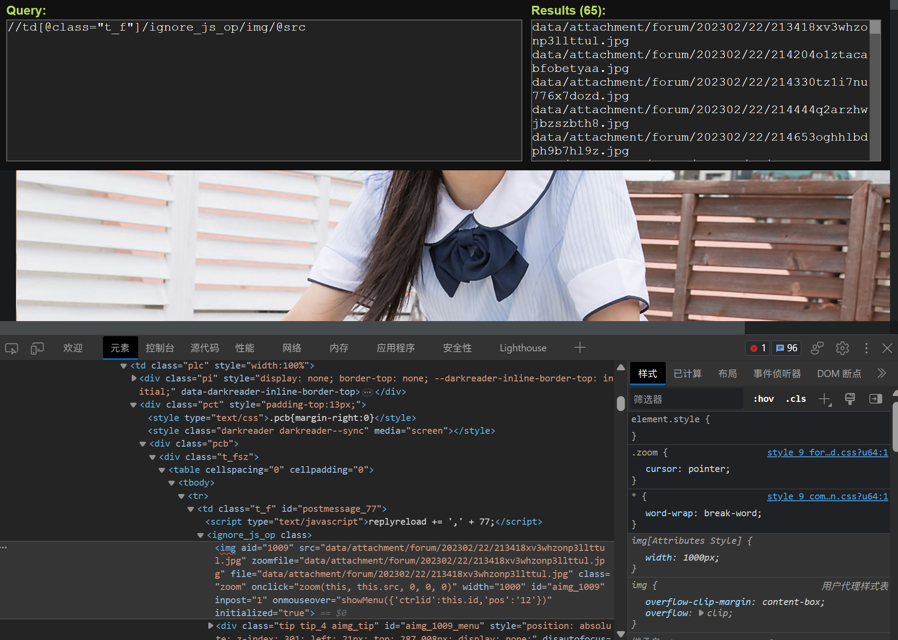
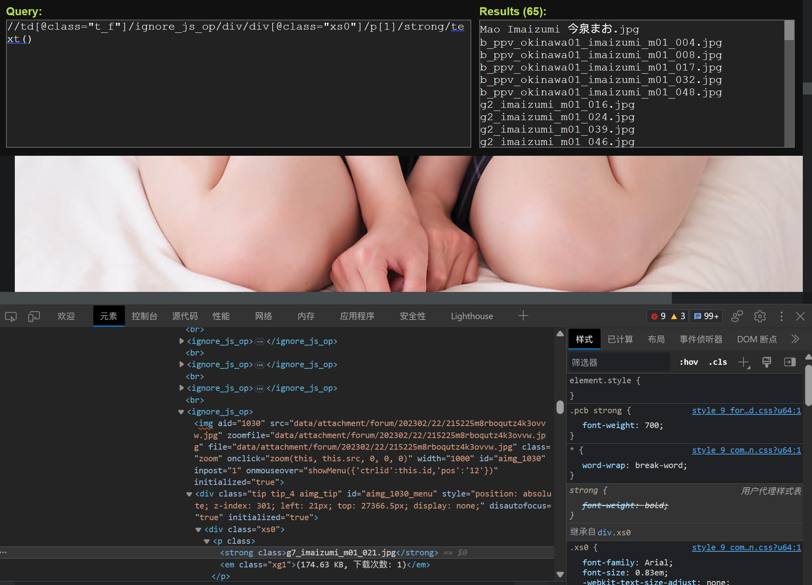
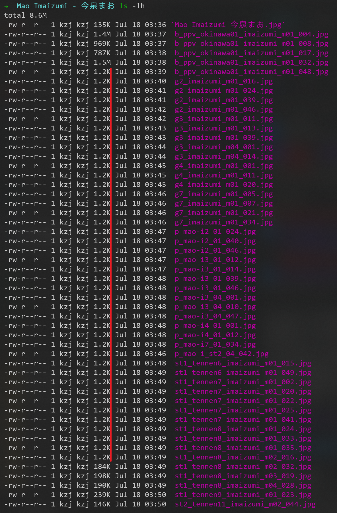
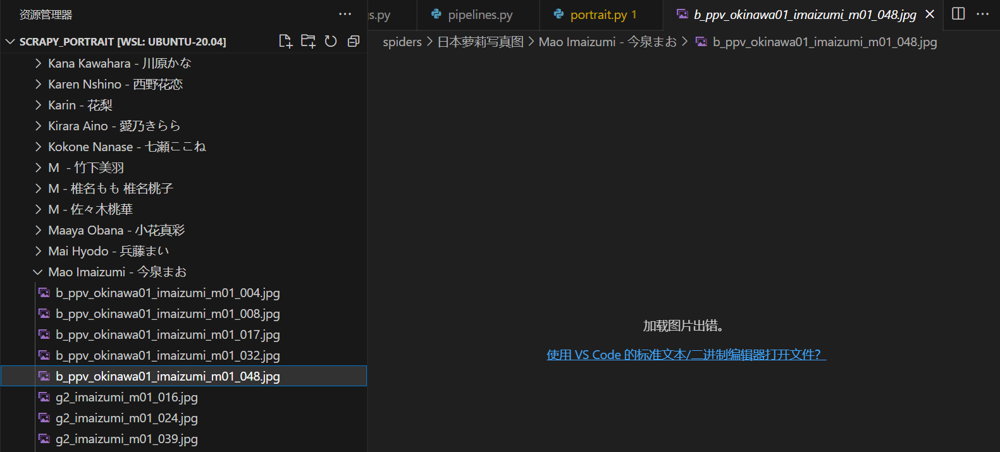
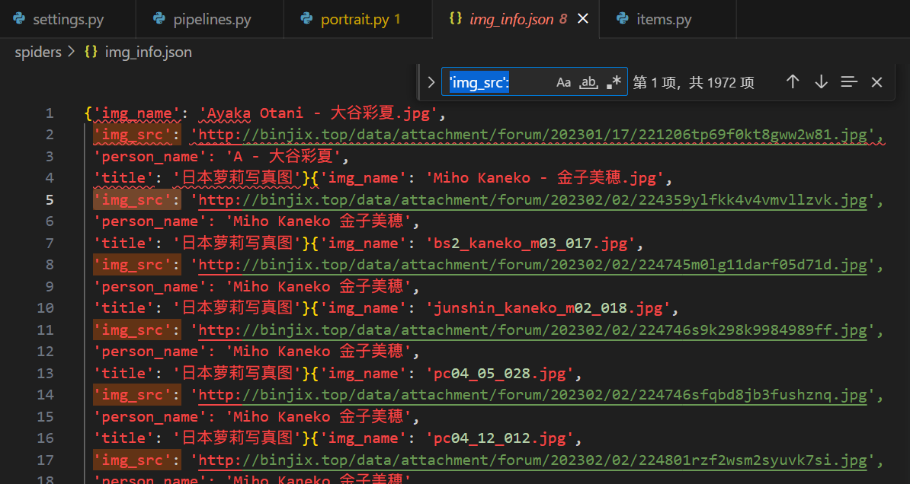

# 写真网站爬取图片

[要爬取的写真图片网站](http://binjix.top/forum.php)

## 准备

爬取以下三个有内容的人物列表
1. [日本萝莉写真图](http://binjix.top/forum.php?mod=forumdisplay&fid=41)
2. [萝莉视频写真](http://binjix.top/forum.php?mod=forumdisplay&fid=2)
3. [偶像视频写真](http://binjix.top/forum.php?mod=forumdisplay&fid=36)

点进单个人物的链接，每个人物有若干张写真图片

为爬取下来图片的存储设计的目录结构示意为
```txt
├─日本萝莉写真图
│  ├─Ayane Yamasaka - 山坂あやね
│  ├─Horikawa Suzu - 堀川すず
│  ├─Saki Tojo - 塔上さき
│  └─Mao Imaizumi - 今泉まお
│      ├─Mao Imaizumi 今泉まお.jpg
│      ├─b_ppv_okinawa01_imaizumi_m01_004.jpg
│      └─b_ppv_okinawa01_imaizumi_m01_008.jpg
├─萝莉视频写真
└─偶像视频写真
```
其中：
1. 一级文件夹名为 **人物列表的标题**

2. 二级文件夹名为 **提取出的英文名 - 提取出的日文名**

3. 三级图片文件名为 **图片链接里的文件名**


下面用xpath_helper插件调试和获取想要的内容

### 一级文件夹名的获取

[日本萝莉写真图页面](http://binjix.top/forum.php?mod=forumdisplay&fid=41)

```py
//div[@class="boardnav"]//h1/a/text()
```


### 单个人物详情页面的链接的获取

[日本萝莉写真图页面](http://binjix.top/forum.php?mod=forumdisplay&fid=41)

```py
//ul[@id="waterfall"]/li/div[@class="c cl"]/a/@href
```


注意：拿到的 href 还要加上前缀
```url
http://binjix.top/
```

### 二级文件夹名的获取

[今泉まお详情页面](http://binjix.top/forum.php?mod=viewthread&tid=77&extra=page%3D1)

```py
//div[@class="t_fsz"]//font/font[contains(string(),"英文名") or contains(string(),"日文名")]/text()
```

[XPath匹配含有指定文本的标签教程](https://blog.csdn.net/butterfly5211314/article/details/82755600)


二级文件夹名只需要提取出英文名和日文名，再拼接

有的人物提取不出英文名或日文名，就暂时用人物详情页的标题代替

```py
//div[@id="postlist"]//span[@id="thread_subject"]/text()
```


### 三级图片文件名和下载链接的获取

[今泉まお详情页面](http://binjix.top/forum.php?mod=viewthread&tid=77&extra=page%3D1)

下载链接的获取方法

```py
//td[@class="t_f"]/ignore_js_op/img/@src
```


注意：拿到的 src 还要加上前缀
```url
http://binjix.top/
```

但是这在实际使用中出现了问题，因为网页中的图片使用了懒加载，加载前的src属性值放在zoomfile属性里


所以，把 @src 修改为 @zoomfile 即可

```py
//td[@class="t_f"]/ignore_js_op/img/@zoomfile
```

图片文件名的获取方法

```py
//td[@class="t_f"]/ignore_js_op/div/div[@class="xs0"]/p[1]/strong/text()
```



## 初始化项目

用scrapy爬虫框架创建爬虫

在settings.py文件中加入UA，并选择不遵守robots协议
```py
# Crawl responsibly by identifying yourself (and your website) on the user-agent
USER_AGENT = "Mozilla/5.0 (Windows NT 10.0; Win64; x64) AppleWebKit/537.36 (KHTML, like Gecko) Chrome/114.0.0.0 Safari/537.36"
# Obey robots.txt rules
# ROBOTSTXT_OBEY = True
```

scrapy_portrait/scrapy_portrait/spiders/portrait.py文件的内容为
```py
import scrapy

class PortraitSpider(scrapy.Spider):
    name = "portrait"
    allowed_domains = ["binjix.top"]
    start_urls = ["http://binjix.top/forum.php?mod=forumdisplay&fid=41",
                  "http://binjix.top/forum.php?mod=forumdisplay&fid=2",
                  "http://binjix.top/forum.php?mod=forumdisplay&fid=36"]
    # 用 href 和 src 访问时需要添加的前缀
    url_prefix = "http://binjix.top/"

    def parse(self, response):
        print('写真爬虫启动成功')
        # 获取一级文件夹名
        page_title = response.xpath('//div[@class="boardnav"]//h1/a/text()').extract_first()
        print(page_title)
        # 获取单个人物详情页面的链接列表
        href_list = response.xpath('//ul[@id="waterfall"]/li/div[@class="c cl"]/a/@href').extract()
        for each_href in href_list:
            href_str = self.url_prefix + each_href
            print(href_str)
```

运行结果如下图

现在已经能够正确爬取父级页面，并且可以获得子级页面的链接

## 爬取子级页面

在portrait.py文件的PortraitSpider类中新增加一个方法parse_child()，用于爬取子级页面，portrait.py文件的内容修改为
```py
import scrapy

class PortraitSpider(scrapy.Spider):
    name = "portrait"
    allowed_domains = ["binjix.top"]
    start_urls = ["http://binjix.top/forum.php?mod=forumdisplay&fid=41",
                  "http://binjix.top/forum.php?mod=forumdisplay&fid=2",
                  "http://binjix.top/forum.php?mod=forumdisplay&fid=36"]
    # 用 href 和 src 访问时需要添加的前缀
    prefix_url = "http://binjix.top/"

    # 爬取父级页面
    def parse(self, response):
        print('写真爬虫启动成功')
        # 获取一级文件夹名
        page_title = response.xpath('//div[@class="boardnav"]//h1/a/text()').extract_first()
        print(page_title)
        # 获取单个人物详情页面的链接列表
        href_list = response.xpath('//ul[@id="waterfall"]/li/div[@class="c cl"]/a/@href').extract()
        for each_href in href_list:
            # 获取单个人物的链接
            href_str = self.prefix_url + each_href
            # 对子级页面进行访问
            yield scrapy.Request(url=href_str, callback=self.parse_child)
            
    # 爬取子级页面
    def parse_child(self, response):
        # 获取人物介绍文字列表
        info_list = response.xpath('//div[@class="t_fsz"]//font/font[contains(string(),"英文名") or contains(string(),"日文名")]/text()').extract()
        # 初始化英文名和日文名
        english_name = ''
        japanese_name = ''
        full_name = ''
        for each_info in info_list:
            # 找到介绍中的英文名和日文名
            if(english_name == '' and each_info.find('英文名：') != -1):
                # 切片，并获取：号后面的部分，并去掉前后空格
                english_name = each_info.split('：', 1)[1].strip()
            if(japanese_name == '' and each_info.find('日文名：') != -1):
                japanese_name = each_info.split('：', 1)[1].strip()
            # 如果英文名和日文名都找到就退出循环
            if(english_name != '' and japanese_name != ''):
                break
        # 如果解析出了英文名和日文名，就用 英文名 - 日文名
        if(english_name != '' and japanese_name != ''): 
            full_name = english_name + ' - ' + japanese_name
        # 如果解析不出，就用人物详情页的标题代替
        else:
            full_name = response.xpath('//div[@id="postlist"]//span[@id="thread_subject"]/text()').extract_first()
        print(full_name)  
```

运行结果如下图

现在可以获得所有二级文件夹的命名

继续爬取子级页面中的写真图片的名字和下载链接，为接下来的下载图片做准备，portrait.py文件的内容修改为
```py
import scrapy

class PortraitSpider(scrapy.Spider):
    name = "portrait"
    allowed_domains = ["binjix.top"]
    start_urls = ["http://binjix.top/forum.php?mod=forumdisplay&fid=41",
                  "http://binjix.top/forum.php?mod=forumdisplay&fid=2",
                  "http://binjix.top/forum.php?mod=forumdisplay&fid=36"]
    # 用 href 和 src 访问时需要添加的前缀
    prefix_url = "http://binjix.top/"

    # 爬取父级页面
    def parse(self, response):
        print('写真爬虫启动成功')
        # 获取一级文件夹名
        page_title = response.xpath('//div[@class="boardnav"]//h1/a/text()').extract_first()
        print(page_title)
        # 获取单个人物详情页面的链接列表
        href_list = response.xpath('//ul[@id="waterfall"]/li/div[@class="c cl"]/a/@href').extract()
        for each_href in href_list:
            # 获取单个人物的链接
            href_str = self.prefix_url + each_href
            # 对子级页面进行访问
            yield scrapy.Request(url=href_str, callback=self.parse_child)
            
    # 爬取子级页面
    def parse_child(self, response):
        # 获取人物介绍文字列表
        info_list = response.xpath('//div[@class="t_fsz"]//font/font[contains(string(),"英文名") or contains(string(),"日文名")]/text()').extract()
        # 初始化英文名和日文名
        english_name = ''
        japanese_name = ''
        full_name = ''
        for each_info in info_list:
            # 找到介绍中的英文名和日文名
            if(english_name == '' and each_info.find('英文名：') != -1):
                # 切片，并获取：号后面的部分，并去掉前后空格
                english_name = each_info.split('：', 1)[1].strip()
            if(japanese_name == '' and each_info.find('日文名：') != -1):
                japanese_name = each_info.split('：', 1)[1].strip()
            # 如果英文名和日文名都找到就退出循环
            if(english_name != '' and japanese_name != ''):
                break
        # 如果解析出了英文名和日文名，就用 英文名 - 日文名
        if(english_name != '' and japanese_name != ''): 
            full_name = english_name + ' - ' + japanese_name
        # 如果解析不出，就用人物详情页的标题代替
        else:
            full_name = response.xpath('//div[@id="postlist"]//span[@id="thread_subject"]/text()').extract_first()
        print(full_name)
        
        # 获取写真图片的名字和下载链接，因为图片名和下载链接有一一对应的关系，所以不能分别解析
        block_list = response.xpath('//td[@class="t_f"]/ignore_js_op')
        for each_block in block_list:
            # 链式调用xpath()
            # 获取单个图片的src
            each_src = each_block.xpath('./img/@zoomfile').extract_first()
            src_str = self.prefix_url + each_src
            # 获取单个图片的名称
            each_name = each_block.xpath('./div/div[@class="xs0"]/p[1]/strong/text()').extract_first()
            print(each_name, src_str)
```

运行结果如下图

现在可以获得所有人物的各自的所有图片的名称和下载链接

## 下载图片到本地

保存一张图片需要：
1. 一级文件夹名
2. 二级文件夹名
3. 三级图片文件名
4. 三级图片下载链接

scrapy_portrait/scrapy_portrait/items.py文件的内容为
```py
import scrapy

class ScrapyPortraitItem(scrapy.Item):
    # 一级人物列表标题
    title = scrapy.Field()
    # 人物名字
    person_name = scrapy.Field()
    # 图片名字
    img_name = scrapy.Field()
    # 图片下载链接
    img_src = scrapy.Field()
```

在portrait.py文件的scrapy.Request()函数中使用meta参数，从parse()方法向parse_child()方法传递数据，portrait.py文件的内容修改为
```py
import scrapy
from scrapy_portrait.items import ScrapyPortraitItem

class PortraitSpider(scrapy.Spider):
    name = "portrait"
    allowed_domains = ["binjix.top"]
    start_urls = ["http://binjix.top/forum.php?mod=forumdisplay&fid=41",
                  "http://binjix.top/forum.php?mod=forumdisplay&fid=2",
                  "http://binjix.top/forum.php?mod=forumdisplay&fid=36"]
    # 用 href 和 src 访问时需要添加的前缀
    prefix_url = "http://binjix.top/"

    # 爬取父级页面
    def parse(self, response):
        print('写真爬虫启动成功')
        # 获取一级文件夹名
        page_title = response.xpath('//div[@class="boardnav"]//h1/a/text()').extract_first()
        print(page_title)
        # 获取单个人物详情页面的链接列表
        href_list = response.xpath('//ul[@id="waterfall"]/li/div[@class="c cl"]/a/@href').extract()
        for each_href in href_list:
            # 获取单个人物的链接
            href_str = self.prefix_url + each_href
            # 对子级页面进行访问
            yield scrapy.Request(url=href_str, callback=self.parse_child, meta={'page_title':page_title})
            
    # 爬取子级页面
    def parse_child(self, response):
        # 获取人物列表的标题名
        page_title = response.meta['page_title']
        # 获取人物介绍文字列表
        info_list = response.xpath('//div[@class="t_fsz"]//font/font[contains(string(),"英文名") or contains(string(),"日文名")]/text()').extract()
        # 初始化英文名和日文名
        english_name = ''
        japanese_name = ''
        full_name = ''
        for each_info in info_list:
            # 找到介绍中的英文名和日文名
            if(english_name == '' and each_info.find('英文名：') != -1):
                # 切片，并获取：号后面的部分，并去掉前后空格
                english_name = each_info.split('：', 1)[1].strip()
            if(japanese_name == '' and each_info.find('日文名：') != -1):
                japanese_name = each_info.split('：', 1)[1].strip()
            # 如果英文名和日文名都找到就退出循环
            if(english_name != '' and japanese_name != ''):
                break
        # 如果解析出了英文名和日文名，就用 英文名 - 日文名
        if(english_name != '' and japanese_name != ''): 
            full_name = english_name + ' - ' + japanese_name
        # 如果解析不出，就用人物详情页的标题代替
        else:
            full_name = response.xpath('//div[@id="postlist"]//span[@id="thread_subject"]/text()').extract_first()
        print(full_name)
        
        # 获取写真图片的名字和下载链接，因为图片名和下载链接有一一对应的关系，所以不能分别解析
        block_list = response.xpath('//td[@class="t_f"]/ignore_js_op')
        for each_block in block_list:
            # 链式调用xpath()
            # 获取单个图片的src
            each_src = each_block.xpath('./img/@zoomfile').extract_first()
            src_str = self.prefix_url + each_src
            # 获取单个图片的名称
            each_name = each_block.xpath('./div/div[@class="xs0"]/p[1]/strong/text()').extract_first()
            # 组装成对象，用于下载
            img_info = ScrapyPortraitItem(title=page_title, person_name=full_name, img_name=each_name, img_src=src_str)
            # 把img_info返回给管道pipelines
            yield img_info
```

接下来完成下载功能的代码

在settings中开启管道，settings.py文件中对应位置修改如下
```py
ITEM_PIPELINES = {
   "scrapy_portrait.pipelines.ScrapyPortraitPipeline": 300,
   "scrapy_portrait.pipelines.ScrapyPortraitPipelineImg": 301,
}
```

pipelines.py文件的内容为
```py
from itemadapter import ItemAdapter
import urllib.request
import os

# 图片信息转换成文本保存到文件
class ScrapyPortraitPipeline:
    def open_spider(self, spider):
        self.fp = open('img_info.json', 'w', encoding='utf-8')
    
    def process_item(self, item, spider):
        self.fp.write(str(item))
        return item

    def close_spider(self, spider):
        self.fp.close()

# 下载图片
class ScrapyPortraitPipelineImg:
    def process_item(self, item, spider):
        # 一级文件夹名
        level1_name = item.get('title')
        # 二级文件夹名 
        level2_name = item.get('person_name')
        # 图片名字
        img_name = item.get('img_name')
        # 图片下载链接
        img_src = item.get('img_src')
        # 相对于当前路径的图片的路径名加文件名
        img_full_name = './' + level1_name + '/' + level2_name + '/' + img_name
        # 创建图片要保存到的目录
        # 如果exist_ok是False（默认），当目标目录（即要创建的目录）已经存在，会抛出一个OSError
        os.makedirs(os.path.dirname(img_full_name), exist_ok=True)
        # 下载图片
        urllib.request.urlretrieve(url=img_src, filename=img_full_name)
        return item
```

注意os.makedirs()的使用方法

[python 在路径下创建文件，没有路径则自动创建](https://www.cnblogs.com/curryxu/p/14473459.html)
[os.mkdir()与os.makedirs()的使用方法](https://zhuanlan.zhihu.com/p/108211297)
[os.path.dirname()用法](https://blog.csdn.net/weixin_38470851/article/details/80367143)

使用以下命令运行爬虫
```shell
scrapy crawl portrait
```

运行过程中的终端输出为


生成的文件为


其中img_info.json文件的内容为


其中下载的图片为


然而发现问题

## 解决图片反爬

因为爬取速度过快，部分图片在下载时触发了反爬，触发了cc攻击的防御机制

[CC攻击与DDOS攻击区别](https://www.jianshu.com/p/cdd508d79a28)


上图中，大小只有1.2K的图片文件都是下载失败的



具体显示的内容为
```html
<html><head><meta http-equiv="X-UA-Compatible" content="IE=edge,chrome=1" /><meta name="renderer" content="webkit" />
<title>AntiCC-WAF</title>
</head><body><div style="display:table;height:100%;width:100%;">
<div style="display:table-cell;text-align:center;vertical-align:middle;font-size:30px;font-family:'Microsoft YaHei';font-weight:900;">Anti_CC 安全检查，预计需要3秒</br>
Browser verification, about 3 seconds</div>
<div style="display:none;" id="checkcode" >/data/attachment/forum/202302/22/214808hr6vcb2v7cnwoflt.jpg?__CDN02=0f6e554999daf067b33e55e0bbff97b0c1689668456_1099</div>
</body>
<script>
var safecode = document.getElementById('checkcode').innerHTML;
function safecheck() {
	setCookie("vpsor_antiCC_token",safecode,30);
}
function go() {
	document.location.href = document.location.href
}
setTimeout("safecheck()", 200);
setTimeout("go()", 2000);
function setCookie(c_name,value,expiredays)
{
var exdate=new Date()
exdate.setDate(exdate.getDate()+expiredays)
document.cookie=c_name+ "=" +escape(value)+
((expiredays==null) ? "" : ";expires="+exdate.toGMTString())
}
</script>
</html>
```
可见，只要触发了图片反爬，三秒钟时间段内的图片下载都是失败

[Scrapy应对反爬虫策略](https://blog.csdn.net/TINANP/article/details/106338733)

### 设置下载延迟

在settings.py中找到 #DOWNLOAD_DELAY = 3 去掉注释
DOWNLOAD_DELAY = 3 表示下载延时设置为3秒，DOWNLOAD_DELAY 支持设置小数。Scrapy在设置了DOWNLOAD_DELAY 的情况下，默认启用 RANDOMIZE_DOWNLOAD_DELAY (随机等待)。这样当从相同的网站获取数据时，Scrapy将会等待一个随机的值（0.5-1.5间的一个书记值乘以DOWNLOAD_DELAY）。该随机值降低了爬虫被检测的概率。

设置 DOWNLOAD_DELAY 的问题，它是一个固定的下载延时，一般不知道设置几秒合适，这时我们可以设置自动限速。设置方法：在settings.py中找到 #AUTOTHROTTLE_ENABLED = True 将注释去掉。

settings.py文件中对应位置修改如下
```py
DOWNLOAD_DELAY = 3
```

清除之前爬虫保存的文件，再次运行爬虫

一共爬取1972张图片


[Linux、Mac统计文件夹下的文件数目](https://www.cnblogs.com/chloneda/p/linux-count-file.html)

但是显示本地只有1961个图片文件（已确定下载的所有图片都是jpg格式的）


## 验证下载的图片数量的完整性

[Python判断文件是否存在的三种方法(os.path.exsist, os.path.isfile, try-catch)](https://blog.csdn.net/NeverLate_gogogo/article/details/109333970)
[python对json对象或json数组操作以及读写各类txt,csv,html,xls文件的工具类](https://blog.csdn.net/ITBigGod/article/details/103131516)
[python读取和保存json文件](https://blog.csdn.net/leviopku/article/details/103773219)

前面在保存json字符串到 img_info.json 文件时比较随意，各个json字符串前后紧挨着，不方便识别
这里手动做些如下小改动，方便后面的读取

img_info.json（仅截取一小部分示意）改动前：
```json
{'img_name': 'Ayaka Otani - 大谷彩夏.jpg',
 'img_src': 'http://binjix.top/data/attachment/forum/202301/17/221206tp69f0kt8gww2w81.jpg',
 'person_name': 'A - 大谷彩夏',
 'title': '日本萝莉写真图'}{'img_name': 'Miho Kaneko - 金子美穂.jpg',
 'img_src': 'http://binjix.top/data/attachment/forum/202302/02/224359ylfkk4v4vmvllzvk.jpg',
 'person_name': 'Miho Kaneko 金子美穂',
 'title': '日本萝莉写真图'}{'img_name': 'bs2_kaneko_m03_017.jpg',
 'img_src': 'http://binjix.top/data/attachment/forum/202302/02/224745m0lg11darf05d71d.jpg',
 'person_name': 'Miho Kaneko 金子美穂',
 'title': '日本萝莉写真图'}
```

img_info.json（仅截取一小部分示意）改动后：
```json
{
    "img_list": [
        {"img_name": "Ayaka Otani - 大谷彩夏.jpg",
 "img_src": "http://binjix.top/data/attachment/forum/202301/17/221206tp69f0kt8gww2w81.jpg",
 "person_name": "A - 大谷彩夏",
 "title": "日本萝莉写真图"},
        {"img_name": "Miho Kaneko - 金子美穂.jpg",
 "img_src": "http://binjix.top/data/attachment/forum/202302/02/224359ylfkk4v4vmvllzvk.jpg",
 "person_name": "Miho Kaneko 金子美穂",
 "title": "日本萝莉写真图"},
        {"img_name": "bs2_kaneko_m03_017.jpg",
 "img_src": "http://binjix.top/data/attachment/forum/202302/02/224745m0lg11darf05d71d.jpg",
 "person_name": "Miho Kaneko 金子美穂",
 "title": "日本萝莉写真图"}
            ]
}
```

把各个独立的json字符串，组成一个json字符串数组

另外注意：
使用 json.loads() 函数时，引号必须为双引号，不能是单引号，不然会有如下报错
[json报错：Expecting property name enclosed in double quotes: line 1 column 2 (char 1)](https://blog.csdn.net/qq_41375609/article/details/100118545)

新建scrapy_portrait/scrapy_portrait/spiders/checking.py文件的内容为
```py
import json
import os

# 读取json文件
f = open('img_info.json', 'r')
content = f.read()
# json.loads()将读取内容转化为python字典
content_dict = json.loads(content)
# 得到list
img_list = content_dict.get('img_list')
# 初始化统计值
index = 0
miss_count = 0
hit_count = 0
# 遍历list
for each_img in img_list:
    # each_img是字典
    path_name = each_img.get('title') + '/' + each_img.get('person_name') + '/' + each_img.get('img_name')
    # 判断这个图片是否存在
    res = os.path.exists(path_name)
    if(res):
        hit_count += 1
    else:
        miss_count += 1
        print('index: ' + index + ', miss: ' + each_img)
    index += 1
f.close()
print('hit_count: ' + str(hit_count) + ', miss_count: ' + str(miss_count))
```

运行结果为


发现json文件中的图片信息，在本地全都有实体图片文件对应

那是多条图片信息对应到了一个实体图片文件？

接下来进行验证
思路是维护一个字典，记录每一个实体图片文件被检索的次数

[Python 字典(Dictionary)教程](https://www.runoob.com/python/python-dictionary.html)

checking.py文件的内容修改为
```py
import json
import os

# 读取json文件
f = open('img_info.json', 'r')
content = f.read()
# json.loads()将读取内容转化为python字典
content_dict = json.loads(content)
# 得到list
img_list = content_dict.get('img_list')
# 初始化统计值
index = 0
miss_count = 0
hit_count = 0
# 实体图片文件检索次数字典
hit_dict = {}
# 遍历list
for each_img in img_list:
    # each_img是字典
    path_name = each_img.get('title') + '/' + each_img.get('person_name') + '/' + each_img.get('img_name')
    # 判断这个图片是否存在
    res = os.path.exists(path_name)
    # 图片存在
    if(res):
        hit_count += 1
        # 这个图片文件第一次被检索
        if(path_name not in hit_dict):
            hit_dict[path_name] = 1
        # 这个图片已经被检索过
        else:
            hit_dict[path_name] += 1
            print('hit again: ' + path_name + ', count: ' + str(hit_dict[path_name]))
    # 图片不存在    
    else:
        miss_count += 1
        print('index: ' + index + ', miss: ' + each_img)
    index += 1
f.close()
print('hit_count: ' + str(hit_count) + ', miss_count: ' + str(miss_count))
```

运行结果为


发现确实是这样


不同的下载链接被我指向了完全一致的保存位置

接下来解决这个问题

## 避免保存图片时的同名覆盖问题


### 思路1：在碰撞的文件名后添加字符

[Python 创建新文件时避免覆盖已有的同名文件的解决方法](https://www.yisu.com/zixun/172560.html)

如果要保存的位置已经有同名文件，就在文件名后面加字符 1，再次判断是否有重名，如果还是重名，就继续添加，直到不重名为止


### 思路2：维护一个字典，记录每一个文件名被保存的次数

思路1的升级版，不再需要迭代判断，但是维护字典需要一定开销


### 思路3：截取下载链接的部分字段作为文件名

只要截取的部分恰当，一定不会重名

## 优化json文件的结构化保存

前面在checking.py中，为了方便地读取img_info.json文件中各个json对象，还需要手动调整img_info.json
现在将需要手动调节的逻辑，用代码完成
pipelines.py文件的内容修改为
```py

```