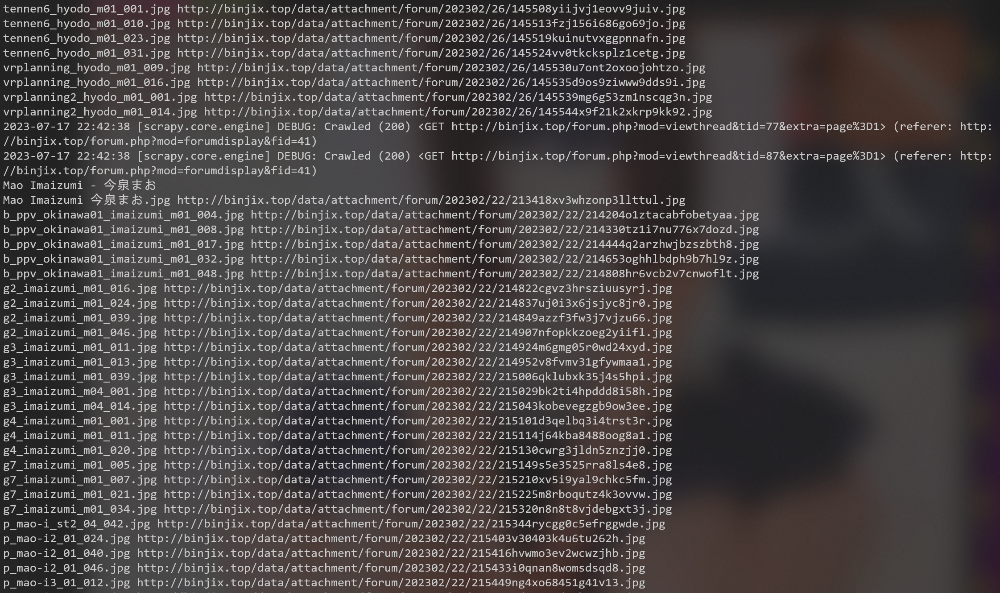
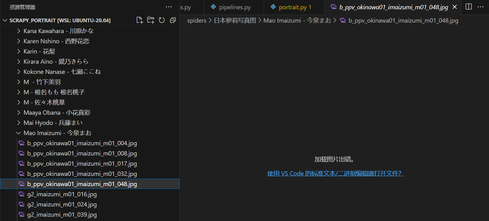

# 写真网站爬取图片

[要爬取的写真图片网站](http://binjix.top/forum.php)

## 准备

爬取以下三个有内容的人物列表
1. [日本萝莉写真图](http://binjix.top/forum.php?mod=forumdisplay&fid=41)
2. [萝莉视频写真](http://binjix.top/forum.php?mod=forumdisplay&fid=2)
3. [偶像视频写真](http://binjix.top/forum.php?mod=forumdisplay&fid=36)

点进单个人物的链接，每个人物有若干张写真图片

为爬取下来图片的存储设计的目录结构示意为
```txt
├─日本萝莉写真图
│  ├─Ayane Yamasaka - 山坂あやね
│  ├─Horikawa Suzu - 堀川すず
│  ├─Saki Tojo - 塔上さき
│  └─Mao Imaizumi - 今泉まお
│      ├─Mao Imaizumi 今泉まお.jpg
│      ├─b_ppv_okinawa01_imaizumi_m01_004.jpg
│      └─b_ppv_okinawa01_imaizumi_m01_008.jpg
├─萝莉视频写真
└─偶像视频写真
```
其中：
1. 一级文件夹名为 **人物列表的标题**

2. 二级文件夹名为 **提取出的英文名 - 提取出的日文名**

3. 三级图片文件名为 **图片链接里的文件名**


下面用xpath_helper插件调试和获取想要的内容

### 一级文件夹名的获取

[日本萝莉写真图页面](http://binjix.top/forum.php?mod=forumdisplay&fid=41)

```py
//div[@class="boardnav"]//h1/a/text()
```


### 单个人物详情页面的链接的获取

[日本萝莉写真图页面](http://binjix.top/forum.php?mod=forumdisplay&fid=41)

```py
//ul[@id="waterfall"]/li/div[@class="c cl"]/a/@href
```


注意：拿到的 href 还要加上前缀
```url
http://binjix.top/
```

### 二级文件夹名的获取

[今泉まお详情页面](http://binjix.top/forum.php?mod=viewthread&tid=77&extra=page%3D1)

```py
//div[@class="t_fsz"]//font/font[contains(string(),"英文名") or contains(string(),"日文名")]/text()
```

[XPath匹配含有指定文本的标签教程](https://blog.csdn.net/butterfly5211314/article/details/82755600)


二级文件夹名只需要提取出英文名和日文名，再拼接

有的人物提取不出英文名或日文名，就暂时用人物详情页的标题代替

```py
//div[@id="postlist"]//span[@id="thread_subject"]/text()
```


### 三级图片文件名和下载链接的获取

[今泉まお详情页面](http://binjix.top/forum.php?mod=viewthread&tid=77&extra=page%3D1)

下载链接的获取方法

```py
//td[@class="t_f"]/ignore_js_op/img/@src
```


注意：拿到的 src 还要加上前缀
```url
http://binjix.top/
```

但是这在实际使用中出现了问题，因为网页中的图片使用了懒加载，加载前的src属性值放在zoomfile属性里


所以，把 @src 修改为 @zoomfile 即可

```py
//td[@class="t_f"]/ignore_js_op/img/@zoomfile
```

图片文件名的获取方法

```py
//td[@class="t_f"]/ignore_js_op/div/div[@class="xs0"]/p[1]/strong/text()
```


## 初始化项目

用scrapy爬虫框架创建爬虫

在settings.py文件中加入UA，并选择不遵守robots协议
```py
# Crawl responsibly by identifying yourself (and your website) on the user-agent
USER_AGENT = "Mozilla/5.0 (Windows NT 10.0; Win64; x64) AppleWebKit/537.36 (KHTML, like Gecko) Chrome/114.0.0.0 Safari/537.36"
# Obey robots.txt rules
# ROBOTSTXT_OBEY = True
```

scrapy_portrait/scrapy_portrait/spiders/portrait.py文件的内容为
```py
import scrapy

class PortraitSpider(scrapy.Spider):
    name = "portrait"
    allowed_domains = ["binjix.top"]
    start_urls = ["http://binjix.top/forum.php?mod=forumdisplay&fid=41",
                  "http://binjix.top/forum.php?mod=forumdisplay&fid=2",
                  "http://binjix.top/forum.php?mod=forumdisplay&fid=36"]
    # 用 href 和 src 访问时需要添加的前缀
    url_prefix = "http://binjix.top/"

    def parse(self, response):
        print('写真爬虫启动成功')
        # 获取一级文件夹名
        page_title = response.xpath('//div[@class="boardnav"]//h1/a/text()').extract_first()
        print(page_title)
        # 获取单个人物详情页面的链接列表
        href_list = response.xpath('//ul[@id="waterfall"]/li/div[@class="c cl"]/a/@href').extract()
        for each_href in href_list:
            href_str = self.url_prefix + each_href
            print(href_str)
```

运行结果如下图

现在已经能够正确爬取父级页面，并且可以获得子级页面的链接

## 爬取子级页面

在portrait.py文件的PortraitSpider类中新增加一个方法parse_child()，用于爬取子级页面，portrait.py文件的内容修改为
```py
import scrapy

class PortraitSpider(scrapy.Spider):
    name = "portrait"
    allowed_domains = ["binjix.top"]
    start_urls = ["http://binjix.top/forum.php?mod=forumdisplay&fid=41",
                  "http://binjix.top/forum.php?mod=forumdisplay&fid=2",
                  "http://binjix.top/forum.php?mod=forumdisplay&fid=36"]
    # 用 href 和 src 访问时需要添加的前缀
    prefix_url = "http://binjix.top/"

    # 爬取父级页面
    def parse(self, response):
        print('写真爬虫启动成功')
        # 获取一级文件夹名
        page_title = response.xpath('//div[@class="boardnav"]//h1/a/text()').extract_first()
        print(page_title)
        # 获取单个人物详情页面的链接列表
        href_list = response.xpath('//ul[@id="waterfall"]/li/div[@class="c cl"]/a/@href').extract()
        for each_href in href_list:
            # 获取单个人物的链接
            href_str = self.prefix_url + each_href
            # 对子级页面进行访问
            yield scrapy.Request(url=href_str, callback=self.parse_child)
            
    # 爬取子级页面
    def parse_child(self, response):
        # 获取人物介绍文字列表
        info_list = response.xpath('//div[@class="t_fsz"]//font/font[contains(string(),"英文名") or contains(string(),"日文名")]/text()').extract()
        # 初始化英文名和日文名
        english_name = ''
        japanese_name = ''
        full_name = ''
        for each_info in info_list:
            # 找到介绍中的英文名和日文名
            if(english_name == '' and each_info.find('英文名：') != -1):
                # 切片，并获取：号后面的部分，并去掉前后空格
                english_name = each_info.split('：', 1)[1].strip()
            if(japanese_name == '' and each_info.find('日文名：') != -1):
                japanese_name = each_info.split('：', 1)[1].strip()
            # 如果英文名和日文名都找到就退出循环
            if(english_name != '' and japanese_name != ''):
                break
        # 如果解析出了英文名和日文名，就用 英文名 - 日文名
        if(english_name != '' and japanese_name != ''): 
            full_name = english_name + ' - ' + japanese_name
        # 如果解析不出，就用人物详情页的标题代替
        else:
            full_name = response.xpath('//div[@id="postlist"]//span[@id="thread_subject"]/text()').extract_first()
        print(full_name)  
```

运行结果如下图

现在可以获得所有二级文件夹的命名

继续爬取子级页面中的写真图片的名字和下载链接，为接下来的下载图片做准备，portrait.py文件的内容修改为
```py
import scrapy

class PortraitSpider(scrapy.Spider):
    name = "portrait"
    allowed_domains = ["binjix.top"]
    start_urls = ["http://binjix.top/forum.php?mod=forumdisplay&fid=41",
                  "http://binjix.top/forum.php?mod=forumdisplay&fid=2",
                  "http://binjix.top/forum.php?mod=forumdisplay&fid=36"]
    # 用 href 和 src 访问时需要添加的前缀
    prefix_url = "http://binjix.top/"

    # 爬取父级页面
    def parse(self, response):
        print('写真爬虫启动成功')
        # 获取一级文件夹名
        page_title = response.xpath('//div[@class="boardnav"]//h1/a/text()').extract_first()
        print(page_title)
        # 获取单个人物详情页面的链接列表
        href_list = response.xpath('//ul[@id="waterfall"]/li/div[@class="c cl"]/a/@href').extract()
        for each_href in href_list:
            # 获取单个人物的链接
            href_str = self.prefix_url + each_href
            # 对子级页面进行访问
            yield scrapy.Request(url=href_str, callback=self.parse_child)
            
    # 爬取子级页面
    def parse_child(self, response):
        # 获取人物介绍文字列表
        info_list = response.xpath('//div[@class="t_fsz"]//font/font[contains(string(),"英文名") or contains(string(),"日文名")]/text()').extract()
        # 初始化英文名和日文名
        english_name = ''
        japanese_name = ''
        full_name = ''
        for each_info in info_list:
            # 找到介绍中的英文名和日文名
            if(english_name == '' and each_info.find('英文名：') != -1):
                # 切片，并获取：号后面的部分，并去掉前后空格
                english_name = each_info.split('：', 1)[1].strip()
            if(japanese_name == '' and each_info.find('日文名：') != -1):
                japanese_name = each_info.split('：', 1)[1].strip()
            # 如果英文名和日文名都找到就退出循环
            if(english_name != '' and japanese_name != ''):
                break
        # 如果解析出了英文名和日文名，就用 英文名 - 日文名
        if(english_name != '' and japanese_name != ''): 
            full_name = english_name + ' - ' + japanese_name
        # 如果解析不出，就用人物详情页的标题代替
        else:
            full_name = response.xpath('//div[@id="postlist"]//span[@id="thread_subject"]/text()').extract_first()
        print(full_name)
        
        # 获取写真图片的名字和下载链接，因为图片名和下载链接有一一对应的关系，所以不能分别解析
        block_list = response.xpath('//td[@class="t_f"]/ignore_js_op')
        for each_block in block_list:
            # 链式调用xpath()
            # 获取单个图片的src
            each_src = each_block.xpath('./img/@zoomfile').extract_first()
            src_str = self.prefix_url + each_src
            # 获取单个图片的名称
            each_name = each_block.xpath('./div/div[@class="xs0"]/p[1]/strong/text()').extract_first()
            print(each_name, src_str)
```

运行结果如下图

现在可以获得所有人物的各自的所有图片的名称和下载链接

## 下载图片到本地

保存一张图片需要：
1. 一级文件夹名
2. 二级文件夹名
3. 三级图片文件名
4. 三级图片下载链接

scrapy_portrait/scrapy_portrait/items.py文件的内容为
```py
import scrapy

class ScrapyPortraitItem(scrapy.Item):
    # 一级人物列表标题
    title = scrapy.Field()
    # 人物名字
    person_name = scrapy.Field()
    # 图片名字
    img_name = scrapy.Field()
    # 图片下载链接
    img_src = scrapy.Field()
```

在portrait.py文件的scrapy.Request()函数中使用meta参数，从parse()方法向parse_child()方法传递数据，portrait.py文件的内容修改为
```py
import scrapy
from scrapy_portrait.items import ScrapyPortraitItem

class PortraitSpider(scrapy.Spider):
    name = "portrait"
    allowed_domains = ["binjix.top"]
    start_urls = ["http://binjix.top/forum.php?mod=forumdisplay&fid=41",
                  "http://binjix.top/forum.php?mod=forumdisplay&fid=2",
                  "http://binjix.top/forum.php?mod=forumdisplay&fid=36"]
    # 用 href 和 src 访问时需要添加的前缀
    prefix_url = "http://binjix.top/"

    # 爬取父级页面
    def parse(self, response):
        print('写真爬虫启动成功')
        # 获取一级文件夹名
        page_title = response.xpath('//div[@class="boardnav"]//h1/a/text()').extract_first()
        print(page_title)
        # 获取单个人物详情页面的链接列表
        href_list = response.xpath('//ul[@id="waterfall"]/li/div[@class="c cl"]/a/@href').extract()
        for each_href in href_list:
            # 获取单个人物的链接
            href_str = self.prefix_url + each_href
            # 对子级页面进行访问
            yield scrapy.Request(url=href_str, callback=self.parse_child, meta={'page_title':page_title})
            
    # 爬取子级页面
    def parse_child(self, response):
        # 获取人物列表的标题名
        page_title = response.meta['page_title']
        # 获取人物介绍文字列表
        info_list = response.xpath('//div[@class="t_fsz"]//font/font[contains(string(),"英文名") or contains(string(),"日文名")]/text()').extract()
        # 初始化英文名和日文名
        english_name = ''
        japanese_name = ''
        full_name = ''
        for each_info in info_list:
            # 找到介绍中的英文名和日文名
            if(english_name == '' and each_info.find('英文名：') != -1):
                # 切片，并获取：号后面的部分，并去掉前后空格
                english_name = each_info.split('：', 1)[1].strip()
            if(japanese_name == '' and each_info.find('日文名：') != -1):
                japanese_name = each_info.split('：', 1)[1].strip()
            # 如果英文名和日文名都找到就退出循环
            if(english_name != '' and japanese_name != ''):
                break
        # 如果解析出了英文名和日文名，就用 英文名 - 日文名
        if(english_name != '' and japanese_name != ''): 
            full_name = english_name + ' - ' + japanese_name
        # 如果解析不出，就用人物详情页的标题代替
        else:
            full_name = response.xpath('//div[@id="postlist"]//span[@id="thread_subject"]/text()').extract_first()
        print(full_name)
        
        # 获取写真图片的名字和下载链接，因为图片名和下载链接有一一对应的关系，所以不能分别解析
        block_list = response.xpath('//td[@class="t_f"]/ignore_js_op')
        for each_block in block_list:
            # 链式调用xpath()
            # 获取单个图片的src
            each_src = each_block.xpath('./img/@zoomfile').extract_first()
            src_str = self.prefix_url + each_src
            # 获取单个图片的名称
            each_name = each_block.xpath('./div/div[@class="xs0"]/p[1]/strong/text()').extract_first()
            # 组装成对象，用于下载
            img_info = ScrapyPortraitItem(title=page_title, person_name=full_name, img_name=each_name, img_src=src_str)
            # 把img_info返回给管道pipelines
            yield img_info
```

接下来完成下载功能的代码

在settings中开启管道，settings.py文件中对应位置修改如下
```py
ITEM_PIPELINES = {
   "scrapy_portrait.pipelines.ScrapyPortraitPipeline": 300,
   "scrapy_portrait.pipelines.ScrapyPortraitPipelineImg": 301,
}
```

pipelines.py文件的内容为
```py
from itemadapter import ItemAdapter
import urllib.request
import os

# 图片信息转换成文本保存到文件
class ScrapyPortraitPipeline:
    def open_spider(self, spider):
        self.fp = open('img_info.json', 'w', encoding='utf-8')
    
    def process_item(self, item, spider):
        self.fp.write(str(item))
        return item

    def close_spider(self, spider):
        self.fp.close()

# 下载图片
class ScrapyPortraitPipelineImg:
    def process_item(self, item, spider):
        # 一级文件夹名
        level1_name = item.get('title')
        # 二级文件夹名 
        level2_name = item.get('person_name')
        # 图片名字
        img_name = item.get('img_name')
        # 图片下载链接
        img_src = item.get('img_src')
        # 相对于当前路径的图片的路径名加文件名
        img_full_name = './' + level1_name + '/' + level2_name + '/' + img_name
        # 创建图片要保存到的目录
        # 如果exist_ok是False（默认），当目标目录（即要创建的目录）已经存在，会抛出一个OSError
        os.makedirs(os.path.dirname(img_full_name), exist_ok=True)
        # 下载图片
        urllib.request.urlretrieve(url=img_src, filename=img_full_name)
        return item
```

注意os.makedirs()的使用方法

[python 在路径下创建文件，没有路径则自动创建](https://www.cnblogs.com/curryxu/p/14473459.html)
[os.mkdir()与os.makedirs()的使用方法](https://zhuanlan.zhihu.com/p/108211297)
[os.path.dirname()用法](https://blog.csdn.net/weixin_38470851/article/details/80367143)

使用以下命令运行爬虫
```shell
scrapy crawl portrait
```

运行过程中的终端输出为


生成的文件为


其中img_info.json文件的内容为


其中下载的图片为


## 解决图片反爬

因为爬取速度过快，部分图片在下载时触发了反爬，触发了cc攻击的防御机制

[CC攻击与DDOS攻击区别](https://www.jianshu.com/p/cdd508d79a28)


上图中，大小只有1.2K的图片文件都是下载失败的



具体显示的内容为
```html
<html><head><meta http-equiv="X-UA-Compatible" content="IE=edge,chrome=1" /><meta name="renderer" content="webkit" />
<title>AntiCC-WAF</title>
</head><body><div style="display:table;height:100%;width:100%;">
<div style="display:table-cell;text-align:center;vertical-align:middle;font-size:30px;font-family:'Microsoft YaHei';font-weight:900;">Anti_CC 安全检查，预计需要3秒</br>
Browser verification, about 3 seconds</div>
<div style="display:none;" id="checkcode" >/data/attachment/forum/202302/22/214808hr6vcb2v7cnwoflt.jpg?__CDN02=0f6e554999daf067b33e55e0bbff97b0c1689668456_1099</div>
</body>
<script>
var safecode = document.getElementById('checkcode').innerHTML;
function safecheck() {
	setCookie("vpsor_antiCC_token",safecode,30);
}
function go() {
	document.location.href = document.location.href
}
setTimeout("safecheck()", 200);
setTimeout("go()", 2000);
function setCookie(c_name,value,expiredays)
{
var exdate=new Date()
exdate.setDate(exdate.getDate()+expiredays)
document.cookie=c_name+ "=" +escape(value)+
((expiredays==null) ? "" : ";expires="+exdate.toGMTString())
}
</script>
</html>
```
可见，只要触发了图片反爬，三秒钟时间段内的图片下载都是失败

[Scrapy应对反爬虫策略](https://blog.csdn.net/TINANP/article/details/106338733)

### 设置下载延迟

在settings.py中找到 #DOWNLOAD_DELAY = 3 去掉注释
DOWNLOAD_DELAY = 3 表示下载延时设置为3秒，DOWNLOAD_DELAY 支持设置小数。Scrapy在设置了DOWNLOAD_DELAY 的情况下，默认启用 RANDOMIZE_DOWNLOAD_DELAY (随机等待)。这样当从相同的网站获取数据时，Scrapy将会等待一个随机的值（0.5-1.5间的一个书记值乘以DOWNLOAD_DELAY）。该随机值降低了爬虫被检测的概率。

设置 DOWNLOAD_DELAY 的问题，它是一个固定的下载延时，一般不知道设置几秒合适，这时我们可以设置自动限速。设置方法：在settings.py中找到 #AUTOTHROTTLE_ENABLED = True 将注释去掉。

settings.py文件中对应位置修改如下
```py
DOWNLOAD_DELAY = 3
```

清除之前爬虫保存的文件，再次运行爬虫


