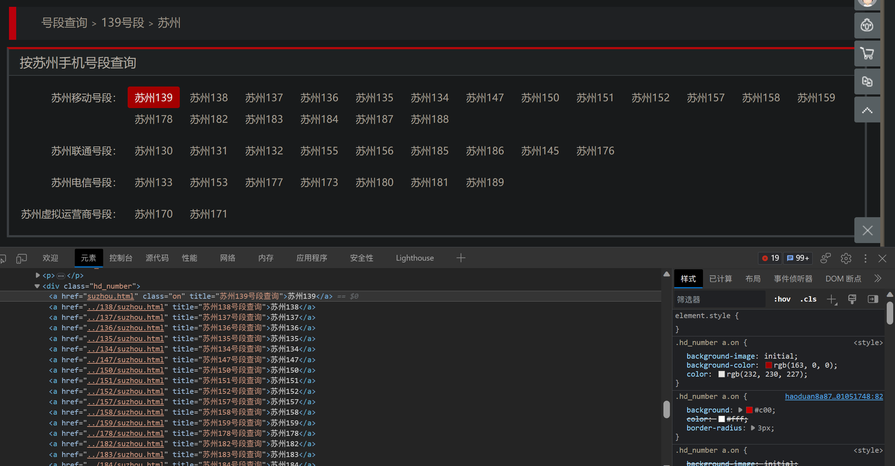
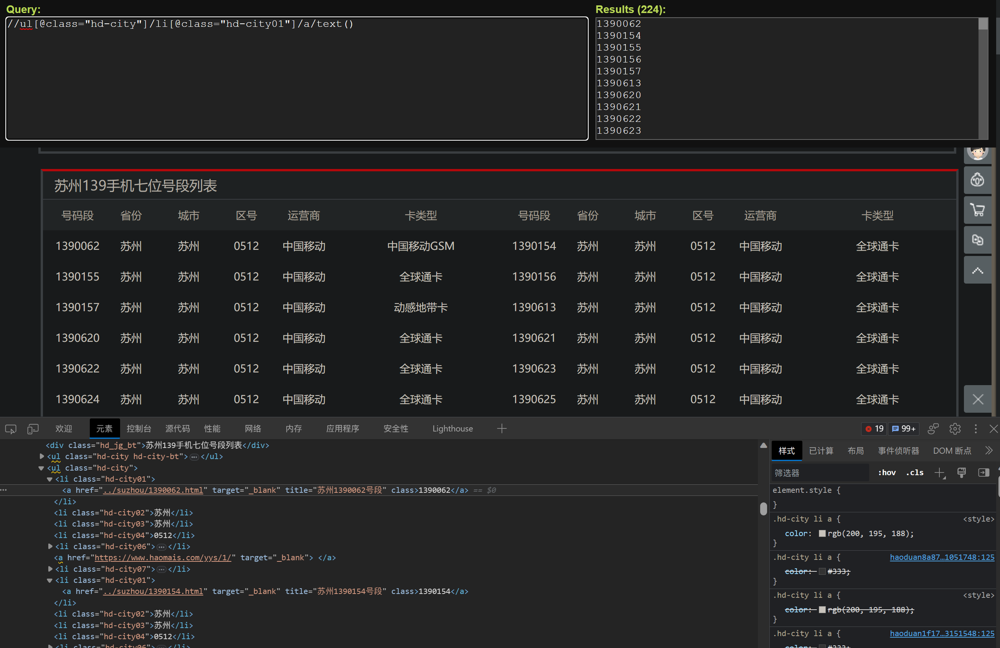
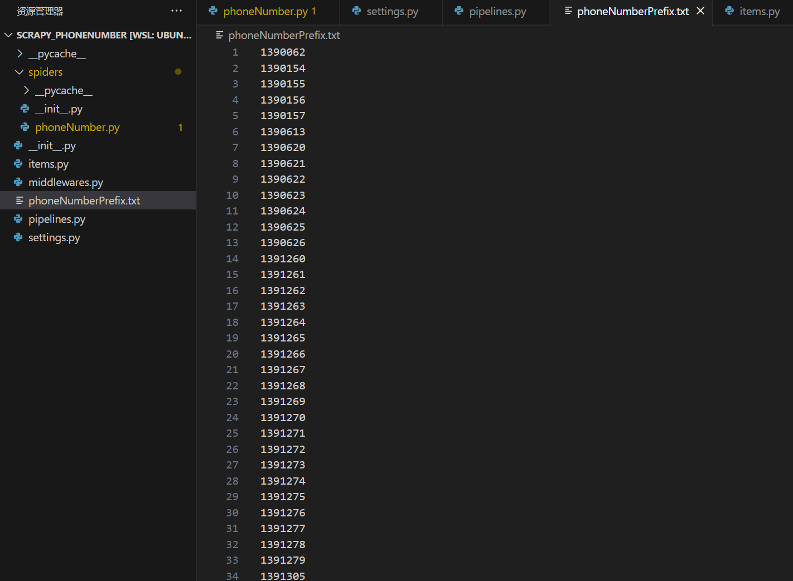

# 爬取苏州手机号的7位号段

[号麦网苏州号段](https://www.haomais.com/haoma/chaxun/haomais/haoduan/139/suzhou.html)

## 准备

### 使用链接提取器 CrawlSpider



如上图所示，需要爬取很多链接
先用链接提取器 CrawlSpider

定义一个规则，拿到网页中的符合规则链接，进行解析

这里使用 scrapy shell
```shell
scrapy shell https://www.haomais.com/haoma/chaxun/haomais/haoduan/139/suzhou.html
In [1]: from scrapy.linkextractors import LinkExtractor
In [2]: link = LinkExtractor(allow=r'\d+/suzhou.html')
In [3]: link.extract_links(response)
Out[3]:
[Link(url='https://www.haomais.com/haoma/chaxun/haomais/haoduan/139/suzhou.html', text='', fragment='', nofollow=False),
 Link(url='https://www.haomais.com/haoma/chaxun/haomais/haoduan/138/suzhou.html', text='苏州138', fragment='', nofollow=False),
 Link(url='https://www.haomais.com/haoma/chaxun/haomais/haoduan/137/suzhou.html', text='苏州137', fragment='', nofollow=False),
 Link(url='https://www.haomais.com/haoma/chaxun/haomais/haoduan/136/suzhou.html', text='苏州136', fragment='', nofollow=False),
 Link(url='https://www.haomais.com/haoma/chaxun/haomais/haoduan/135/suzhou.html', text='苏州135', fragment='', nofollow=False),
 Link(url='https://www.haomais.com/haoma/chaxun/haomais/haoduan/134/suzhou.html', text='苏州134', fragment='', nofollow=False),
 Link(url='https://www.haomais.com/haoma/chaxun/haomais/haoduan/147/suzhou.html', text='苏州147', fragment='', nofollow=False),
 Link(url='https://www.haomais.com/haoma/chaxun/haomais/haoduan/150/suzhou.html', text='苏州150', fragment='', nofollow=False),
 Link(url='https://www.haomais.com/haoma/chaxun/haomais/haoduan/151/suzhou.html', text='苏州151', fragment='', nofollow=False),
 Link(url='https://www.haomais.com/haoma/chaxun/haomais/haoduan/152/suzhou.html', text='苏州152', fragment='', nofollow=False),
 Link(url='https://www.haomais.com/haoma/chaxun/haomais/haoduan/157/suzhou.html', text='苏州157', fragment='', nofollow=False),
 Link(url='https://www.haomais.com/haoma/chaxun/haomais/haoduan/158/suzhou.html', text='苏州158', fragment='', nofollow=False),
 Link(url='https://www.haomais.com/haoma/chaxun/haomais/haoduan/159/suzhou.html', text='苏州159', fragment='', nofollow=False),
 Link(url='https://www.haomais.com/haoma/chaxun/haomais/haoduan/178/suzhou.html', text='苏州178', fragment='', nofollow=False),
 Link(url='https://www.haomais.com/haoma/chaxun/haomais/haoduan/182/suzhou.html', text='苏州182', fragment='', nofollow=False),
 Link(url='https://www.haomais.com/haoma/chaxun/haomais/haoduan/183/suzhou.html', text='苏州183', fragment='', nofollow=False),
 Link(url='https://www.haomais.com/haoma/chaxun/haomais/haoduan/184/suzhou.html', text='苏州184', fragment='', nofollow=False),
 Link(url='https://www.haomais.com/haoma/chaxun/haomais/haoduan/187/suzhou.html', text='苏州187', fragment='', nofollow=False),
 Link(url='https://www.haomais.com/haoma/chaxun/haomais/haoduan/188/suzhou.html', text='苏州188', fragment='', nofollow=False),
 Link(url='https://www.haomais.com/haoma/chaxun/haomais/haoduan/130/suzhou.html', text='苏州130', fragment='', nofollow=False),
 Link(url='https://www.haomais.com/haoma/chaxun/haomais/haoduan/131/suzhou.html', text='苏州131', fragment='', nofollow=False),
 Link(url='https://www.haomais.com/haoma/chaxun/haomais/haoduan/132/suzhou.html', text='苏州132', fragment='', nofollow=False),
 Link(url='https://www.haomais.com/haoma/chaxun/haomais/haoduan/155/suzhou.html', text='苏州155', fragment='', nofollow=False),
 Link(url='https://www.haomais.com/haoma/chaxun/haomais/haoduan/156/suzhou.html', text='苏州156', fragment='', nofollow=False),
 Link(url='https://www.haomais.com/haoma/chaxun/haomais/haoduan/185/suzhou.html', text='苏州185', fragment='', nofollow=False),
 Link(url='https://www.haomais.com/haoma/chaxun/haomais/haoduan/186/suzhou.html', text='苏州186', fragment='', nofollow=False),
 Link(url='https://www.haomais.com/haoma/chaxun/haomais/haoduan/145/suzhou.html', text='苏州145', fragment='', nofollow=False),
 Link(url='https://www.haomais.com/haoma/chaxun/haomais/haoduan/176/suzhou.html', text='苏州176', fragment='', nofollow=False),
 Link(url='https://www.haomais.com/haoma/chaxun/haomais/haoduan/133/suzhou.html', text='苏州133', fragment='', nofollow=False),
 Link(url='https://www.haomais.com/haoma/chaxun/haomais/haoduan/153/suzhou.html', text='苏州153', fragment='', nofollow=False),
 Link(url='https://www.haomais.com/haoma/chaxun/haomais/haoduan/177/suzhou.html', text='苏州177', fragment='', nofollow=False),
 Link(url='https://www.haomais.com/haoma/chaxun/haomais/haoduan/173/suzhou.html', text='苏州173', fragment='', nofollow=False),
 Link(url='https://www.haomais.com/haoma/chaxun/haomais/haoduan/180/suzhou.html', text='苏州180', fragment='', nofollow=False),
 Link(url='https://www.haomais.com/haoma/chaxun/haomais/haoduan/181/suzhou.html', text='苏州181', fragment='', nofollow=False),
 Link(url='https://www.haomais.com/haoma/chaxun/haomais/haoduan/189/suzhou.html', text='苏州189', fragment='', nofollow=False),
 Link(url='https://www.haomais.com/haoma/chaxun/haomais/haoduan/170/suzhou.html', text='苏州170', fragment='', nofollow=False),
 Link(url='https://www.haomais.com/haoma/chaxun/haomais/haoduan/171/suzhou.html', text='苏州171', fragment='', nofollow=False)]
```

成功拿到了苏州的全部3位号段的链接，一共37个

### 使用xpath

[要爬取的某个链接](https://www.haomais.com/haoma/chaxun/haomais/haoduan/139/suzhou.html)

```py
//ul[@class="hd-city"]/li[@class="hd-city01"]/a/text()
```



## 初始化项目

用scrapy爬虫框架创建爬虫
```shell
scrapy startproject scrapy_phoneNumber
cd scrapy_phoneNumber
# 注意这里执行 scrapy genspider 命令时，多了 -t crawl 参数
scrapy genspider phoneNumber -t crawl https://www.haomais.com/haoma/chaxun/haomais/haoduan/139/suzhou.html
```

在settings.py文件中加入UA，并选择不遵守robots协议
```py
# Crawl responsibly by identifying yourself (and your website) on the user-agent
USER_AGENT = "Mozilla/5.0 (Windows NT 10.0; Win64; x64) AppleWebKit/537.36 (KHTML, like Gecko) Chrome/114.0.0.0 Safari/537.36"
# Obey robots.txt rules
# ROBOTSTXT_OBEY = True
```

scrapy_phoneNumber/scrapy_phoneNumber/spiders/phoneNumber.py文件的内容为
```py
import scrapy
from scrapy.linkextractors import LinkExtractor
from scrapy.spiders import CrawlSpider, Rule

class PhonenumberSpider(CrawlSpider):
    name = "phoneNumber"
    allowed_domains = ["www.haomais.com"]
    start_urls = ["https://www.haomais.com/haoma/chaxun/haomais/haoduan/139/suzhou.html"]

    rules = (Rule(LinkExtractor(allow=r'\d+/suzhou.html'), callback="parse_item", follow=True),)

    def parse_item(self, response):
        print('号麦网爬虫启动成功')
        print(response.url)
```

使用命令运行爬虫
```shell
scrapy crawl phoneNumber
```

一共37个网页链接不重不漏

## 爬取7位号段内容

items.py文件的内容为
```py
import scrapy

class ScrapyPhonenumberItem(scrapy.Item):
    phoneNumberPrefix = scrapy.Field()
```

phoneNumber.py文件的内容修改为
```py
import scrapy
from scrapy.linkextractors import LinkExtractor
from scrapy.spiders import CrawlSpider, Rule
from scrapy_phoneNumber.items import ScrapyPhonenumberItem

class PhonenumberSpider(CrawlSpider):
    name = "phoneNumber"
    allowed_domains = ["www.haomais.com"]
    start_urls = ["https://www.haomais.com/haoma/chaxun/haomais/haoduan/139/suzhou.html"]

    rules = (Rule(LinkExtractor(allow=r'\d+/suzhou.html'), callback="parse_item", follow=True),)

    def parse_item(self, response):
        print('号麦网爬虫启动成功')
        phoneNumberPrefix_list = response.xpath('//ul[@class="hd-city"]/li[@class="hd-city01"]/a/text()')
        for phoneNumberPrefix in phoneNumberPrefix_list:
            yield ScrapyPhonenumberItem(phoneNumberPrefix=phoneNumberPrefix.extract())
```

别忘了在settings.py文件中开启管道
```py
ITEM_PIPELINES = {
   "scrapy_phoneNumber.pipelines.ScrapyPhonenumberPipeline": 300,
}
```

pipelines.py文件的内容为
```py
from itemadapter import ItemAdapter

class ScrapyPhonenumberPipeline:
    def open_spider(self, spider):
        self.fp = open('phoneNumberPrefix.txt', 'w', encoding='utf-8')
    
    def process_item(self, item, spider):
        self.fp.write(item['phoneNumberPrefix'] + '\n')
        return item
    
    def close_spider(self, spider):
        self.fp.close()
```

经测试，爬取成功
