# 量化交易

### Python模块

```python
# 数据批量计算
import numpy as np
# 灵活的表计算
import pandas as pd
# 数据可视化
import matplotlib.pyplot as plt
# 拿取数据
import mplfinance as fin
# 随机数
import random
# 数学库
import math
# 日期时间
import datetime
import dateutil
```

### 在线平台

聚宽
优矿
米筐
Quantopian

### 框架

RQALpha
QUANTAXIS

### jupyter notebook

#### 安装

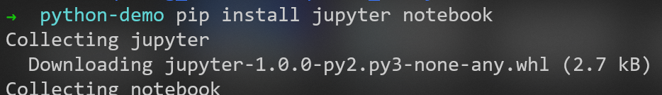

更新requirement

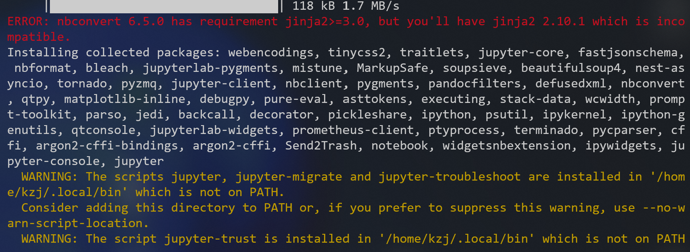

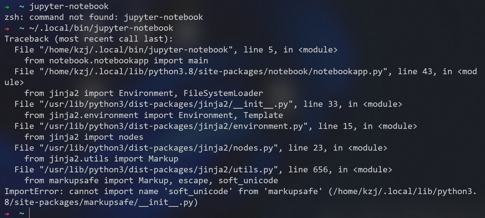

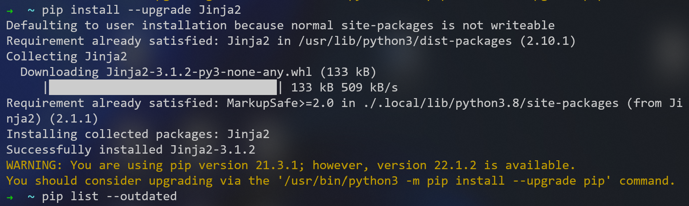

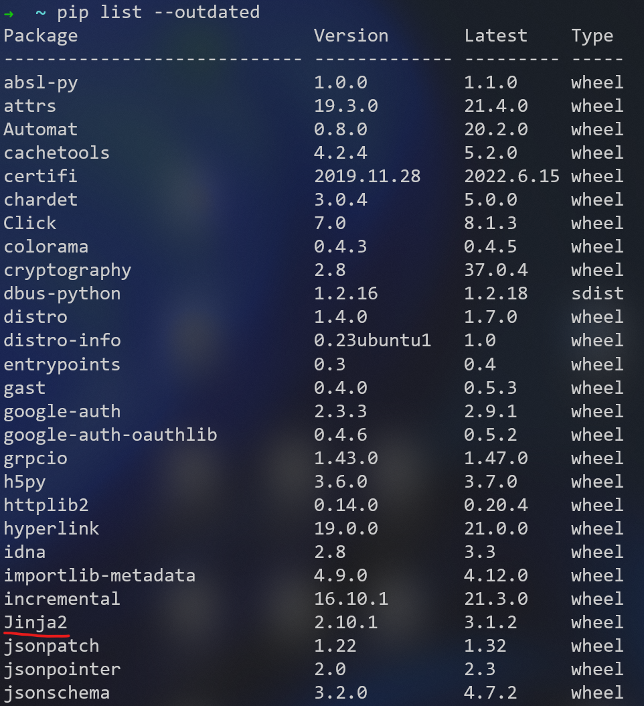

#### 找不到命令

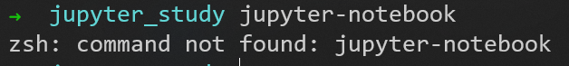

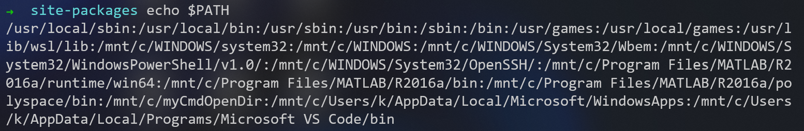

将命令目录加入$PATH

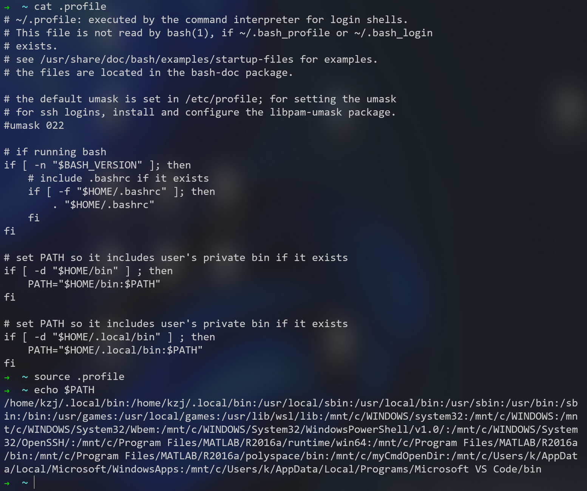

这样设置，每次重启，要手动加入$PATH，在~目录下使用命令
```bash
source .profile
```

之后在同一个命令窗口，可以启动jupyter notebook

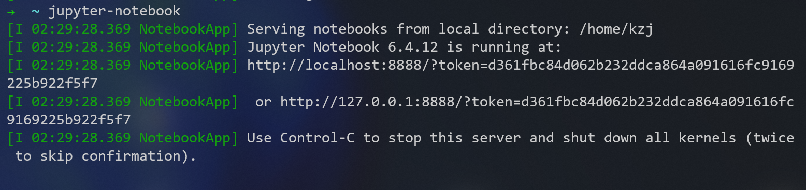

如果提示一闪而过，可以<kbd>Ctrl</kbd> + <kbd>C</kbd> 来显示

#### 第一次启动

1. 使用token临时登录
   
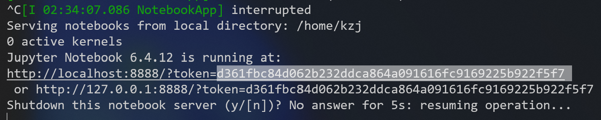

2. 设置密码

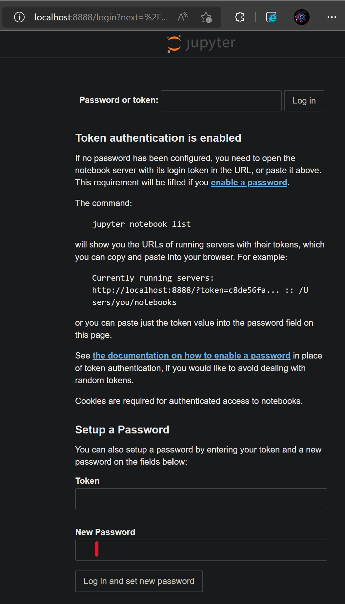

3. 新建文件
   
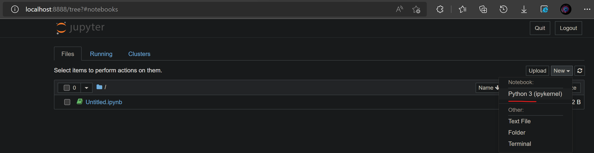

#### 快捷键

1. 在运行后的代码中，光标放到函数中，<kbd>Shift</kbd>+<kbd>Tab</kbd>查看函数用法
2. <kbd>Tab</kbd>代码补全
3. <kbd>Esc</kbd>后<kbd>A</kbd>键:上方插入单元，<kbd>B</kbd>键:下方插入单元
4. <kbd>Esc</kbd>后<kbd>M</kbd>键:进入markdown模式，<kbd>Y</kbd>键:进入代码模式
5. <kbd>Esc</kbd>后<kbd>Shift</kbd>+<kbd>M</kbd>键:合并当前和下方单元
6. <kbd>Esc</kbd>后2次<kbd>D</kbd>键:删除当前单元
7. <kbd>Esc</kbd>后<kbd>Z</kbd>键:恢复最后删除的单元
8. <kbd>Ctrl</kbd>+<kbd>Enter</kbd>:运行当前单元
9. <kbd>Alt</kbd>+<kbd>Enter</kbd>:运行当前单元，并在下方插入新单元

#### 魔法命令

列出所有变量名:
```python
%who
```

列出指定类型的变量名:
```python
%who int
```

#### 使用上一步的结果

上一步的结果:
```python
_
```

第n步的结果:
```python
_n
```

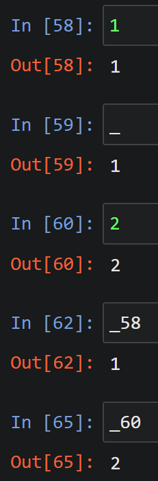

#### 查询函数的用法

函数后面加一个问号:

```python
pd.date_range?
# 可以使用通配符
pd.read_*?
```
