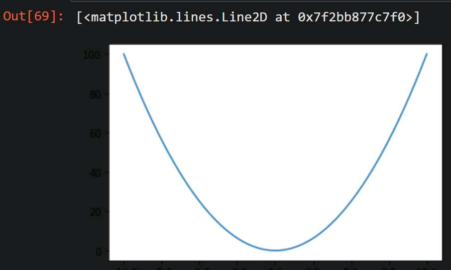

# numpy

### 获得大量的随机数并打印

1. 普通操作

```python
import numpy as np
import random

a = [random.uniform(100.0, 200.0) for i in range(50)]
print(a)

x = 6.8
b = []
for ele in a:
    b.append(ele * x)
print(b)
```

2. 使用numpy更简单

```python
# 这里的a和x是上一段代码中的
a = np.array(a)
print(a*x)
```

### 大量数相乘

两个长度相等的array中的对应位置的数相乘

```python
a = [random.uniform(10.0, 20.0) for i in range(50)]
b = [random.randint(1, 10)      for i in range(50)]
a = np.array(a)
b = np.array(b)
print(a)
print(b)
print(a*b)
print( (a*b).sum() )
```

### 用 np.array() 创建矩阵

```python
a = np.array([ [1,2,3],[4,5,6] ])
print(a)
print(a.dtype)
print(a.size)
print(a.shape)
print(a.ndim)
print(a.T)
print(a.T.T)
```

```
[[1 2 3]
 [4 5 6]]
int64
6
(2, 3)
2
[[1 4]
 [2 5]
 [3 6]]
[[1 2 3]
 [4 5 6]]
```

### 元素不同的数据类型


```python
a = np.array([0]*10)
print(a)
print(a.dtype)
```

```
[0 0 0 0 0 0 0 0 0 0]
int64
```

----

```python
a = np.zeros(10)
print(a)
print(a.dtype)
```

```
[0. 0. 0. 0. 0. 0. 0. 0. 0. 0.]
float64s
```

---

```python
a = np.zeros(10, dtype='int')
print(a)
print(a.dtype)
```

```
[0 0 0 0 0 0 0 0 0 0]
int64
```

---

```python
a = np.ones(10)
print(a)
print(a.dtype)
```

```
[1. 1. 1. 1. 1. 1. 1. 1. 1. 1.]
float64
```

### 残留数据

```python
a = np.empty(8)
# 需要手动对元素赋值
print(a)
```

```
[2.58280603e-316 0.00000000e+000 2.05833592e-312 2.18565567e-312
 8.48798317e-313 1.01855798e-312 4.66013568e-033 6.28024482e+174]
```

### array()、range() 和 arange()函数的区别和用法

1. np.array(object, dtype=None, copy=True, order=‘K’, subok=False, ndmin=0)
   创建一个数组
2. range(start, stop[, step ])
   创建一个整数列表，一般用在for循环中
3. np.arange ( [start, ] stop,  [step, ]  dtype=None)
   返回一个有终点和起点的固定步长的排列
4. 区别
   1. range()不支持步长为小数，np.arange()支持步长为小数
   2. range() 函数是python 自带的函数，而arange() 是numpy 库中的函数
5. 外部资料
[用例](https://blog.csdn.net/Skylar_tramp/article/details/113532361)
[参数](https://blog.csdn.net/m0_51816252/article/details/125717825?spm=1001.2101.3001.6650.5&utm_medium=distribute.pc_relevant.none-task-blog-2%7Edefault%7EBlogCommendFromBaidu%7Edefault-5-125717825-blog-113532361.pc_relevant_multi_platform_featuressortv2dupreplace&depth_1-utm_source=distribute.pc_relevant.none-task-blog-2%7Edefault%7EBlogCommendFromBaidu%7Edefault-5-125717825-blog-113532361.pc_relevant_multi_platform_featuressortv2dupreplace)

### np.arange() 和 np.linspace() 的区别

1. arange() 是设置步长

```python
np.arange(2,10,0.3)
```

```
array([2. , 2.3, 2.6, 2.9, 3.2, 3.5, 3.8, 4.1, 4.4, 4.7, 5. , 5.3, 5.6,
       5.9, 6.2, 6.5, 6.8, 7.1, 7.4, 7.7, 8. , 8.3, 8.6, 8.9, 9.2, 9.5,
       9.8])
```

2. linspace() 是设置等分的份数

```python
np.linspace(0,20,20)
```

```
array([ 0.        ,  1.05263158,  2.10526316,  3.15789474,  4.21052632,
        5.26315789,  6.31578947,  7.36842105,  8.42105263,  9.47368421,
       10.52631579, 11.57894737, 12.63157895, 13.68421053, 14.73684211,
       15.78947368, 16.84210526, 17.89473684, 18.94736842, 20.        ])
```

```python
np.linspace(0,20,21)
```

```
array([ 0.,  1.,  2.,  3.,  4.,  5.,  6.,  7.,  8.,  9., 10., 11., 12.,
       13., 14., 15., 16., 17., 18., 19., 20.])
```

linspace() 用于在作图中生成自变量

```python
import matplotlib.pyplot as plt
x = np.linspace(-10, 10, 10000)
y = x**2
plt.plot(x,y)
```



### 单位矩阵

```python
np.eye(5)
```
```
array([[1., 0., 0., 0., 0.],
       [0., 1., 0., 0., 0.],
       [0., 0., 1., 0., 0.],
       [0., 0., 0., 1., 0.],
       [0., 0., 0., 0., 1.]])
```

### 对 array 的操作

1. 比较两个 array 返回一个 bool 型的 array

```python
a = np.arange(10)
b = np.arange(9, -1, -1)
print(a)
print(b)
print(a+b)
a<b
# a, b, a+b 都是 array 类型
```
```
[0 1 2 3 4 5 6 7 8 9]
[9 8 7 6 5 4 3 2 1 0]
[9 9 9 9 9 9 9 9 9 9]
array([ True,  True,  True,  True,  True, False, False, False, False,
       False])
```

2. 对 array 的重定形和切片
   
```python
a = np.arange(15).reshape(3,5)
a
```
```
array([[ 0,  1,  2,  3,  4],
       [ 5,  6,  7,  8,  9],
       [10, 11, 12, 13, 14]])
```

两种切片写法

```python
print(a[0][0:3])
print(a[0,0:3])
```
```
[0 1 2]
[0 1 2]
```

### array 和 list 的区别

```python
a = np.arange(10)
b = list(range(10))
# a是array, b是list
```

切片

```python
a_cut = a[0:4]
b_cut = b[0:4]
```

对切出的片进行赋值

```python
a_cut[0] = 20
b_cut[0] = 20
```

结果

1. a_cut
```
array([20,  1,  2,  3])
```

2. b_cut
```
[20, 1, 2, 3]
```

3. a **(array 的切片相当于视图(引用))**
```
array([20,  1,  2,  3,  4,  5,  6,  7,  8,  9])
```

4. b **(list 的切片相当于复制)**
```
[0, 1, 2, 3, 4, 5, 6, 7, 8, 9]
```

### 数据筛选

1. array 比 list 更简便
   
使用 list

```python
a = [random.randint(0, 10) for i in range(20)]
print(a)
```

```
[4, 4, 10, 9, 2, 7, 6, 0, 5, 7, 6, 0, 10, 4, 2, 10, 6, 9, 5, 2]
```

```python
# 使用匿名函数
list(filter (lambda x: x>5, a) )
```

```
[10, 9, 7, 6, 7, 6, 10, 10, 6, 9]
```

使用 array

```python
# 这里赋值号右侧的a是上面代码中的
a = np.array(a)
a
```

```
array([ 4,  4, 10,  9,  2,  7,  6,  0,  5,  7,  6,  0, 10,  4,  2, 10,  6,
        9,  5,  2])
```

```python
# 使用bool类型的array
a[a>5]
```

```
array([10,  9,  7,  6,  7,  6, 10, 10,  6,  9])
```

```python
# 其中bool类型的array如下
a>5
```

```
array([False, False,  True,  True, False,  True,  True, False, False,
        True,  True, False,  True, False, False,  True,  True,  True,
       False, False])
```

2. 多轮筛选

```python
a = [random.randint(0, 10) for i in range(20)]
a = np.array(a)
print(a)
b = a[a>5]
print(b)
c = b[b%2==0]
print(c)
```

```
[ 1 10  2  1  4  7  1  4  9  2 10  0  7  8 10  3  0  9  2  3]
[10  7  9 10  7  8 10  9]
[10 10  8 10]
```


尝试1

```python
a[a>5][a%2==0]
# 报错, IndexError: boolean index did not match indexed array along dimension 0; dimension is 10 but corresponding boolean dimension is 20
# 第二个中括号传入的布尔型数组过长
```

尝试2.1

```python
# 注意python中没有&&运算符 
a[a>5 & a%2==0]
# 报错, ValueError: The truth value of an array with more than one element is ambiguous. Use a.any() or a.all()
```

尝试2.2

```python
a>5 & a%2==0
# 和尝试2.1中报错相同
```

尝试2.3

```python
# and 和 & 的不同
print(True and False)
print(True  &  False)
# &是二进制位运算符
# and是逻辑与，当所有值都为真，则返回最后一个真值
print(3  &  5)
print(3 and 5)
print(4  &  3)
print(4 and 3)
```

```
False
False
1
5
0
3
```

尝试3(正确)

```python
# 与尝试2.1相比, 多了括号
a[(a>5) & (a%2==0)]
```

```
array([10, 10,  8, 10])
```

尝试4.1(同理尝试4.2)

```python
# &可以被重载, and不能重载
# 把尝试3中的 & 换成 and, 就会报错, 和尝试2.1中报错相同
a[(a>5) and (a%2==0)]
```

尝试4.2

```python
# 正确
a[(a>5) | (a%2==0)]
```

```
array([10,  2,  4,  7,  4,  9,  2, 10,  0,  7,  8, 10,  0,  9,  2])
```

```python
# 报错同尝试4.1
a[(a>5) or (a%2==0)]
```

### array 的索引和切片

1. 用列表作为索引

```python
a = np.arange(10,20)
print(a)
```

```
[10 11 12 13 14 15 16 17 18 19]
```

尝试1

```python
a[1,3,4,6,7]
# 报错, IndexError: too many indices for array: array is 1-dimensional, but 5 were indexed
```

尝试2(正确)

```python
a[[1,3,4,6,7]]
```

```
array([11, 13, 14, 16, 17])
```

2. 多种索引和切片

```python
a = np.arange(20).reshape(4,5)
print(a)
```

```
[[ 0  1  2  3  4]
 [ 5  6  7  8  9]
 [10 11 12 13 14]
 [15 16 17 18 19]]
```

```python
# 行 常规索引
# 列 切片
a[0, 2:5]
```

```
array([2, 3, 4])
```

```python
# 行 常规索引
# 列 布尔型索引
a[0, a[0]>2]
```

```
array([3, 4])
```

```python
# 想选出 6，8，16，18
a[[1,3],[1,3]]
# 这样只拿出了(1,1)和(3,3)的值
```

```
array([ 6, 18])
```

```python
# 行和列分别切
a[[1,3], :][:, [1,3]]
# :表示全部
```

```
array([[ 6,  8],
       [16, 18]])
```

### 数值处理函数

```python
a = np.arange(-5,5)
print(a)
# abs()和np.abs()都行
print(abs(a))
print(np.abs(a))
```

```
[-5 -4 -3 -2 -1  0  1  2  3  4]
[5 4 3 2 1 0 1 2 3 4]
[5 4 3 2 1 0 1 2 3 4]
```

math库中的函数可能不支持对数组使用

```python
import math
print(math.sqrt(a))
# 报错, TypeError: only size-1 arrays can be converted to Python scalars
```

使用numpy库的函数

```python
# 只能用np.sqrt，不能用math.sqrt
print(np.sqrt(a))
```

```
[       nan        nan        nan        nan        nan 0.
 1.         1.41421356 1.73205081 2.        ]
RuntimeWarning: invalid value encountered in sqrt
  print(np.sqrt(a))
```

同理，当a是数值类型时，可用如下方法

```python
# 四舍五入
round(a)
# 向0取整
int(a)
# 向下取整
math.floor(a)
# 向上取整
math.ceil(a)
```

当a是array类型时，要用numpy中的方法

```python
a = np.arange(-5.5, 5.5)
print(a)
```

```
[-5.5 -4.5 -3.5 -2.5 -1.5 -0.5  0.5  1.5  2.5  3.5  4.5]
```

```python
np.floor(a)
```

```
array([-6., -5., -4., -3., -2., -1.,  0.,  1.,  2.,  3.,  4.])
```

```python
# 把整数和小数分开
x,y = np.modf(a)
print(x)
print(y)
```

```
[-0.5 -0.5 -0.5 -0.5 -0.5 -0.5  0.5  0.5  0.5  0.5  0.5]
[-5. -4. -3. -2. -1. -0.  0.  1.  2.  3.  4.]
```

### np.nan

```python
np.nan
```

```
nan
```

```python
np.nan == np.nan
```

```
False
```

```python
np.nan is np.nan
```

```
True
```

```python
a = np.arange(5)
print(a)
b = a/a
print(b)
```

```
[0 1 2 3 4]
[nan  1.  1.  1.  1.]
RuntimeWarning: invalid value encountered in true_divide
  b = a/a
```

```python
np.isnan(b)
```

```
array([ True, False, False, False, False])
```

```python
# 如果想要把nan值删掉
b[np.isnan(b)]
# 这样只保留了nan
```

```
array([nan])
```

```python
# ~是取反
b[~np.isnan(b)]
```

```
array([1., 1., 1., 1.])
```

### np.inf

```python
np.inf
```

```
inf
```

```python
np.inf == np.inf
```

```
True
```

```python
np.inf is np.inf
```

```
True
```

```python
np.inf > 99999999999999999999999
```

```
True
```

```python
a = np.array([3,4,5,6,7])
b = np.array([3,0,5,0,7])
c = a/b
print(c)
```

```
[ 1. inf  1. inf  1.]
RuntimeWarning: divide by zero encountered in true_divide
  c = a/b
```

```python
# 扔掉inf
c[c!=np.inf]
```

```
array([1., 1., 1.])
```

```python
# 也可以这样写
c[~np.isinf(c)]
```

```
array([1., 1., 1.])
```

### 统计

```python
a = np.array([3,4,5,6,7])
b = np.array([7,6,5,4,3])
c = np.maximum(a,b)
# 同理有minimum
print(c)
```

```
[7 6 5 6 7]
```

```python
# 求和
print(a.sum())
# 平均值
print(a.mean())
# 方差
print(a.var())
# 标准差
print(a.std())
# 同理min
print(a.max())
# 返回最大元素对应的索引值,同理argmin
print(a.argmax())
```

```
25
5.0
2.0
1.4142135623730951
7
4
```

### 生成随机数

```python
np.random.randint(0, 20, (3,5))
```

```
array([[17,  0, 13, 14,  7],
       [ 5, 10, 12,  5, 16],
       [ 8, 18,  6, 12,  6]])
```

```python
np.random.choice([1,2,3,4,5], 10)
```

```
array([2, 5, 4, 2, 1, 1, 3, 5, 1, 3])
```

```python
np.random.uniform(2.0, 4.0, 10)
```

```
array([3.30637928, 2.39358803, 3.68326491, 2.95372764, 2.47539052,
       2.62150652, 3.89660926, 3.49389794, 2.17470061, 2.32251381])
```

