# pandas

### 带标签的一维数组 pd.Series()

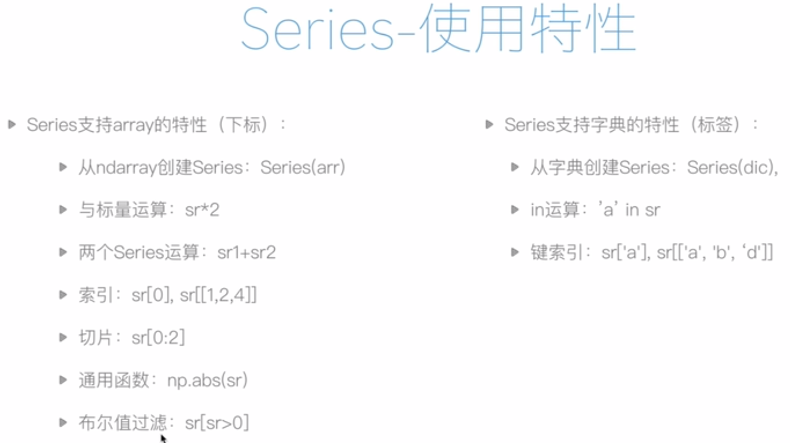

使用默认下标索引

```python
import numpy as np
import pandas as pd

# 像列表
sr1 = pd.Series([2,3,4,5])
sr1
```

```
0    2
1    3
2    4
3    5
dtype: int64
```

手动指定标签

```python
# 像字典
sr2 = pd.Series([2,3,4,5], index=['a', 'b', 'c', 'd'])
sr2
```

```
a    2
b    3
c    4
d    5
dtype: int64
```

手动指定标签后，也可以用下标索引

```python
# 依然可以用index访问
print(sr2[0])
print(sr2[['a', 'b']])
```

```
# 依然可以用index访问
print(sr2[0])
print(sr2[['a', 'b']])
```

Series 相加 (对应标签的value相加)

```python
sr2 + sr2
```

```
a     4
b     6
c     8
d    10
dtype: int64
```

Series 相加 (标签对应不上)

```python
sr1 + sr2
```

```
0   NaN
1   NaN
2   NaN
3   NaN
a   NaN
b   NaN
c   NaN
d   NaN
dtype: float64
```

判断 Series 是否有某个标签

```python
'a' in sr2
```

```
True
```

用标签遍历 Series

```python
for i in sr2:
    print(i)
```

```
2
3
4
5
```

key

```python
# 获得索引
sr2.index
```

```
Index(['a', 'b', 'c', 'd'], dtype='object')
```

value

```python
# 获得值
sr2.values
```

```
array([2, 3, 4, 5])
```

使用 key 查找 value

```python
# 标签相当于给索引起了别名
sr2[['a', 'c']]
```

```
a    2
c    4
dtype: int64
```

切片

```python
sr2['a':'c']
```

```
a    2
b    3
c    4
dtype: int64
```

### 区分 Series 的标签和下标

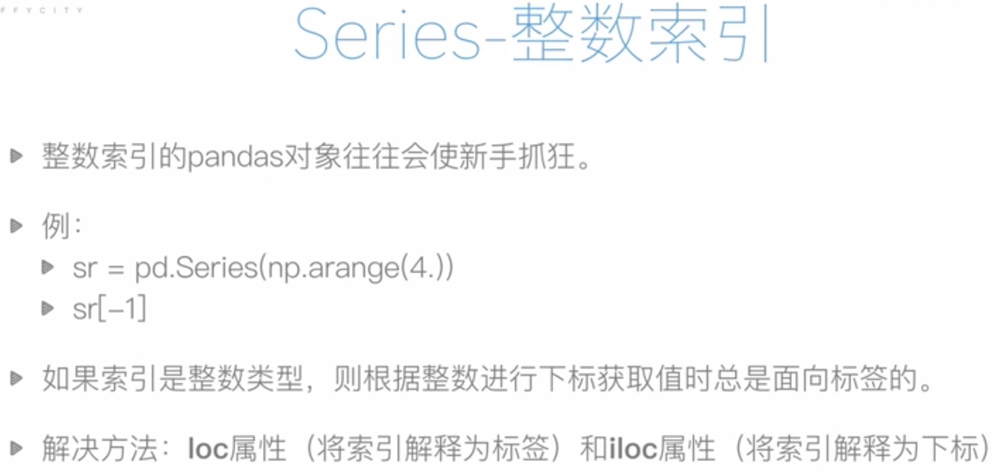

从array生成Series

```python
# 整数索引
sr1 = pd.Series(np.arange(10))
print(sr1)
```

```
0    0
1    1
2    2
3    3
4    4
5    5
6    6
7    7
8    8
9    9
dtype: int64
```

截取后半部分

```python
# copy()用来建立和旧文件无关的新量
sr2 = sr1[5:].copy()
print(sr2)
```

```
5    5
6    6
7    7
8    8
9    9
dtype: int64
```

[ ] 默认解释

```python
# 这里的5解释为标签还是下标？
sr2[5]
# 解释为标签
```

```
5
```

.loc[ ] 和 .iloc[ ] 强制解释

```python
# loc将[]中的内容强制解释为标签
print(sr2.loc[5])
# iloc将[]中的内容强制解释为下标
print(sr2.iloc[4])
```

```
5
9
```

### 数据对齐

对应key的value做运算

```python
# 数据对齐
sr1 = pd.Series([12,23,34], index=['c','a','b'])
sr2 = pd.Series([11,20,10], index=['b','c','a'])
print(sr1+sr2)
```

```
a    33
b    45
c    32
dtype: int64
```

有缺失值时，对应的项结果为nan

```python
# 数据缺失
sr1 = pd.Series([12,23,34], index=['c','a','b'])
sr2 = pd.Series([11,20,10,21], index=['b','c','a','d'])
print(sr1+sr2)
```

```
a    33.0
b    45.0
c    32.0
d     NaN
dtype: float64
```

临时填补空缺值

```python
# sr1.add(sr2)等同于sr1+sr2
sr1.add(sr2, fill_value=0)
# 填补空缺值
```

```
a    33.0
b    45.0
c    32.0
d    21.0
dtype: float64
```

### 缺失值处理

判断是否是缺失值

```python
# 缺失值处理(删掉or填补)
sr3 = sr1+sr2
sr3.isnull()
# 同理notnull()
```

```
a    False
b    False
c    False
d     True
dtype: bool
```

删掉缺失值

```python
# 删掉缺失值
sr3[sr3.notnull()]
```

```
a    33.0
b    45.0
c    32.0
dtype: float64
```

```python
# 同理
sr3.dropna()
```

```
a    33.0
b    45.0
c    32.0
dtype: float64
```

填补缺失值

```python
# 填补缺失值为0
sr3.fillna(0)
```

```
a    33.0
b    45.0
c    32.0
d     0.0
dtype: float64
```

```python
# 填补缺失值为平均值
# sr3.mean()的计算会跳过nan
sr3.fillna(sr3.mean())
```

```
a    33.000000
b    45.000000
c    32.000000
d    36.666667
dtype: float64
```

### 带标签的二维数组 pd.DataFrame()

指定列标签

```python
pd.DataFrame({'one':[1,2,3], 'two':[4,5,6]})
```

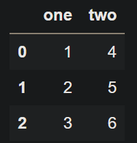

同时指定列标签和行标签
这里的 DataFrame 的每一列由一个 Series 组成

```python
pd.DataFrame({ 'one': pd.Series( [1,2,3], index=['a','b','c'] ), 'two':pd.Series( [1,2,3,4],index=['b','a','c','d'] ) })
```

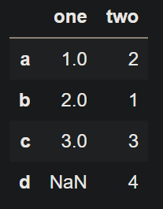

从csv文件中读取数据

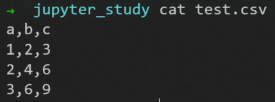

```python
# csv文件
pd.read_csv('test.csv')
```

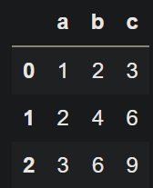

向csv文件中写入数据

```python
df = pd.DataFrame({ 'one': pd.Series( [1,2,3], index=['a','b','c'] ), 'two':pd.Series( [1,2,3,4],index=['b','a','c','d'] ) })
df.to_csv('test2.csv')
```

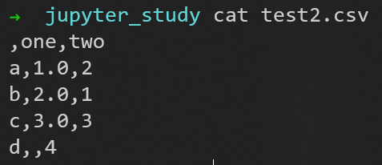

### DataFrame 的属性

```python
# 行标签
df.index
```

```
Index(['a', 'b', 'c', 'd'], dtype='object')
```

```python
# 列标签
df.columns
```

```
Index(['one', 'two'], dtype='object')
```

```python
# 数据
df.values
```

```
array([[ 1.,  2.],
       [ 2.,  1.],
       [ 3.,  3.],
       [nan,  4.]])
```

一列上的数据，要属于同一个数学集

```python
df
```

标签为one的列，由于 type(np.nan) 为 float，虽然传入的其他数据都是 int 类型，但此列升级成 float 类型

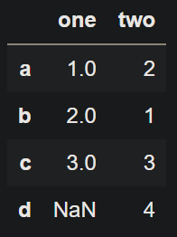

```python
df.T
```

例如a列，1.0是float，原先的2也要化成2.0(float)，因为float包括int

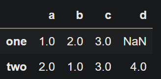

按列计算统计值

```python
# 25% 50% 75% 是四分位数
df.describe()
```

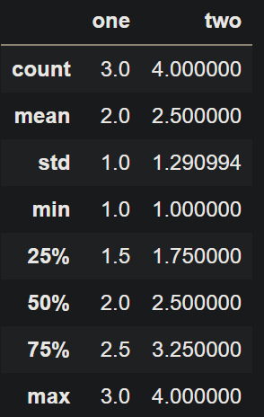

### DataFrame 的索引

注意使用索引时，行列的先后顺序

```python
# 先列后行
print(df['one']['a'])
# 先行后列
print(df.loc['a','one'])
```

```
1.0
1.0
```

两种访问顺序

```python
df.loc[ ['a','c'], 'two' ]
```

```
a    2
c    3
Name: two, dtype: int64
```

```python
df['two'][ ['a','c'] ]
```

```
a    2
c    3
Name: two, dtype: int64
```

访问一列
从 DataFrame 的某一列拿出一个 Series 

```python
# 把一列看作一个Series
sr1 = df['one']
# 等同于 sr1 = df.loc[:,'one']
print(sr1)
print(type(sr1))
# 使用df['a']访问一行会报错
```

```
a    1.0
b    2.0
c    3.0
d    NaN
Name: one, dtype: float64
<class 'pandas.core.series.Series'>
```

访问一行
从 DataFrame 的某一行拿出一个 Series

```python
# 访问一行
sr2 = df.loc['a',:]
print(sr2)
print(type(sr2))
```

```
one    1.0
two    2.0
Name: a, dtype: float64
<class 'pandas.core.series.Series'>
```

### 数据对齐

对应位置的元素做运算

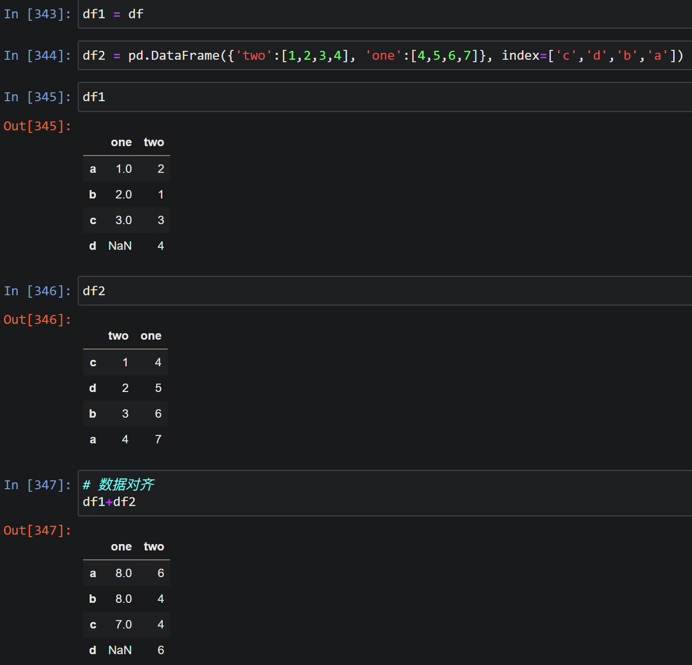

### 数据缺失

填补空缺值

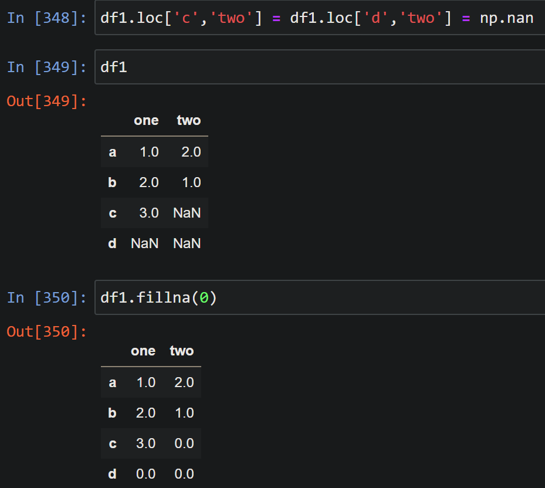

删去包含空缺值的行

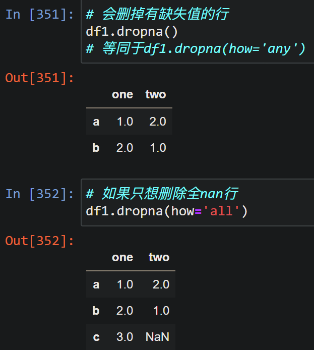

删去包含空缺值的列

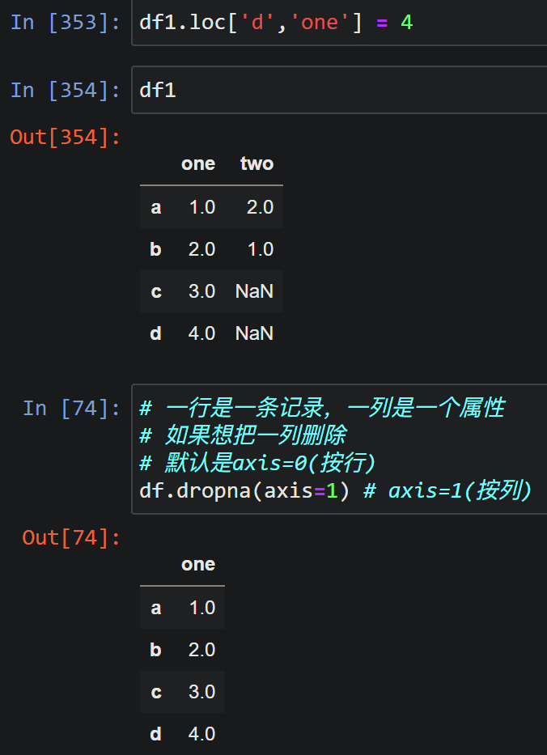

### 使用 DataFrame 进行统计

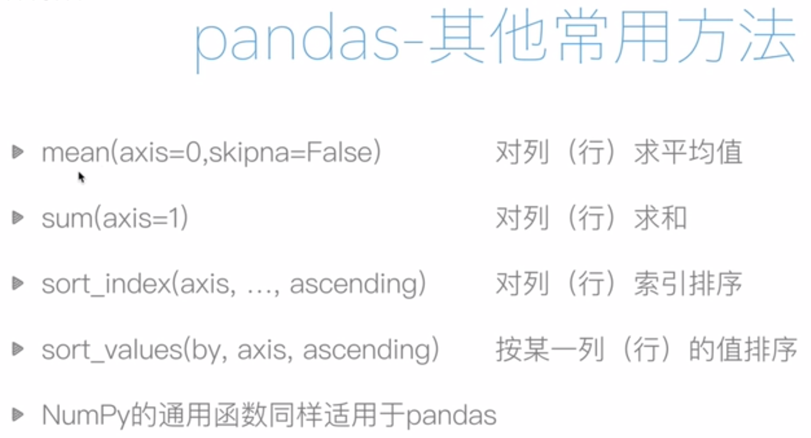

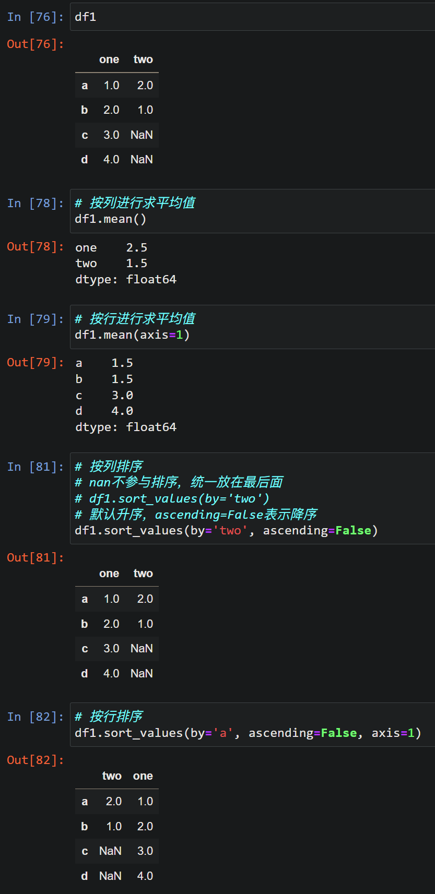

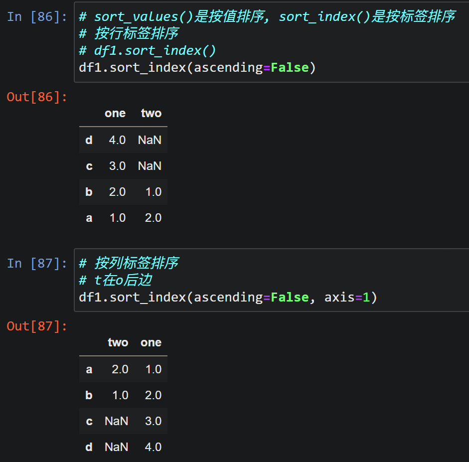
