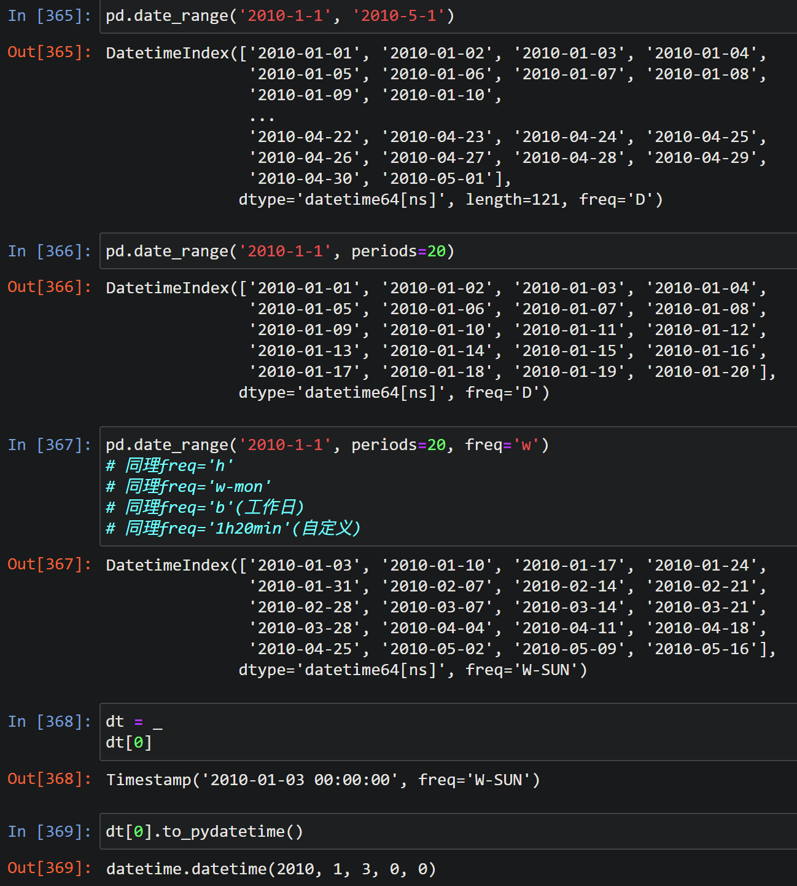
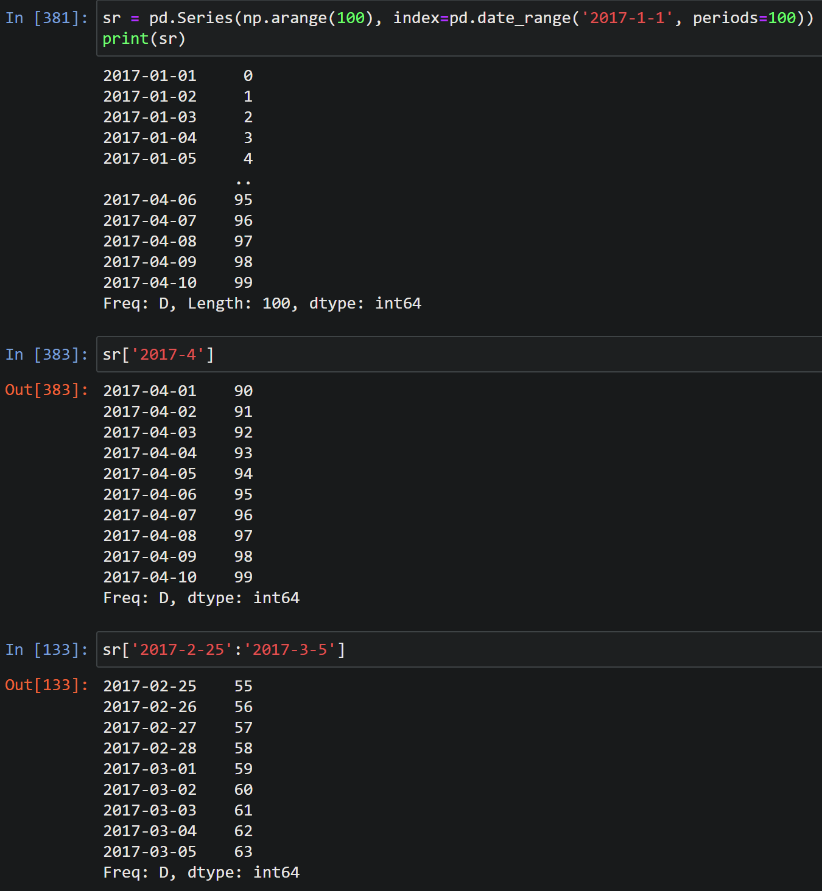
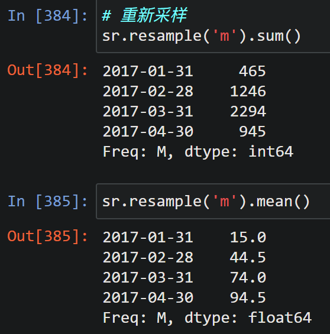

# datetime 和 dateutil 和 pandas 中的日期时间

### datetime

```python
import datetime
# 需要输入格式化字符串
datetime.datetime.strptime('2022-02-28', '%Y-%m-%d')
```

```
datetime.datetime(2022, 2, 28, 0, 0)
```

### dateutil

```python
import dateutil
# 不再需要格式化字符串
# dateutil.parser.parse('2022-2-28')
dateutil.parser.parse('2/28/2022')
```

```
datetime.datetime(2022, 2, 28, 0, 0)
```

### 使用 pandas 的日期时间

#### 把字符串转化为 datetime 格式

```python
pd.to_datetime(['2000-2-2', '2002/feb/4'])
```

```
DatetimeIndex(['2000-02-02', '2002-02-04'], dtype='datetime64[ns]', freq=None)
```

```python
dt1 = _
dt1[0]
```

```
Timestamp('2000-02-02 00:00:00')
```

#### 生成日期范围



#### 把日期时间作为 Series 中的索引



pandas 中的数据重采样



