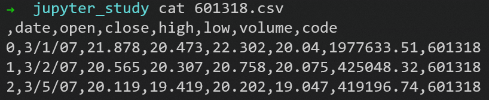
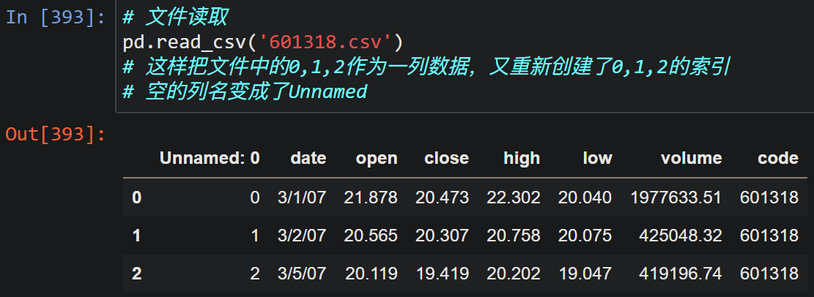
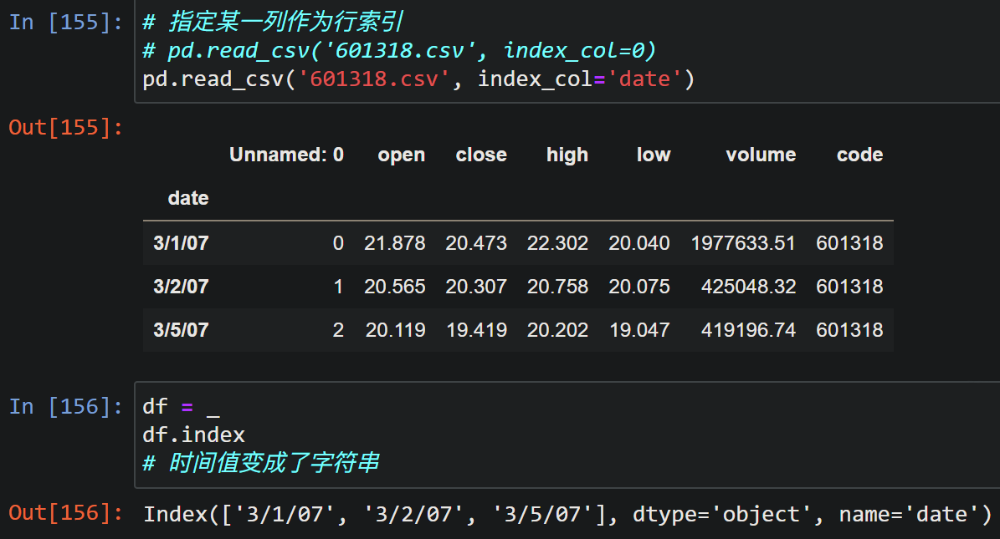
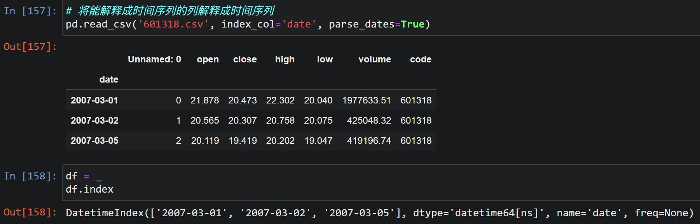
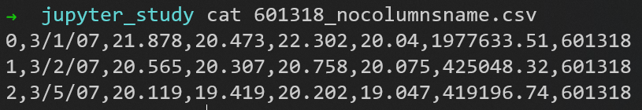
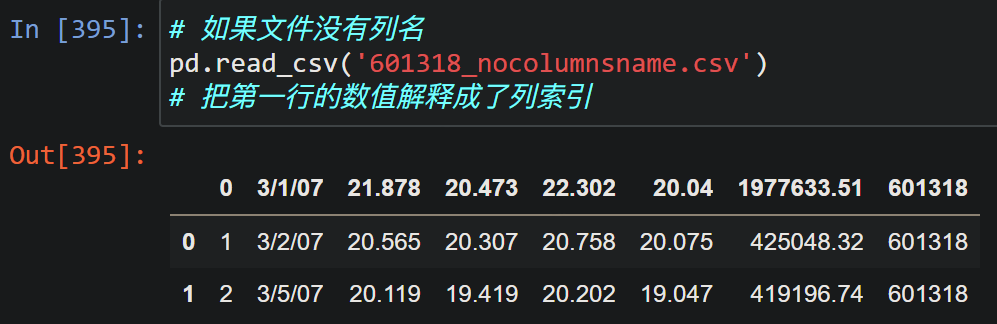
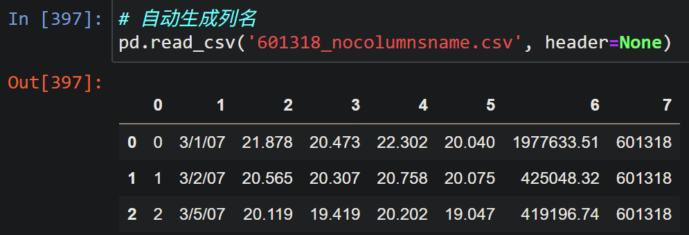
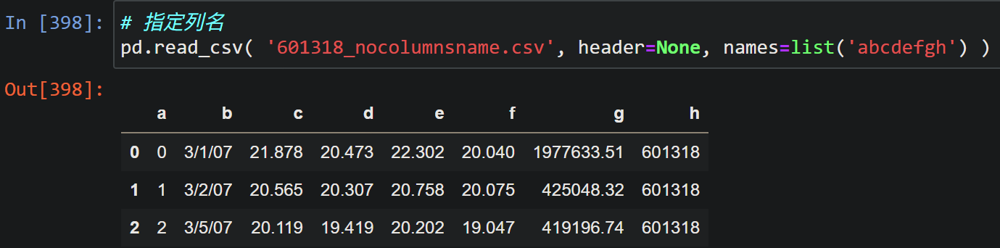

# csv 文件 I/O

### 读取文件 

#### 行索引

csv文件内容

如果不手动指定某一列作为行索引，将自动创建行索引

手动将某一列指定为行索引 (时间解释成了字符串)

将时间字符串解释成 datetime 格式

#### 列索引

csv文件内容，少了原先的第一行 (列标签)

如果不指定header，将自动把第一行数据解释成列标签

使用header参数告知文件中无列名，读入时自动生成默认列名

自定义列名

#### 空缺值识别

