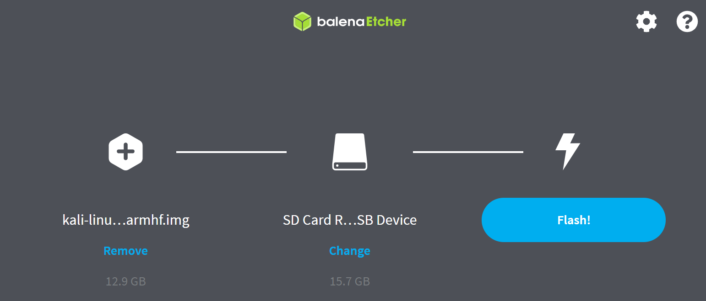
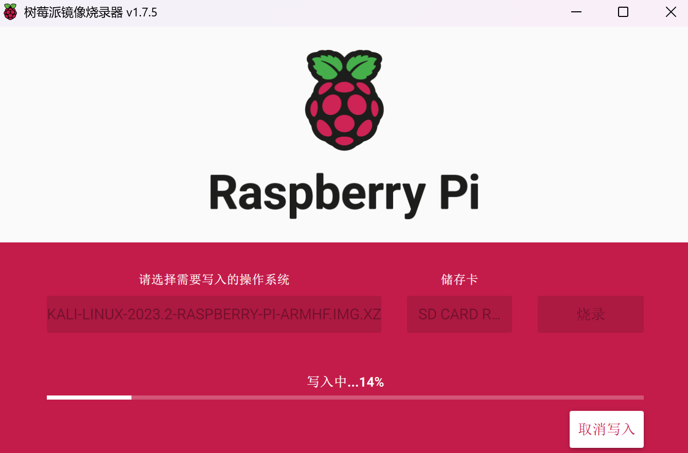

# 安装系统

[树莓派操作系统大全](https://make.quwj.com/member/2/bookmarks?category=37)

## kali linux 系统

[树莓派Raspberrypi安装Kali Linux保姆教程](https://blog.csdn.net/qq_43332010/article/details/120933435)
[树莓派4B安装kali绝对可行完全方案](https://blog.csdn.net/lm19770429/article/details/122757043)

### 事先准备

必须：
1. 树莓派4B
2. [Kali Linux ARM 官方下载地址](https://www.kali.org/get-kali/#kali-arm)
我下载的是32位系统
3. [SD卡烧录软件（树莓派官方推荐）](https://www.raspberrypi.com/software/)
4. SD卡（大于等于16G）

可选：
1. 显示器
2. 键盘
3. 鼠标

PS：可以不要显示器键盘鼠标，用其他电脑远程连接，流程记录在安装 Raspberry Pi OS 系统

### 烧录系统到SD卡

两个软件二选一使用

使用软件 balenaEtcher


使用软件 Raspberry Pi Imager


### 第一次开机

账号 kali，密码 kali
root用户密码设置为 1

插上 RT3070L USB无线网卡，就可以使用WiFi

### 调整分辨率

未完成

准备换4B，等我的mirco hdmi线到


### 试一试先

airo 可以
fluxion 
wifiphisher


## Raspberry Pi OS 系统

### 事先准备

必须：
1. 树莓派3B
2. [系统镜像官方下载地址](https://www.raspberrypi.com/software/operating-systems/)
我下载的是32位Lite版本（无桌面）系统
3. [SD卡烧录软件（树莓派官方推荐）](https://www.raspberrypi.com/software/)
4. SD卡（大于等于16G）


可选：
1. 显示器
2. 键盘
3. 鼠标

### 烧录系统到SD卡


### 第一次开机

设置账号 zk，密码 1
root用户密码设置为 1

关机命令
```shell
sudo halt
```


---


[二进制安全学习路线](https://blog.csdn.net/qq_43332010/article/details/121725989)


