# 安装系统

[树莓派操作系统大全](https://make.quwj.com/member/2/bookmarks?category=37)

## kali linux 系统

[树莓派Raspberrypi安装Kali Linux保姆教程](https://blog.csdn.net/qq_43332010/article/details/120933435)
[树莓派4B安装kali绝对可行完全方案](https://blog.csdn.net/lm19770429/article/details/122757043)

### 事先准备

必须：
1. 树莓派4B
2. [Kali Linux ARM 官方下载地址](https://www.kali.org/get-kali/#kali-arm)
我下载的是32位系统
3. [SD卡烧录软件（树莓派官方推荐）](https://www.raspberrypi.com/software/)
4. SD卡（大于等于16G）

可选：
1. 显示器
2. 键盘
3. 鼠标

PS：可以不要显示器键盘鼠标，用其他电脑远程连接，流程记录在安装 Raspberry Pi OS 系统

### 烧录系统到SD卡

两个软件二选一使用

使用软件 balenaEtcher


使用软件 Raspberry Pi Imager


### 第一次开机

账号 kali，密码 kali
root用户密码设置为 1

插上 RT3070L USB无线网卡，就可以使用WiFi

### 调整分辨率

在 /boot/config.txt 文件中增加
```
# 不留边缘
disable_overscan=1
overscan_left=0
overscan_right=0
overscan_top=0
overscan_bottom=0
# 开启4K模式
hdmi_enable_4kp60=1
```

重启即可

然后在设置中开启 Kali HiDPI Mode

### 换源

速度可以，暂时不换

### 中文输入法

```shell
sudo apt install fcitx
sudo apt-get install fcitx-rime
```
重启即可使用

默认是繁体字，按 F4 键，切换成简体字

### 安装软件

#### gedit

```shell
sudo apt install gedit
```

#### vscode

[vscode官方下载地址](https://code.visualstudio.com/#alt-downloads)

下载 .deb arm32 的版本

```shell
sudo dpkg -i code_1.80.0-1688477950_armhf.deb
```

启动命令
```shell
code .
```

## Raspberry Pi OS 系统

### 事先准备

必须：
1. 树莓派3B
2. [系统镜像官方下载地址](https://www.raspberrypi.com/software/operating-systems/)
我下载的是32位Lite版本（无桌面）系统
3. [SD卡烧录软件（树莓派官方推荐）](https://www.raspberrypi.com/software/)
4. SD卡（大于等于16G）
5. 一台可以远程连接树莓派的电脑

### 烧录系统到SD卡


### 开启ssh功能

在根目录bootfs中，直接新建一个文本文档，重命名为ssh，注意不要保留原来的txt后缀
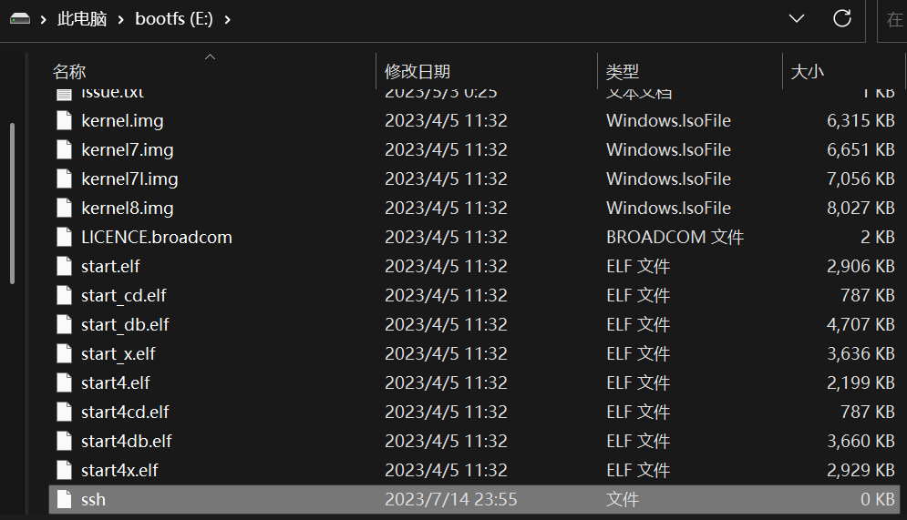

### 连接路由器

#### 有线连接

一根网线分别连接路由器和树莓派

#### 无线连接

在根目录bootfs中，新建文本文档写入以下内容，文件名改为wpa_supplicant.conf
```txt
country=CN
ctrl_interface=DIR=/var/run/wpa_supplicant GROUP=netdev
update_config=1

network={
ssid="WiFi-A"
psk="12345678"
key_mgmt=WPA-PSK
priority=1
}

network={
# ssid:网络名称
ssid="WiFi-B"
# psk:密码
psk="12345678"
# key_mgmt:加密方式
key_mgmt=WPA-PSK
# priority:连接优先级，数字越大优先级越高（不可以是负数）
priority=2
# scan_ssid:连接隐藏WiFi时需要指定该值为1
scan_ssid=1
}

# 如果你的 WiFi 没有密码
network={
ssid="你的无线网络名称"
key_mgmt=NONE
}

# 如果你的 WiFi 使用WEP加密
network={
ssid="你的无线网络名称"
key_mgmt=NONE
wep_key0="你的wifi密码"
}

# 如果你的 WiFi 使用WPA/WPA2加密
network={
ssid="你的无线网络名称"
key_mgmt=WPA-PSK
psk="你的wifi密码"
}
```

此处按自己的WiFi配置填写

#### 确定树莓派的IP地址

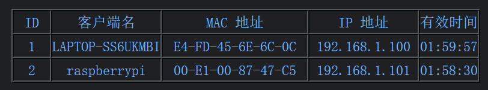

### 启用默认账号

默认用户 pi ，默认密码 raspberry

[树莓派raspberry pi 4 SSH默认密码无法登录解决办法](https://blog.csdn.net/u012329294/article/details/123447208)

pi账号在最近的raspberry pi os中因为安全原因已经删除
那就手动恢复这个账号

在根目录bootfs中，新建文本文档写入以下内容，文件名改为userconf
```txt
pi:$6$/4.VdYgDm7RJ0qM1$FwXCeQgDKkqrOU3RIRuDSKpauAbBvP11msq9X58c8Que2l1Dwq3vdJMgiZlQSbEXGaY5esVHGBNbCxKLVNqZW1
```
注意：以上其实就是username:hash(password)，这一串hash就是raspberry

### ssh远程连接

电脑和树莓派要在同一局域网里

#### FinalShell

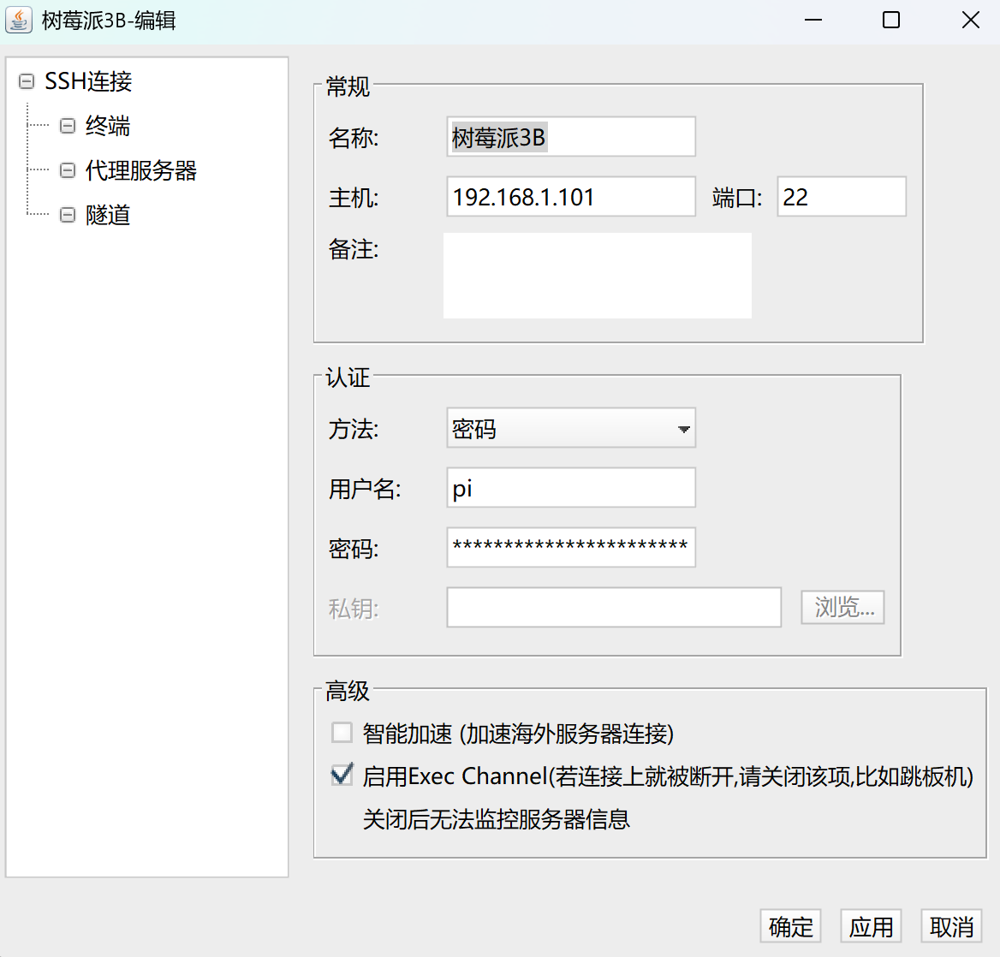

#### putty

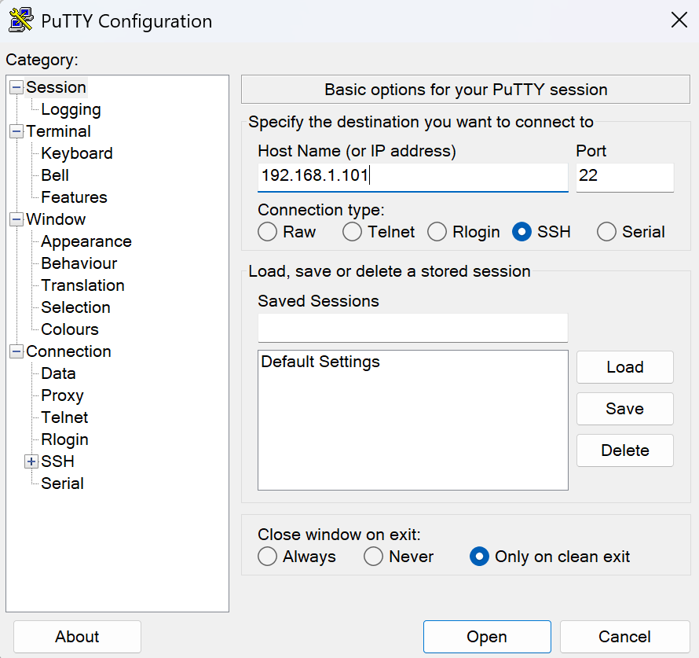

#### cmd命令行

[Windows下cmd命令行ssh连接Linux服务器](https://blog.csdn.net/sungencheng/article/details/123070390)

使用命令
```shell
ssh [用户名]@[ip地址]
```
然后输入该用户的密码即可
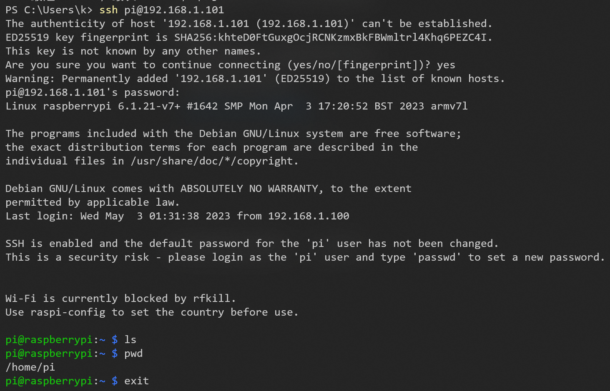

#### termius

[termius官方网站](https://termius.com/)

在iPad上使用
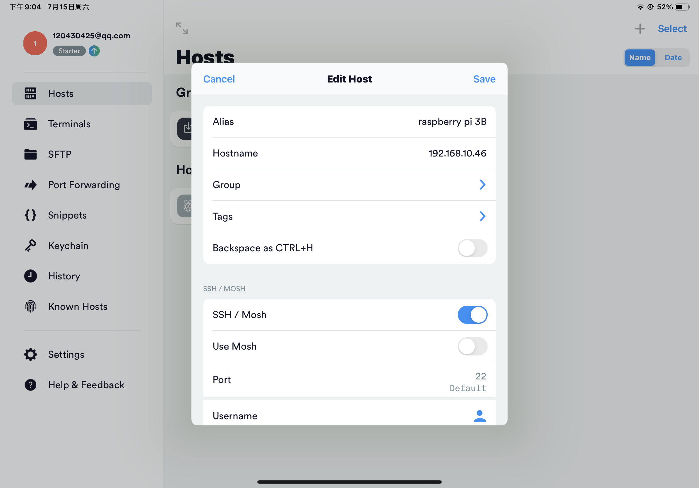
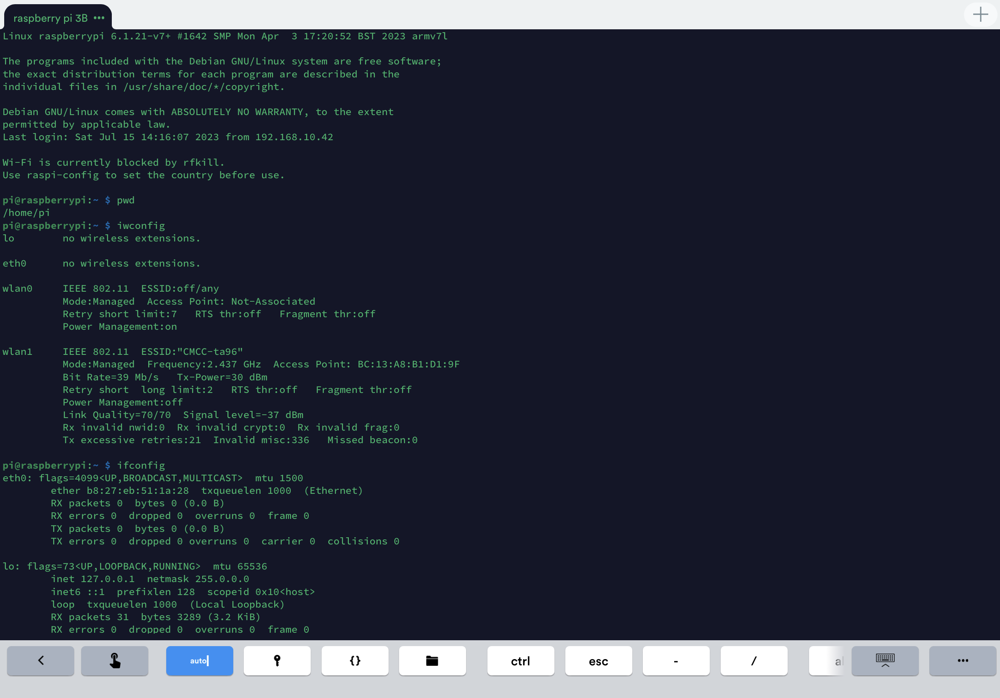

### 用户密码修改

pi 用户的密码为 902309
root 用户的密码为 kzjraspberry

### 关机/重启命令

关机命令
```shell
sudo halt
```

重启命令
```shell
sudo reboot
```

### 使用WiFi

[wpa_cli与wpa_supplicant的理解](https://blog.csdn.net/weixin_42271802/article/details/109852902)

wpa_supplicant工具包含wpa_supplicant和wpa_cli这两个程序，其中wpa_supplicant程序作为服务端在后台运行，服务wpa_cli客户端的请求，从而实现WiFi的配置连接

#### 启用无线网卡

下面命令用于查看无线网卡的信息和状态
```shell
iwconfig
ifconfig
```

如果无线网卡没有启动，可用下面命令来启动
```shell
ifconfig wlan1 up
```

通过下面命令查看无线网卡状态，若<>内显示包括UP关键字说明无线网卡已激活
```shell
ip link show wlan1
```

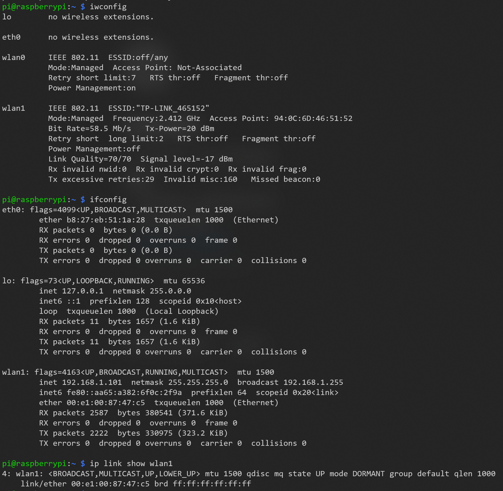

#### 扫描附近的WiFi

[Linux环境下通过wpa_supplicant命令连接WIFI](https://blog.csdn.net/weixin_43361652/article/details/128441233)

下面命令用于搜索附近的WiFi
```shell
iw dev wlan1 scan
# 搜索附近是否有期望的名为[SSID]的WiFi
iw dev wlan1 scan | grep [SSID] 
```

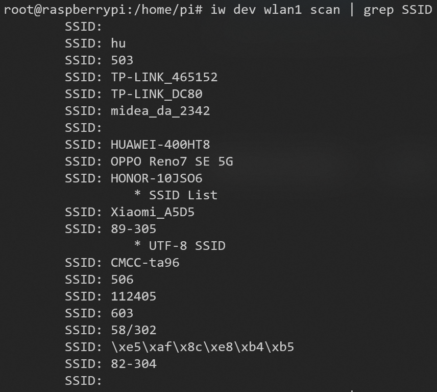
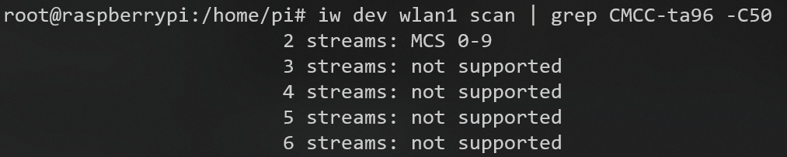

也可以通过wpa_supplicant的客户端工具wpa_cli来扫描WiFi
```shell
# 扫描WiFi
wpa_cli -i wlan1 scan
# 打印扫描结果
wpa_cli -i wlan1 scan_result
```

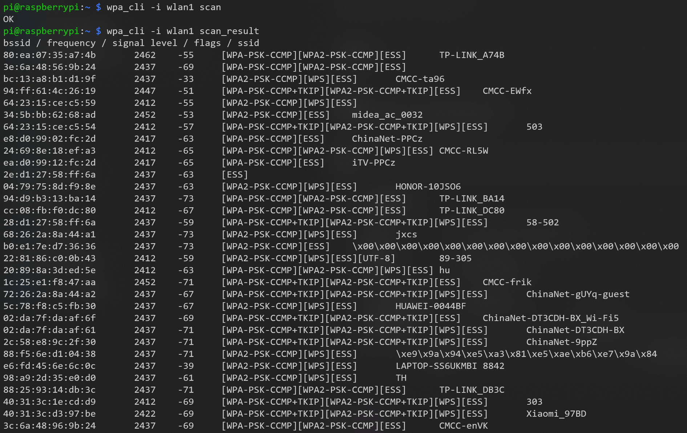

#### 连接WiFi

```shell
# 连接无加密网络
iw dev wlan1 connect [SSID]
# 连接WEP加密网络
iw dev wlan1 connect [SSID] key 0:[WEP密钥]
# 连接WPA/WPA2加密网络
# 在wpa_supplicant.conf文件中添加要连接的WiFi信息
sudo vi /etc/wpa_supplicant/wpa_supplicant.conf
# 从该配置文件启动wpa_supplicant
sudo wpa_supplicant -i wlan1 -c /etc/wpa_supplicant/wpa_supplicant.conf &
```

[vi命令使用详解](https://blog.csdn.net/anliu1/article/details/128397684)

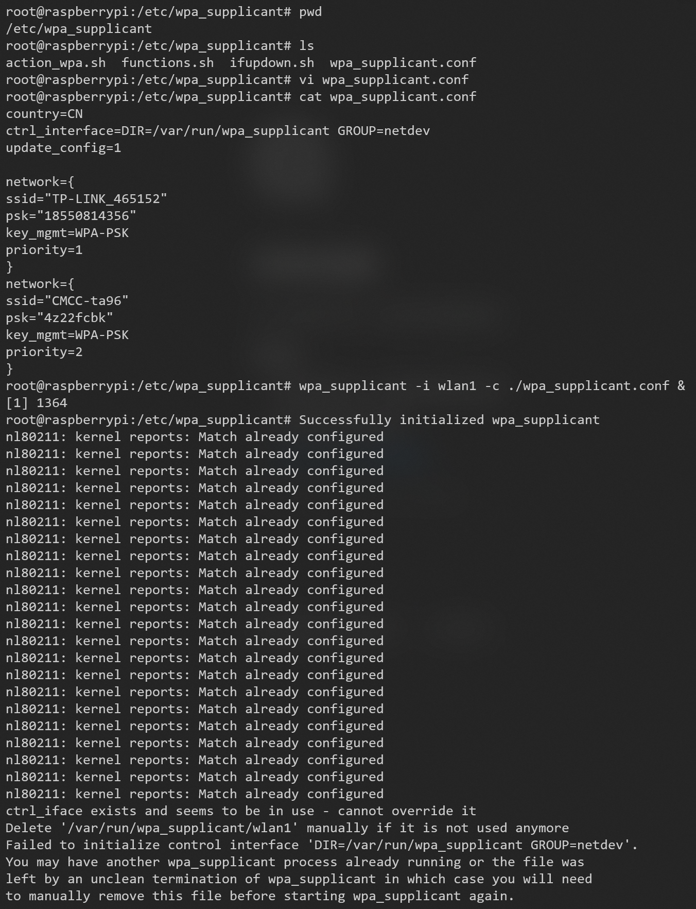
上图报错的原因是，系统已经存在打开的多个wpa_supplicant实例，
执行下面命令杀死所有wpa_supplicant即可
```shell
# 断开WiFi
sudo killall wpa_supplicant
```

[wpa_supplicant连接Wifi错误分析](https://blog.csdn.net/yk150915/article/details/78728796)

但是我们是ssh连接树莓派的，杀死所有wpa_supplicant之后就会断连
这里我用重启树莓派系统代替重启wpa_supplicant

可以使用下面命令查看现在连接的网络
```shell
iw dev wlan1 link
```

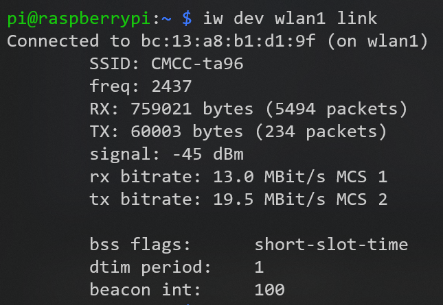

#### 切换WiFi（用wpa_cli来简化操作）

[linux使用wpa_supplicant和wpa_cli手动配置wifi](https://www.cnblogs.com/libra13179/p/14739113.html)
[wpa_cli使用之WIFI开启,扫描热点,连接热点,断开热点,WIFI关闭](https://www.cnblogs.com/lifexy/p/10180653.html)

用wpa_cli添加一个网络连接，比在wpa_supplicant.conf文件中添加要连接的WiFi信息麻烦
所以这里wpa_cli只用来切换已保存的WiFi

```shell
# 查看已保存的WiFi列表
wpa_cli -i wlan1 list_network
# 选择连接指定ID的WiFi
wpa_cli -i wlan1 select_network [ID]
# 查看WiFi连接状态
wpa_cli -i wlan1 status
```

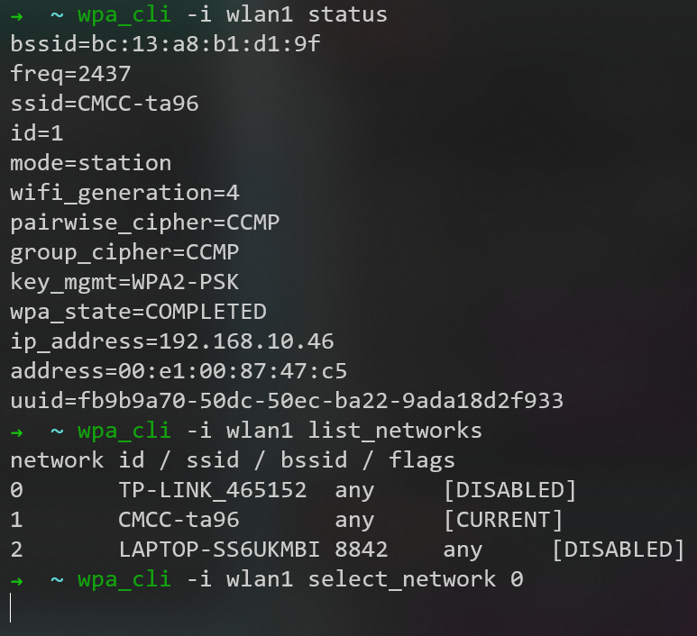

### 安装软件

#### vim

```shell
sudo apt install vim
```

#### zsh

```shell
sudo apt install zsh
```

如果出现找不到命令的情况
~/.zshrc文件中编辑PATH

然后使之生效
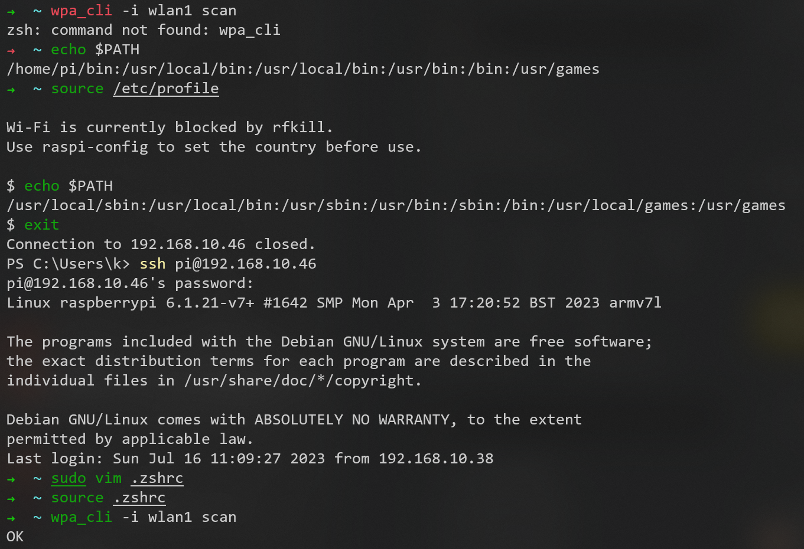

#### oh-my-zsh

配置插件和WSL2中的相同


---


[二进制安全学习路线](https://blog.csdn.net/qq_43332010/article/details/121725989)


[安全论坛](https://www.freebuf.com/)


