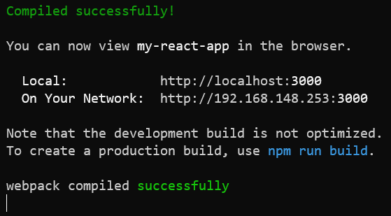

# React 脚手架

## 简介

- react脚手架：用来帮助程序员快速创建一个基于react库的模板项目
- react项目的脚手架库：create-react-app
- 项目的整体技术架构：react + webpack + es6 + eslint
- 使用脚手架开发的项目的特点：模块化、组件化、工程化

## 使用 create-react-app 快速构建 React 开发环境

推荐不要用 npm 全局安装 create-react-app，而是用 npx 单次使用 create-react-app
```sh
npx create-react-app my-react-app
```

命令执行完成后，会在当前目录创建名为 my-react-app 的项目目录

### npm 和 npx 的区别

[npm和npx的区别链接](https://blog.csdn.net/qq_45947664/article/details/127856736)

- npm：会在本地全局性的安装create-react-app，这个包会存储在node目录下面去。以后创建react项目直接执行create-react-app命令就可以了
- npx：会把create-react-app安装包临时安装上，等项目初始化完成以后，他就删除掉

## 运行 React 应用程序

进入项目目录，并使用如下命令运行 React 应用程序
```sh
npm start
```


终端中提示如下图


在浏览器中打开 http://localhost:3000/ ，如下图所示


## 使用脚手架创建项目的目录结构

```sh
my-react-app/
  README.md
  node_modules/
  package.json
  .gitignore
  public/
    favicon.ico
    index.html
    manifest.json
    robots.txt
  src/
    App.css
    App.js
    App.test.js
    index.css
    index.js
    logo.svg
    reportWebVitals.js
    setupTests.js
```

### node_modules/

存放依赖的目录

### public/

存放静态资源的目录，例如 html 文件、css 文件、图片等

代码中的 **%PUBLIC_URL%** 就代表 public/ 文件夹的路径

#### favicon.ico

网站标签图标，必须是 *.ico 格式

#### index.html（重要）

网站首页的html文件
如果没有了这个文件，我们后面写的组件就没有地方放了

```html
<!DOCTYPE html>
<html lang="en">
  <head>
    <meta charset="utf-8" />
    <!-- %PUBLIC_URL% 就代表 public/ 文件夹的路径 -->
    <link rel="icon" href="%PUBLIC_URL%/favicon.ico" />
    <!-- 开启理想视口，用于做移动端网页的适配 -->
    <meta name="viewport" content="width=device-width, initial-scale=1" />
    <!-- 用于配置浏览器页签和地址栏的颜色（兼容性不好） -->
    <meta name="theme-color" content="#000000" />
    <!-- 描述网站信息，方便搜索引擎爬取 -->
    <meta
      name="description"
      content="Web site created using create-react-app"
    />
    <!-- 用于指定网页被收藏后，显示的图标（apple设备） -->
    <link rel="apple-touch-icon" href="%PUBLIC_URL%/logo192.png" />
    <!-- 应用加壳时的配置文件 -->
    <link rel="manifest" href="%PUBLIC_URL%/manifest.json" />
    <title>React App</title>
  </head>
  <body>
    <!-- 如果浏览器不支持js，则展示标签中的内容 -->
    <noscript>You need to enable JavaScript to run this app.</noscript>
    <!-- 后面写的组件都会放到这个容器中 -->
    <div id="root"></div>
  </body>
</html>
```

#### manifest.json

用于应用加壳（应用加壳就是将一个网页应用，变成一个桌面应用）

#### robots.txt

爬虫协议文件

### src/

存放源代码的目录

#### App.css

App组件的样式

#### App.js（重要）

定义了一个 **App组件**，会被放到 public/index.html 文件定义的 **#root容器** 中
自己写的组件，要作为App组件的子组件

#### App.test.js

专门用于测试App，这个文件基本用不到

#### index.css

index.js 文件使用的样式

#### index.js（重要）

入口文件，将 src/App.js 中定义的 **App组件**，渲染到 public/index.html 文件定义的 **#root容器** 中

#### reportWebVitals.js

用于记录页面的性能数据

#### setupTests.js

用于做组件的测试

### package.json

包的说明文件

### README.md

仓库的说明文档

## Helloworld

清空 文件夹 src/ 和 文件夹 public/ 中的文件，我们自己实现一个可运行的最简形式

### 创建 public/index.html

就是html最基本的结构，再加一个 **#root容器**

```html
<!DOCTYPE html>
<html>
    <head>
        <meta charset="utf-8" />
        <title>react脚手架</title>
    </head>
    <body>
        <div id="root"></div>
    </body>
</html>
```

### 创建 src/index.js

渲染 **App组件** 到页面的 **#root容器** 中

```js
// 引入react核心库
import React from 'react';
// 引入ReactDOM
import ReactDOM from 'react-dom';
// 引入App组件
import App from './App';

// 渲染App组件到页面
ReactDOM.render(<App />, document.getElementById('root'));
```

import 时，from 的 **js文件** 或 **jsx文件**，文件的**后缀可省略**

### 创建 src/App.js

创建并暴露 **App组件**

```js
import React from 'react';

// 创建外壳组件App
class App extends React.Component{
    render(){
        return (
            <div>
                <h1>Hello React</h1>
            </div>
        )
    }
}

// 暴露App组件（默认暴露）
export default App;
```

完成上面的3个文件后，可在页面上看出效果


### 默认暴露、分别暴露、统一暴露（export）

[默认暴露、分别暴露、统一暴露的学习](https://blog.csdn.net/u014582342/article/details/124787058)

新建 module.js 文件
```js
const React = {a:1,b:2};
// 分别暴露
export class Component{};
React.Component = Component;
// 默认暴露（只能有一个）
export default React;
const c=3;
const d=4;
// 统一暴露
export {c,d};
```

在另一个文件中引入 module.js 文件中暴露的内容
```js
// 全部引入
import * as content from './module';
console.log(content);
// 引入默认暴露的
import React from './module';
console.log(React);
// 引入分别暴露和统一暴露的
import {Component,c,d} from './module';
console.log(Component,c,d);
```

暴露出的内容如下


#### 对 src/App.js 的优化

1. 由引入 React 再使用 React.Component，变为直接引入 Component
2. 把创建和暴露App组件的代码写到一起

```js
// 这里的{}不是解构赋值，而是es6中的用于引入分别暴露和统一暴露的东西
import React,{Component} from 'react';

// 创建外壳组件App
// 暴露App组件（默认暴露）
export default class App extends Component{
    render(){
        return (
            <div>
                <h1>Hello React</h1>
            </div>
        )
    }
}
```

### 创建 src/components/Hello 文件夹

#### 当前目录下创建 index.jsx

创建并暴露 **Hello组件**

```js
import React,{Component} from 'react';
import './index.css';

export default class Hello extends Component{
    render(){
        return(
            <div>
                <h2 className="title">Hello React</h2>
            </div>
        )
    }
}
```

#### 当前目录下创建 index.css

```css
.title{
    background-color: orange;
}
```
#### 后续 Hello组件 需要用到的资源都放到这个文件夹里

### 修改 src/App.js

引入 **Hello组件**，作为 **App组件** 的子组件

```js
import React,{Component} from 'react';
import Hello from './components/Hello';

export default class App extends Component{
    render(){
        return (
            <div>
                <Hello/>
            </div>
        )
    }
}
```

**import Hello from './components/Hello';** 中能直接**通过文件夹名引用**，是因为如果**省略文件名**，就**默认文件名**为 **index**（文件名后缀为 js 或 jsx）

效果如下


### 样式的模块化

#### 问题：后引入的样式覆盖之前的样式

为了演示这个问题，新增一个 Hello2组件，文件格式同 Hello组件，样式只是把 index.css 中的 orange 改为 blue，同样作为 App组件 的子组件

src/App.js 文件的内容修改为
```js
import React,{Component} from 'react';
import Hello from './components/Hello';
// 后引入的样式覆盖之前的样式
import Hello2 from './components/Hello2';

export default class App extends Component{
    render(){
        return (
            <div>
                <Hello/>
                <Hello2/>
            </div>
        )
    }
}
```

现在项目的目录结构如下

```sh
my-react-app/
  README.md
  node_modules/
  package.json
  .gitignore
  public/
    index.html
  src/
    App.js
    index.js
    components/
      Hello/
        index.js
        index.css
      Hello2/
        index.js
        index.css
```

效果如下


#### 避免样式冲突 方法1：less文件

less文件可以产生嵌套

#### 避免样式冲突 方法2：样式的模块化（module）

把 src/components/Hello/index.css 文件名修改为 src/components/Hello/**index.module.css**

src/components/Hello/index.jsx 文件的内容修改为
```js
import React,{Component} from 'react';
// 新的引入方式
import hello from './index.module.css';

export default class Hello extends Component{
    render(){
        return(
            <div>
                <h2 className={hello.title}>Hello React</h2>
            </div>
        )
    }
}
```

效果如下


---


P54


