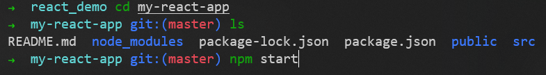

# React 脚手架

## 简介

- react脚手架：用来帮助程序员快速创建一个基于react库的模板项目
- react项目的脚手架库：create-react-app
- 项目的整体技术架构：react + webpack + es6 + eslint
- 使用脚手架开发的项目的特点：模块化、组件化、工程化

## 使用 create-react-app 快速构建 React 开发环境

推荐不要用 npm 全局安装 create-react-app，而是用 npx 单次使用 create-react-app
```sh
npx create-react-app my-react-app
```

命令执行完成后，会在当前目录创建名为 my-react-app 的项目目录

### npm 和 npx 的区别

[npm和npx的区别链接](https://blog.csdn.net/qq_45947664/article/details/127856736)

- npm：会在本地全局性的安装create-react-app，这个包会存储在node目录下面去。以后创建react项目直接执行create-react-app命令就可以了
- npx：会把create-react-app安装包临时安装上，等项目初始化完成以后，他就删除掉

## 运行 React 应用程序

进入项目目录，并使用如下命令运行 React 应用程序
```sh
npm start
```



终端中提示如下图


在浏览器中打开 http://localhost:3000/ ，如下图所示


## 项目目录结构

```sh
my-react-app/
  README.md
  node_modules/
  package.json
  .gitignore
  public/
    favicon.ico
    index.html
    manifest.json
    robots.txt
  src/
    App.css
    App.js
    App.test.js
    index.css
    index.js
    logo.svg
```

### node_modules/

存放依赖的目录

### public/

存放静态资源的目录，例如 html 文件、css 文件、图片等

代码中的 **%PUBLIC_URL%** 就代表 public/ 文件夹的路径

#### favicon.ico

网站标签图标，必须是 *.ico 格式

#### index.html（重要）

网站首页的html文件
如果没有了这个文件，我们后面写的组件就没有地方放了

```html
<!DOCTYPE html>
<html lang="en">
  <head>
    <meta charset="utf-8" />
    <!-- %PUBLIC_URL% 就代表 public/ 文件夹的路径 -->
    <link rel="icon" href="%PUBLIC_URL%/favicon.ico" />
    <!-- 开启理想视口，用于做移动端网页的适配 -->
    <meta name="viewport" content="width=device-width, initial-scale=1" />
    <!-- 用于配置浏览器页签和地址栏的颜色（兼容性不好） -->
    <meta name="theme-color" content="#000000" />
    <!-- 描述网站信息，方便搜索引擎爬取 -->
    <meta
      name="description"
      content="Web site created using create-react-app"
    />
    <!-- 用于指定网页被收藏后，显示的图标（apple设备） -->
    <link rel="apple-touch-icon" href="%PUBLIC_URL%/logo192.png" />
    <!-- 应用加壳时的配置文件 -->
    <link rel="manifest" href="%PUBLIC_URL%/manifest.json" />
    <title>React App</title>
  </head>
  <body>
    <!-- 如果浏览器不支持js，则展示标签中的内容 -->
    <noscript>You need to enable JavaScript to run this app.</noscript>
    <!-- 后面写的组件都会放到这个容器中 -->
    <div id="root"></div>
  </body>
</html>
```

#### manifest.json

用于应用加壳（应用加壳就是将一个网页应用，变成一个桌面应用）

#### robots.txt

爬虫协议文件

### src/

存放源代码的目录

#### App.css

用于配置全局样式

#### App.js

定义了一个 **App组件**，会被放到 public/index.html 文件定义的 **#root容器** 中
自己写的组件，作为App组件的子组件

#### App.test.js

专门用于测试App，这个文件基本用不到

#### index.css

index.js 文件使用的样式

#### index.js

入口文件，将 src/App.js 中定义的 **App组件**，渲染到 public/index.html 文件定义的 **#root容器** 中


---


P51 9min


