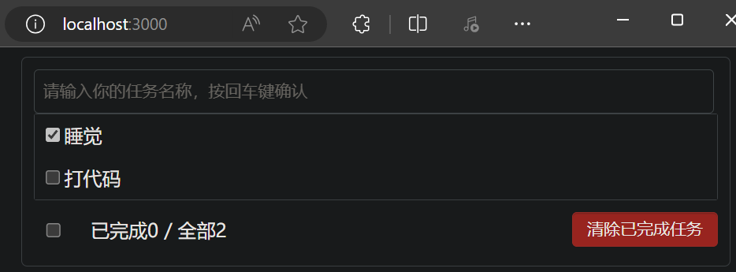
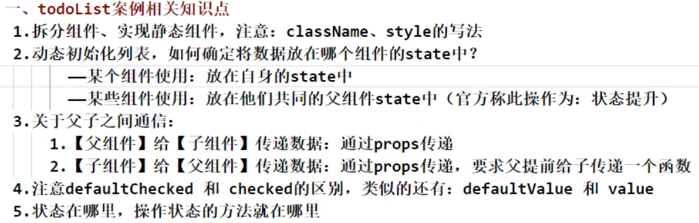

# TodoList 案例

首先初始化项目
```sh
npx create-react-app todolist
```
然后删掉用不到的文件

## 功能界面的组件化编码流程

1. 拆分组件：拆分页面，抽取组件
2. 实现静态组件：使用组件实现静态页面效果
3. 实现动态组件
    1. 动态显示初始化状态 state
       1. 数据类型
       2. 数据名称
       3. 保存到哪个组件
    2. 交互（从绑定事件监听开始）

## 拆分组件


## 实现静态组件

现在项目的目录结构如下
```sh
todolist/
  README.md
  node_modules/
  package.json
  .gitignore
  public/
    index.html
  src/
    App.js
    App.css
    index.js
    components/
      Header/
        index.js
        index.css
      List/
        index.js
        index.css
      Item/
        index.js
        index.css
      Footer/
        index.js
        index.css
```

### public/index.html

```html
<!DOCTYPE html>
<html lang="en">
  <head>
    <meta charset="utf-8" />
    <title>React App</title>
  </head>
  <body>
    <div id="root"></div>
  </body>
</html>
```

### src/App.js

App组件中，包含 Header子组件、List子组件、Footer子组件

```js
import React, { Component } from 'react';
import Header from './components/Header';
import List from './components/List';
import Footer from './components/Footer';
import './App.css';

export default class App extends Component{
  render(){
    return(
      <div className="todo-container">
        <div className="todo-wrap">
          <Header />
          <List />
          <Footer />
        </div>
      </div>
    );
  }
}
```

### src/App.css

```css
/*base*/
body {
  background: #fff;
}

.btn {
  display: inline-block;
  padding: 4px 12px;
  margin-bottom: 0;
  font-size: 14px;
  line-height: 20px;
  text-align: center;
  vertical-align: middle;
  cursor: pointer;
  box-shadow: inset 0 1px 0 rgba(255, 255, 255, 0.2), 0 1px 2px rgba(0, 0, 0, 0.05);
  border-radius: 4px;
}

.btn-danger {
  color: #fff;
  background-color: #da4f49;
  border: 1px solid #bd362f;
}

.btn-danger:hover {
  color: #fff;
  background-color: #bd362f;
}

.btn:focus {
  outline: none;
}

.todo-container {
  width: 600px;
  margin: 0 auto;
}

.todo-container .todo-wrap {
  padding: 10px;
  border: 1px solid #ddd;
  border-radius: 5px;
}
```

### src/index.js

```js
import React from 'react';
import ReactDOM from 'react-dom/client';
import App from './App';

const root = ReactDOM.createRoot(document.getElementById('root'));
root.render(
  <React.StrictMode>
    <App />
  </React.StrictMode>
);
```

### Header组件

#### src/components/Header/index.jsx

```js
import React, { Component } from 'react';
import './index.css'

export default class Header extends Component {
  render() {
    return (
      <div className="todo-header">
        <input type="text" placeholder="请输入你的任务名称，按回车键确认" />
      </div>
    )
  }
}
```

#### src/components/Header/index.css

```css
/*header*/
.todo-header input {
    width: 560px;
    height: 28px;
    font-size: 14px;
    border: 1px solid #ccc;
    border-radius: 4px;
    padding: 4px 7px;
}

.todo-header input:focus {
    outline: none;
    border-color: rgba(82, 168, 236, 0.8);
    box-shadow: inset 0 1px 1px rgba(0, 0, 0, 0.075), 0 0 8px rgba(82, 168, 236, 0.6);
}
```

### List组件

#### src/components/List/index.jsx

List组件中，包含多个 Item子组件

```js
import React, { Component } from 'react';
import Item from '../Item';
import './index.css';

export default class List extends Component {
  render() {
    return (
      <div className="todo-main">
        <Item />
        <Item />
        <Item />
        <Item />
        <Item />
      </div>
    )
  }
}
```

#### src/components/List/index.css

```css
/*main*/
.todo-main {
  margin-left: 0px;
  border: 1px solid #ddd;
  border-radius: 2px;
  padding: 0px;
}

.todo-empty {
  height: 40px;
  line-height: 40px;
  border: 1px solid #ddd;
  border-radius: 2px;
  padding-left: 5px;
  margin-top: 10px;
}
```

### Item组件

#### src/components/Item/index.jsx

```js
import React, { Component } from 'react';
import './index.css';

export default class Item extends Component {
  render() {
    return (
      <div>
        <li>
            <label>
                <input type="checkbox" />
                <span>Todo Item</span>
            </label>
            <button className="btn btn-danger" style={{display:'none'}}>删除</button>
        </li>
      </div>
    )
  }
}
```

#### src/components/Item/index.css

```css
/*item*/
li {
  list-style: none;
  height: 36px;
  line-height: 36px;
  padding: 0 5px;
  border-bottom: 1px solid #ddd;
}

li label {
  float: left;
  cursor: pointer;
}

li label li input {
  vertical-align: middle;
  margin-right: 6px;
  position: relative;
  top: -1px;
}

li button {
  float: right;
  display: none;
  margin-top: 3px;
}

li:before {
  content: initial;
}

li:last-child {
  border-bottom: none;
}
```

### Footer组件

#### src/components/Footer/index.jsx

```js
import React, { Component } from 'react';
import './index.css';

export default class Footer extends Component {
  render() {
    return (
      <div className="todo-footer">
        <label>
            <input type="checkbox" />
        </label>
        <span>
            <span>已完成0</span> / 全部2
        </span>
        <button className="btn btn-danger">清除已完成任务</button>
      </div>
    )
  }
}
```

#### src/components/Footer/index.css

```css
/*footer*/
.todo-footer {
  height: 40px;
  line-height: 40px;
  padding-left: 6px;
  margin-top: 5px;
}

.todo-footer label {
  display: inline-block;
  margin-right: 20px;
  cursor: pointer;
}

.todo-footer label input {
  position: relative;
  top: -1px;
  vertical-align: middle;
  margin-right: 5px;
}

.todo-footer button {
  float: right;
  margin-top: 5px;
}
```

效果如下


## 动态初始化列表

比较自然的选择是，让 **List组件** 的 state 保存要渲染的列表数据
但是现在还**没有学习组件间通信**，Header组件 要把用户输入的东西传给 List组件（Header组件 和 List组件 是**兄弟组件**），现在还实现不了

App组件 是所有组件的父组件，让 **App组件** 的 state **保存要渲染的列表数据**
这样，**Header子组件**（添加数据） 和 **List子组件**（拿到数据并展示） 就可以通过他们的父组件 **App组件** 进行交互

### src/App.js

- 在App组件中，**初始化** **todos数组**，用来保存用户输入的数据
- 把 todos数组 传递给 **List子组件**

```js
import React, { Component } from 'react';
import Header from './components/Header';
import List from './components/List';
import Footer from './components/Footer';
import './App.css';

export default class App extends Component{
  // 初始化状态
  state = {
    todos: [
      {id:'001',name:'吃饭',done:true},
      {id:'002',name:'睡觉',done:true},
      {id:'003',name:'打代码',done:false},
    ]
  }
  render(){
    const {todos} = this.state;
    return(
      <div className="todo-container">
        <div className="todo-wrap">
          <Header />
          <List todos={todos}/>
          <Footer />
        </div>
      </div>
    );
  }
}
```

### src/components/List/index.jsx

- 在 List组件 中**接收** **todos数组**
- 把 todos数组 的每一项分别传递给各个 **Item子组件**

```js
import React, { Component } from 'react';
import Item from '../Item';
import './index.css';

export default class List extends Component {
  render() {
    const {todos} = this.props;
    return (
      <div className="todo-main">
        {
          todos.map((todo, index) => (
            // 用index作为key会导致问题，详见 DOM 的 diffing 算法
            // <Item key={index} todo={todo} />
            <Item key={todo.id} todo={todo} />
          ))
        }
      </div>
    )
  }
}
```

注意：
用 index 作为 key 不太好，在之前的 **DOM 的 diffing 算法** 中讲过

### src/components/Item/index.jsx

- 在 Item组件 中**渲染** **todo对象**

```js
import React, { Component } from 'react';
import './index.css';

export default class Item extends Component {
  render() {
    const {todo} = this.props;
    const {id,name,done} = todo;
    return (
      <div>
        <li>
            <label>
                <input type="checkbox" defaultChecked={done}/>
                <span>{name}</span>
            </label>
            <button className="btn btn-danger" style={{display:'none'}}>删除</button>
        </li>
      </div>
    )
  }
}
```

效果如下


## 添加列表项

从 父组件 传递数据给 子组件，很简单，使用 props 即可
现在想要做的是，从 **子组件** 传递数据给 **父组件**，要怎么实现？
答：
**父组件通过 props 传递一个函数给子组件，子组件通过调用函数，把数据传递给父组件**

### src/App.js

- 在 App组件 里，给 **Header子组件** 传递一个**addTodo函数**，子组件 **Header子组件** 通过调用函数，把数据传递给父组件 **App组件**

```js
import React, { Component } from 'react';
import Header from './components/Header';
import List from './components/List';
import Footer from './components/Footer';
import './App.css';

export default class App extends Component{
  // 初始化状态
  state = {
    todos: [
      {id:'001',name:'吃饭',done:true},
      {id:'002',name:'睡觉',done:true},
      {id:'003',name:'打代码',done:false},
    ]
  }
  // 用于添加一个todo，接收的参数是todo对象
  addTodo = (todoObj)=>{
    // 获取原todos数组
    const {todos} = this.state;
    // 在todos数组中追加一个todo对象，定义成一个新的todos数组
    const newTodos = [todoObj,...todos];
    // 更新状态
    this.setState({todos:newTodos});
  }
  render(){
    const {todos} = this.state;
    return(
      <div className="todo-container">
        <div className="todo-wrap">
          <Header addTodo={this.addTodo}/>
          <List todos={todos}/>
          <Footer />
        </div>
      </div>
    );
  }
}
```

### src/components/Header/index.jsx

- 在 Header组件 里，给回车键绑定一个键盘事件，把获取的**值传递**给 **父组件** **App组件**

```js
import React, { Component } from 'react';
import {nanoid} from 'nanoid';
import './index.css';

export default class Header extends Component {
    handleKeyUp = (event) => {
        // 解构赋值获取keyCode,target
        const {keyCode,target} = event;
        // 判断是否是回车键
        if(keyCode === 13){
            // 添加的todo的名字不能为空
            if(target.value.trim() === ''){
                alert('输入不能为空');
                return;
            }
            // 准备好一个todo对象
            const todoObj = {id:nanoid(),name:target.value,done:false};
            // 将todo对象传递给App组件
            this.props.addTodo(todoObj);
            // 清空输入
            target.value = '';
        }
    }
    render() {
        return (
            <div className="todo-header">
                <input onKeyUp={this.handleKeyUp} type="text" placeholder="请输入你的任务名称，按回车键确认" />
            </div>
        )
    }
}
```

注意：
要使用 nanoid（用于生成唯一id），要用 npm 安装

效果如下


## 鼠标移入效果

想要在鼠标移入某一项的时候，这一项高亮且显示删除按钮，在鼠标移出的时候，隐藏删除按钮

### src/components/Item/index.jsx

- 在 Item组件 里，给列表项绑定 鼠标移入事件 和 鼠标移出事件，并在事件的回调函数中，更改状态 state

```js
import React, { Component } from 'react';
import './index.css';

export default class Item extends Component {
  state = {mouseIsEnter:false}
  // 高阶函数
  // 鼠标移入、移出的回调
  handleMouse = (isEnter) => {
    return (event) => {
      this.setState({mouseIsEnter:isEnter})
    }
  }
  render() {
    const {todo} = this.props;
    const {id,name,done} = todo;
    const {mouseIsEnter} = this.state;
    return (
      <div>
        <li style={{backgroundColor:mouseIsEnter ? '#ddd' : 'white'}} onMouseEnter={this.handleMouse(true)} onMouseLeave={this.handleMouse(false)}>
            <label>
                <input type="checkbox" defaultChecked={done}/>
                <span>{name}</span>
            </label>
            <button className="btn btn-danger" style={{display:mouseIsEnter ? 'block' : 'none'}}>删除</button>
        </li>
      </div>
    )
  }
}
```

效果如下


## 修改列表项的选中和取消选中

和之前的 添加列表项 类似，**子组件** 想要操作 **父组件** 的 state
**父组件通过 props 传递一个函数给子组件，子组件通过调用函数，把数据传递给父组件**

但是 添加列表项 中的 **App组件** 和 **Header组件** 是父子关系，而这里的 **App组件** 和 **Item组件** 是**祖孙关系**
那就一层一层传递函数，**App组件** 先给 **List组件** 传递函数，但是 List组件 不用，**List组件** 转手把函数传递给 **Item组件**，Item组件 调用函数，把数据传给 **App组件**

### src/App.js

- 在 App组件 里，给 **List子组件** 传递一个**updateTodo函数**
- **状态 state 在哪里，操作状态的函数就在哪里**

```js
import React, { Component } from 'react';
import Header from './components/Header';
import List from './components/List';
import Footer from './components/Footer';
import './App.css';

export default class App extends Component{
  // 初始化状态
  state = {
    todos: [
      {id:'001',name:'吃饭',done:true},
      {id:'002',name:'睡觉',done:true},
      {id:'003',name:'打代码',done:false},
    ]
  }
  // 用于添加一个todo，接收的参数是todo对象
  addTodo = (todoObj)=>{
    // 获取原todos数组
    const {todos} = this.state;
    // 在todos数组中追加一个todo对象，定义成一个新的todos数组
    const newTodos = [todoObj,...todos];
    // 更新状态
    this.setState({todos:newTodos});
  }
  // 用于更新一个todo对象
  updateTodo = (id,done)=>{
    // 获取原todos数组
    const {todos} = this.state;
    // 匹配数据并修改
    const newTodos = todos.map((todoObj)=>{
      if(todoObj.id === id) return {...todoObj,done:done};
      else return todoObj;
    })
    this.setState({todos:newTodos});
  }
  render(){
    const {todos} = this.state;
    return(
      <div className="todo-container">
        <div className="todo-wrap">
          <Header addTodo={this.addTodo}/>
          <List todos={todos} updateTodo={this.updateTodo}/>
          <Footer />
        </div>
      </div>
    );
  }
}
```

### src/components/List/index.jsx

- 在 List组件 中**接收** **updateTodo函数**
- 把 updateTodo函数 继续传递给 **Item子组件**

```js
import React, { Component } from 'react';
import Item from '../Item';
import './index.css';

export default class List extends Component {
  render() {
    const {todos,updateTodo} = this.props;
    return (
      <div className="todo-main">
        {
          todos.map((todo, index) => (
            // 用index作为key会导致问题，详见 DOM 的 diffing 算法
            // <Item key={index} todo={todo} />
            <Item key={todo.id} todo={todo} updateTodo={updateTodo}/>
          ))
        }
      </div>
    )
  }
}
```

### src/components/Item/index.jsx

- 在 Item组件 里，给复选框绑定 onChange事件，并在事件的回调函数中，调用接收到的 **updateTodo函数**，把获取的**值传递**给 **祖先组件** **App组件**

```js
import React, { Component } from 'react';
import './index.css';

export default class Item extends Component {
  state = {mouseIsEnter:false}
  // 高阶函数
  // 鼠标移入、移出的回调
  handleMouse = (isEnter) => {
    return (event) => {
      this.setState({mouseIsEnter:isEnter})
    }
  }
  // 勾选、取消勾选某一个todo的回调
  handleCheck = (id) => {
    return (event) => {
      // 向App组件传递数据
      this.props.updateTodo(id,event.target.checked);
    }
  }
  render() {
    const {todo} = this.props;
    const {id,name,done} = todo;
    const {mouseIsEnter} = this.state;
    return (
      <div>
        <li style={{backgroundColor:mouseIsEnter ? '#ddd' : 'white'}} onMouseEnter={this.handleMouse(true)} onMouseLeave={this.handleMouse(false)}>
            <label>
                <input type="checkbox" defaultChecked={done} onChange={this.handleCheck(id)}/>
                <span>{name}</span>
            </label>
            <button className="btn btn-danger" style={{display:mouseIsEnter ? 'block' : 'none'}}>删除</button>
        </li>
      </div>
    )
  }
}
```

效果如下


## 对 props 进行限制

App组件 通过 props 给 Header子组件 和 List子组件 传递数据，但是没有对传递的 props 进行类型和必要性的限制，接下来我们限制一下
使用 **PropTypes** 进行类型和必要性的限制

### src/components/Header/index.jsx

- 在 Header组件 里，对接收到的 **addTodo函数** 进行限制

```js
import React, { Component } from 'react';
import PropsTypes from 'prop-types';
import {nanoid} from 'nanoid';
import './index.css';

export default class Header extends Component {
    // 对接收的props的类型和必要性进行限制
    static propsTypes = {
        addTodo:PropsTypes.func.isRequired,
    }
    handleKeyUp = (event) => {
        // 解构赋值获取keyCode,target
        const {keyCode,target} = event;
        // 判断是否是回车键
        if(keyCode === 13){
            // 添加的todo的名字不能为空
            if(target.value.trim() === ''){
                alert('输入不能为空');
                return;
            }
            // 准备好一个todo对象
            const todoObj = {id:nanoid(),name:target.value,done:false};
            // 将todo对象传递给App组件
            this.props.addTodo(todoObj);
            // 清空输入
            target.value = '';
        }
    }
    render() {
        return (
            <div className="todo-header">
                <input onKeyUp={this.handleKeyUp} type="text" placeholder="请输入你的任务名称，按回车键确认" />
            </div>
        )
    }
}
```

注意：
要使用 prop-types，要用 npm 安装

### src/components/List/index.jsx

- 同理，在 List组件 里，对接收到的 **todos数组** 和 **updateTodo函数** 进行限制

```js
import React, { Component } from 'react';
import PropsTypes from 'prop-types';
import Item from '../Item';
import './index.css';

export default class List extends Component {
  static propTypes = {
    todos: PropsTypes.array.isRequired,
    updateTodo: PropsTypes.func.isRequired,
  }
  render() {
    const {todos,updateTodo} = this.props;
    return (
      <div className="todo-main">
        {
          todos.map((todo, index) => (
            // 用index作为key会导致问题，详见 DOM 的 diffing 算法
            // <Item key={index} todo={todo} />
            <Item key={todo.id} todo={todo} updateTodo={updateTodo}/>
          ))
        }
      </div>
    )
  }
}
```

### src/components/Item/index.jsx

- 同理，在 Item组件 里，对接收到的 **todos数组** 和 **updateTodo函数** 进行限制

```js
import React, { Component } from 'react';
import PropsTypes from 'prop-types';
import './index.css';

export default class Item extends Component {
  static propTypes = {
    // 注意传入的key不是prop，不能在这里进行限制
    todo: PropsTypes.object.isRequired,
    updateTodo: PropsTypes.func.isRequired,
  }
  state = {mouseIsEnter:false}
  // 高阶函数
  // 鼠标移入、移出的回调
  handleMouse = (isEnter) => {
    return (event) => {
      this.setState({mouseIsEnter:isEnter})
    }
  }
  // 勾选、取消勾选某一个todo的回调
  handleCheck = (id) => {
    return (event) => {
      // 向App组件传递数据
      this.props.updateTodo(id,event.target.checked);
    }
  }
  render() {
    const {todo} = this.props;
    const {id,name,done} = todo;
    const {mouseIsEnter} = this.state;
    return (
      <div>
        <li style={{backgroundColor:mouseIsEnter ? '#ddd' : 'white'}} onMouseEnter={this.handleMouse(true)} onMouseLeave={this.handleMouse(false)}>
            <label>
                <input type="checkbox" defaultChecked={done} onChange={this.handleCheck(id)}/>
                <span>{name}</span>
            </label>
            <button className="btn btn-danger" style={{display:mouseIsEnter ? 'block' : 'none'}}>删除</button>
        </li>
      </div>
    )
  }
}
```

## 删除一个列表项

实现每一项右侧的删除按钮的功能，用户点击删除按钮后，要跳出一个弹窗让用户确认

和之前的 修改列表项的选中和取消选中 类似，一层一层传递函数，**App组件** 先给 **List组件** 传递函数，但是 List组件 不用，**List组件** 转手把函数传递给 **Item组件**，Item组件 调用函数，把数据传给 **App组件**

### src/App.js

- 在 App组件 里，给 **List子组件** 传递一个**deleteTodo函数**
- **状态 state 在哪里，操作状态的函数就在哪里**

```js
import React, { Component } from 'react';
import Header from './components/Header';
import List from './components/List';
import Footer from './components/Footer';
import './App.css';

export default class App extends Component{
  // 初始化状态
  state = {
    todos: [
      {id:'001',name:'吃饭',done:true},
      {id:'002',name:'睡觉',done:true},
      {id:'003',name:'打代码',done:false},
    ]
  }
  // 用于添加一个todo，接收的参数是todo对象
  addTodo = (todoObj)=>{
    // 获取原todos数组
    const {todos} = this.state;
    // 在todos数组中追加一个todo对象，定义成一个新的todos数组
    const newTodos = [todoObj,...todos];
    // 更新状态
    this.setState({todos:newTodos});
  }
  // 用于更新一个todo对象
  updateTodo = (id,done)=>{
    // 获取原todos数组
    const {todos} = this.state;
    // 匹配数据并修改
    const newTodos = todos.map((todoObj)=>{
      if(todoObj.id === id) return {...todoObj,done:done};
      else return todoObj;
    })
    this.setState({todos:newTodos});
  }
  // 用于删除一个todo对象
  deleteTodo = (id)=>{
    const {todos} = this.state;
    // 删除指定id的todo对象
    const newTodos = todos.filter((todoObj)=>{
      return todoObj.id !== id;
    })
    this.setState({todos:newTodos});
  }
  render(){
    const {todos} = this.state;
    return(
      <div className="todo-container">
        <div className="todo-wrap">
          <Header addTodo={this.addTodo}/>
          <List todos={todos} updateTodo={this.updateTodo} deleteTodo={this.deleteTodo}/>
          <Footer />
        </div>
      </div>
    );
  }
}
```

### src/components/List/index.jsx

- 在 List组件 中**接收** **deleteTodo函数**
- 把 deleteTodo函数 继续传递给 **Item子组件**

```js
import React, { Component } from 'react';
import PropsTypes from 'prop-types';
import Item from '../Item';
import './index.css';

export default class List extends Component {
  static propTypes = {
    todos: PropsTypes.array.isRequired,
    updateTodo: PropsTypes.func.isRequired,
    deleteTodo: PropsTypes.func.isRequired,
  }
  render() {
    const {todos,updateTodo,deleteTodo} = this.props;
    return (
      <div className="todo-main">
        {
          todos.map((todo, index) => (
            // 用index作为key会导致问题，详见 DOM 的 diffing 算法
            // <Item key={index} todo={todo} />
            <Item key={todo.id} todo={todo} updateTodo={updateTodo} deleteTodo={deleteTodo}/>
          ))
        }
      </div>
    )
  }
}
```

### src/components/Item/index.jsx

- 在 Item组件 里，给删除按钮绑定 onClick事件，并在事件的回调函数中，调用接收到的 **deleteTodo函数**，把要删除对象的id的**值传递**给 **祖先组件** **App组件**

```js
import React, { Component } from 'react';
import PropsTypes from 'prop-types';
import './index.css';

export default class Item extends Component {
  static propTypes = {
    // 注意传入的key不是prop，不能在这里进行限制
    todo: PropsTypes.object.isRequired,
    updateTodo: PropsTypes.func.isRequired,
  }
  state = {mouseIsEnter:false}
  // 高阶函数
  // 鼠标移入、移出的回调
  handleMouse = (isEnter) => {
    return (event) => {
      this.setState({mouseIsEnter:isEnter})
    }
  }
  // 勾选、取消勾选某一个todo的回调
  handleCheck = (id) => {
    return (event) => {
      // 向App组件传递数据
      this.props.updateTodo(id,event.target.checked);
    }
  }
  // 不用写成高阶函数了
  // 删除一个todo的回调
  handleDelete = (id) => {
    if(window.confirm('确定要删除吗？')){
      this.props.deleteTodo(id);
    }
  }
  render() {
    const {todo} = this.props;
    const {id,name,done} = todo;
    const {mouseIsEnter} = this.state;
    return (
      <div>
        <li style={{backgroundColor:mouseIsEnter ? '#ddd' : 'white'}} onMouseEnter={this.handleMouse(true)} onMouseLeave={this.handleMouse(false)}>
            <label>
                <input type="checkbox" defaultChecked={done} onChange={this.handleCheck(id)}/>
                <span>{name}</span>
            </label>
            <button onClick={()=>{this.handleDelete(id)}} className="btn btn-danger" style={{display:mouseIsEnter ? 'block' : 'none'}}>删除</button>
        </li>
      </div>
    )
  }
}
```

效果如下



## 实现底部的统计功能

统计 已完成任务 和 全部任务 的数量

### src/App.js

- 在App组件中，把 todos数组 传递给 **Footer子组件**

```js
import React, { Component } from 'react';
import Header from './components/Header';
import List from './components/List';
import Footer from './components/Footer';
import './App.css';

export default class App extends Component{
  // 初始化状态
  state = {
    todos: [
      {id:'001',name:'吃饭',done:true},
      {id:'002',name:'睡觉',done:true},
      {id:'003',name:'打代码',done:false},
    ]
  }
  // 用于添加一个todo，接收的参数是todo对象
  addTodo = (todoObj)=>{
    // 获取原todos数组
    const {todos} = this.state;
    // 在todos数组中追加一个todo对象，定义成一个新的todos数组
    const newTodos = [todoObj,...todos];
    // 更新状态
    this.setState({todos:newTodos});
  }
  // 用于更新一个todo对象
  updateTodo = (id,done)=>{
    // 获取原todos数组
    const {todos} = this.state;
    // 匹配数据并修改
    const newTodos = todos.map((todoObj)=>{
      if(todoObj.id === id) return {...todoObj,done:done};
      else return todoObj;
    })
    this.setState({todos:newTodos});
  }
  // 用于删除一个todo对象
  deleteTodo = (id)=>{
    const {todos} = this.state;
    // 删除指定id的todo对象
    const newTodos = todos.filter((todoObj)=>{
      return todoObj.id !== id;
    })
    this.setState({todos:newTodos});
  }
  render(){
    const {todos} = this.state;
    return(
      <div className="todo-container">
        <div className="todo-wrap">
          <Header addTodo={this.addTodo}/>
          <List todos={todos} updateTodo={this.updateTodo} deleteTodo={this.deleteTodo}/>
          <Footer todos={todos}/>
        </div>
      </div>
    );
  }
}
```

### src/components/Footer/index.jsx

- 在 Footer组件 中**接收** **todos数组**
- 对 todos数组 进行统计

```js
import React, { Component } from 'react';
import './index.css';

export default class Footer extends Component {
  render() {
    const {todos} = this.props;
    // 计算已完成todo的个数
    // reduce()方法传入2个参数，第二个参数是初始值（第一轮调用回调函数的初始值），第一个参数是回调函数
    // 回调函数有2个参数，第一个是初始值，第二个是当前遍历的数组元素，返回值作为新的初始值作为下一轮对回调函数的初始值参数
    const doneCount = todos.reduce((pre,todoObj)=>{return pre+ (todoObj.done ? 1 : 0)},0)
    // 计算全部todo的个数
    const total = todos.length;
    return (
      <div className="todo-footer">
        <label>
            <input type="checkbox" />
        </label>
        <span>
            <span>已完成{doneCount}</span> / 全部{total}
        </span>
        <button className="btn btn-danger">清除已完成任务</button>
      </div>
    )
  }
}
```

[js中reduce()的使用](https://developer.mozilla.org/zh-CN/docs/Web/JavaScript/Reference/Global_Objects/Array/Reduce)

效果如下


## 底部组件的复选框实现全选功能

当列表项全部被选中时，底部组件的复选框也应该被选中；反之，不被选中；特殊的，当列表项为0个时，复选框也不应该被选中
当我们人为更改底部组件的复选框是否被选中时，需要将状态同步到 todos 数组中

### src/components/Footer/index.jsx

- 实现底部组件的复选框**显示**是否全选的功能（暂时还**不能人为更改**底部组件的复选框是否被选中）

```js
import React, { Component } from 'react';
import './index.css';

export default class Footer extends Component {
  render() {
    const {todos} = this.props;
    // 计算已完成todo的个数
    // reduce()方法传入2个参数，第二个参数是初始值（第一轮调用回调函数的初始值），第一个参数是回调函数
    // 回调函数有2个参数，第一个是初始值，第二个是当前遍历的数组元素，返回值作为新的初始值作为下一轮对回调函数的初始值参数
    const doneCount = todos.reduce((pre,todoObj)=>{return pre+ (todoObj.done ? 1 : 0)},0)
    // 计算全部todo的个数
    const total = todos.length;
    return (
      <div className="todo-footer">
        <label>
            <input type="checkbox" checked={ (doneCount === total && total !== 0) ? true : false}/>
        </label>
        <span>
            <span>已完成{doneCount}</span> / 全部{total}
        </span>
        <button className="btn btn-danger">清除已完成任务</button>
      </div>
    )
  }
}
```

效果如下


### src/App.js

- 在 App组件 里，给 **Footer子组件** 传递一个**checkAllTodo函数**

```js
import React, { Component } from 'react';
import Header from './components/Header';
import List from './components/List';
import Footer from './components/Footer';
import './App.css';

export default class App extends Component{
  // 初始化状态
  state = {
    todos: [
      {id:'001',name:'吃饭',done:true},
      {id:'002',name:'睡觉',done:true},
      {id:'003',name:'打代码',done:false},
    ]
  }
  // 用于添加一个todo，接收的参数是todo对象
  addTodo = (todoObj)=>{
    // 获取原todos数组
    const {todos} = this.state;
    // 在todos数组中追加一个todo对象，定义成一个新的todos数组
    const newTodos = [todoObj,...todos];
    // 更新状态
    this.setState({todos:newTodos});
  }
  // 用于更新一个todo对象
  updateTodo = (id,done)=>{
    // 获取原todos数组
    const {todos} = this.state;
    // 匹配数据并修改
    const newTodos = todos.map((todoObj)=>{
      if(todoObj.id === id) return {...todoObj,done:done};
      else return todoObj;
    })
    this.setState({todos:newTodos});
  }
  // 用于删除一个todo对象
  deleteTodo = (id)=>{
    const {todos} = this.state;
    // 删除指定id的todo对象
    const newTodos = todos.filter((todoObj)=>{
      return todoObj.id !== id;
    })
    this.setState({todos:newTodos});
  }
  // 用于全选或全不选
  checkAllTodo = (done)=>{
    const {todos} = this.state;
    const newTodos = todos.map((todoObj)=>{
      return {...todoObj,done:done};
    })
    this.setState({todos:newTodos});
  }
  render(){
    const {todos} = this.state;
    return(
      <div className="todo-container">
        <div className="todo-wrap">
          <Header addTodo={this.addTodo}/>
          <List todos={todos} updateTodo={this.updateTodo} deleteTodo={this.deleteTodo}/>
          <Footer todos={todos} checkAllTodo={this.checkAllTodo}/>
        </div>
      </div>
    );
  }
}
```

### src/components/Footer/index.jsx

- 实现**人为更改**底部组件的复选框是否被选中，并将状态同步到 todos 数组中
- 在 Footer组件 里，给底部复选框绑定 onChange事件，并在事件的回调函数中，调用接收到的 **checkAllTodo函数**，实现全选或全不选的功能

```js
import React, { Component } from 'react';
import './index.css';

export default class Footer extends Component {
  handleCheckAll = (event) => {
    this.props.checkAllTodo(event.target.checked);
  }
  render() {
    const {todos} = this.props;
    // 计算已完成todo的个数
    // reduce()方法传入2个参数，第二个参数是初始值（第一轮调用回调函数的初始值），第一个参数是回调函数
    // 回调函数有2个参数，第一个是初始值，第二个是当前遍历的数组元素，返回值作为新的初始值作为下一轮对回调函数的初始值参数
    const doneCount = todos.reduce((pre,todoObj)=>{return pre+ (todoObj.done ? 1 : 0)},0)
    // 计算全部todo的个数
    const total = todos.length;
    return (
      <div className="todo-footer">
        <label>
            <input type="checkbox" onChange={this.handleCheckAll} checked={ (doneCount === total && total !== 0) ? true : false}/>
        </label>
        <span>
            <span>已完成{doneCount}</span> / 全部{total}
        </span>
        <button className="btn btn-danger">清除已完成任务</button>
      </div>
    )
  }
}
```

但是发现，虽然 todos 数组中的数据确实改变了，但是**没有反应**到 **Item组件** 的渲染上，效果如下


问题出在 Item组件 的复选框的 **defaultChecked** 属性上

#### src/components/Item/index.jsx（前期埋下的坑）

- 注意，复选框的 **checked** 属性与 **defaultChecked** 属性的区别：
- defaultChecked 只在初次渲染时生效，更新时不受控制
- checked 始终受到控制，必须通过绑定 onChange 事件来控制选中情况
- 所以要把 Item组件 的复选框的 **defaultChecked** 属性改成 **checked** 属性

[defaultChecked 跟 checked 及 defaultValue 跟 value 的区别](https://blog.csdn.net/TL18382950497/article/details/115425569)

```js
import React, { Component } from 'react';
import PropsTypes from 'prop-types';
import './index.css';

export default class Item extends Component {
  static propTypes = {
    // 注意传入的key不是prop，不能在这里进行限制
    todo: PropsTypes.object.isRequired,
    updateTodo: PropsTypes.func.isRequired,
  }
  state = {mouseIsEnter:false}
  // 高阶函数
  // 鼠标移入、移出的回调
  handleMouse = (isEnter) => {
    return (event) => {
      this.setState({mouseIsEnter:isEnter})
    }
  }
  // 勾选、取消勾选某一个todo的回调
  handleCheck = (id) => {
    return (event) => {
      // 向App组件传递数据
      this.props.updateTodo(id,event.target.checked);
    }
  }
  // 不用写成高阶函数了
  // 删除一个todo的回调
  handleDelete = (id) => {
    if(window.confirm('确定要删除吗？')){
      this.props.deleteTodo(id);
    }
  }
  render() {
    const {todo} = this.props;
    const {id,name,done} = todo;
    const {mouseIsEnter} = this.state;
    return (
      <div>
        <li style={{backgroundColor:mouseIsEnter ? '#ddd' : 'white'}} onMouseEnter={this.handleMouse(true)} onMouseLeave={this.handleMouse(false)}>
            <label>
                {/* <input type="checkbox" defaultChecked={done} onChange={this.handleCheck(id)}/> */}
                <input type="checkbox" checked={done} onChange={this.handleCheck(id)}/>
                <span>{name}</span>
            </label>
            <button onClick={()=>{this.handleDelete(id)}} className="btn btn-danger" style={{display:mouseIsEnter ? 'block' : 'none'}}>删除</button>
        </li>
      </div>
    )
  }
}
```

效果如下


## 实现清除已完成任务的功能

和之前的功能同理

### src/App.js

- 在 App组件 里，给 **Footer子组件** 传递一个**clearAllDone函数**

```js
import React, { Component } from 'react';
import Header from './components/Header';
import List from './components/List';
import Footer from './components/Footer';
import './App.css';

export default class App extends Component{
  // 初始化状态
  state = {
    todos: [
      {id:'001',name:'吃饭',done:true},
      {id:'002',name:'睡觉',done:true},
      {id:'003',name:'打代码',done:false},
    ]
  }
  // 用于添加一个todo，接收的参数是todo对象
  addTodo = (todoObj)=>{
    // 获取原todos数组
    const {todos} = this.state;
    // 在todos数组中追加一个todo对象，定义成一个新的todos数组
    const newTodos = [todoObj,...todos];
    // 更新状态
    this.setState({todos:newTodos});
  }
  // 用于更新一个todo对象
  updateTodo = (id,done)=>{
    // 获取原todos数组
    const {todos} = this.state;
    // 匹配数据并修改
    const newTodos = todos.map((todoObj)=>{
      if(todoObj.id === id) return {...todoObj,done:done};
      else return todoObj;
    })
    this.setState({todos:newTodos});
  }
  // 用于删除一个todo对象
  deleteTodo = (id)=>{
    const {todos} = this.state;
    // 删除指定id的todo对象
    const newTodos = todos.filter((todoObj)=>{
      return todoObj.id !== id;
    })
    this.setState({todos:newTodos});
  }
  // 用于全选或全不选
  checkAllTodo = (done)=>{
    const {todos} = this.state;
    const newTodos = todos.map((todoObj)=>{
      return {...todoObj,done:done};
    })
    this.setState({todos:newTodos});
  }
  // 清除所有已完成的todo对象
  clearAllDone = ()=>{
    const {todos} = this.state;
    // 过滤数据，只保留未完成的todo对象
    const newTodos = todos.filter((todoObj)=>{
      return !todoObj.done;
    })
    this.setState({todos:newTodos});
  }
  render(){
    const {todos} = this.state;
    return(
      <div className="todo-container">
        <div className="todo-wrap">
          <Header addTodo={this.addTodo}/>
          <List todos={todos} updateTodo={this.updateTodo} deleteTodo={this.deleteTodo}/>
          <Footer todos={todos} checkAllTodo={this.checkAllTodo} clearAllDone={this.clearAllDone}/>
        </div>
      </div>
    );
  }
}
```

### src/components/Footer/index.jsx

- 在 Footer组件 里，给按钮绑定 onClick事件，并在事件的回调函数中，调用接收到的 **clearAllDone函数**，实现清除所有已完成任务的功能

```js
import React, { Component } from 'react';
import './index.css';

export default class Footer extends Component {
  handleCheckAll = (event) => {
    this.props.checkAllTodo(event.target.checked);
  }
  // 清除所有已完成的回调
  handleClearAllDone = () => {
    if(window.confirm('确定要删除吗？')){
      this.props.clearAllDone();
    }
  }
  render() {
    const {todos} = this.props;
    // 计算已完成todo的个数
    // reduce()方法传入2个参数，第二个参数是初始值（第一轮调用回调函数的初始值），第一个参数是回调函数
    // 回调函数有2个参数，第一个是初始值，第二个是当前遍历的数组元素，返回值作为新的初始值作为下一轮对回调函数的初始值参数
    const doneCount = todos.reduce((pre,todoObj)=>{return pre+ (todoObj.done ? 1 : 0)},0)
    // 计算全部todo的个数
    const total = todos.length;
    return (
      <div className="todo-footer">
        <label>
            <input type="checkbox" onChange={this.handleCheckAll} checked={ (doneCount === total && total !== 0) ? true : false}/>
        </label>
        <span>
            <span>已完成{doneCount}</span> / 全部{total}
        </span>
        <button onClick={this.handleClearAllDone} className="btn btn-danger">清除已完成任务</button>
      </div>
    )
  }
}
```

效果如下


## 总结



## 缺点

App组件过于复杂，不利于维护


---


P65


