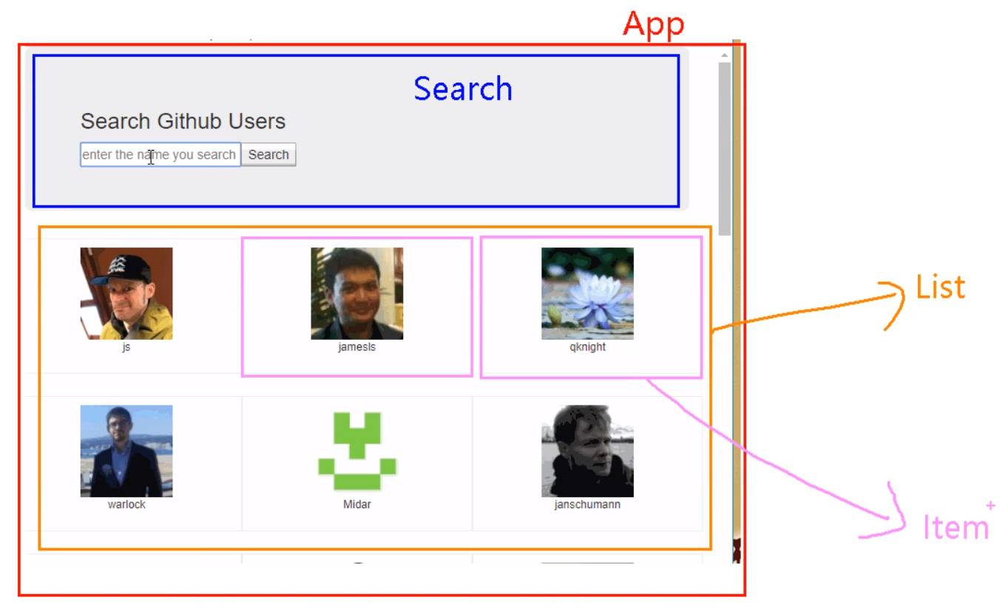
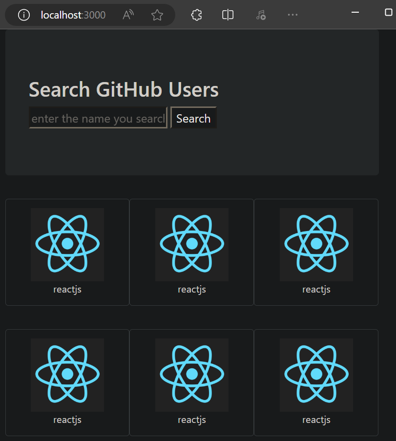

# react ajax

## 前置说明

1. React 本身只关注于界面，并不包含发送 ajax 请求的代码
2. 前端应用需要通过 ajax请求后台数据（json 数据），然后把数据展示在界面上
3. React 应用中需要集成第三方 ajax 库（或自己封装）

## 常用的 ajax 请求库

1. jQuery：比较重，不推荐
2. **axios**：轻量级，推荐
    1. 封装 XmlHttpRequest 对象的 ajax
    2. promise 风格
    3. 可以用在 浏览器端 和 node服务器端

## 安装 axios

```sh
npm install axios
```


# github 搜索案例

首先初始化项目
```sh
npx create-react-app learn-ajax
```
然后删掉用不到的文件

## 拆分组件



## 实现静态组件

### public/index.html

引用 bootstrap.min.css 样式文件（外部引用、CDN引用）

```html
<!DOCTYPE html>
<html lang="en">
  <head>
    <meta charset="utf-8" />
    <title>React App</title>
    <meta name="viewport" content="width=device-width, initial-scale=1">
    <link rel="stylesheet" href="https://cdn.staticfile.org/twitter-bootstrap/4.3.1/css/bootstrap.min.css">
  </head>
  <body>
    <div id="root"></div>
  </body>
</html>
```

### src/App.js

App组件中，包含 Search子组件、List子组件

```js
import React, { Component } from 'react';
import Search from './components/Search';
import List from './components/List';

export default class App extends Component {
  render() {
    return (
      <div className="container">
        <Search />
        <List />
      </div>
    )
  }
}
```

### src/index.js

```js
import React from 'react';
import ReactDOM from 'react-dom/client';
import App from './App';

const root = ReactDOM.createRoot(document.getElementById('root'));
root.render(
  <React.StrictMode>
    <App />
  </React.StrictMode>
);
```

### Search组件

#### src/components/Search/index.jsx

```js
import React, { Component } from 'react';

export default class Search extends Component {
  render() {
    return (
      <section className="jumbotron">
        <h3 className="jumbotron-heading">Search GitHub Users</h3>
        <div>
          <input type="text" placeholder="enter the name you search" />&nbsp;
          <button>Search</button>
        </div>
      </section>
    )
  }
}
```

### List组件

#### src/components/List/index.jsx

```js
import React, { Component } from 'react';
import Item from '../Item';

export default class List extends Component {
  render() {
    return (
      <div>
        <Item />
        <Item />
        <Item />
        <Item />
        <Item />
        <Item />
      </div>
    )
  }
}
```

### Item组件

#### src/components/Item/index.jsx

```js
import React, { Component } from 'react';
import './index.css';

export default class Item extends Component {
  render() {
    return (
      <div className="card">
        <a href="https://github.com/reactjs" target="_blank" rel="noreferrer">
          
        </a>
        <p className="card-text">reactjs</p>
      </div>
    )
  }
}
```

#### src/components/Item/index.css

```css
.album {
    min-height: 50rem;
    /* Can be removed; just added for demo purposes */
    padding-top: 3rem;
    padding-bottom: 3rem;
    background-color: #f7f7f7;
}

.card {
    float: left;
    width: 33.333%;
    padding: .75rem;
    margin-bottom: 2rem;
    border: 1px solid #efefef;
    text-align: center;
}

.card>img {
    margin-bottom: .75rem;
    border-radius: 100px;
}

.card-text {
    font-size: 85%;
}
```

效果如下


## axios 发送请求

### src/components/Search/index.jsx

```js

```


---


P48 暂时跳过
跳过 P65-66 脚手架配置代理

到 P68


[代码](https://github.com/xzlaptt/React)
