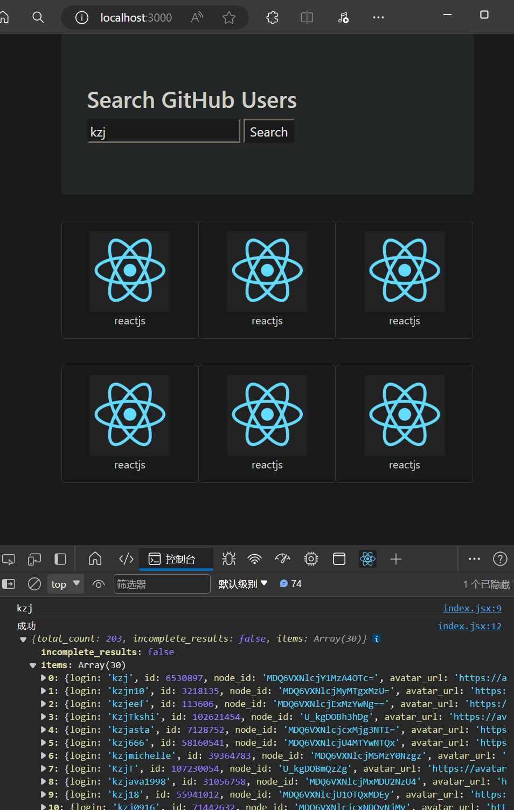
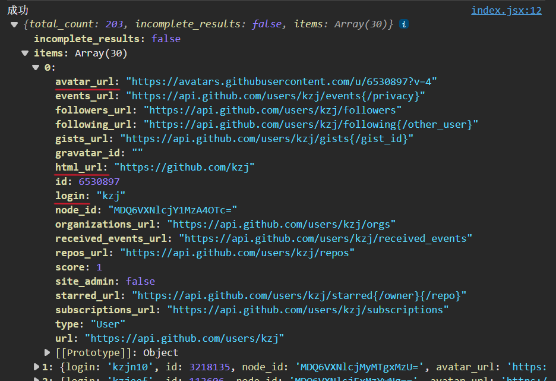
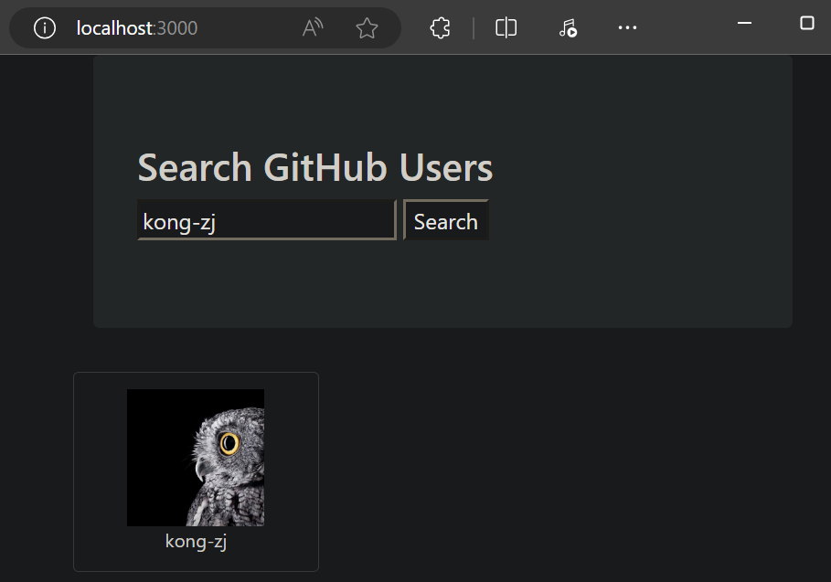

# react ajax

## 前置说明

1. React 本身只关注于界面，并不包含发送 ajax 请求的代码
2. 前端应用需要通过 ajax请求后台数据（json 数据），然后把数据展示在界面上
3. React 应用中需要集成第三方 ajax 库（或自己封装）

## 常用的 ajax 请求库

1. jQuery：比较重，不推荐
2. **axios**：轻量级，推荐
    1. 封装 XmlHttpRequest 对象的 ajax
    2. promise 风格
    3. 可以用在 浏览器端 和 node服务器端

## 安装 axios

```sh
npm install axios
```


# github 搜索案例

请求地址： https://api.github.com/search/users?q=xxxxxx

首先初始化项目
```sh
npx create-react-app learn-ajax
```
然后删掉用不到的文件

## 拆分组件


## 实现静态组件

### public/index.html

引用 bootstrap.min.css 样式文件（外部引用、CDN引用）

```html
<!DOCTYPE html>
<html lang="en">
  <head>
    <meta charset="utf-8" />
    <title>React App</title>
    <meta name="viewport" content="width=device-width, initial-scale=1">
    <link rel="stylesheet" href="https://cdn.staticfile.org/twitter-bootstrap/4.3.1/css/bootstrap.min.css">
  </head>
  <body>
    <div id="root"></div>
  </body>
</html>
```

### src/App.js

App组件中，包含 Search子组件、List子组件

```js
import React, { Component } from 'react';
import Search from './components/Search';
import List from './components/List';

export default class App extends Component {
  render() {
    return (
      <div className="container">
        <Search />
        <List />
      </div>
    )
  }
}
```

### src/index.js

```js
import React from 'react';
import ReactDOM from 'react-dom/client';
import App from './App';

const root = ReactDOM.createRoot(document.getElementById('root'));
root.render(
  <React.StrictMode>
    <App />
  </React.StrictMode>
);
```

### Search组件

#### src/components/Search/index.jsx

```js
import React, { Component } from 'react';

export default class Search extends Component {
  render() {
    return (
      <section className="jumbotron">
        <h3 className="jumbotron-heading">Search GitHub Users</h3>
        <div>
          <input type="text" placeholder="enter the name you search" />&nbsp;
          <button>Search</button>
        </div>
      </section>
    )
  }
}
```

### List组件

#### src/components/List/index.jsx

```js
import React, { Component } from 'react';
import Item from '../Item';

export default class List extends Component {
  render() {
    return (
      <div>
        <Item />
        <Item />
        <Item />
        <Item />
        <Item />
        <Item />
      </div>
    )
  }
}
```

### Item组件

#### src/components/Item/index.jsx

```js
import React, { Component } from 'react';
import './index.css';

export default class Item extends Component {
  render() {
    return (
      <div className="card">
        <a href="https://github.com/reactjs" target="_blank" rel="noreferrer">
          
        </a>
        <p className="card-text">reactjs</p>
      </div>
    )
  }
}
```

#### src/components/Item/index.css

```css
.album {
    min-height: 50rem;
    /* Can be removed; just added for demo purposes */
    padding-top: 3rem;
    padding-bottom: 3rem;
    background-color: #f7f7f7;
}

.card {
    float: left;
    width: 33.333%;
    padding: .75rem;
    margin-bottom: 2rem;
    border: 1px solid #efefef;
    text-align: center;
}

.card>img {
    margin-bottom: .75rem;
    border-radius: 100px;
}

.card-text {
    font-size: 85%;
}
```

效果如下


## axios 发送请求

### src/components/Search/index.jsx

- 在 Search组件 里，给搜索按钮绑定一个 onClick事件，并在事件的回调函数中，用 **axios** 发送网络请求
- 用 回调形式的 **ref** 标记 input输入框，供回调函数使用

```js
import React, { Component } from 'react';
import axios from 'axios';

export default class Search extends Component {
  search = () => {
    // 获取用户输入
    // 解构赋值的连续写法，拿到 this 里的 keyWordElement 里的 value，然后重命名为 keyWord
    const {keyWordElement:{value:keyWord}}  = this;
    console.log(keyWord);
    // 发送网络请求
    axios.get(`https://api.github.com/search/users?q=${keyWord}`).then(
      response => {console.log('成功',response.data);},
      error => {console.log('失败',error);}
    )
  }
  render() {
    return (
      <section className="jumbotron">
        <h3 className="jumbotron-heading">Search GitHub Users</h3>
        <div>
          <input ref={c => this.keyWordElement = c} type="text" placeholder="enter the name you search" />&nbsp;
          <button onClick={this.search}>Search</button>
        </div>
      </section>
    )
  }
}
```

效果如下


## 展示数据

我们只需要展示数据的 avatar_url、html_url、login


**Search组件** 拿到的数据，要交给 **List组件** 来展示，Search组件 和 List组件 是 **兄弟组件**

App组件 是所有组件的父组件，让 **App组件** 的 state **保存要渲染的列表数据**
这样，**Search子组件**（抓取数据） 和 **List子组件**（展示数据） 就可以通过他们的父组件 **App组件** 进行交互

### src/App.js

- 在App组件中，**初始化** **users数组**，用来保存搜索到的结果
- 把 修改users数组的**saveUsers函数** 传递给 **Search子组件**

```js
import React, { Component } from 'react';
import Search from './components/Search';
import List from './components/List';

export default class App extends Component {
  state = {users: []}
  saveUsers = (users) => {
    // this.setState({users:users});
    // 可简写为
    this.setState({users});
  }
  render() {
    return (
      <div className="container">
        <Search saveUsers={this.saveUsers}/>
        <List />
      </div>
    )
  }
}
```

### src/components/Search/index.jsx

- 在 Search组件 里，调用接收到的 **saveUsers函数**，把搜索结果传给 **App组件**

```js
import React, { Component } from 'react';
import axios from 'axios';

export default class Search extends Component {
  search = () => {
    // 获取用户输入
    // 解构赋值的连续写法，拿到 this 里的 keyWordElement 里的 value，然后重命名为 keyWord
    const {keyWordElement:{value:keyWord}}  = this;
    console.log(keyWord);
    // 发送网络请求
    axios.get(`https://api.github.com/search/users?q=${keyWord}`).then(
      response => {
        this.props.saveUsers(response.data.items);
      },
      error => {console.log('失败',error);}
    )
  }
  render() {
    return (
      <section className="jumbotron">
        <h3 className="jumbotron-heading">Search GitHub Users</h3>
        <div>
          <input ref={c => this.keyWordElement = c} type="text" placeholder="enter the name you search" />&nbsp;
          <button onClick={this.search}>Search</button>
        </div>
      </section>
    )
  }
}
```

### src/App.js

- 在App组件中，把 users数组 传递给 **List子组件**

```js
import React, { Component } from 'react';
import Search from './components/Search';
import List from './components/List';

export default class App extends Component {
  state = {users: []}
  saveUsers = (users) => {
    // this.setState({users:users});
    // 可简写为
    this.setState({users});
  }
  render() {
    const {users} = this.state;
    return (
      <div className="container">
        <Search saveUsers={this.saveUsers}/>
        <List users={users}/>
      </div>
    )
  }
}
```

### src/components/List/index.jsx

- 在 List组件 中**接收** **users数组**
- 把 users数组 的每一项分别传递给各个 **Item子组件**

```js
import React, { Component } from 'react';
import Item from '../Item';

export default class List extends Component {
  render() {
    return (
      <div className="row">
        {
          this.props.users.map((userObj, index) => {
            return <Item key={userObj.id} userObj={userObj} />
          })
        }
      </div>
    )
  }
}
```

### src/components/Item/index.jsx

- 在 Item组件 中**渲染** **user对象**

```js
import React, { Component } from 'react';
import './index.css';

export default class Item extends Component {
  render() {
    const {userObj:{avatar_url,html_url,login}} = this.props;
    return (
      <div className="card">
        <a href={html_url} target="_blank" rel="noreferrer">
          
        </a>
        <p className="card-text">{login}</p>
      </div>
    )
  }
}
```

效果如下


## List组件 的完善

List组件 要展示以下几种信息：
1. 搜索成功得到的结果（已完成）
2. 初次渲染的欢迎词（未完成）
3. 正在搜索中的提示（未完成）
4. 搜索失败的错误信息（未完成）

List组件要在不同场景，展示不同类型的东西
**状态 state 驱动页面的展示**，所以需要4种不同的 状态 state

### src/App.js

- 在App组件中，需要更多的 **状态 state**

```js

```


---


P48 暂时跳过
跳过 P65-66 脚手架配置代理

到 P70


[代码](https://github.com/xzlaptt/React)
