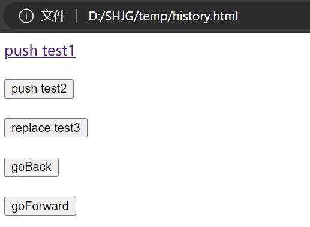
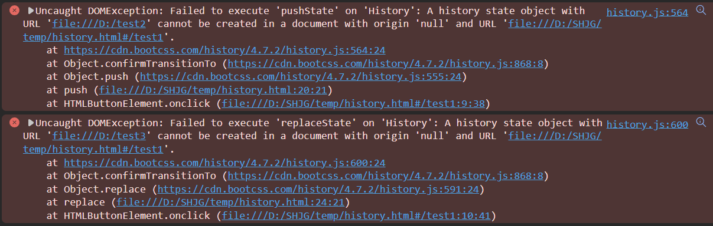

# React 路由

## SPA 的理解（单页面，多组件）

1. SPA 即 **Single Page Application**（单页面应用）
2. 整个应用只有**一个完整的页面**
3. 点击页面中的链接**不会刷新**页面，只会做页面的**局部更新**
4. 数据都需要通过 **ajax请求** 获取，并在前端异步展现

## 路由 的理解

一个路由就是一个映射关系（key:value）
其中，key 为 url 中的 path（路径），value 为 function（后端路由） 或 component（前端路由）

### 路由分类

#### 后端路由

理解：服务器端路由，value 是 **function**，用来处理客户端提交的请求

注册路由：`router.get(path,function(req,res))`

工作过程：当 node 接收到一个请求时，根据请求路径找到匹配的路由，调用路由中的函数处理请求，返回响应数据

#### 前端路由

理解：浏览器端路由，value 是 **component**，用于展示页面内容

注册路由：`<Route path="/test" component={Test}>`

工作过程：当浏览器的 path 变为/test 时，当前路由组件就会变为 Test 组件

## 前端路由的工作原理

[深入理解前端路由：构建现代 Web 应用的基石（上）](https://blog.csdn.net/weixin_42554191/article/details/134745958)
[深入理解前端路由：构建现代 Web 应用的基石（下）](https://web-hls.blog.csdn.net/article/details/134746077)

前端路由是一种在单页应用程序（SPA）中管理页面导航的技术，它通过**在浏览器中修改 url 中的 path 而不向服务器发送请求来实现页面的切换**

问题是，前端路由怎么实现对 url 中的 path 的监测

### 前端路由的基石：浏览器的历史记录 history

[JavaScript之彻底搞懂DOM与BOM及其区别与用法](https://blog.csdn.net/qq_52736131/article/details/123563321)


用一个式子总结它们之间的关系：
**JavaScript = ECMAscript + BOM + DOM**

- ECMAscript：它是一种由 ECMA国际（前身为欧洲计算机制造商协会）通过 ECMA-262 标准化的脚本程序设计语言，它是JavaScript（简称JS）的标准，浏览器就是去执行这个标准
- DOM（document 是其的一个对象）：即 Document Object Model（文档对象模型），它是一种独立于语言，用于操作**xml，html文档**的应用编程接口
- BOM（window 是其的一个对象）：即 Browser Object Model（浏览器对象模型），它是为了控制**浏览器**的行为而出现的接口

BOM 身上有 浏览器的历史记录 history


直接操作 window.history 比较麻烦，我们借助 history.js库 来操作

```html
<!DOCTYPE html>
<html lang="en">
<head>
    <meta charset="UTF-8">
    <title>前端路由的基石 history</title>
</head>
<body>
    <a href="https://cn.bing.com" onclick="return push('/test1');">push test1</a><br><br>
    <button onclick="push('/test2')">push test2</button><br><br>
    <button onclick="replace('/test3')">replace test3</button><br><br>
    <button onclick="goBack()">goBack</button><br><br>
    <button onclick="goForward()">goForward</button><br><br>

    <script type="text/javascript" src="https://cdn.bootcss.com/history/4.7.2/history.js"></script>
    <script type="text/javascript">
        let history = History.createBrowserHistory();
        // let history = History.createHashHistory();
        function push(path) {
            // 向浏览器的history栈中推入一条记录
            history.push(path);
            return false;
        }
        function replace(path) {
            history.replace(path);
        }
        function back() {
            history.goBack();
        }
        function forward() {
            history.goForward();
        }
        // 监听路径变化
        history.listen((location) => {
            console.log('请求路径变化为：',location);
        });
    </script>
</body>
</html>
```

效果如下


在windows中直接打开这个html文件，点击按钮，会报错，如下图所示


原因是 history.pushstate 方法修改url不能**跨域**。因为该项目是直接通过浏览器打开 index.html 文件就可以查看，修改了原有的地址会进行报错。如果启动本地服务器不会存在这个问题

那就用nginx来代理一下

在WSL2子系统中新建文件 /etc/nginx/sites-available/myconf5，内容如下
```conf
server {
	listen 8011;
	server_name localhost;

	location /history.html {
		alias /home/kzj/react_demo/history.html;
	}
}
```

使配置生效


访问 http://127.0.0.1:8011/history.html
效果如下


--- 

P76 6min


[代码](https://github.com/xzlaptt/React)
