# React 路由

## SPA 的理解（单页面，多组件）

1. SPA 即 **Single Page Application**（单页面应用）
2. 整个应用只有**一个完整的页面**
3. 点击页面中的链接**不会刷新**页面，只会做页面的**局部更新**
4. 数据都需要通过 **ajax请求** 获取，并在前端异步展现

## 路由 的理解

一个路由就是一个映射关系（key:value）
其中，key 为 url 中的 path（路径），value 为 function（后端路由） 或 component（前端路由）

### 路由分类

#### 后端路由

理解：服务器端路由，value 是 **function**，用来处理客户端提交的请求

注册路由：`router.get(path,function(req,res))`

工作过程：当 node 接收到一个请求时，根据请求路径找到匹配的路由，调用路由中的函数处理请求，返回响应数据

#### 前端路由

理解：浏览器端路由，value 是 **component**，用于展示页面内容

注册路由：`<Route path="/test" component={Test}>`

工作过程：当浏览器的 path 变为/test 时，当前路由组件就会变为 Test 组件

## 前端路由的工作原理

[深入理解前端路由：构建现代 Web 应用的基石（上）](https://blog.csdn.net/weixin_42554191/article/details/134745958)
[深入理解前端路由：构建现代 Web 应用的基石（下）](https://web-hls.blog.csdn.net/article/details/134746077)

前端路由是一种在单页应用程序（SPA）中管理页面导航的技术，它通过**在浏览器中修改 url 中的 path 而不向服务器发送请求来实现页面的切换**

问题是，前端路由怎么实现对 url 中的 path 的监测

### 前端路由的基石：浏览器的历史记录 history

[JavaScript之彻底搞懂DOM与BOM及其区别与用法](https://blog.csdn.net/qq_52736131/article/details/123563321)


用一个式子总结它们之间的关系：
**JavaScript = ECMAscript + BOM + DOM**

- ECMAscript：它是一种由 ECMA国际（前身为欧洲计算机制造商协会）通过 ECMA-262 标准化的脚本程序设计语言，它是JavaScript（简称JS）的标准，浏览器就是去执行这个标准
- DOM（document 是其的一个对象）：即 Document Object Model（文档对象模型），它是一种独立于语言，用于操作**xml，html文档**的应用编程接口
- BOM（window 是其的一个对象）：即 Browser Object Model（浏览器对象模型），它是为了控制**浏览器**的行为而出现的接口

BOM 身上有 浏览器的历史记录 history
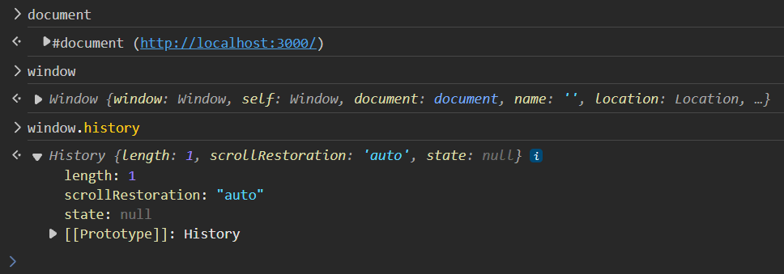

直接操作 window.history 比较麻烦，我们借助 history.js库 来操作

```html
<!DOCTYPE html>
<html lang="en">
<head>
    <meta charset="UTF-8">
    <title>前端路由的基石 history</title>
</head>
<body>
    <a href="https://cn.bing.com" onclick="return push('/test1');">push test1</a><br><br>
    <button onclick="push('/test2')">push test2</button><br><br>
    <button onclick="replace('/test3')">replace test3</button><br><br>
    <button onclick="back()">goBack</button><br><br>
    <button onclick="forward()">goForward</button><br><br>

    <script type="text/javascript" src="https://cdn.bootcss.com/history/4.7.2/history.js"></script>
    <script type="text/javascript">
        // 方法一：直接使用H5推出的history身上的API
        let history = History.createBrowserHistory();
        // 方法二：使用hash值（锚点）
        // 锚点跳转不会引起页面的刷新，但是能留下历史记录
        // let history = History.createHashHistory();
        function push(path) {
            // 向浏览器的history栈中推入一条记录
            history.push(path);
            return false;
        }
        function replace(path) {
            // 替换当前记录
            history.replace(path);
        }
        function back() {
            history.goBack();
        }
        function forward() {
            history.goForward();
        }
        // 监听路径变化
        history.listen((location) => {
            console.log('请求路径变化为：',location);
        });
    </script>
</body>
</html>
```

效果如下


在windows中直接打开这个html文件，点击按钮，会报错，如下图所示


原因是 history.pushstate 方法修改url不能**跨域**。因为该项目是直接通过浏览器打开文件就可以查看，修改了原有的地址会进行报错。如果启动本地服务器不会存在这个问题

那就用nginx来代理一下

在WSL2子系统中新建文件 /etc/nginx/sites-available/myconf5，内容如下
```conf
server {
	listen 8011;
	server_name localhost;

	location /history.html {
		alias /home/kzj/react_demo/history.html;
	}
}
```

使配置生效


访问 http://127.0.0.1:8011/history.html
效果如下
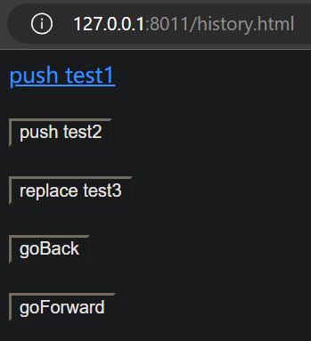

浏览器的历史记录是**栈结构**

点击按钮时，请求路径的变化如下


## react-router-dom 的理解

1. react 的一个插件库
2. 专门用来实现一个 SPA 应用
3. 基于 react 的项目基本都会用到此库

# react-router-dom（旧的5版本）

[中文文档](https://react-router.docschina.org/web/guides/philosophy)

## 安装 react-router-dom

```sh
npm install react-router-dom@5
```

## 路由的基本使用：使用路由链接实现切换组件

实现步骤：
1. 点击导航链接，引起**路径变化**
2. 路径的变化被前端路由器监测到，进行**匹配组件**，从而展示

现在新建一个react项目，清空 文件夹 src/ 和 文件夹 public/ 中的文件，我们自己实现一个可运行的最简形式

### Home组件

#### src/components/Home/index.jsx

```js
import React, { Component } from 'react';

export default class About extends Component {
  render() {
    return (
      <div>About组件</div>
    )
  }
}
```

### About组件

#### src/components/About/index.jsx

```js
import React, { Component } from 'react';

export default class Home extends Component {
  render() {
    return (
      <div>Home组件</div>
    )
  }
}
```

### public/index.html

引用 bootstrap.min.css 样式文件（外部引用、CDN引用）

```html
<!DOCTYPE html>
<html lang="en">
  <head>
    <meta charset="utf-8" />
    <title>React App</title>
    <meta name="viewport" content="width=device-width, initial-scale=1">
    <link rel="stylesheet" href="https://cdn.staticfile.org/twitter-bootstrap/4.3.1/css/bootstrap.min.css">
  </head>
  <body>
    <div id="root"></div>
  </body>
</html>
```

### src/index.js

```js
import React from 'react';
import ReactDOM from 'react-dom/client';
import App from './App';

const root = ReactDOM.createRoot(document.getElementById('root'));
root.render(
  <React.StrictMode>
    <App />
  </React.StrictMode>
);
```

### src/App.js（Link组件）

使用 **Link组件** 编写路由链接

```js
import React, { Component } from 'react';
import { Link, BrowserRouter } from 'react-router-dom';

export default class App extends Component {
  render() {
    return (
      <div>
        <div className="row">
          <div className="col-xs-offset-2 col-xs-8">
            <div className="page-header"><h2>React Router Demo</h2></div>
          </div>
        </div>
        <div className="row">
          <div className="col-xs-2 col-xs-offset-2">
            <div className="list-group">
              {/* 编写路由链接 */}
              <BrowserRouter>
                <Link className="list-group-item" to="/home">Home</Link>
                <Link className="list-group-item" to="/about">About</Link>
              </BrowserRouter>
            </div>
          </div>
          <div className="col-xs-6">
            <div className="panel">
              <div className="panel-body">
                ?????
              </div>
            </div>
          </div>
        </div>
      </div>
    )
  }
}
```

现在，我们已经能通过点击路由链接，实现路径的变化
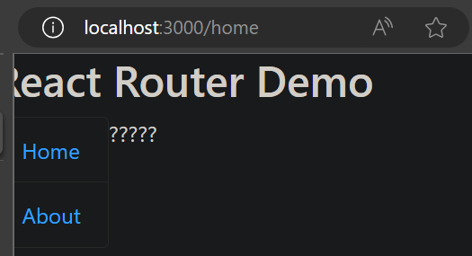


### src/App.js（Route组件）

使用 **Route组件** 注册路由

```js
import React, { Component } from 'react';
import { Link, BrowserRouter, Route } from 'react-router-dom';
import Home from './components/Home';
import About from './components/About';

export default class App extends Component {
  render() {
    return (
      <div>
        <div className="row">
          <div className="col-xs-offset-2 col-xs-8">
            <div className="page-header"><h2>React Router Demo</h2></div>
          </div>
        </div>
        <div className="row">
          <div className="col-xs-2 col-xs-offset-2">
            <div className="list-group">
              {/* 编写路由链接 */}
              <BrowserRouter>
                <Link className="list-group-item" to="/home">Home</Link>
                <Link className="list-group-item" to="/about">About</Link>
              </BrowserRouter>
            </div>
          </div>
          <div className="col-xs-6">
            <div className="panel">
              <div className="panel-body">
                {/* 注册路由 */}
                <BrowserRouter>
                  <Route path="/home" component={Home} />
                  <Route path="/about" component={About} />
                </BrowserRouter>
              </div>
            </div>
          </div>
        </div>
      </div>
    )
  }
}
```

此时，点击路由链接，但是组件没有变，是什么问题？
因为整个应用要用一个路由器管理，所以不要像上面代码中用两个路由器（两个路由器之间没有数据沟通），而是需要**将App组件改为路由器组件**

### src/index.js（BrowserRouter组件）

把 App组件 用 **BrowserRouter组件** 包住

```js
import React from 'react';
import ReactDOM from 'react-dom/client';
import App from './App';
import { BrowserRouter } from 'react-router-dom';

const root = ReactDOM.createRoot(document.getElementById('root'));
root.render(
  <React.StrictMode>
    <BrowserRouter>
      <App />
    </BrowserRouter>
  </React.StrictMode>
);
```

### src/App.js

去掉 **BrowserRouter组件**

```js
import React, { Component } from 'react';
import { Link, Route } from 'react-router-dom';
import Home from './components/Home';
import About from './components/About';

export default class App extends Component {
  render() {
    return (
      <div>
        <div className="row">
          <div className="col-xs-offset-2 col-xs-8">
            <div className="page-header"><h2>React Router Demo</h2></div>
          </div>
        </div>
        <div className="row">
          <div className="col-xs-2 col-xs-offset-2">
            <div className="list-group">
              {/* 编写路由链接 */}
                <Link className="list-group-item" to="/home">Home</Link>
                <Link className="list-group-item" to="/about">About</Link>
            </div>
          </div>
          <div className="col-xs-6">
            <div className="panel">
              <div className="panel-body">
                {/* 注册路由 */}
                  <Route path="/home" component={Home} />
                  <Route path="/about" component={About} />
              </div>
            </div>
          </div>
        </div>
      </div>
    )
  }
}
```

现在，当路径变化，就会展示对应的组件（不会发送网络请求）
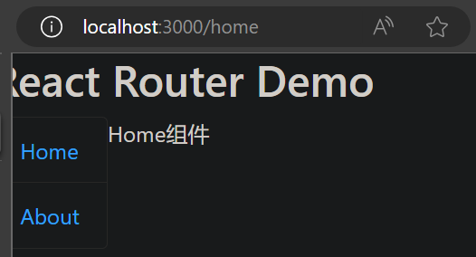


### 路由的基本使用 总结

1. 明确好界面中的导航区、展示区
2. 导航区的a标签（js原生）改为**Link标签**（React组件）`<Link to="/xxxx">Demo</Link>`
3. 展示区写**Route标签**进行路径的匹配 `<Route path="/xxxx" component={Demo} />`
4. App组件的最外侧包裹一个 `<BrowserRouter>` 或 `<HashRouter>`

#### react会把Link标签变成浏览器认识的a标签

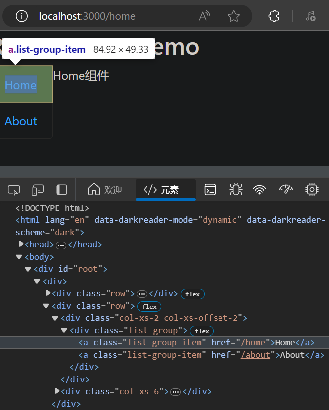

#### BrowserRouter 与 HashRouter 的区别

- BrowserRouter 对应前面讲的 createBrowserHistory
- HashRouter 对应前面讲的 createHashHistory

把上面代码中的App组件的最外侧包裹的 `<BrowserRouter>` 换成 `<HashRouter>`，看看有什么变化
效果如下

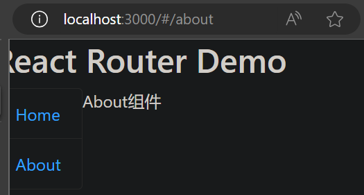

路径中多了 `#`，且 `/home` 或 `/about` 都是在 `#` 后面
`#` 后面的属于 **哈希值**（也叫 **锚点值**），`#` 后面的东西（前台资源）都**不会作为资源发送给服务器**

## 路由组件 与 一般组件

上面例子中的 Home组件 和 About组件 都是 **路由组件**，放在 **components文件夹** 下是不规范的，要放在 **pages文件夹** 下
现在项目的目录结构如下
```sh
route-demo/
  README.md
  node_modules/
  package.json
  public/
    index.html
  src/
    App.js
    index.js
    pages/
      Home/
        index.jsx
      About/
        index.jsx
    components/
```

### src/App.js

修改 Home组件 和 About组件 的**引入地址**

```js
import React, { Component } from 'react';
import { Link, Route } from 'react-router-dom';
import Home from './pages/Home';
import About from './pages/About';

export default class App extends Component {
  render() {
    return (
      <div>
        <div className="row">
          <div className="col-xs-offset-2 col-xs-8">
            <div className="page-header"><h2>React Router Demo</h2></div>
          </div>
        </div>
        <div className="row">
          <div className="col-xs-2 col-xs-offset-2">
            <div className="list-group">
              {/* 编写路由链接 */}
              <Link className="list-group-item" to="/home">Home</Link>
              <Link className="list-group-item" to="/about">About</Link>
            </div>
          </div>
          <div className="col-xs-6">
            <div className="panel">
              <div className="panel-body">
                {/* 注册路由 */}
                <Route path="/home" component={Home} />
                <Route path="/about" component={About} />
              </div>
            </div>
          </div>
        </div>
      </div>
    )
  }
}
```

### Header组件（一般组件）

把页面顶部的 React Router Demo 文字，抽象成组件

#### src/components/Header/index.jsx

打印 this.props

```js
import React, { Component } from 'react';

export default class Header extends Component {
  render() {
    console.log('Header组件收到的props：',this.props);
    return (
        <div className="page-header"><h2>React Router Demo</h2></div>
    )
  }
}
```

### src/App.js

使用 Header组件

```js
import React, { Component } from 'react';
import { Link, Route } from 'react-router-dom';
import Home from './pages/Home';
import About from './pages/About';
import Header from './components/Header';

export default class App extends Component {
  render() {
    return (
      <div>
        <div className="row">
          <div className="col-xs-offset-2 col-xs-8">
            <Header />
          </div>
        </div>
        <div className="row">
          <div className="col-xs-2 col-xs-offset-2">
            <div className="list-group">
              {/* 编写路由链接 */}
              <Link className="list-group-item" to="/home">Home</Link>
              <Link className="list-group-item" to="/about">About</Link>
            </div>
          </div>
          <div className="col-xs-6">
            <div className="panel">
              <div className="panel-body">
                {/* 注册路由 */}
                <Route path="/home" component={Home} />
                <Route path="/about" component={About} />
              </div>
            </div>
          </div>
        </div>
      </div>
    )
  }
}
```

### About组件（路由组件）

#### src/pages/About/index.jsx

打印 this.props

```js
import React, { Component } from 'react';

export default class About extends Component {
  render() {
    console.log('About组件收到的props：',this.props);
    return (
      <div>About组件</div>
    )
  }
}
```

此时项目的目录结构如下
```sh
route-demo/
  README.md
  node_modules/
  package.json
  public/
    index.html
  src/
    App.js
    index.js
    pages/
      Home/
        index.jsx
      About/
        index.jsx
    components/
      Header/
        index.jsx
```

现在，可以比较 **Header组件（一般组件）** 和 **About组件（路由组件）** 收到的 props 的不同

路由组件 与 一般组件 的最大的区别：**路由组件 会收到路由器给传递的 3个最重要的props信息，分别是 history、location、match**

> 这里每个 console.log 会有两次输出，是因为 src/index.js 文件中 `<React.StrictMode>` 组件包裹整个应用，导致两次输出

### 路由组件与一般组件 总结

1. 写法不同：
   1. 一般组件：`<Demo/>`
   2. 路由组件：`<Route path="/demo" component={Demo} />`
2. 存放位置不同：
   1. 一般组件：components文件夹下
   2. 路由组件：pages文件夹下
3. 接收到的**props**不同：
   1. 一般组件：写组件标签时传递了什么，就能收到什么
   2. 路由组件：比一般组件**多接收到三个固定的属性：history、location、match**

路由组件的三大属性中我们要重点关注的如下
```js
history: 
  go: ƒ go(n)
  goBack: ƒ goBack()
  goForward: ƒ goForward()
  push: ƒ push(path, state)
  replace: ƒ replace(path, state)

location: 
  pathname: "/about"
  search: ""
  state: undefined

match: 
  params: {}
  path: "/about"
  url: "/about"
```

## NavLink 组件

点击导航区的 Home 或 About 时，想要有蓝色的高亮
那就别再用 Link，用 NavLink

NavLink 可以实现路由链接的**高亮**，通过 activeClassName 指定样式名

### 使用 NavLink 组件

#### src/App.js（NavLink组件）

使用 NavLink组件

```js
import React, { Component } from 'react';
import { NavLink, Route } from 'react-router-dom';
import Home from './pages/Home';
import About from './pages/About';
import Header from './components/Header';

export default class App extends Component {
  render() {
    return (
      <div>
        <div className="row">
          <div className="col-xs-offset-2 col-xs-8">
            <Header />
          </div>
        </div>
        <div className="row">
          <div className="col-xs-2 col-xs-offset-2">
            <div className="list-group">
              {/* 编写路由链接 */}
              <NavLink className="list-group-item" to="/home">Home</NavLink>
              <NavLink className="list-group-item" to="/about">About</NavLink>
            </div>
          </div>
          <div className="col-xs-6">
            <div className="panel">
              <div className="panel-body">
                {/* 注册路由 */}
                <Route path="/home" component={Home} />
                <Route path="/about" component={About} />
              </div>
            </div>
          </div>
        </div>
      </div>
    )
  }
}
```

效果如下
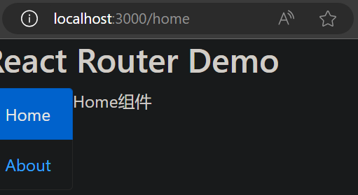

> 使用 NavLink 后，点击谁，就是给谁加了 active 属性，而碰巧了，引入的 bootstrap 样式中，active 属性的样式，就是加了一个高亮

如果我们不喜欢 bootstrap 默认的高亮效果，可以自定义样式

#### public/index.html

添加自定义样式

```html
<!DOCTYPE html>
<html lang="en">
  <head>
    <meta charset="utf-8" />
    <title>React App</title>
    <meta name="viewport" content="width=device-width, initial-scale=1">
    <link rel="stylesheet" href="https://cdn.staticfile.org/twitter-bootstrap/4.3.1/css/bootstrap.min.css">
    <style>
      .atguigu{
        background-color: orange !important;
        color: red !important;
      }
    </style>
  </head>
  <body>
    <div id="root"></div>
  </body>
</html>
```

`!important` 用于把自己写的样式的权限提到最高，不然会受 bootstrap 默认样式的影响

#### src/App.js

给 NavLink组件 添加 `activeClassName="atguigu"` 属性，定义 NavLink组件 被点击时添加的样式名

```js
import React, { Component } from 'react';
import { NavLink, Route } from 'react-router-dom';
import Home from './pages/Home';
import About from './pages/About';
import Header from './components/Header';

export default class App extends Component {
  render() {
    return (
      <div>
        <div className="row">
          <div className="col-xs-offset-2 col-xs-8">
            <Header />
          </div>
        </div>
        <div className="row">
          <div className="col-xs-2 col-xs-offset-2">
            <div className="list-group">
              {/* 编写路由链接 */}
              <NavLink activeClassName="atguigu" className="list-group-item" to="/home">Home</NavLink>
              <NavLink activeClassName="atguigu" className="list-group-item" to="/about">About</NavLink>
            </div>
          </div>
          <div className="col-xs-6">
            <div className="panel">
              <div className="panel-body">
                {/* 注册路由 */}
                <Route path="/home" component={Home} />
                <Route path="/about" component={About} />
              </div>
            </div>
          </div>
        </div>
      </div>
    )
  }
}
```

效果如下


### 封装 NavLink 组件

上面的例子中，如果页面上有很多导航链接，就要写很多 `<NavLink activeClassName="atguigu" className="list-group-item" to="/home">Home</NavLink>`，每一项里面有很多重复的东西，还有优化的空间

那就对 NavLink组件 进行二次封装

#### src/components/MyNavLink/index.jsx

定义一个名为 MyNavLink 的一般组件

```js
import React, { Component } from 'react';
import { NavLink } from 'react-router-dom';

export default class MyNavLink extends Component {
  render() {
    const { to, title } = this.props;
    return (
        <NavLink activeClassName="atguigu" className="list-group-item" to={to}>{title}</NavLink>
    )
  }
}
```

#### src/App.js

把 NavLink组件 换成 MyNavLink组件

```js
import React, { Component } from 'react';
import { Route } from 'react-router-dom';
import Home from './pages/Home';
import About from './pages/About';
import Header from './components/Header';
import MyNavLink from './components/MyNavLink';

export default class App extends Component {
  render() {
    return (
      <div>
        <div className="row">
          <div className="col-xs-offset-2 col-xs-8">
            <Header />
          </div>
        </div>
        <div className="row">
          <div className="col-xs-2 col-xs-offset-2">
            <div className="list-group">
              {/* 编写路由链接 */}
              {/* <NavLink activeClassName="atguigu" className="list-group-item" to="/home">Home</NavLink> */}
              {/* <NavLink activeClassName="atguigu" className="list-group-item" to="/about">About</NavLink> */}
              <MyNavLink to="/home" title="Home" />
              <MyNavLink to="/about" title="About" />
            </div>
          </div>
          <div className="col-xs-6">
            <div className="panel">
              <div className="panel-body">
                {/* 注册路由 */}
                <Route path="/home" component={Home} />
                <Route path="/about" component={About} />
              </div>
            </div>
          </div>
        </div>
      </div>
    )
  }
}
```

效果和之前相同

但是 MyNavLink 的 `<MyNavLink to="/home" title="Home" />`，**用 title 属性指定标签内容**，而 NavLink 的 `<NavLink activeClassName="atguigu" className="list-group-item" to="/home">Home</NavLink>`，可以**直接在标签体处写标签内容**
怎么能像使用 NavLink 一样使用 MyNavLink，直接在**标签体**处写标签内容？
我们学过**使用 props 接收传递过来的标签属性**，但是怎么**接收标签体**？

**标签体 是特殊的标签属性**，react 也能帮我们收集，通过 **this.props.children** 接收

#### src/App.js

不再使用自闭合的 MyNavLink，而是像使用 NavLink 一样使用 MyNavLink，直接在**标签体**处写标签内容

```js
import React, { Component } from 'react';
import { Route } from 'react-router-dom';
import Home from './pages/Home';
import About from './pages/About';
import Header from './components/Header';
import MyNavLink from './components/MyNavLink';

export default class App extends Component {
  render() {
    return (
      <div>
        <div className="row">
          <div className="col-xs-offset-2 col-xs-8">
            <Header />
          </div>
        </div>
        <div className="row">
          <div className="col-xs-2 col-xs-offset-2">
            <div className="list-group">
              {/* 编写路由链接 */}
              {/* <NavLink activeClassName="atguigu" className="list-group-item" to="/home">Home</NavLink> */}
              {/* <NavLink activeClassName="atguigu" className="list-group-item" to="/about">About</NavLink> */}
              {/* <MyNavLink to="/home" title="Home" /> */}
              {/* <MyNavLink to="/about" title="About" /> */}
              <MyNavLink to="/home">Home</MyNavLink>
              <MyNavLink to="/about">About</MyNavLink>
            </div>
          </div>
          <div className="col-xs-6">
            <div className="panel">
              <div className="panel-body">
                {/* 注册路由 */}
                <Route path="/home" component={Home} />
                <Route path="/about" component={About} />
              </div>
            </div>
          </div>
        </div>
      </div>
    )
  }
}
```

#### src/components/MyNavLink/index.jsx（children属性）

通过 **this.props.children** 接收**标签体**

```js
import React, { Component } from 'react';
import { NavLink } from 'react-router-dom';

export default class MyNavLink extends Component {
  render() {
    console.log(this.props);
    const { to, children } = this.props;
    return (
        <NavLink activeClassName="atguigu" className="list-group-item" to={to}>{children}</NavLink>
    )
  }
}
```

效果和之前相同


#### src/components/MyNavLink/index.jsx

**标签体 是特殊的标签属性**，不用直接写标签体，用标签的 **children 属性**，就可以**定义标签体**，即 `<NavLink children="About" />` 等价于 `<NavLink>About</NavLink>`

则上面的代码可以继续简化

```js
import React, { Component } from 'react';
import { NavLink } from 'react-router-dom';

export default class MyNavLink extends Component {
  render() {
    return (
        <NavLink activeClassName="atguigu" className="list-group-item" {...this.props} />
    )
  }
}
```

代码中的 `{...this.props}` 不仅把我们自己定义的 to 属性接收过去了，同时还把react帮我们定义的 children 接收了

效果和之前相同

## Switch 组件

Switch组件 的作用是路由切换时，**只渲染第一个匹配到的路由**
通常情况下，**path** 和 **component** 是**一一对应**的关系
Switch 可以提高路由匹配效率（**单一匹配**）

### Test组件（路由组件）

为了演示，再添加一个名为 Test 的路由组件

#### src/pages/Test/index.jsx

```js
import React, { Component } from 'react'

export default class Test extends Component {
  render() {
    return (
      <div>Test组件</div>
    )
  }
}
```

### src/App.js

让`/home`路径同时匹配 Home组件 和 Test组件（path 和 component 不是一一对应的关系）

```js
import React, { Component } from 'react';
import { Route } from 'react-router-dom';
import Header from './components/Header';
import Home from './pages/Home';
import About from './pages/About';
import Test from './pages/Test';
import MyNavLink from './components/MyNavLink';

export default class App extends Component {
  render() {
    return (
      <div>
        <div className="row">
          <div className="col-xs-offset-2 col-xs-8">
            <Header />
          </div>
        </div>
        <div className="row">
          <div className="col-xs-2 col-xs-offset-2">
            <div className="list-group">
              {/* 编写路由链接 */}
              {/* <NavLink activeClassName="atguigu" className="list-group-item" to="/home">Home</NavLink> */}
              {/* <NavLink activeClassName="atguigu" className="list-group-item" to="/about">About</NavLink> */}
              {/* <MyNavLink to="/home" title="Home" /> */}
              {/* <MyNavLink to="/about" title="About" /> */}
              <MyNavLink to="/home">Home</MyNavLink>
              <MyNavLink to="/about">About</MyNavLink>
            </div>
          </div>
          <div className="col-xs-6">
            <div className="panel">
              <div className="panel-body">
                {/* 注册路由 */}
                <Route path="/home" component={Home} />
                <Route path="/home" component={Test} />
                <Route path="/about" component={About} />
              </div>
            </div>
          </div>
        </div>
      </div>
    )
  }
}
```

效果如下
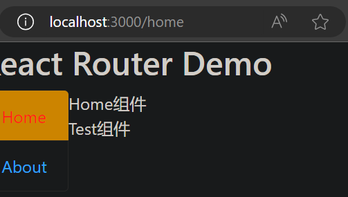

匹配的两个组件都会展示
这就说明，找到第一个匹配的组件后，还会继续匹配

如果注册的路由特别多，会有效率问题
能不能找到第一个匹配的组件后，就不再继续匹配了？
用 **Switch组件** 即可

### src/App.js（Switch组件）

用 **Switch组件** 把所有注册的路由包起来

```js
import React, { Component } from 'react';
import { Route, Switch } from 'react-router-dom';
import Header from './components/Header';
import Home from './pages/Home';
import About from './pages/About';
import Test from './pages/Test';
import MyNavLink from './components/MyNavLink';

export default class App extends Component {
  render() {
    return (
      <div>
        <div className="row">
          <div className="col-xs-offset-2 col-xs-8">
            <Header />
          </div>
        </div>
        <div className="row">
          <div className="col-xs-2 col-xs-offset-2">
            <div className="list-group">
              {/* 编写路由链接 */}
              {/* <NavLink activeClassName="atguigu" className="list-group-item" to="/home">Home</NavLink> */}
              {/* <NavLink activeClassName="atguigu" className="list-group-item" to="/about">About</NavLink> */}
              {/* <MyNavLink to="/home" title="Home" /> */}
              {/* <MyNavLink to="/about" title="About" /> */}
              <MyNavLink to="/home">Home</MyNavLink>
              <MyNavLink to="/about">About</MyNavLink>
            </div>
          </div>
          <div className="col-xs-6">
            <div className="panel">
              <div className="panel-body">
                {/* 注册路由 */}
                <Switch>
                  <Route path="/home" component={Home} />
                  <Route path="/home" component={Test} />
                  <Route path="/about" component={About} />
                </Switch>
              </div>
            </div>
          </div>
        </div>
      </div>
    )
  }
}
```

效果如下


使用 Switch组件，路由切换时，**只渲染第一个匹配到的路由**

## 路由的 模糊匹配 与 严格匹配

默认是模糊匹配，使用 exact 属性开启严格匹配

### src/App.js

```js
import React, { Component } from 'react';
import { Route, Switch } from 'react-router-dom';
import Header from './components/Header';
import Home from './pages/Home';
import About from './pages/About';
import MyNavLink from './components/MyNavLink';

export default class App extends Component {
  render() {
    return (
      <div>
        <div className="row">
          <div className="col-xs-offset-2 col-xs-8">
            <Header />
          </div>
        </div>
        <div className="row">
          <div className="col-xs-2 col-xs-offset-2">
            <div className="list-group">
              {/* 编写路由链接 */}
              {/* <NavLink activeClassName="atguigu" className="list-group-item" to="/home">Home</NavLink> */}
              {/* <NavLink activeClassName="atguigu" className="list-group-item" to="/about">About</NavLink> */}
              {/* <MyNavLink to="/home" title="Home" /> */}
              {/* <MyNavLink to="/about" title="About" /> */}
              <MyNavLink to="/home">Home</MyNavLink>
              <MyNavLink to="/about">About</MyNavLink>
            </div>
          </div>
          <div className="col-xs-6">
            <div className="panel">
              <div className="panel-body">
                {/* 注册路由 */}
                <Switch>
                  <Route path="/home/a/b" component={Home} />
                  <Route path="/about" component={About} />
                </Switch>
              </div>
            </div>
          </div>
        </div>
      </div>
    )
  }
}
```

效果如下（没有匹配上）


要的是 `/home/a/b`，但是只给了 `/home`，不算匹配（给的东西**少**了）

### src/App.js（模糊匹配）

```js
import React, { Component } from 'react';
import { Route, Switch } from 'react-router-dom';
import Header from './components/Header';
import Home from './pages/Home';
import About from './pages/About';
import MyNavLink from './components/MyNavLink';

export default class App extends Component {
  render() {
    return (
      <div>
        <div className="row">
          <div className="col-xs-offset-2 col-xs-8">
            <Header />
          </div>
        </div>
        <div className="row">
          <div className="col-xs-2 col-xs-offset-2">
            <div className="list-group">
              {/* 编写路由链接 */}
              {/* <NavLink activeClassName="atguigu" className="list-group-item" to="/home">Home</NavLink> */}
              {/* <NavLink activeClassName="atguigu" className="list-group-item" to="/about">About</NavLink> */}
              {/* <MyNavLink to="/home" title="Home" /> */}
              {/* <MyNavLink to="/about" title="About" /> */}
              <MyNavLink to="/home/a/b">Home</MyNavLink>
              <MyNavLink to="/about">About</MyNavLink>
            </div>
          </div>
          <div className="col-xs-6">
            <div className="panel">
              <div className="panel-body">
                {/* 注册路由 */}
                <Switch>
                  <Route path="/home" component={Home} />
                  <Route path="/about" component={About} />
                </Switch>
              </div>
            </div>
          </div>
        </div>
      </div>
    )
  }
}
```

效果如下（匹配上了）
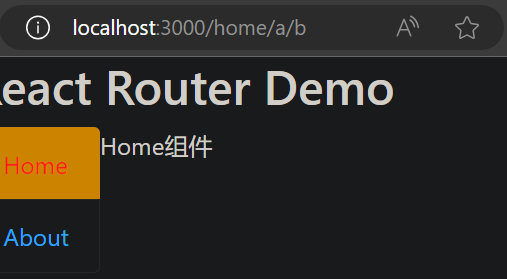

要的是 `/home`，但是给了 `/home/a/b`，算匹配（给的东西**多**了）

要的东西一个不能少，可以多给一点，他只看开头的一块（**前缀匹配**）

### src/App.js（严格匹配 exact）

使用 `exact` 开启严格匹配

```js
import React, { Component } from 'react';
import { Route, Switch } from 'react-router-dom';
import Header from './components/Header';
import Home from './pages/Home';
import About from './pages/About';
import MyNavLink from './components/MyNavLink';

export default class App extends Component {
  render() {
    return (
      <div>
        <div className="row">
          <div className="col-xs-offset-2 col-xs-8">
            <Header />
          </div>
        </div>
        <div className="row">
          <div className="col-xs-2 col-xs-offset-2">
            <div className="list-group">
              {/* 编写路由链接 */}
              {/* <NavLink activeClassName="atguigu" className="list-group-item" to="/home">Home</NavLink> */}
              {/* <NavLink activeClassName="atguigu" className="list-group-item" to="/about">About</NavLink> */}
              {/* <MyNavLink to="/home" title="Home" /> */}
              {/* <MyNavLink to="/about" title="About" /> */}
              <MyNavLink to="/home/a/b">Home</MyNavLink>
              <MyNavLink to="/about">About</MyNavLink>
            </div>
          </div>
          <div className="col-xs-6">
            <div className="panel">
              <div className="panel-body">
                {/* 注册路由 */}
                <Switch>
                  <Route exact path="/home" component={Home} />
                  <Route exact path="/about" component={About} />
                </Switch>
              </div>
            </div>
          </div>
        </div>
      </div>
    )
  }
}
```

效果如下（没有匹配上）


要的和给的必须完全相同才算匹配

### 总结

1. 默认使用的是模糊匹配（前缀匹配）
2. 使用 exact 属性开启严格匹配：`<Route exact path="/home" component={Home} />`
3. 但是**不要滥用** 严格匹配 exact（有时候开启会导致**无法继续匹配二级路由**），如果不开启严格匹配会引发一些问题，才开启它

## Redirect 重定向

刚开始打开网页，什么路由也没有指定，也就什么组件也没匹配上，效果如下


一般把 Redirect组件 写在所有路由注册的最下方，用来**兜底**，当所有路由都无法匹配时，跳转到 Redirect 指定的路由

### src/App.js

增加一行 `<Redirect to="/home" />`，当所有路由都无法匹配时，跳转到路由 `/home`

```js
import React, { Component } from 'react';
import { Route, Switch, Redirect } from 'react-router-dom';
import Header from './components/Header';
import Home from './pages/Home';
import About from './pages/About';
import MyNavLink from './components/MyNavLink';

export default class App extends Component {
  render() {
    return (
      <div>
        <div className="row">
          <div className="col-xs-offset-2 col-xs-8">
            <Header />
          </div>
        </div>
        <div className="row">
          <div className="col-xs-2 col-xs-offset-2">
            <div className="list-group">
              {/* 编写路由链接 */}
              {/* <NavLink activeClassName="atguigu" className="list-group-item" to="/home">Home</NavLink> */}
              {/* <NavLink activeClassName="atguigu" className="list-group-item" to="/about">About</NavLink> */}
              {/* <MyNavLink to="/home" title="Home" /> */}
              {/* <MyNavLink to="/about" title="About" /> */}
              <MyNavLink to="/home">Home</MyNavLink>
              <MyNavLink to="/about">About</MyNavLink>
            </div>
          </div>
          <div className="col-xs-6">
            <div className="panel">
              <div className="panel-body">
                {/* 注册路由 */}
                <Switch>
                  <Route path="/home" component={Home} />
                  <Route path="/about" component={About} />
                  <Redirect to="/home" />
                </Switch>
              </div>
            </div>
          </div>
        </div>
      </div>
    )
  }
}
```

我们在浏览器中输入 `http://localhost:3000`，就会自动跳到 `http://localhost:3000/home`，效果如下


## 嵌套路由

react中路由的注册是有顺序的（父组件中的路由先注册，子组件中的路由后注册），因此在匹配的时候也是按照这个顺序进行的，因此会先匹配父组件中的路由

### 拆分组件

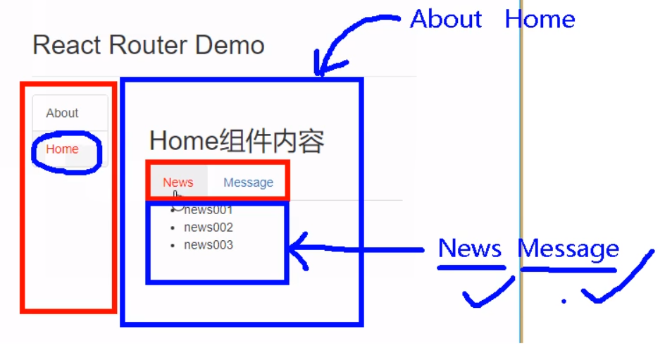

### 实现静态组件

#### src/pages/Home/Message/index.jsx

```js
import React, { Component } from 'react';

export default class Message extends Component {
  render() {
    return (
        <div>
            <ul>
                <li>
                    <a href="/message1">message001</a>&nbsp;&nbsp;
                </li>
                <li>
                    <a href="/message2">message002</a>&nbsp;&nbsp;
                </li>
                <li>
                    <a href="/message/3">message003</a>&nbsp;&nbsp;
                </li>
            </ul>
        </div>
    )
  }
}
```

#### src/pages/Home/News/index.jsx

```js
import React, { Component } from 'react';

export default class News extends Component {
  render() {
    return (
        <div>
            <ul>
                <li>news001</li>
                <li>news002</li>
                <li>news003</li>
            </ul>
        </div>
    )
  }
}
```

此时项目的目录结构如下
```sh
route-demo/
  README.md
  node_modules/
  package.json
  public/
    index.html
  src/
    App.js
    index.js
    pages/
      Home/
        index.jsx
        Message/
          index.jsx
        News/
          index.jsx
      About/
        index.jsx
    components/
      Header/
        index.jsx
      MyNavLink/
        index.jsx
```

### src/pages/Home/index.jsx（嵌套路由）

```js
import React, { Component } from 'react';
import Message from './Message';
import News from './News';
import MyNavLink from '../../components/MyNavLink';
import { Route, Switch, Redirect } from 'react-router-dom';

export default class Home extends Component {
    render() {
        return (
            <div>
                <h2>Home组件内容</h2>
                <div>
                    <ul className="nav nav-tabs">
                        <li>
                            {/* react中路由的注册是有顺序的（父组件中的路由先注册，子组件中的路由后注册），因此在匹配的时候也是按照这个顺序进行的，因此会先匹配父组件中的路由 */}
                            {/* <MyNavLink to="/news">News</MyNavLink> */}
                            <MyNavLink to="/home/news">News</MyNavLink>
                        </li>
                        <li>
                            {/* <MyNavLink to="/message">Message</MyNavLink> */}
                            <MyNavLink to="/home/message">Message</MyNavLink>
                        </li>
                    </ul>
                    <Switch>
                        <Route path="/home/news" component={News} />
                        <Route path="/home/message" component={Message} />
                        <Redirect to="/home/message" />
                    </Switch>
                </div>
            </div>
        )
    }
}
```

效果如下


点击 Message 之后发生了什么？
1. 路径变成 `/home/message`
2. 在 Home组件 的父组件 App组件 中，匹配到 `/home` 路由，挂载 Home组件
3. 在 Home组件 中，继续进行路由匹配，匹配到 `/home/message` 路由，挂载 Message组件

点击 Home 之后，为什么直接能到 `/home/message`？
1. 点击 Home 之后，路径变成 `/home`，挂载 Home组件
2. 在 Home组件 中，继续进行路由匹配，`/home` 不能匹配 `/home/news` 和 `/home/message` 路由，被 Redirect 兜底到 `/home/message`
3. 匹配到 `/home/message` 路由，挂载 Message组件

> 也就是说，如果注册三级路由，前两级路由的名字也要写在前方，不能省略，因为**路由匹配时有先后顺序，会先匹配父组件中的路由**

### src/pages/Home/index.jsx

去掉 `<Redirect to="/home/message" />`，为了方便演示下面的 严格匹配导致问题

```js
import React, { Component } from 'react';
import Message from './Message';
import News from './News';
import MyNavLink from '../../components/MyNavLink';
import { Route, Switch } from 'react-router-dom';

export default class Home extends Component {
    render() {
        return (
            <div>
                <h2>Home组件内容</h2>
                <div>
                    <ul className="nav nav-tabs">
                        <li>
                            <MyNavLink to="/home/news">News</MyNavLink>
                        </li>
                        <li>
                            <MyNavLink to="/home/message">Message</MyNavLink>
                        </li>
                    </ul>
                    <Switch>
                        <Route path="/home/news" component={News} />
                        <Route path="/home/message" component={Message} />
                    </Switch>
                </div>
            </div>
        )
    }
}
```

### src/App.js（严格匹配导致问题）

```js
import React, { Component } from 'react';
import { Route, Switch, Redirect } from 'react-router-dom';
import Header from './components/Header';
import Home from './pages/Home';
import About from './pages/About';
import MyNavLink from './components/MyNavLink';

export default class App extends Component {
  render() {
    return (
      <div>
        <div className="row">
          <div className="col-xs-offset-2 col-xs-8">
            <Header />
          </div>
        </div>
        <div className="row">
          <div className="col-xs-2 col-xs-offset-2">
            <div className="list-group">
              {/* 编写路由链接 */}
              <MyNavLink to="/home">Home</MyNavLink>
              <MyNavLink to="/about">About</MyNavLink>
            </div>
          </div>
          <div className="col-xs-6">
            <div className="panel">
              <div className="panel-body">
                {/* 注册路由 */}
                <Switch>
                  <Route exact path="/home" component={Home} />
                  <Route exact path="/about" component={About} />
                  <Redirect to="/home" />
                </Switch>
              </div>
            </div>
          </div>
        </div>
      </div>
    )
  }
}
```

效果如下

点击 Message 之后：

无法继续匹配二级路由

如上面的严格匹配模式中所说：严格匹配模式不要随便开启，需要时再开，有时候开启会导致**无法继续匹配二级路由**

### 总结

1. 注册子路由时，要写上父路由的path值
2. 路由的匹配是按照注册路由的顺序进行的（从父到子）

## 向路由组件传递参数

**向路由组件传递参数**，有3种方式：
1. 传递 params 参数
2. 传递 search 参数
3. 传递 state 参数

### 拆分组件

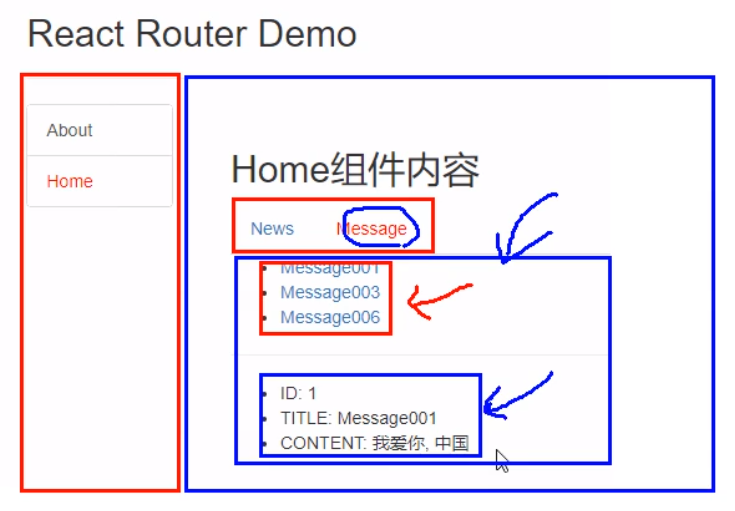

### 实现静态组件

#### src/pages/Home/Message/Detail/index.jsx

```js
import React, { Component } from 'react';

export default class Detail extends Component {
  render() {
    return (
      <ul>
        <li>ID: ???</li>
        <li>TITLE: ???</li>
        <li>CONTENT: ???</li>
      </ul>
    )
  }
}
```

此时项目的目录结构如下
```sh
route-demo/
  README.md
  node_modules/
  package.json
  public/
    index.html
  src/
    App.js
    index.js
    pages/
      Home/
        index.jsx
        Message/
          index.jsx
          Detail/
            index.jsx
        News/
          index.jsx
      About/
        index.jsx
    components/
      Header/
        index.jsx
      MyNavLink/
        index.jsx
```

### src/pages/Home/Message/index.jsx（嵌套路由）

之前，信息列表是写死的，现在改成动态获取的
还要 编写路由链接 和 注册路由

```js
import React, { Component } from 'react';
import { Link, Route } from 'react-router-dom';
import Detail from './Detail';

export default class Message extends Component {
    state = {
        messageArr: [
            {id: '01', title: 'message001'},
            {id: '02', title: 'message002'},
            {id: '03', title: 'message003'},
        ]
    }
  render() {
    const { messageArr } = this.state;
    return (
        <div>
            <ul>
                {
                    messageArr.map((msgObj) =>{
                        return (
                            <li key={msgObj.id}>
                                <Link to="/home/message/detail">{msgObj.title}</Link>&nbsp;&nbsp;
                            </li>
                        )
                    })
                }
            </ul>
            <hr/>
            <Route path="/home/message/detail" component={Detail}/>
        </div>
    )
  }
}
```

效果如下
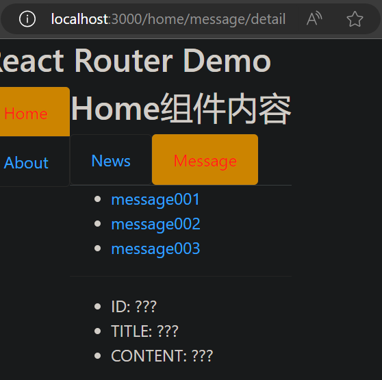

但是现在展示的 Detail组件（路由组件）是写死的，想要向其中传递数据
**向路由组件传递参数**，有几种方式？

### 向路由组件传递 params 参数

特点：直接在**路径**中传递参数

#### src/pages/Home/Message/index.jsx

在 编写路由链接 时，**向路由组件传递params参数**
在 注册路由 时，**声明接收params参数**

```js
import React, { Component } from 'react';
import { Link, Route } from 'react-router-dom';
import Detail from './Detail';

export default class Message extends Component {
    state = {
        messageArr: [
            {id: '01', title: 'message001'},
            {id: '02', title: 'message002'},
            {id: '03', title: 'message003'},
        ]
    }
  render() {
    const { messageArr } = this.state;
    return (
        <div>
            <ul>
                {
                    messageArr.map((msgObj) =>{
                        return (
                            <li key={msgObj.id}>
                                {/* 向路由组件传递params参数 */}
                                <Link to={`/home/message/detail/${msgObj.id}/${msgObj.title}`}>{msgObj.title}</Link>&nbsp;&nbsp;
                            </li>
                        )
                    })
                }
            </ul>
            <hr/>
            {/* 声明接收params参数 */}
            <Route path="/home/message/detail/:id/:title" component={Detail}/>
        </div>
    )
  }
}
```

#### src/pages/Home/Message/Detail/index.jsx

通过 `this.props.match.params` 接收传入的params参数

```js
import React, { Component } from 'react';

// 模拟服务器返回的数据
const detailData = [
    { id: '01', content: '你好，中国'},
    { id: '02', content: '你好，尚硅谷'},
    { id: '03', content: '你好，未来的自己'},
]

export default class Detail extends Component {
  render() {
    console.log('Detail组件接收到的props：',this.props);
    // 接收params参数
    const { id, title } = this.props.match.params;
    const findResult = detailData.find((detailObj)=>{
        return detailObj.id === id
    })
    return (
      <ul>
        <li>ID: {id}</li>
        <li>TITLE: {title}</li>
        <li>CONTENT: {findResult.content}</li>
      </ul>
    )
  }
}
```

效果如下
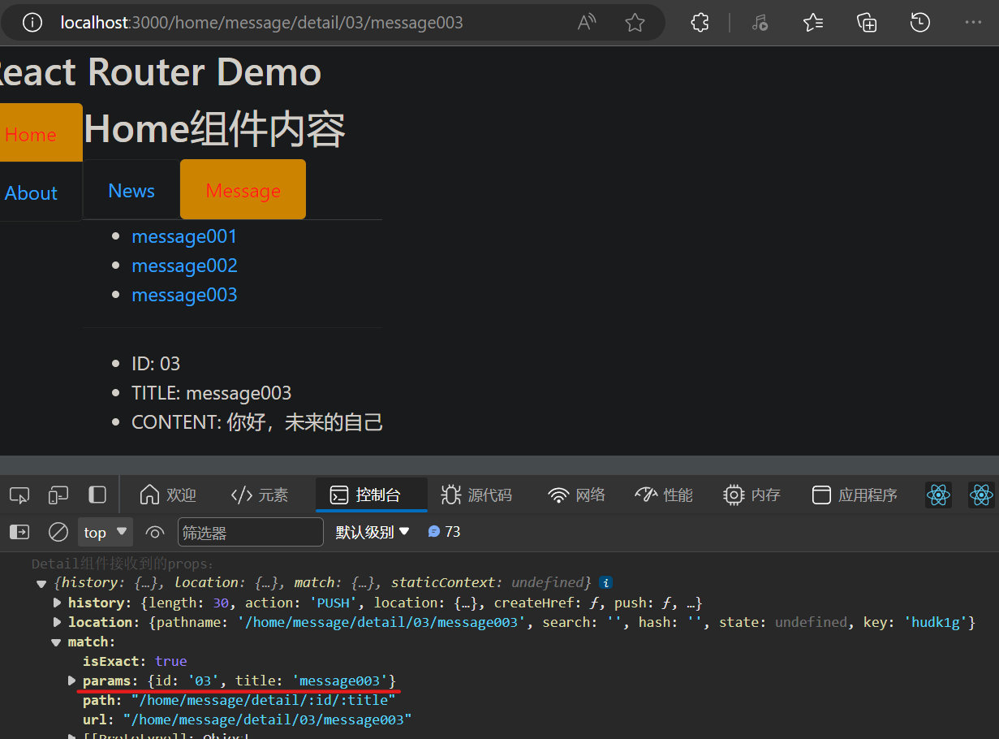

#### 传递 params 参数总结

- 路由链接（携带参数）：`<Link to="/home/message/detail/03/message003">message003</Link>`
- 注册路由（声明接收）：`<Route path="/home/message/detail/:id/:title" component={Detail}/>`
- 接收参数：`const { id, title } = this.props.match.params;`

### 向路由组件传递 search 参数

与 params参数 相比，传递 search参数 时简单一点，接收 search参数 时麻烦一点

#### src/pages/Home/Message/index.jsx

在 编写路由链接 时，**向路由组件传递search参数**
在 注册路由 时，**search参数无需声明接收，正常注册路由即可**

```js
import React, { Component } from 'react';
import { Link, Route } from 'react-router-dom';
import Detail from './Detail';

export default class Message extends Component {
    state = {
        messageArr: [
            {id: '01', title: 'message001'},
            {id: '02', title: 'message002'},
            {id: '03', title: 'message003'},
        ]
    }
  render() {
    const { messageArr } = this.state;
    return (
        <div>
            <ul>
                {
                    messageArr.map((msgObj) =>{
                        return (
                            <li key={msgObj.id}>
                                {/* 向路由组件传递search参数 */}
                                <Link to={`/home/message/detail/?id=${msgObj.id}&title=${msgObj.title}`}>{msgObj.title}</Link>&nbsp;&nbsp;
                            </li>
                        )
                    })
                }
            </ul>
            <hr/>
            {/* search参数无需声明接收，正常注册路由即可 */}
            <Route path="/home/message/detail" component={Detail}/>
        </div>
    )
  }
}
```

#### src/pages/Home/Message/Detail/index.jsx

通过 `this.props.location.search` 接收传入的search参数
获取到的search是 **urlencoded编码字符串**，需要使用 **query-string库** 解析
`qs.parse()` 用于把 urlencoded编码字符串 转化为 **对象**

```js
import React, { Component } from 'react';
import qs from 'query-string';

// 模拟服务器返回的数据
const detailData = [
    { id: '01', content: '你好，中国'},
    { id: '02', content: '你好，尚硅谷'},
    { id: '03', content: '你好，未来的自己'},
]

export default class Detail extends Component {
  render() {
    console.log('Detail组件接收到的props：',this.props);
    // 接收search参数
    const {search} = this.props.location;
    const {id,title} = qs.parse(search.substring(1));
    const findResult = detailData.find((detailObj)=>{
        return detailObj.id === id
    })
    return (
      <ul>
        <li>ID: {id}</li>
        <li>TITLE: {title}</li>
        <li>CONTENT: {findResult.content}</li>
      </ul>
    )
  }
}
```

效果如下
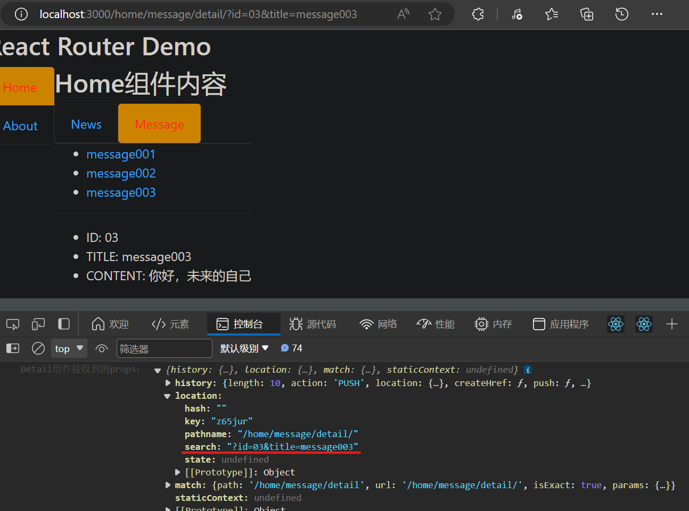

##### query-string库的使用

`qs.stringify()` 用于把 对象 转化为 **urlencoded编码字符串**
`qs.parse()` 用于把 urlencoded编码字符串 转化为 **对象**

```js
import qs from 'query-string';

let obj = {name: 'tom', age: 18};
// 想变成 name=tom&age=18 字符串，即 key=value&key=value（urlencoded编码）
console.log(qs.stringify(obj));

let str = 'name=tom&age=18';
// 想变成 {name: 'tom', age: 18} 对象
console.log(qs.parse(str));
```

效果如下


#### 传递 search 参数总结

- 路由链接（携带参数）：`<Link to="/home/message/detail/?id=03&title=message003">message003</Link>`
- 注册路由（无需声明，正常注册即可）：`<Route path="/home/message/detail" component={Detail}/>`
- 接收参数：`const {search} = this.props.location; const {id,title} = qs.parse(search.substring(1));`

### 向路由组件传递 state 参数

这里的 state 不同于 组件里的state，虽然都叫 state，但是这里的 state 是**路由组件独有的属性**
与前两者相比的优势：传递的东西**不会在路径中显示**

#### src/pages/Home/Message/index.jsx

在 编写路由链接 时，**向路由组件传递state参数，把 to 写成对象**
在 注册路由 时，**state参数无需声明接收，正常注册路由即可**

```js
import React, { Component } from 'react';
import { Link, Route } from 'react-router-dom';
import Detail from './Detail';

export default class Message extends Component {
    state = {
        messageArr: [
            {id: '01', title: 'message001'},
            {id: '02', title: 'message002'},
            {id: '03', title: 'message003'},
        ]
    }
  render() {
    const { messageArr } = this.state;
    return (
        <div>
            <ul>
                {
                    messageArr.map((msgObj) =>{
                        return (
                            <li key={msgObj.id}>
                                {/* 向路由组件传递state参数 */}
                                <Link to={{pathname:'/home/message/detail',state:{id:msgObj.id,title:msgObj.title}}}>{msgObj.title}</Link>&nbsp;&nbsp;
                            </li>
                        )
                    })
                }
            </ul>
            <hr/>
            {/* state参数无需声明接收，正常注册路由即可 */}
            <Route path="/home/message/detail" component={Detail}/>
        </div>
    )
  }
}
```

#### src/pages/Home/Message/Detail/index.jsx

通过 `this.props.location.state` 接收传入的state参数

```js
import React, { Component } from 'react';

// 模拟服务器返回的数据
const detailData = [
    { id: '01', content: '你好，中国'},
    { id: '02', content: '你好，尚硅谷'},
    { id: '03', content: '你好，未来的自己'},
]

export default class Detail extends Component {
  render() {
    console.log('Detail组件接收到的props：',this.props);
    // 接收state参数
    const {id,title} = this.props.location.state;
    const findResult = detailData.find((detailObj)=>{
        return detailObj.id === id
    })
    return (
      <ul>
        <li>ID: {id}</li>
        <li>TITLE: {title}</li>
        <li>CONTENT: {findResult.content}</li>
      </ul>
    )
  }
}
```

点击 message003后，效果如下（**刷新**的话，**数据也不会丢失**）


但是，如果 **清空缓存并硬刷新**，然后在浏览器中输入 `http://localhost:3000/home/message/detail`

就会报错

因为 `this.props.location.state` 的结果是 `undefined`

##### src/pages/Home/Message/Detail/index.jsx（修复报错）

`this.props.location.state || {}` 中的 `|| {}` 表示：如果 `this.props.location.state` 是 `undefined`，则返回一个空对象
findResult 也同理处理

```js
import React, { Component } from 'react';

// 模拟服务器返回的数据
const detailData = [
    { id: '01', content: '你好，中国'},
    { id: '02', content: '你好，尚硅谷'},
    { id: '03', content: '你好，未来的自己'},
]

export default class Detail extends Component {
  render() {
    console.log('Detail组件接收到的props：',this.props);
    // 接收state参数
    const {id,title} = this.props.location.state || {};
    const findResult = detailData.find((detailObj)=>{
        return detailObj.id === id
    }) || {};
    return (
      <ul>
        <li>ID: {id}</li>
        <li>TITLE: {title}</li>
        <li>CONTENT: {findResult.content}</li>
      </ul>
    )
  }
}
```

此时，如果 **清空缓存并硬刷新**，然后在浏览器中输入 `http://localhost:3000/home/message/detail`，就不会报错


#### 传递 state 参数总结

- 路由链接（携带参数）：`<Link to={{pathname:'/home/message/detail',state:{id:'03',title:'message003'}}}>message003</Link>`
- 注册路由（无需声明，正常注册即可）：`<Route path="/home/message/detail" component={Detail}/>`
- 接收参数：`const { id, title } = this.props.location.state;`

## push 和 replace

如上面的 **前端路由的基石：浏览器的历史记录 history** 所说：
- `push` 方法会向浏览器的历史记录中添加一个新的记录
- `replace` 方法则会替换掉当前的历史记录

默认的路由跳转使用 push 模式（会留下历史记录痕迹）

手动开启 replace 模式（不会留下历史记录痕迹）

### src/pages/Home/Message/index.jsx（replace模式）

在 Link组件中，添加 replace 属性

```js
import React, { Component } from 'react';
import { Link, Route } from 'react-router-dom';
import Detail from './Detail';

export default class Message extends Component {
    state = {
        messageArr: [
            {id: '01', title: 'message001'},
            {id: '02', title: 'message002'},
            {id: '03', title: 'message003'},
        ]
    }
  render() {
    const { messageArr } = this.state;
    return (
        <div>
            <ul>
                {
                    messageArr.map((msgObj) =>{
                        return (
                            <li key={msgObj.id}>
                                {/* 向路由组件传递state参数 */}
                                <Link replace to={{pathname:'/home/message/detail',state:{id:msgObj.id,title:msgObj.title}}}>{msgObj.title}</Link>&nbsp;&nbsp;
                            </li>
                        )
                    })
                }
            </ul>
            <hr/>
            {/* state参数无需声明接收，正常注册路由即可 */}
            <Route path="/home/message/detail" component={Detail}/>
        </div>
    )
  }
}
```

在 message001、message002、message003 之前跳转时，不会留下历史记录痕迹

## 编程式路由导航

之前的路由跳转都要依靠 Link组件 或 NavLink组件 实现
而使用编程式路由导航，可通过 JS代码实现路由的跳转

现有有需求：点击 News组件，当 News组件 展示3秒后，自动跳到 Message组件（不借助路由链接，不需要人手动点击）

### src/pages/Home/News/index.jsx

```js
import React, { Component } from 'react';

export default class News extends Component {
  componentDidMount(){
    setTimeout(()=>{
      this.props.history.push(`/home/message`);  //编程式导航
    },3000)
  }
  render() {
    return (
        <div>
            <ul>
                <li>news001</li>
                <li>news002</li>
                <li>news003</li>
            </ul>
        </div>
    )
  }
}
```

可实现上面所述的效果，这样使路由的跳转更加灵活，不需要借助路由链接，不需要人手动点击

### 总结

通过 `this.props.history` 拿到 history，在事件的回调函数中调用 history 的方法

```js
// push跳转，携带params参数
this.props.history.push(`/home/message/detail/${id}/${title}`);
// replace跳转，携带params参数
this.props.history.replace(`/home/message/detail/${id}/${title}`);
// push跳转，携带search参数
this.props.history.push(`/home/message/detail/?id=${id}&title=${title}`);
// replace跳转，携带search参数
this.props.history.replace(`/home/message/detail/?id=${id}&title=${title}`);
// push跳转，携带state参数
this.props.history.push(`/home/message/detail`,{id:id,title:title});
// replace跳转，携带state参数
this.props.history.replace(`/home/message/detail`,{id:id,title:title});
// 后退
this.props.history.goBack();
// 前进
this.props.history.goForward();
// go方法，参数n是一个数值，正数代表前进几步，负数代表后退几步
this.props.history.go(n);
```

## withRouter

之前的代码中，只有 **路由组件** 的 props 中有 history、location、match
如何让 **一般组件** 有 路由组件 的 API？
使用 **withRouter**

### src/components/Header/index.jsx（withRouter）

withRouter 的作用：能够接收一个 一般组件，然后在其props加上 路由组件 特有的 history、location、match，并返回加工后的新组件（**一般组件 变身 高阶组件**）

```js
import React, { Component } from 'react';
import { withRouter } from 'react-router-dom';

class Header extends Component {
  render() {
    // console.log('Header组件收到的props：',this.props);
    return (
        <div className="page-header"><h2>React Router Demo</h2></div>
    )
  }
}

export default withRouter(Header);
```

### src/components/Header/index.jsx（使用this.props.history）

然后就可以使用 `this.props.history` 了

```js
import React, { Component } from 'react';
import { withRouter } from 'react-router-dom';

class Header extends Component {
  goBack = ()=>{
    this.props.history.goBack();
  }
  goForward = ()=>{
    this.props.history.goForward();
  }
  go = ()=>{
    const goNum = this.goNum ? this.goNum.value : 0;
    if(goNum !== 0) this.props.history.go(goNum);
  }
  render() {
    // console.log('Header组件收到的props：',this.props);
    return (
        <div className="page-header">
          <h2>React Router Demo</h2>
          <button onClick={this.goBack}>goBack</button>&nbsp;&nbsp;
          <button onClick={this.goForward}>goForward</button>&nbsp;&nbsp;
          <input ref={c => this.goNum = c} type="text" placeholder="enter where you go" />
          <button onClick={this.go}>go</button>&nbsp;&nbsp;
          </div>
    )
  }
}

export default withRouter(Header);
```

效果如下
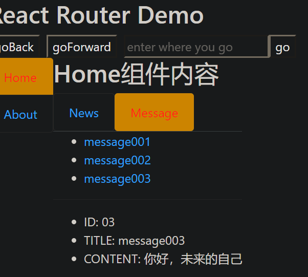

## BrowserRouter 与 HashRouter 的区别

1. 底层原理不一样：
   1. BrowserRouter 使用的是 H5 的 history API（不是`this.props.history`，`this.props.history`是对H5的history的二次封装），不兼容 IE9 及以下版本
   2. HashRouter 使用的是 URL 的哈希值
2. path表现形式不一样
   1. BrowserRouter 的路径中没有`#`，例如：`localhost:3000/demo/test`
   2. HashRouter 的路径包含`#`，例如：`localhost:3000/#/demo/test`
3. 刷新后，对**路由state参数**的影响
   1. BrowserRouter 没有任何影响，因为路由state保存在history对象中
   2. HashRouter 刷新后会导致路由state参数的**丢失**

