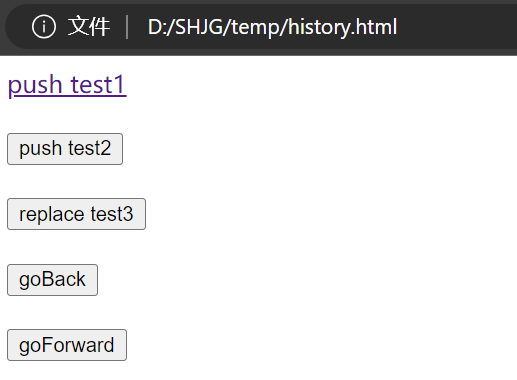

# React 路由

## SPA 的理解（单页面，多组件）

1. SPA 即 **Single Page Application**（单页面应用）
2. 整个应用只有**一个完整的页面**
3. 点击页面中的链接**不会刷新**页面，只会做页面的**局部更新**
4. 数据都需要通过 **ajax请求** 获取，并在前端异步展现

## 路由 的理解

一个路由就是一个映射关系（key:value）
其中，key 为 url 中的 path（路径），value 为 function（后端路由） 或 component（前端路由）

### 路由分类

#### 后端路由

理解：服务器端路由，value 是 **function**，用来处理客户端提交的请求

注册路由：`router.get(path,function(req,res))`

工作过程：当 node 接收到一个请求时，根据请求路径找到匹配的路由，调用路由中的函数处理请求，返回响应数据

#### 前端路由

理解：浏览器端路由，value 是 **component**，用于展示页面内容

注册路由：`<Route path="/test" component={Test}>`

工作过程：当浏览器的 path 变为/test 时，当前路由组件就会变为 Test 组件

## 前端路由的工作原理

[深入理解前端路由：构建现代 Web 应用的基石（上）](https://blog.csdn.net/weixin_42554191/article/details/134745958)
[深入理解前端路由：构建现代 Web 应用的基石（下）](https://web-hls.blog.csdn.net/article/details/134746077)

前端路由是一种在单页应用程序（SPA）中管理页面导航的技术，它通过**在浏览器中修改 url 中的 path 而不向服务器发送请求来实现页面的切换**

问题是，前端路由怎么实现对 url 中的 path 的监测

### 前端路由的基石：浏览器的历史记录 history

[JavaScript之彻底搞懂DOM与BOM及其区别与用法](https://blog.csdn.net/qq_52736131/article/details/123563321)


用一个式子总结它们之间的关系：
**JavaScript = ECMAscript + BOM + DOM**

- ECMAscript：它是一种由 ECMA国际（前身为欧洲计算机制造商协会）通过 ECMA-262 标准化的脚本程序设计语言，它是JavaScript（简称JS）的标准，浏览器就是去执行这个标准
- DOM（document 是其的一个对象）：即 Document Object Model（文档对象模型），它是一种独立于语言，用于操作**xml，html文档**的应用编程接口
- BOM（window 是其的一个对象）：即 Browser Object Model（浏览器对象模型），它是为了控制**浏览器**的行为而出现的接口

BOM 身上有 浏览器的历史记录 history


直接操作 window.history 比较麻烦，我们借助 history.js库 来操作

```html
<!DOCTYPE html>
<html lang="en">
<head>
    <meta charset="UTF-8">
    <title>前端路由的基石 history</title>
</head>
<body>
    <a href="https://cn.bing.com" onclick="return push('/test1');">push test1</a><br><br>
    <button onclick="push('/test2')">push test2</button><br><br>
    <button onclick="replace('/test3')">replace test3</button><br><br>
    <button onclick="back()">goBack</button><br><br>
    <button onclick="forward()">goForward</button><br><br>

    <script type="text/javascript" src="https://cdn.bootcss.com/history/4.7.2/history.js"></script>
    <script type="text/javascript">
        // 方法一：直接使用H5推出的history身上的API
        let history = History.createBrowserHistory();
        // 方法二：使用hash值（锚点）
        // 锚点跳转不会引起页面的刷新，但是能留下历史记录
        // let history = History.createHashHistory();
        function push(path) {
            // 向浏览器的history栈中推入一条记录
            history.push(path);
            return false;
        }
        function replace(path) {
            // 替换当前记录
            history.replace(path);
        }
        function back() {
            history.goBack();
        }
        function forward() {
            history.goForward();
        }
        // 监听路径变化
        history.listen((location) => {
            console.log('请求路径变化为：',location);
        });
    </script>
</body>
</html>
```

效果如下


在windows中直接打开这个html文件，点击按钮，会报错，如下图所示


原因是 history.pushstate 方法修改url不能**跨域**。因为该项目是直接通过浏览器打开文件就可以查看，修改了原有的地址会进行报错。如果启动本地服务器不会存在这个问题

那就用nginx来代理一下

在WSL2子系统中新建文件 /etc/nginx/sites-available/myconf5，内容如下
```conf
server {
	listen 8011;
	server_name localhost;

	location /history.html {
		alias /home/kzj/react_demo/history.html;
	}
}
```

使配置生效


访问 http://127.0.0.1:8011/history.html
效果如下


浏览器的历史记录是**栈结构**

点击按钮时，请求路径的变化如下


## react-router-dom 的理解

1. react 的一个插件库
2. 专门用来实现一个 SPA 应用
3. 基于 react 的项目基本都会用到此库

# react-router-dom（旧的5版本）

[中文文档](https://react-router.docschina.org/web/guides/philosophy)

## 安装 react-router-dom

```sh
npm install react-router-dom@5
```

## 路由的基本使用

### 使用路由链接实现切换组件

实现步骤：
1. 点击导航链接，引起**路径变化**
2. 路径的变化被前端路由器监测到，进行**匹配组件**，从而展示

现在新建一个react项目，清空 文件夹 src/ 和 文件夹 public/ 中的文件，我们自己实现一个可运行的最简形式

#### Home组件

##### src/components/Home/index.jsx

```js
import React, { Component } from 'react';

export default class About extends Component {
  render() {
    return (
      <div>About组件</div>
    )
  }
}
```

#### About组件

##### src/components/About/index.jsx

```js
import React, { Component } from 'react';

export default class Home extends Component {
  render() {
    return (
      <div>Home组件</div>
    )
  }
}
```

#### public/index.html

引用 bootstrap.min.css 样式文件（外部引用、CDN引用）

```html
<!DOCTYPE html>
<html lang="en">
  <head>
    <meta charset="utf-8" />
    <title>React App</title>
    <meta name="viewport" content="width=device-width, initial-scale=1">
    <link rel="stylesheet" href="https://cdn.staticfile.org/twitter-bootstrap/4.3.1/css/bootstrap.min.css">
  </head>
  <body>
    <div id="root"></div>
  </body>
</html>
```

#### src/index.js

```js
import React from 'react';
import ReactDOM from 'react-dom/client';
import App from './App';

const root = ReactDOM.createRoot(document.getElementById('root'));
root.render(
  <React.StrictMode>
    <App />
  </React.StrictMode>
);
```

#### src/App.js（Link组件）

使用 **Link组件** 编写路由链接

```js
import React, { Component } from 'react';
import { Link, BrowserRouter } from 'react-router-dom';

export default class App extends Component {
  render() {
    return (
      <div>
        <div className="row">
          <div className="col-xs-offset-2 col-xs-8">
            <div className="page-header"><h2>React Router Demo</h2></div>
          </div>
        </div>
        <div className="row">
          <div className="col-xs-2 col-xs-offset-2">
            <div className="list-group">
              {/* 编写路由链接 */}
              <BrowserRouter>
                <Link className="list-group-item" to="/home">Home</Link>
                <Link className="list-group-item" to="/about">About</Link>
              </BrowserRouter>
            </div>
          </div>
          <div className="col-xs-6">
            <div className="panel">
              <div className="panel-body">
                ?????
              </div>
            </div>
          </div>
        </div>
      </div>
    )
  }
}
```

现在，我们已经能通过点击路由链接，实现路径的变化


#### src/App.js（Route组件）

使用 **Route组件** 注册路由

```js
import React, { Component } from 'react';
import { Link, BrowserRouter, Route } from 'react-router-dom';
import Home from './components/Home';
import About from './components/About';

export default class App extends Component {
  render() {
    return (
      <div>
        <div className="row">
          <div className="col-xs-offset-2 col-xs-8">
            <div className="page-header"><h2>React Router Demo</h2></div>
          </div>
        </div>
        <div className="row">
          <div className="col-xs-2 col-xs-offset-2">
            <div className="list-group">
              {/* 编写路由链接 */}
              <BrowserRouter>
                <Link className="list-group-item" to="/home">Home</Link>
                <Link className="list-group-item" to="/about">About</Link>
              </BrowserRouter>
            </div>
          </div>
          <div className="col-xs-6">
            <div className="panel">
              <div className="panel-body">
                {/* 注册路由 */}
                <BrowserRouter>
                  <Route path="/home" component={Home} />
                  <Route path="/about" component={About} />
                </BrowserRouter>
              </div>
            </div>
          </div>
        </div>
      </div>
    )
  }
}
```

此时，点击路由链接，但是组件没有变，是什么问题？
因为整个应用要用一个路由器管理，所以不要像上面代码中用两个路由器（两个路由器之间没有数据沟通），而是需要**将App组件改为路由器组件**

#### src/index.js（BrowserRouter组件）

把 App组件 用 **BrowserRouter组件** 包住

```js
import React from 'react';
import ReactDOM from 'react-dom/client';
import App from './App';
import { BrowserRouter } from 'react-router-dom';

const root = ReactDOM.createRoot(document.getElementById('root'));
root.render(
  <React.StrictMode>
    <BrowserRouter>
      <App />
    </BrowserRouter>
  </React.StrictMode>
);
```

#### src/App.js

去掉 **BrowserRouter组件**

```js
import React, { Component } from 'react';
import { Link, Route } from 'react-router-dom';
import Home from './components/Home';
import About from './components/About';

export default class App extends Component {
  render() {
    return (
      <div>
        <div className="row">
          <div className="col-xs-offset-2 col-xs-8">
            <div className="page-header"><h2>React Router Demo</h2></div>
          </div>
        </div>
        <div className="row">
          <div className="col-xs-2 col-xs-offset-2">
            <div className="list-group">
              {/* 编写路由链接 */}
                <Link className="list-group-item" to="/home">Home</Link>
                <Link className="list-group-item" to="/about">About</Link>
            </div>
          </div>
          <div className="col-xs-6">
            <div className="panel">
              <div className="panel-body">
                {/* 注册路由 */}
                  <Route path="/home" component={Home} />
                  <Route path="/about" component={About} />
              </div>
            </div>
          </div>
        </div>
      </div>
    )
  }
}
```

现在，当路径变化，就会展示对应的组件（不会发送网络请求）


--- 

P78


[代码](https://github.com/xzlaptt/React)
