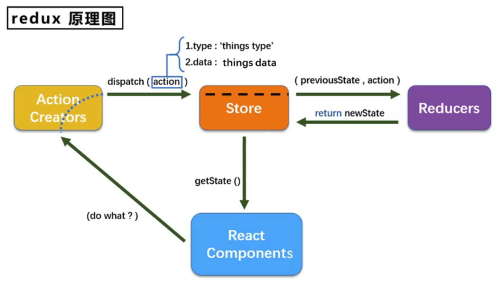
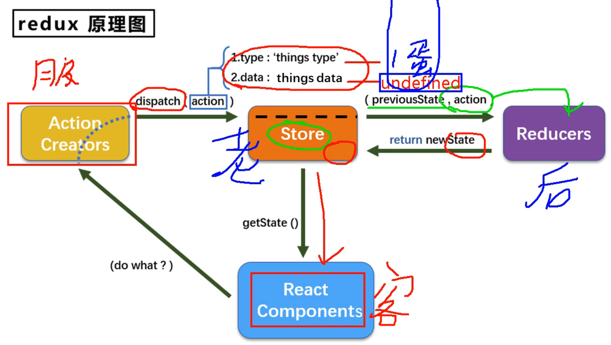
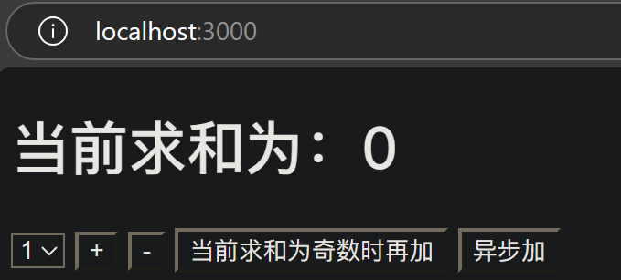
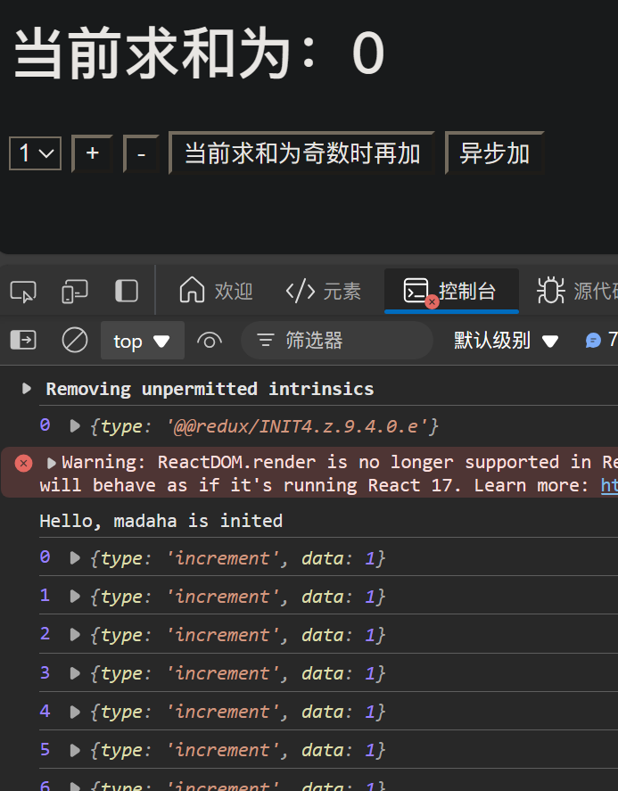
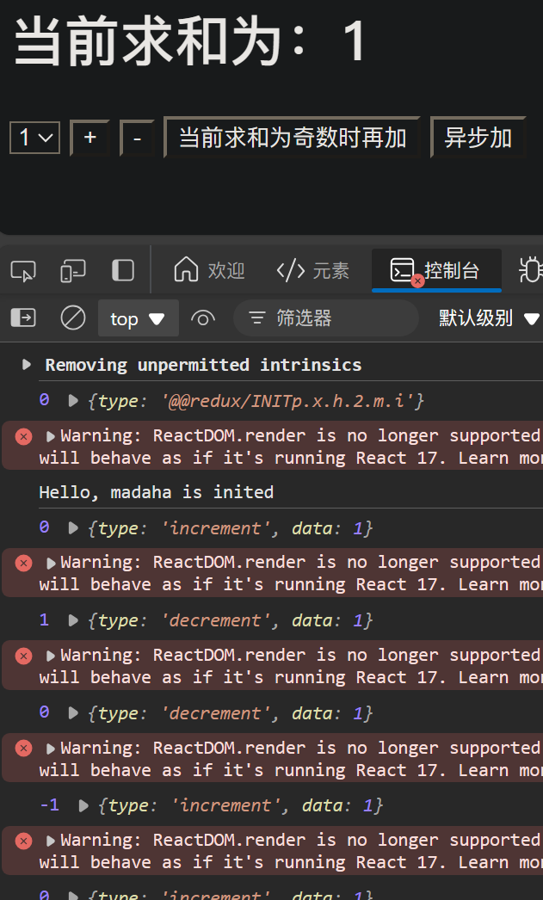

# redux

## redux理解

### 文档

英文文档：https://redux.js.org/

中文文档：https://www.redux.org.cn/

github：https://github.com/reduxjs/redux

### redux是什么

redux是一个专门用于做**状态管理**的JS库（不是react插件库）
它可以用在 react，vue，angular 等框架中，但基本与react配合使用
作用：**集中式管理**react应用中多个组件**共享**的**状态**

### 什么时候用redux

1. 某个组件的状态，需要让其他组件可以随时拿到（**共享**）
2. 一个组件需要改变另一个组件的状态（**通信**）
3. 总体原则：能不用就不用，如果不用比较吃力才考虑使用

### redux工作流程





## redux的三个核心概念

### action

- 动作的对象
- 包含2个属性：
    1. `type`：**标识**属性，值为字符串，唯一，**必要**属性
    2. `data`：**数据**属性，值类型任意，**可选**属性
- 例子：`{type:'ADD_STUDENT',data:{name:'tom',age:18}}`

### reducer

- 用于**初始化**状态、**加工**状态
- 加工时，根据旧的`state`和`action`，产生新的`state`的**纯函数**

### store

- 将`state`、`action`、`reducer`联系在一起的对象
- 如何得到此对象？
    1. `import {createStore} from 'redux'`
    2. `import reducer from './reducers'`
    3. `const store = createStore(reducer)`
- 此对象的功能？
    1. `getState()`：得到`state`
    2. `dispatch(action)`：分发`action`,触发`reducer`调用，产生新的`state`
    3. `subscribe(listener)`：注册监听，当产生了新的`state`时，自动调用

# 求和案例

## 纯react实现

首先初始化项目
```sh
npx create-react-app redux_test
```
然后删掉用不到的文件

### 实现静态组件

现在项目的目录结构如下
```sh
todolist/
  README.md
  node_modules/
  package.json
  .gitignore
  public/
    index.html
  src/
    App.js
    index.jsx
    components/
      Count/
        index.jsx
```

#### public/index.html

```html
<!DOCTYPE html>
<html lang="en">
<head>
    <meta charset="UTF-8">
    <meta name="viewport" content="width=device-width, initial-scale=1.0">
    <title>redux</title>
</head>
<body>
    <div id="root"></div>
</body>
</html>
```

#### src/App.js

```js
import React, { Component } from 'react';
import Count from './components/Count';

export default class App extends Component {
  render() {
    return (
      <div>
        <Count/>
      </div>
    )
  }
}
```

#### src/index.jsx

```jsx
import React from "react";
import ReactDOM from "react-dom";
import App from './App';

ReactDOM.render(<App/>, document.getElementById('root'));
```

#### src/components/Count/index.jsx

```jsx
import React, { Component } from 'react';

export default class Count extends Component {
  render() {
    return (
      <div>
        <h1>当前求和为：0</h1>
        <select ref={c => this.selectNumber = c}>
            <option value="1">1</option>
            <option value="2">2</option>
            <option value="3">3</option>
        </select>&nbsp;
        <button>+</button>&nbsp;
        <button>-</button>&nbsp;
        <button>当前求和为奇数时再加</button>&nbsp;
        <button>异步加</button>&nbsp;
      </div>
    )
  }
}
```

效果如下


### 实现求和功能

#### src/components/Count/index.jsx

```jsx
import React, { Component } from 'react';

export default class Count extends Component {

  state = { count: 0 }

  // 加法
  increment = () => {
    const { value } = this.selectNumber;
    const { count } = this.state;
    this.setState({ count: count + value * 1 });
  }

  // 减法
  decrement = () => {
    const { value } = this.selectNumber;
    const { count } = this.state;
    this.setState({ count: count - value * 1 });
  }

  // 奇数再加
  incrementIfOdd = () => {
    const { value } = this.selectNumber;
    const { count } = this.state;
    if (count % 2 !== 0) {
      this.setState({ count: count + value * 1 });
    }
  }

  // 异步加
  incrementAsync = () => {
    const { value } = this.selectNumber;
    const { count } = this.state;
    setTimeout(()=>{
      this.setState({ count: count + value * 1 });
    }, 500)
  }

  render() {
    return (
      <div>
        <h1>当前求和为：{this.state.count}</h1>
        <select ref={c => this.selectNumber = c}>
          <option value="1">1</option>
          <option value="2">2</option>
          <option value="3">3</option>
        </select>&nbsp;
        <button onClick={this.increment}>+</button>&nbsp;
        <button onClick={this.decrement}>-</button>&nbsp;
        <button onClick={this.incrementIfOdd}>当前求和为奇数时再加</button>&nbsp;
        <button onClick={this.incrementAsync}>异步加</button>&nbsp;
      </div>
    )
  }
}
```

## redux精简版

### 安装 redux

```sh
npm install redux
```

### 使用 redux

在上面项目的基础上，创建`redux`文件夹，并创建`store.js`和`count_reducer.js`

现在项目的目录结构如下
```sh
todolist/
  README.md
  node_modules/
  package.json
  .gitignore
  public/
    index.html
  src/
    App.js
    index.jsx
    components/
      Count/
        index.jsx
    redux/
      store.js
      count_reducer.js
```

#### src/redux/store.js（`createStore`）

```js
/*
    该文件专门用于暴露一个store对象，整个应用只有一个store对象
*/ 

// 引入createStore，专门用于创建redux中最核心的store对象
import { createStore } from 'redux';
// 引入为Count组件服务的reducer
import countReducer from './count_reducer';
// 暴露store
export default createStore(countReducer);
```

#### src/redux/count_reducer.js

```js
/*
    1. 该文件是用于创建一个为Count组件服务的reducer，reducer的本质就是一个函数
    2. reducer函数会接到两个参数，分别为：之前的状态(preState)、动作对象(action)
*/

const initState = 0;    // 初始化状态
export default function countReducer(preState = initState, action) {
    console.log(preState, action);
    // 从action对象中获取type、data
    const { type, data } = action;
    // 根据type决定如何加工数据
    switch (type) {
        case 'increment':
            return preState + data;
        case 'decrement':
            return preState - data;
        default:
            return preState;
    }
}
```

注意：reducer只关注数据，不关注业务逻辑，只负责对状态进行初始化、加工，具体的 **当前求和为奇数时再加**、**异步加** 放到组件中实现

### 实现求和功能

#### src/components/Count/index.jsx（`getState`、`dispatch`）

```jsx
import React, { Component } from 'react';
// 引入store，用于获取redux中保存的状态
import store from '../../redux/store';

export default class Count extends Component {


  // 加法
  increment = () => {
    const { value } = this.selectNumber;
    // 通知redux加value
    store.dispatch({ type: 'increment', data: value*1 });
  }

  // 减法
  decrement = () => {

  }

  // 奇数再加
  incrementIfOdd = () => {

  }

  // 异步加
  incrementAsync = () => {
    
  }

  render() {
    return (
      <div>
        <h1>当前求和为：{store.getState()}</h1>
        <select ref={c => this.selectNumber = c}>
          <option value="1">1</option>
          <option value="2">2</option>
          <option value="3">3</option>
        </select>&nbsp;
        <button onClick={this.increment}>+</button>&nbsp;
        <button onClick={this.decrement}>-</button>&nbsp;
        <button onClick={this.incrementIfOdd}>当前求和为奇数时再加</button>&nbsp;
        <button onClick={this.incrementAsync}>异步加</button>&nbsp;
      </div>
    )
  }
}
```

效果如下


存在的问题：
redux维护的值在改变，但是页面没有更新

> - **react**承诺过，只要调用`this.setState()`方法，就能更新react的`state`，并重新调用`render()`方法进行**页面刷新**
> - **redux**只承诺一件事：**只负责管理状态**，**不负责页面的更新**。至于状态的改变驱动着页面的更新，要靠我们自己写

#### src/components/Count/index.jsx（`subscribe`）

```jsx
import React, { Component } from 'react';
// 引入store，用于获取redux中保存的状态
import store from '../../redux/store';

export default class Count extends Component {

  componentDidMount(){
    // 检测redux中状态的变化，只要变化，就调用render
    store.subscribe(()=>{
      this.forceUpdate();
    })
  }

  // 加法
  increment = () => {
    const { value } = this.selectNumber;
    // 通知redux加value
    store.dispatch({ type: 'increment', data: value*1 });
  }

  // 减法
  decrement = () => {
    const { value } = this.selectNumber;
    store.dispatch({ type: 'decrement', data: value*1 });
  }

  // 奇数再加
  incrementIfOdd = () => {
    const { value } = this.selectNumber;
    const count = store.getState();
    if (count % 2 !== 0) {
      store.dispatch({ type: 'increment', data: value*1 });
    }
  }

  // 异步加
  incrementAsync = () => {
    const { value } = this.selectNumber;
    setTimeout(()=>{
      store.dispatch({ type: 'increment', data: value*1 });
    }, 500)
  }

  render() {
    return (
      <div>
        <h1>当前求和为：{store.getState()}</h1>
        <select ref={c => this.selectNumber = c}>
          <option value="1">1</option>
          <option value="2">2</option>
          <option value="3">3</option>
        </select>&nbsp;
        <button onClick={this.increment}>+</button>&nbsp;
        <button onClick={this.decrement}>-</button>&nbsp;
        <button onClick={this.incrementIfOdd}>当前求和为奇数时再加</button>&nbsp;
        <button onClick={this.incrementAsync}>异步加</button>&nbsp;
      </div>
    )
  }
}
```

效果如下


其中的代码：
```jsx
  componentDidMount(){
    // 检测redux中状态的变化，只要变化，就调用render
    store.subscribe(()=>{
      this.forceUpdate();
    })
  }
```
如果有很多组件，每个组件里都要写一次，比较冗余

提取出来，只写一次

### 精简调用render的代码

#### src/components/Count/index.jsx

去掉`componentDidMount()`代码

```jsx
import React, { Component } from 'react';
// 引入store，用于获取redux中保存的状态
import store from '../../redux/store';

export default class Count extends Component {

  // 加法
  increment = () => {
    const { value } = this.selectNumber;
    // 通知redux加value
    store.dispatch({ type: 'increment', data: value*1 });
  }

  // 减法
  decrement = () => {
    const { value } = this.selectNumber;
    store.dispatch({ type: 'decrement', data: value*1 });
  }

  // 奇数再加
  incrementIfOdd = () => {
    const { value } = this.selectNumber;
    const count = store.getState();
    if (count % 2 !== 0) {
      store.dispatch({ type: 'increment', data: value*1 });
    }
  }

  // 异步加
  incrementAsync = () => {
    const { value } = this.selectNumber;
    setTimeout(()=>{
      store.dispatch({ type: 'increment', data: value*1 });
    }, 500)
  }

  render() {
    return (
      <div>
        <h1>当前求和为：{store.getState()}</h1>
        <select ref={c => this.selectNumber = c}>
          <option value="1">1</option>
          <option value="2">2</option>
          <option value="3">3</option>
        </select>&nbsp;
        <button onClick={this.increment}>+</button>&nbsp;
        <button onClick={this.decrement}>-</button>&nbsp;
        <button onClick={this.incrementIfOdd}>当前求和为奇数时再加</button>&nbsp;
        <button onClick={this.incrementAsync}>异步加</button>&nbsp;
      </div>
    )
  }
}
```

#### src/index.jsx

只要redux中状态发生了变化，就调用App组件的render方法

```jsx
import React from "react";
import ReactDOM from "react-dom";
import App from './App';
import store from './redux/store';


ReactDOM.render(<App/>, document.getElementById('root'));

store.subscribe(()=> {
    ReactDOM.render(<App/>, document.getElementById('root'));
})
```

但是存在效率问题：虽然有 **DOM diffing 算法**，只会**刷新变化的部分组件**，但是diffing算法在组件很多的时候，自身会消耗一定的资源

## redux完整版


--- 

P101


[代码](https://github.com/xzlaptt/React)
