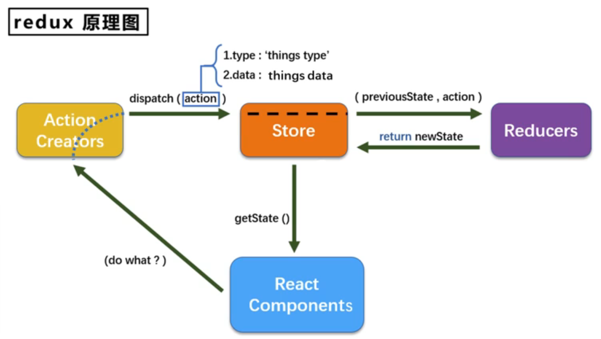
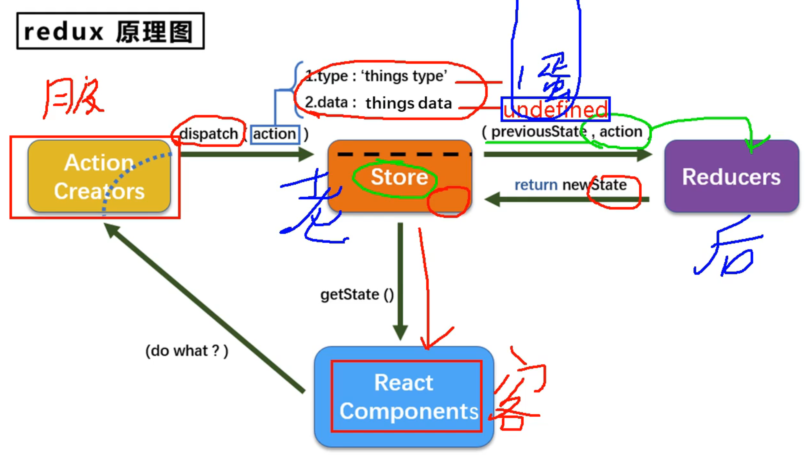
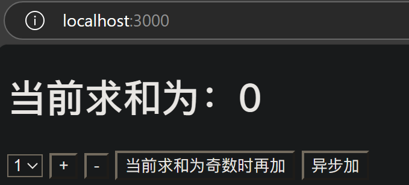

# redux

## redux理解

### 文档

英文文档：https://redux.js.org/

中文文档：https://www.redux.org.cn/

github：https://github.com/reduxjs/redux

### redux是什么

redux是一个专门用于做**状态管理**的JS库（不是react插件库）
它可以用在 react，vue，angular 等框架中，但基本与react配合使用
作用：**集中式管理**react应用中多个组件**共享**的**状态**

### 什么时候用redux

1. 某个组件的状态，需要让其他组件可以随时拿到（**共享**）
2. 一个组件需要改变另一个组件的状态（**通信**）
3. 总体原则：能不用就不用，如果不用比较吃力才考虑使用

### redux工作流程





## redux的三个核心概念

### action

- 动作的对象
- 包含2个属性：
    1. `type`：**标识**属性，值为字符串，唯一，**必要**属性
    2. `data`：**数据**属性，值类型任意，**可选**属性
- 例子：`{type:'ADD_STUDENT',data:{name:'tom',age:18}}`

### reducer

- 用于**初始化**状态、**加工**状态
- 加工时，根据旧的`state`和`action`，产生新的`state`的**纯函数**

### store

- 将`state`、`action`、`reducer`联系在一起的对象
- 如何得到此对象？
    1. `import {createStore} from 'redux'`
    2. `import reducer from './reducers'`
    3. `const store = createStore(reducer)`
- 此对象的功能？
    1. `getState()`:得到`state`
    2. `dispatch(action)`:分发`action`,触发`reducer`调用，产生新的`state`
    3. `subscribe(listener)`:注册监听，当产生了新的`state`时，自动调用

## 求和案例

### 纯react实现

首先初始化项目
```sh
npx create-react-app redux_test
```
然后删掉用不到的文件

### 实现静态组件

现在项目的目录结构如下
```sh
todolist/
  README.md
  node_modules/
  package.json
  .gitignore
  public/
    index.html
  src/
    App.js
    index.jsx
    components/
      Count/
        index.jsx
```

#### public/index.html

```html
<!DOCTYPE html>
<html lang="en">
<head>
    <meta charset="UTF-8">
    <meta name="viewport" content="width=device-width, initial-scale=1.0">
    <title>redux</title>
</head>
<body>
    <div id="root"></div>
</body>
</html>
```

#### src/App.js

```js
import React, { Component } from 'react';
import Count from './components/Count';

export default class App extends Component {
  render() {
    return (
      <div>
        <Count/>
      </div>
    )
  }
}
```

#### src/index.jsx

```jsx
import React from "react";
import ReactDOM from "react-dom";
import App from './App'

ReactDOM.render(<App/>, document.getElementById('root'));
```

#### src/components/List/index.jsx

```jsx
import React, { Component } from 'react';

export default class Count extends Component {
  render() {
    return (
      <div>
        <h1>当前求和为：0</h1>
        <select ref={c => this.selectNumber = c}>
            <option value="1">1</option>
            <option value="2">2</option>
            <option value="3">3</option>
        </select>&nbsp;
        <button>+</button>&nbsp;
        <button>-</button>&nbsp;
        <button>当前求和为奇数时再加</button>&nbsp;
        <button>异步加</button>&nbsp;
      </div>
    )
  }
}
```

效果如下


### redux精简版


---

## redux的三个核心API

### createstore()

创建包含指定reducer的store对象


--- 

P99   11min


[代码](https://github.com/xzlaptt/React)
