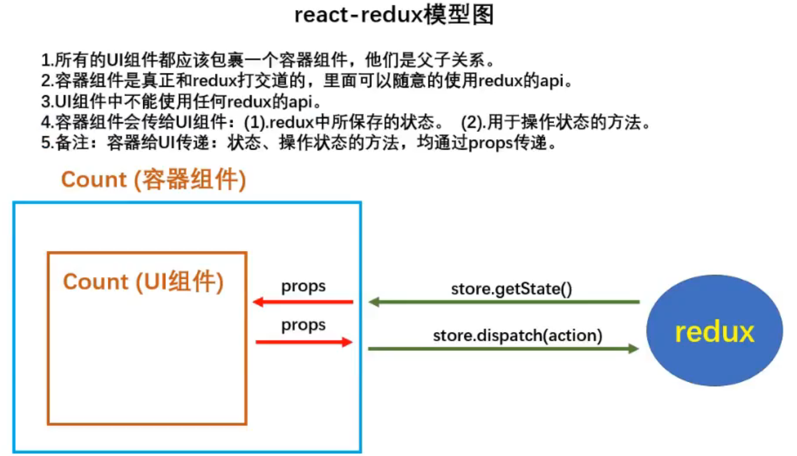
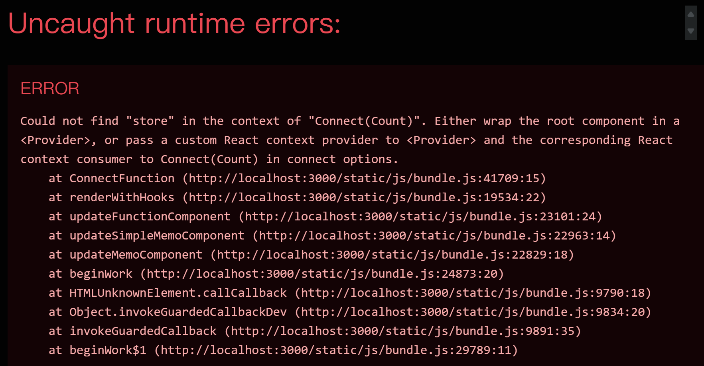
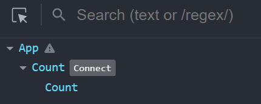
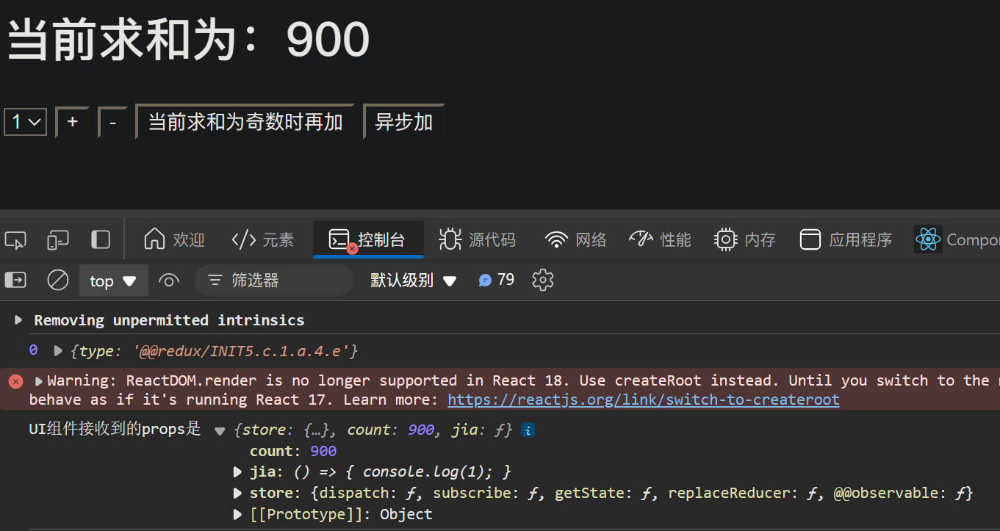

# react-redux

前面所讲的redux只是单纯的一个状态管理库，和react没有关系
react推出 react-redux插件库，更舒服地使用redux

## 安装

`npm install react-redux`

## 模型图



# 求和案例

继续使用上一章的求和案例

## 实现容器组件

在`src`目录下创建一个`containers`文件夹，里面创建一个`Count`文件夹，里面创建一个`index.jsx`文件

现在项目的目录结构如下
```sh
todolist/
  README.md
  node_modules/
  package.json
  .gitignore
  public/
    index.html
  src/
    App.js
    index.jsx
    components/
      Count/
        index.jsx
    containers/
      Count/
        index.jsx
    redux/
      store.js
      count_reducer.js
      count_action.js
      constant.js
```

### src/containers/Count/index.jsx

容器组件起到**桥梁**作用，一边是**UI组件**，一边是**redux**
容器组件不能亲自写，需要使用`react-redux`提供的`connect`函数

```jsx
// 引入Count的UI组件
import CountUI from "../../components/Count";
// 引入redux中的store
import store from "../../redux/store";
// 引入connect用于连接UI组件与redux
import { connect } from "react-redux";

// 使用connect()()，创建并暴露一个Count容器组件
export default connect()(CountUI);
```

## 渲染容器组件

### src/App.js

之前是渲染`Count的UI组件`，现在改为渲染`Count的容器组件`

```js
import React, { Component } from 'react';
import Count from './containers/Count';

export default class App extends Component {
  render() {
    return (
      <div>
        <Count/>
      </div>
    )
  }
}
```

效果如下


因为上面的`src/containers/Count/index.jsx`文件中的`Count的容器组件`，只连接了**UI组件**，还没有连接**redux**，所以报错

容器组件不需要自己引入`store`，必须在上一层通过`props`的方式传递
`src/App.js`文件修改如下
```js
import React, { Component } from 'react';
import Count from './containers/Count';
import store from './redux/store';

export default class App extends Component {
  render() {
    return (
      <div>
        <Count store={store}/>
      </div>
    )
  }
}
```

这样就相当于`Count的容器组件`连接了**redux**
运行后不再报错

## 容器组件（父）给UI组件（子）传递信息

**容器组件**和**UI组件**是父子关系


### src/containers/Count/index.jsx（父）

```jsx
// 引入Count的UI组件
import CountUI from "../../components/Count";
// 引入connect用于连接UI组件与redux
import { connect } from "react-redux";

// a函数的返回的对象中的key就作为传递给UI组件props的key，value就作为传递给UI组件props的value
// 传递状态
function a() {
    return { count: 900 };
    // 相当于 <CountUI count={900}/>
}

// a函数的返回的对象中的key就作为传递给UI组件props的key，value就作为传递给UI组件props的value
// 传递操作状态的方法
function b() {
    return { jia: () => { console.log(1); } }
}

// 使用connect()()，创建并暴露一个Count容器组件
export default connect(a, b)(CountUI);
```

### src/components/Count/index.jsx（子）

```jsx
import React, { Component } from 'react';

export default class Count extends Component {

  // 加法
  increment = () => {
    const { value } = this.selectNumber;
  }

  // 减法
  decrement = () => {
    const { value } = this.selectNumber;
  }

  // 奇数再加
  incrementIfOdd = () => {
    const { value } = this.selectNumber;
  }

  // 异步加
  incrementAsync = () => {
    const { value } = this.selectNumber;
  }

  render() {
    console.log('UI组件接收到的props是', this.props);
    return (
      <div>
        <h1>当前求和为：{this.props.count}</h1>
        <select ref={c => this.selectNumber = c}>
          <option value="1">1</option>
          <option value="2">2</option>
          <option value="3">3</option>
        </select>&nbsp;
        <button onClick={this.increment}>+</button>&nbsp;
        <button onClick={this.decrement}>-</button>&nbsp;
        <button onClick={this.incrementIfOdd}>当前求和为奇数时再加</button>&nbsp;
        <button onClick={this.incrementAsync}>异步加</button>&nbsp;
      </div>
    )
  }
}
```

效果如下


## 实现求和功能

### src/containers/Count/index.jsx（父）

```jsx
// 引入Count的UI组件
import CountUI from "../../components/Count";
// 引入connect用于连接UI组件与redux
import { connect } from "react-redux";

import store from "../../redux/store";

// 传递状态
function a() {
    return { count: store.getState() };
}

// 传递操作状态的方法
function b() {
    return {
        jia: (number) => {
            // 通知redux执行加法
            store.dispatch({ type: 'increment', data: number });
        }
    }
}

// 使用connect()()，创建并暴露一个Count容器组件
export default connect(a, b)(CountUI);
```

### src/components/Count/index.jsx（子）

```jsx
import React, { Component } from 'react';

export default class Count extends Component {

  // 加法
  increment = () => {
    const { value } = this.selectNumber;
    this.props.jia(value*1);
  }

  // 减法
  decrement = () => {
    const { value } = this.selectNumber;
  }

  // 奇数再加
  incrementIfOdd = () => {
    const { value } = this.selectNumber;
  }

  // 异步加
  incrementAsync = () => {
    const { value } = this.selectNumber;
  }

  render() {
    return (
      <div>
        <h1>当前求和为：{this.props.count}</h1>
        <select ref={c => this.selectNumber = c}>
          <option value="1">1</option>
          <option value="2">2</option>
          <option value="3">3</option>
        </select>&nbsp;
        <button onClick={this.increment}>+</button>&nbsp;
        <button onClick={this.decrement}>-</button>&nbsp;
        <button onClick={this.incrementIfOdd}>当前求和为奇数时再加</button>&nbsp;
        <button onClick={this.incrementAsync}>异步加</button>&nbsp;
      </div>
    )
  }
}
```

## 小精简（connect参数）

### src/containers/Count/index.jsx

可以不引入`store`，因为我们想要的`state`和`dispatch`，`connect`会自动帮我们传入

```jsx
// 引入Count的UI组件
import CountUI from "../../components/Count";
// 引入connect用于连接UI组件与redux
import { connect } from "react-redux";

// import store from "../../redux/store";

// 传递状态
// redux自动调用 state = store.getState()，并把 state 作为参数传入
function a(state) {
    return { count: state };
}

// 传递操作状态的方法
// redux自动把 dispatch 作为参数传入
function b(dispatch) {
    return {
        jia: (number) => {
            // 通知redux执行加法
            dispatch({ type: 'increment', data: number });
        }
    }
}

// 使用connect()()，创建并暴露一个Count容器组件
export default connect(a, b)(CountUI);
```

## 使用 action creators

### src/containers/Count/index.jsx（`mapStateToProps`、`mapDispatchToProps`）

- 不要自己写`action`，而是调用`action creators`返回一个`action`
- 函数名要见名知意，改为`mapStateToProps`、`mapDispatchToProps`

```jsx
// 引入Count的UI组件
import CountUI from "../../components/Count";
// 引入connect用于连接UI组件与redux
import { connect } from "react-redux";

import {createIncrementAction} from "../../redux/count_action";

// 传递状态
// redux自动调用 state = store.getState()，并把 state 作为参数传入
function mapStateToProps(state) {
    return { count: state };
}

// 传递操作状态的方法
// redux自动把 dispatch 作为参数传入
function mapDispatchToProps(dispatch) {
    return {
        jia: (number) => {
            // 通知redux执行加法
            dispatch(createIncrementAction(number));
        }
    }
}

// 使用connect()()，创建并暴露一个Count容器组件
export default connect(mapStateToProps, mapDispatchToProps)(CountUI);
```

## 完善求和功能

### src/containers/Count/index.jsx（父）

```jsx
// 引入Count的UI组件
import CountUI from "../../components/Count";
// 引入connect用于连接UI组件与redux
import { connect } from "react-redux";

import {
    createIncrementAction, 
    createDecrementAction, 
    createIncrementAsyncAction
} from "../../redux/count_action";

// 传递状态
// redux自动调用 state = store.getState()，并把 state 作为参数传入
function mapStateToProps(state) {
    return { count: state };
}

// 传递操作状态的方法
// redux自动把 dispatch 作为参数传入
function mapDispatchToProps(dispatch) {
    return {
        jia: number => dispatch(createIncrementAction(number)),
        jian: number => dispatch(createDecrementAction(number)),
        jiaAsync: (number, time) => dispatch(createIncrementAsyncAction(number, time))
    }
}

// 使用connect()()，创建并暴露一个Count容器组件
export default connect(mapStateToProps, mapDispatchToProps)(CountUI);
```

### src/components/Count/index.jsx（子）

```jsx
import React, { Component } from 'react';

export default class Count extends Component {

  // 加法
  increment = () => {
    const { value } = this.selectNumber;
    this.props.jia(value * 1);
  }

  // 减法
  decrement = () => {
    const { value } = this.selectNumber;
    this.props.jian(value * 1);
  }

  // 奇数再加
  incrementIfOdd = () => {
    const { value } = this.selectNumber;
    if (this.props.count % 2 !== 0) {
      this.props.jia(value * 1);
    }
  }

  // 异步加
  incrementAsync = () => {
    const { value } = this.selectNumber;
    this.props.jiaAsync(value * 1, 500);
  }

  render() {
    return (
      <div>
        <h1>当前求和为：{this.props.count}</h1>
        <select ref={c => this.selectNumber = c}>
          <option value="1">1</option>
          <option value="2">2</option>
          <option value="3">3</option>
        </select>&nbsp;
        <button onClick={this.increment}>+</button>&nbsp;
        <button onClick={this.decrement}>-</button>&nbsp;
        <button onClick={this.incrementIfOdd}>当前求和为奇数时再加</button>&nbsp;
        <button onClick={this.incrementAsync}>异步加</button>&nbsp;
      </div>
    )
  }
}
```


--- 

P106

https://www.bilibili.com/video/BV1wy4y1D7JT?p=104


[代码](https://github.com/xzlaptt/React)
