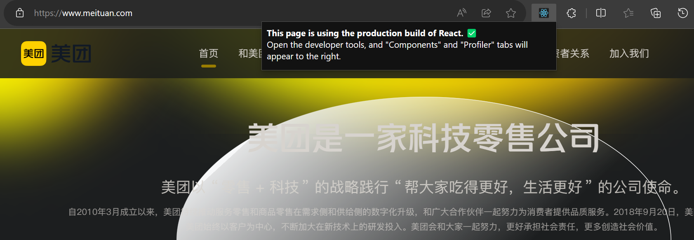
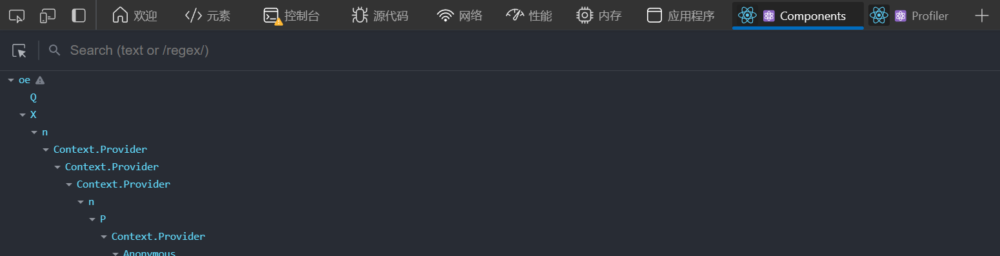
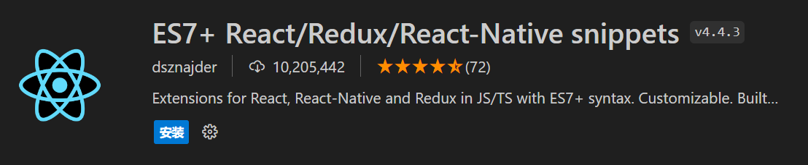

# 教程链接

[官方教程](https://react.nodejs.cn/learn)
[菜鸟教程](https://www.runoob.com/react/react-tutorial.html)
[w3schools教程](https://www.w3schools.cn/react/default.asp)
[尚硅谷React视频教程](https://www.bilibili.com/video/BV1wy4y1D7JT/)
[大神笔记整理1-入门](https://blog.csdn.net/yangaoyuan1999/article/details/117605896)
[大神笔记整理2-组件实例的三大属性state,props,refs](https://blog.csdn.net/yangaoyuan1999/article/details/117651823)

# React 简介

用于构建用户界面的 JavaScript 库
> React 是一个将**数据**渲染为 **HTML视图** 的开源 JavaScript 库

## React 特点

1. 声明式设计：React 采用声明范式，可以轻松描述应用
2. 高效：React 通过对 DOM 的模拟（虚拟DOM），最大限度地减少与 DOM 的交互（DOM Diffing 算法，最小化页面重绘）
3. 灵活：React 可以与已知的库或框架很好地配合
4. JSX：JSX 是 JavaScript 语法的扩展。React 开发不一定使用 JSX，但我们建议使用它
5. 组件：通过 React 构建组件，使得代码更加容易得到复用，能够很好的应用在大项目的开发中
6. 单向响应的数据流：React 实现了单向响应的数据流，从而减少了重复代码，这也是它为什么比传统数据绑定更简单

# 使用 React

## 1. 直接在 HTML 文件中编写 React

直接使用 Staticfile CDN 的 React CDN 库，地址如下：
```html
<script src="https://cdn.staticfile.org/react/16.4.0/umd/react.development.js"></script>
<script src="https://cdn.staticfile.org/react-dom/16.4.0/umd/react-dom.development.js"></script>
<script src="https://cdn.staticfile.org/babel-standalone/6.26.0/babel.min.js"></script>
```

> 我们引入了三个库：react.development.min.js 、react-dom.development.min.js 、babel.min.js：
> - react.min.js ：React 的核心库
> - react-dom.min.js ：提供与 DOM 相关的功能
> - babel.min.js ：babel 将 jsx代码 转为 js代码

[babel在线编译器](https://babeljs.io/repl)

新建一个 .html 文件，内容如下
```html
<!DOCTYPE html>
<html>
<head>
    <meta charset="UTF-8" />
    <title>Hello React!</title>
    <script src="https://cdn.staticfile.org/react/16.4.0/umd/react.development.js"></script>
    <script src="https://cdn.staticfile.org/react-dom/16.4.0/umd/react-dom.development.js"></script>
    <script src="https://cdn.staticfile.org/babel-standalone/6.26.0/babel.min.js"></script>
</head>
<body>
 
    <div id="example"></div>
    <script type="text/babel">
        ReactDOM.render(
            <h1>Hello, world!</h1>,
            document.getElementById('example')
        );
    </script>
 
</body>
</html>
```
以上代码将一个 h1 标题，插入 id="example" 节点中

在这个html页面中，输出了 Hello, world!


这种使用 React 的方式可以用于测试目的，但不要用于生产

## 2. 通过 npm 使用 React

### 使用 create-react-app 快速构建 React 开发环境

此处略，详细见后面章节

# 安装开发者工具 React Developer Tools


## 图标颜色

### 灰色

该网页不是用react写的

### 红色


该网页是用react写的，但是没有打包，还处于开发者模式

### 蓝色


是用react脚手架打包后的网页

## 使用


在浏览器的开发者工具中，Components 可以查看嵌套的组件，Profiler 用来做性能分析

# VSCode 插件

推荐使用这个


## rcc

react class component 的简写，即 类式组件

在文件中输入 rcc，会自动生成以下代码
```js
import React, { Component } from 'react'

export default class index extends Component {
  render() {
    return (
      <div>index</div>
    )
  }
}
```

## rfc

react function component 的简写，即 函数式组件

在文件中输入 rfc，会自动生成以下代码
```js
import React from 'react'

export default function index() {
  return (
    <div>index</div>
  )
}
```

## !

在文件中输入 !，会自动生成html骨架代码
```html
<!DOCTYPE html>
<html lang="en">
<head>
    <meta charset="UTF-8">
    <meta name="viewport" content="width=device-width, initial-scale=1.0">
    <title>Document</title>
</head>
<body>
    
</body>
</html>
```


---

# 例子：井字游戏


